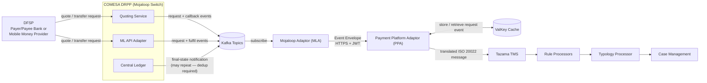
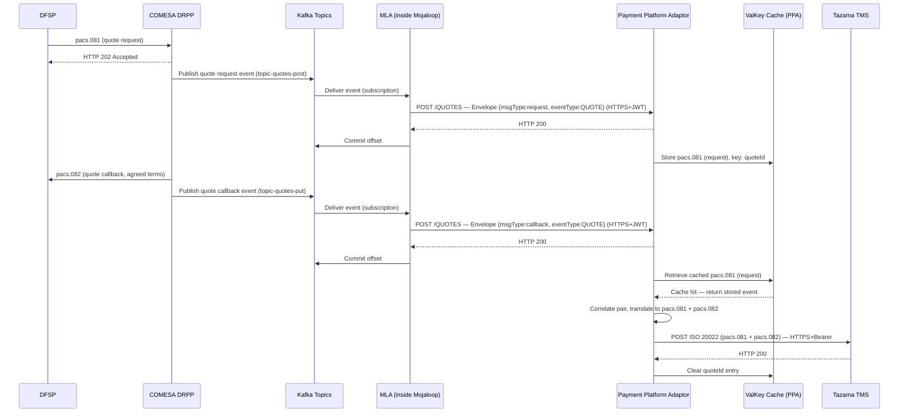
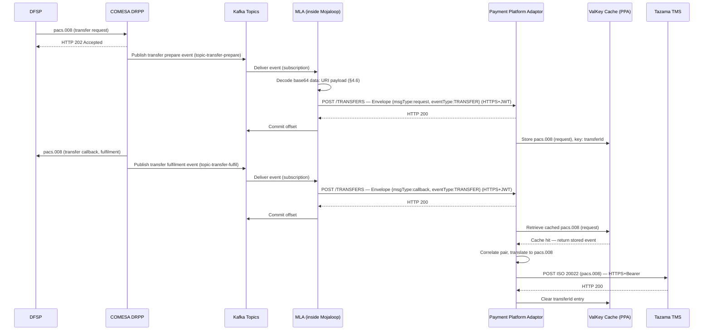
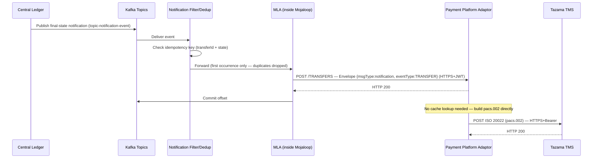

# FUNCTIONAL SPECIFICATION DOCUMENT
## Message Ingestion — Mojaloop to Tazama
*(implemented by the Mojaloop Adaptor and Payment Platform Adaptor)*

**COMESA CLEARING HOUSE × PAYSYS LABS**
*Tazama Fraud Management Module — Integration Layer*

---

| | |
|---|---|
| **Document Ref** | CCH-PL-FSD-MSGING-001 |
| **Version** | v1.0 |
| **Date** | 21st July 2026 |
| **Author** | Behjet Ansari, Senior Business Analyst — Paysys Labs |
| **Classification** | Confidential |

### Version History

| Version | Date | Author | Summary of Changes |
|---|---|---|---|
| v1.0 | 20th July 2026 | Behjet Ansari | Baseline version for CCH review |

---

## 1. Introduction

Tazama's fraud detection is only as good as the transaction picture it receives. Every payment on the COMESA Digital Retail Payment Platform (DRPP) — a Mojaloop-based switch — happens asynchronously and in pieces: a quote request and its answer, a transfer request and its outcome, each as a separate event. For Tazama to evaluate a transaction, those pieces have to be captured, paired back together, and re-expressed in Tazama's specific ISO 20022 message set.

**This document specifies how that happens: message ingestion from Mojaloop into Tazama.** It covers what has to be captured, how the pieces of an asynchronous transaction are correlated into one complete record, how that record is translated into Tazama's specific ISO 20022 message set, and what happens when any step fails, is delayed, or arrives with something the pipeline hasn't seen before.

Two components implement this ingestion pipeline:

- **The Mojaloop Adaptor (MLA)** — subscribes to Kafka topics published in and around the DRPP and relays each event onward, unmodified, as a standard envelope.
- **The Payment Platform Adaptor (PPA)** — receives those envelopes, correlates request/callback pairs, translates the combined data into Tazama's specific ISO 20022 message set, and dispatches it to the Tazama Transaction Monitoring Service (TMS).

This document also covers the non-functional dimensions of ingestion — architecture, performance, and security — that determine whether the pipeline is fit for a live production payment switch, not just functionally correct on the happy path. (Infrastructure — hosting, sizing of underlying compute/network — is covered separately in the Infrastructure Design Document and is out of scope here.)

It is written for both technical and non-technical reviewers.


---

## 2. Glossary

| Term | Meaning |
|---|---|
| **MLA** | Mojaloop Adaptor. Subscribes to Kafka topics and relays events to the PPA. |
| **PPA** | Payment Platform Adaptor. Correlates, translates, and forwards events to Tazama's TMS. |
| **DRPP** | Digital Retail Payment Platform. COMESA's Mojaloop-based payment switch. |
| **DFSP** | Digital Financial Services Provider. A bank or mobile money provider on the switch. |
| **Quoting Service** | The Mojaloop service that handles quote requests and FX quote requests. |
| **ML API Adapter** | The Mojaloop service that handles transfer and FX transfer requests. |
| **Central Ledger** | The Mojaloop service that settles transfers and publishes the final transfer-state notification event. Distinct from the ML API Adapter — see §4.1. |
| **TMS** | Tazama's Transaction Monitoring Service. Evaluates transactions against fraud rules. |
| **Kafka topic** | A persistent, ordered event channel. Services publish events to it; subscribers read from it. |
| **FSPIOP** | Mojaloop's legacy FSP-facing header/auth scheme (e.g. `FSPIOP-Source`/`Destination`, JWS signing). Message bodies are referenced by ISO 20022 message type throughout this document; FSPIOP terminology is retained only for these transport-level headers. |
| **ISO 20022** | International financial messaging standard, used by both Mojaloop and Tazama — but as two distinct message sets. The PPA translates Mojaloop's ISO 20022 messages into Tazama's specific ISO 20022 message set. |
| **Async callback** | Mojaloop's response pattern: the switch immediately returns HTTP 202 Accepted, then delivers the actual result later via a callback to a registered endpoint. |
| **Ingress event** | A message published to Kafka when an FSP sends a request to the switch (e.g. `pacs.081` quote request, `pacs.008` transfer request). |
| **Callback event** | A message published to Kafka when the switch sends the result back to the requesting FSP (e.g. `pacs.082` quote callback, `pacs.008` transfer callback). |
| **Event Envelope** | The wrapper the MLA uses to package a Kafka event before sending it to the PPA. |
| **Correlation** | The PPA's process of matching an ingress event with its corresponding callback event using the shared transaction/quote/transfer ID. |
| **ValKey cache** | Short-term memory (Redis-compatible) the PPA uses to hold an ingress event while waiting for the matching callback event. |
| **ILP packet** | A cryptographic packet attached to a quote response and carried into the transfer to prove the transfer terms were not changed.[^2] |
| **Condition** | A SHA-256 hash included in a transfer request. The switch checks the corresponding fulfilment against this before committing. |
| **FSPIOP-Source / Destination** | FSPIOP headers identifying which DFSP sent a message and which DFSP should receive the callback.[^2] |
| **JWS** | JSON Web Signature. Mojaloop's request-integrity signing scheme (RS256/384/512 over method, `FSPIOP-URI`, Source/Destination headers, and body). See §10.2. |
| **mTLS** | Mutual TLS — both client and server present certificates, used between trusted internal services. See §10.1. |
| **Notification Filter / Dedup** | The component responsible for de-duplicating Central Ledger's transfer-notification events before they reach MLA/PPA. See §4.1, §6.4. |
| **Idempotency key** | A unique identifier (e.g. `transferId` + state) used to detect and discard duplicate events for the same logical outcome. |
| **DLQ** | Dead-Letter Queue/Log. Where events that exhaust retries are placed for manual investigation. |
| **Tokenization** | Replacing a sensitive field's real value with a non-reversible substitute token, as an alternative to encryption for PII fields. See §10.3. |

---

## 3. System Context

### 3.1 How Mojaloop Works

Whenever an FSP submits a request to the Mojaloop Switch — whether for a quotation or transfer initiation — the Switch immediately responds with an HTTP 202 Accepted status. The substantive outcome, including the agreed quotation terms or transfer confirmation, is subsequently delivered through a separate callback message to the FSP's registered endpoint.

Accordingly, each transaction on the DRPP network generates at least two distinct events for every action: an outbound request event and a corresponding inbound callback event. The MLA captures these directly from Kafka. The PPA is responsible for correlating these events to establish the complete transaction flow.

### 3.2 Where Ingestion Fits



### 3.3 Transaction Stages Covered in Phase 1

A complete Mojaloop payment goes through up to two stages. The MLA and PPA handle events from both. Each stage produces both a request event and a callback event on Kafka.[^2]

| Stage | Mojaloop Service | Request Event | Callback Event | Phase 1? |
|---|---|---|---|---|
| **1 — Quote** | Quoting Service | `pacs.081` (request) | `pacs.082` (callback) | ✅ Yes |
| **1a — FX Quote** | Quoting Service | `pacs.091` (request) | `pacs.092` (callback) | ✅ Yes (cross-border) |
| **2 — Transfer** | ML API Adapter (request) / Central Ledger (notification) | `pacs.008` (request) | `pacs.008` (callback)<br>Central Ledger notification — `pacs.002` (final state) | ✅ Yes |
| **2a — FX Transfer** | ML API Adapter (request) / Central Ledger (notification) | `pacs.009` (request) | `pacs.009` (callback)<br>Central Ledger notification — `pacs.002` (final state) | ✅ Yes (cross-border) |
| **Error path** | Any service | Any of the above | `pacs.002` (error callback, any resource) | ✅ Yes (all stages) |

> **Note:** The final transfer-state notification is published by **Central Ledger**, not by the ML API Adapter (corrected from the prior version of this document). It notifies the payee that the transfer was committed, is not itself a response from the payee, and may be emitted more than once per transaction — it must be de-duplicated before being treated as a distinct event (§4.1, §6.4). It carries the final transfer state and is required for Tazama to receive.


---

## 4. Architecture

### 4.1 Component Overview

| Component | Responsibility | Status | Failure impact if down |
|---|---|---|---|
| **MLA** | Consumes Kafka topics (quotes, transfers, FX variants, notifications); wraps each event in an Event Envelope; POSTs to PPA | Existing, topic list corrected (§4.4) | Kafka consumer lag builds; no impact to live payments |
| **Notification Filter / Dedup** | Consumes Central Ledger's `topic-notification-event`; suppresses duplicate final-state notifications for the same transfer before MLA/PPA processes them | **New** — ownership (MLA-side vs. PPA-side) is an open item (§12) | Without it, duplicate `pacs.002` messages may reach TMS |
| **PPA** | Correlates request/callback pairs via the ValKey cache; translates the combined data to Tazama's specific ISO 20022 message set; sends to TMS | Existing | Payments unaffected; fraud pipeline stalls until restored |
| **ValKey cache** | Holds one half of a correlation pair until its match arrives or the TTL expires | Existing | Halts PPA processing (§6.7) — a deliberate hard-stop, not a silent data-loss path |
| **Tazama TMS** | Evaluates translated messages against fraud rules | Existing/external | Out of scope for this document |

### 4.2 Deployment Topology

MLA and PPA are independently deployable, independently scalable services connected by a synchronous HTTP handoff gated on Kafka offset commits (§5.3, §6.3). Hosting location (Paysys DC vs. COMESA infrastructure) is tracked as Open Item #5 and covered in the separate Infrastructure Design Document.

PPA is stateless application logic backed entirely by the external ValKey cache, and is horizontally scalable behind a load balancer; MLA can distribute calls across PPA replicas.

### 4.3 Failure Isolation Boundaries

- **PPA ack-before-durability**: PPA acknowledges MLA at step 1 of its processing pipeline (§6.3), before validation, correlation, translation, or the TMS send have run — and MLA commits its Kafka offset on that same ack (§5.3 step 7). If PPA crashes after acking but before completing the pipeline, the event has no way back: the Kafka offset is already committed, so it can't be replayed, and nothing else yet holds it durably. This needs an explicit decision — PPA persists the envelope to its own durable store before acking, or MLA's offset commit is deferred until PPA confirms durable acceptance rather than bare receipt.
- **MLA ↔ PPA**: coupled via Kafka-offset-gated HTTP handoff (§5.3 step 6) — MLA only commits a Kafka offset after PPA acknowledges receipt with HTTP 200. A PPA outage back-pressures MLA's Kafka consumption per-partition; it never touches the live payment switch, since MLA is a passive subscriber.
- **Central Ledger dedup**: if the Notification Filter/Dedup component is unavailable, the pipeline must make an explicit choice — either drop notification events (favoring no-duplicates-to-TMS over completeness) or pass them through with dedup deferred to a PPA-side idempotency key. This decision is currently unresolved and is tracked as Open Item (§12).
- **ValKey unavailable**: MLA/PPA halts processing and does not commit Kafka offsets (§6.7) — this is a correct, deliberate hard-stop, not a gap, but it makes ValKey HA a release-blocking NFR (§4.5).

### 4.4 Kafka Topic and Consumer Group Model

The prior version of this document assumed three consolidated topics (`quoting-service`, `ml-api-adapter`, `account-lookup-service`). Confirmed technical discovery shows Mojoloop actually publishes on **per-action topics**:

| Topic | Published By | Events Carried |
|---|---|---|
| `topic-quotes-post` | Quoting Service | `pacs.081` (request) |
| `topic-quotes-put` | Quoting Service | `pacs.082` (response or error callback) |
| `topic-fx-quotes-post` | Quoting Service | `pacs.091` (request) |
| `topic-fx-quotes-put` | Quoting Service | `pacs.092` (response or error callback) |
| `topic-transfer-prepare` | ML API Adapter | `pacs.008` (request) |
| `topic-transfer-fulfil` | ML API Adapter | `pacs.008` (fulfil, reject, abort, or error callback) |
| `topic-notification-event` | **Central Ledger** | Final transfer-state notification — `pacs.002` (may repeat — requires dedup, §4.1) |

FX transfer topics (`topic-fx-transfer-*` equivalents) follow the same per-action pattern and remain to be confirmed for Phase 1 scope (Open Item #13, §12). Bulk-quote and admin/position topics exist in the Mojaloop deployment but are not required for Phase 1 P2P monitoring.

> **NFR — dedicated consumer group required:** MLA/PPA consumers **must** run under a new, dedicated Kafka consumer group and must **never** reuse Mojaloop's own internal consumer group names (e.g. `group-quotes-handler-post`, `ml-group-notification-event`). Sharing a group can steal partitions from Mojaloop's own core-service handlers, which is a live-payment-path risk, not just a monitoring-pipeline one.

### 4.5 Correlation State (ValKey) — Scale and HA

- Sizing is driven by `TTL × in-flight request rate × average payload size` — see §9.3 for the full formula, which depends on the TPS assumption in §9.1.
- ValKey must run as a highly-available cluster; correlation-cache downtime is a deliberate hard-stop for the whole pipeline (§6.7), which makes ValKey HA a release-blocking requirement rather than an operational nice-to-have.
- Eviction policy should be `volatile-lru`, since every correlation key carries an explicit TTL by design.

> **Note — distinct from Tazama's internal cache:** Tazama's TMS/rule-evaluation layer maintains its own, separate Redis cache (used for NetworkMap, TypologyConfig, and transaction-context caching by the Event Director, Rule Processors, and Typology Processor). That cache is internal to Tazama and out of scope for this document — it is not the same instance as the PPA's ValKey correlation cache described above, and the two should not be conflated when reading this FSD alongside Tazama-internal architecture documentation.

### 4.6 Data Handling Note

Two distinct operations were previously conflated under a single "Decrypt" step (old §5.3 step 3):

1. **Payload decoding** — transfer-topic payloads arrive as a **base64-encoded `data:` URI**. This is a transport encoding, not a security control, and must be decoded before fields such as `transferId`, `amount`, `condition`, `payerFsp`, `payeeFsp` can be extracted. Quote payloads arrive as plain JSON and do not need this step.
2. **Payload decryption** — a genuine cryptographic control, only relevant if/when field-level or transport-level encryption is introduced. This is addressed as a data-protection decision in §10.3, not as a processing-pipeline mechanic.

The processing pipeline in §6.3 reflects this split.

### 4.7 Dead-Letter Queue (DLQ)

- **Owner:** Paysys Tech — a single shared DLQ store, written to by both MLA (§5.6) and PPA (§6.7).
- **Storage:** a dedicated durable store (not Kafka) — e.g. a database table or object-storage bucket keyed by event ID and timestamp, holding the full envelope/payload plus failure reason and retry count.
- **Retention:** 90 days by default (TBC — align with audit-log retention policy once confirmed), then purged or archived per CCH compliance policy.
- **Replay:** manual, operator-triggered — re-injects a DLQ entry back into the pipeline from the point it failed, without needing a fresh Kafka event; every replay is itself audit-logged.
- **Alerting:** every DLQ write raises an operations alert (§5.6, §6.7); tool/destination tracked separately in §12 Open Items.

---

## 5. Mojaloop Adaptor (MLA)

### 5.1 What It Does

The MLA subscribes to Kafka topics carrying Mojaloop payment events. Every time a payment event is published — whether an FSP's outgoing request or the switch's incoming callback — the MLA picks it up, wraps it in a standard Event Envelope, and sends it to the PPA. The MLA performs **no transformation or business logic** of any kind.

### 5.2 Ingress — Kafka Subscriptions

The MLA subscribes to the per-action topics defined in §4.4. Full topic list is maintained in Annex A.1 to avoid duplicating it here.

> Topic names for the FX quote/transfer channel are to be confirmed with the Mojaloop Implementation Partner at the JAD workshop (Open Item #13, §12).

### 5.3 How the MLA Processes Each Event

1. A new event appears on a subscribed Kafka topic.
2. The MLA reads the raw message and checks that it is a valid, well-formed JSON payload.
3. If the topic carries a base64-encoded `data:` URI body (transfer/FX-transfer topics — §4.6), the MLA decodes it to recover the underlying JSON.
4. The MLA extracts the key identification fields: message type (request, callback, or the Central Ledger notification), resource type (QUOTE, TRANSFER, FXTRANSFER, etc.), the transaction/quote/transfer ID, the `FSPIOP-Source`, and the `FSPIOP-Destination`.
5. The MLA wraps these fields and the original message body into an Event Envelope (see §5.4).
6. The MLA sends the envelope to the PPA via a secure API call and waits for HTTP 200.
7. Only after receiving HTTP 200 does the MLA commit the Kafka offset, confirming the event has been handled. If the PPA does not respond as expected, the offset is not committed and the retry policy applies (§5.6).

### 5.4 Event Envelope Structure

The Event Envelope is the standard wrapper the MLA uses for every event it sends to the PPA:

| Field | Type | Description |
|---|---|---|
| `msgType` | string | Type of the original event: request, callback, or the Central Ledger notification type |
| `eventType` | string | Resource type: `QUOTE`, `FXQUOTE`, `TRANSFER`, or `FXTRANSFER` |
| `id` | string | The unique ID for this transaction leg. See per-type scheme below. |
| `correlationId` | string | Technical trace ID (e.g. UUID), generated by the MLA per event — distinct from the business `id` above. Propagated through PPA, ValKey, audit logs, DLQ, and the outbound TMS call for cross-component tracing. |
| `fspiop-source` | string | `FSPIOP-Source` header value: identifies the DFSP that originated the request |
| `fspiop-destination` | string | `FSPIOP-Destination` header value: identifies the intended recipient DFSP |
| `body` | object | The full original message body (decoded, if applicable — §4.6) |
| `timestamp` | string | ISO 8601 datetime of when the MLA consumed the event from Kafka |

**`id` scheme by resource type:**

| eventType | id format |
|---|---|
| QUOTE | `quoteId` |
| FXQUOTE | `conversionRequestId` |
| TRANSFER | `transferId` |
| FXTRANSFER | `commitRequestId` |

> `fspiop-source` and `fspiop-destination` are **mandatory** in the envelope. They identify which DFSPs are involved in the transaction and are required by the PPA for routing and audit purposes.

### 5.5 Egress — Sending Events to the PPA

| Event Type | PPA Endpoint | Covers |
|---|---|---|
| QUOTE or FXQUOTE (any msgType) | `POST /QUOTES` | All quote and FX quote events — requests and callbacks |
| TRANSFER or FXTRANSFER (any msgType) | `POST /TRANSFERS` | All transfer and FX transfer events — requests, callbacks, and final-state notifications |

Every API call to the PPA is sent over HTTPS (mTLS recommended — §10.1) and includes a bearer token. The PPA responds with HTTP 200 to confirm receipt. The MLA does not wait for the PPA to finish processing — just to confirm it received the envelope.

### 5.6 Error Handling

| Situation | MLA Behaviour |
|---|---|
| PPA returns HTTP 200 | Commit Kafka offset. Log success. Move to next event. |
| PPA returns a 4xx error | Log the full envelope as an error — do not retry. A 4xx means the envelope itself is invalid; retrying will not help. Raise an operations alert. |
| PPA returns a 5xx error or times out | Apply retry policy: up to 3 attempts with exponential back-off **and jitter** (base 1s/2s/4s — see §9.5 for the rationale for adding jitter). If a circuit breaker (§9.5) has tripped due to consecutive failures, fail fast to the dead-letter log instead of retrying. If all retries are exhausted, place the event in the dead-letter log and raise an alert. Do not commit the Kafka offset. |
| The Kafka message is invalid or unreadable | Skip it. Log the issue. Never forward broken data to the PPA. |
| The Kafka broker is temporarily unreachable | Wait and reconnect automatically using the Kafka client's built-in reconnect logic. |


---

## 6. Payment Platform Adaptor (PPA)

### 6.1 What It Does

The PPA is the translation and correlation engine. It receives event envelopes from the MLA, uses a cache to pair each request event with its matching callback event, builds a single complete message from the pair, translates it into Tazama's specific ISO 20022 message set, and sends it to the Tazama TMS. Every step is logged for audit.

### 6.2 Ingress — API Endpoints

| Endpoint | Method | Purpose |
|---|---|---|
| `/QUOTES` | POST | Receives all quote and FX quote events from the MLA |
| `/TRANSFERS` | POST | Receives all transfer and FX transfer events from the MLA (including final-state notifications) |
| `/health` | GET | Health check — returns 200 if the PPA is running; used by monitoring tools |

- All endpoints are served over **HTTPS only** (mTLS recommended — §10.1).
- Every POST request must carry a valid **JWT bearer token**. Requests without one are rejected with HTTP 401.
- The PPA returns HTTP 200 immediately on receipt and processes the envelope **asynchronously**.

### 6.3 Processing Pipeline

Every event envelope received follows these steps in sequence:

| # | Step | Detail |
|---|---|---|
| 1 | **Acknowledge** | Return HTTP 200 to the MLA immediately. All processing from this point is async. |
| 2 | **Validate** | Check that the envelope is complete: required fields present (`msgType`, `eventType`, `id`, `fspiop-source`, `body`), body is non-null, eventType is recognised. |
| 3 | **Dedup (notification events only)** | For events sourced from the Central Ledger notification topic, check the idempotency key (`transferId` + final state) against previously processed notifications; discard duplicates before proceeding (§4.1, §6.4). |
| 4 | **Decrypt** | Body arrives already decoded by the MLA (§5.3 step 3, §5.4) — no decoding happens at this step. Decrypt any fields protected under the scheme defined in §10.3, if enabled. |
| 5 | **Cache check** | Use the transaction/quote ID to look up the ValKey cache. Determine whether this is the first or second event in the pair for this transaction leg. |
| 6 | **Store or correlate** | First event: store in cache keyed by ID + eventType. Second event: retrieve the stored first event from cache and combine the two. |
| 7 | **Translate** | Build one complete message in Tazama's specific ISO 20022 message set from the combined data. Apply the field mapping rules (§6.5, with worked examples in §7). Generate required header fields (`MsgId`, `CreDtTm`, `NbOfTxs`, `SttlmMtd`). |
| 8 | **Send to TMS** | POST the completed message to the correct Tazama TMS endpoint for that message type. |
| 9 | **Handle TMS response** | HTTP 200: log success, clear the completed transaction from cache. Error or timeout: apply retry policy (§6.7); log and alert if all retries exhausted. |
| 10 | **Audit log** | Write a full audit entry: what came in, what was sent, all timestamps, TMS response, any errors — masked per §10.4. |

### 6.4 Correlation — Matching Request and Callback Events

Because Mojaloop is asynchronous, every transaction stage produces two separate Kafka events: the outgoing request (e.g. `pacs.081` quote request) and the incoming callback (e.g. `pacs.082` quote callback). Each carries different data. The TMS needs a single complete message combining both.

| Stage | Request Event Carries | Callback Event Carries |
|---|---|---|
| **Quote** (`pacs.081`/`pacs.082`) | payer & payee identity, quoteId, transactionId, amountType, amount, transactionType | transferAmount, payeeReceiveAmount, fees, expiration, ilpPacket, condition |
| **FX Quote** (`pacs.091`/`pacs.092`) | conversionRequestId, conversionTerms (initiatingFsp, counterPartyFsp, sourceAmount, targetCurrency, expiration) | conversionId, agreed targetAmount, condition, expiration, charges |
| **Transfer** (`pacs.008`) | transferId, payerFsp, payeeFsp, amount, expiration, ilpPacket, condition | fulfilment, completedTimestamp, transferState (COMMITTED / ABORTED) |
| **FX Transfer** (`pacs.009`) | commitRequestId, determiningTransferId, initiatingFsp, counterPartyFsp, sourceAmount, targetAmount, condition, expiration | fulfilment, completedTimestamp, conversionState |
| **Final-state notification** (Central Ledger, `pacs.002`) | — | completedTimestamp, transferState — may be emitted more than once per transfer; deduplicated at pipeline step 3 (§6.3) before being treated as a distinct event |
| **Error callback** (`pacs.002`) | — | errorInformation with errorCode and errorDescription |

**Cache keys used for correlation:**

- `quoteId` for quotes
- `transferId` for transfers
- `conversionRequestId` for FX quotes
- `commitRequestId` for FX transfers

> If the callback event never arrives within the configured TTL, the PPA does not forward a partial message to TMS. It logs a timeout and raises an alert. The TTL formula and sizing approach are in §9.3.

### 6.5 ISO 20022 Message Mapping

Once a request+callback pair is correlated, the PPA assembles the message for Tazama's specific ISO 20022 message set:[^1]

| Event Pair (Mojaloop) | ISO 20022 Output (Tazama) | Key Mapped Fields |
|---|---|---|
| `pacs.081` (request) + `pacs.082` (callback) | **pacs.081 + pacs.082** | payer/payee → Dbtr/Cdtr; amount → IntrBkSttlmAmt; ilpPacket → VrfctnOfTerms.IlpV4PrepPacket; fees → ChrgsInf; transferAmount → InstdAmt |
| `pacs.091` (request) + `pacs.092` (callback) | **pacs.091 + pacs.092** | conversionRequestId → TxId; initiatingFsp → Dbtr; counterPartyFsp → Cdtr; sourceAmount → InstdAmt; targetAmount → IntrBkSttlmAmt |
| `pacs.008` (request) + `pacs.008` (callback) | **pacs.008** | transferId → TxId; payerFsp/payeeFsp → DbtrAgt/CdtrAgt; amount → IntrBkSttlmAmt; ilpPacket → VrfctnOfTerms.IlpV4PrepPacket; condition carried as-is |
| Final-state notification (deduplicated) | **pacs.002** | fulfilment → ExctnConf; completedTimestamp → PrcgDt.DtTm; transferState → TxSts |
| `pacs.009` (request) + `pacs.009` (callback) | **pacs.009** | commitRequestId → TxId; determiningTransferId → EndToEndId; initiatingFsp → DbtrAgt; counterPartyFsp → CdtrAgt; condition → VrfctnOfTerms |
| Final-state notification, FX (deduplicated) | **pacs.002** | fulfilment → ExctnConf; completedTimestamp → PrcgDt.DtTm; conversionState → TxSts |
| Any error callback (any resource) | **pacs.002** | errorCode → StsRsnInf.Rsn.Prtry; errorDescription → StsRsnInf.AddtlInf |

Two fields are **generated by the PPA itself** on every outbound message — they are not mapped from Mojaloop inputs:[^1]

- `GrpHdr.MsgId` — a new ULID generated by the PPA for each outbound message
- `GrpHdr.CreDtTm` — the PPA's timestamp at the moment the message is constructed

Full worked examples of each transformation, with complete sample payloads, are in §7.

> **Note — sample values are placeholder; target-side structure needs correction:** the Mojaloop-side sample values in §7 are placeholder — real corridor sample messages have been requested from CCH (Open Item #8). That's in progress and will resolve the input-side realism once CCH responds.
>
> Independent of that, the *target*-side (Tazama output) structure in the table above and in §7's samples has been checked against the actual Tazama interfaces (`Pacs.008.001.10.ts`, `Pacs.002.001.12.ts` in `tazama-lf/frms-coe-lib`) and is wrong regardless of what Mojaloop sends:
> - `PmtId.TxId` doesn't exist in the real `Pacs008` interface — it only has `InstrId`/`EndToEndId`.
> - `IntrBkSttlmAmt.Ccy`/`.value` should be `IntrBkSttlmAmt.Amt.Amt`/`.Amt.Ccy`.
> - `DbtrAgt.FinInstnId.Othr.Id` should be `FinInstnId.ClrSysMmbId.MmbId`.
> - `VrfctnOfTerms`, `IlpV4PrepPacket`, and `Condition` don't exist anywhere in the real interface — there's no field currently mapped to carry the ILP packet at all.
> - `RgltryRptg`, `RmtInf`, and `SplmtryData` are mandatory top-level objects in the real interface and are missing from every sample.
> - On the `pacs.002` side: it's `FIToFIPmtSts`, not `FIToFIPmtStsRpt`; `OrgnlInstrId`/`OrgnlEndToEndId`, not `OrgnlTxId`; and `ExctnConf`/`PrcgDt` don't exist in the real interface at all — mandatory fields there are `TxSts`, `ChrgsInf`, `AccptncDtTm`, `InstgAgt`, `InstdAgt`.
>
> The corrected, field-level mapping (verified against a pinned `frms-coe-lib` commit) lives in the companion `Mojaloop_Tazama_ConversionMapping_v0_1.md` document. This table and §7's samples remain conceptual/illustrative only until updated to match.

### 6.6 Egress — Sending to Tazama TMS

| Parameter | Value |
|---|---|
| **Transport** | HTTPS only — plain HTTP to TMS is not permitted |
| **Method** | POST |
| **Auth** | Bearer token obtained via a live chain, not a static config value: PPA requests a token from an internal **Auth-lib**, which fetches a Tazama-scoped token from an **Auth-service**, which in turn obtains it from **Keycloak**. This token is what's presented on every PPA→TMS call (mTLS recommended in addition — §10.1). |
| **Content-Type** | application/json |
| **Expected response** | HTTP 200 |
| **On failure** | Retry up to 3 times with exponential back-off and jitter (§9.5); circuit-break on sustained failure; dead-letter and alert on exhaustion |

### 6.7 Error Handling

| Situation | PPA Behaviour |
|---|---|
| Callback never arrives before cache TTL expires | Log timeout. Raise alert. Do not forward partial data to TMS. |
| Incoming envelope fails validation | Log and discard. Do not process further. |
| TMS returns a 5xx or times out | Retry up to 3 times with exponential back-off and jitter. Circuit-break on sustained failure (§9.5). Log and alert if all retries fail. |
| TMS returns a 4xx | Log as an application error. Do not retry. Investigate payload. |
| JWT token is missing or invalid on incoming request | Reject with HTTP 401. Log. |
| Cache unavailable (ValKey down) | Halt processing. Raise critical alert. Events queue in Kafka until the issue resolves; Kafka offset is not committed. This is a deliberate hard-stop (§4.3, §4.5). |


---

## 7. Sample Messages & Transformations

This section gives complete, worked examples of the transformation from Mojaloop's messages into Tazama's specific ISO 20022 message set for each message type, so implementers and reviewers can see the full before/after — not just the field-mapping tables in §6.5.

### 7.1 Domestic P2P Transfer — `pacs.008` / `pacs.002`

**Mojaloop request — `pacs.008` request event (decoded from the base64 `data:` URI on `topic-transfer-prepare`):**

```json
{
  "transferId": "b51ec534-ee48-4575-b6a9-ead2955b8069",
  "payerFsp": "payerfsp",
  "payeeFsp": "payeefsp",
  "amount": { "currency": "USD", "amount": "100.00" },
  "ilpPacket": "AYIBgQAAAAAAAASwGmcuZmluYW5jZS1uZXQ...",
  "condition": "f5sqb7tBTWPd5Y8BDuhX0Ndph5Q4uOnMt6oS9YZOOgk",
  "expiration": "2026-07-17T10:15:30.000Z",
  "extensionList": { "extension": [] }
}
```

**Mojaloop callback — `pacs.008` callback event (on `topic-transfer-fulfil`):**

```json
{
  "fulfilment": "XoWG6BsPXqfsBb1zRjEcE0-fWnKtvJnGGxsXOgmuXOg",
  "completedTimestamp": "2026-07-17T10:15:31.500Z",
  "transferState": "COMMITTED",
  "extensionList": { "extension": [] }
}
```

**Resulting Tazama ISO 20022 output — `pacs.008` (sent to TMS on correlation):**

```json
{
  "FIToFICstmrCdtTrf": {
    "GrpHdr": {
      "MsgId": "01J9Z3K2Q8W7X6Y5V4T3R2S1P0",
      "CreDtTm": "2026-07-17T10:15:31.600Z",
      "NbOfTxs": "1",
      "SttlmInf": { "SttlmMtd": "CLRG" }
    },
    "CdtTrfTxInf": {
      "PmtId": { "TxId": "b51ec534-ee48-4575-b6a9-ead2955b8069" },
      "IntrBkSttlmAmt": { "Ccy": "USD", "value": "100.00" },
      "DbtrAgt": { "FinInstnId": { "Othr": { "Id": "payerfsp" } } },
      "CdtrAgt": { "FinInstnId": { "Othr": { "Id": "payeefsp" } } },
      "VrfctnOfTerms": {
        "IlpV4PrepPacket": "AYIBgQAAAAAAAASwGmcuZmluYW5jZS1uZXQ...",
        "Condition": "f5sqb7tBTWPd5Y8BDuhX0Ndph5Q4uOnMt6oS9YZOOgk"
      }
    }
  }
}
```

**Follow-up `pacs.002` — from the deduplicated Central Ledger notification:**

```json
{
  "FIToFIPmtStsRpt": {
    "GrpHdr": { "MsgId": "01J9Z3K3A1B2C3D4E5F6G7H8I9", "CreDtTm": "2026-07-17T10:15:32.000Z" },
    "TxInfAndSts": {
      "OrgnlTxId": "b51ec534-ee48-4575-b6a9-ead2955b8069",
      "TxSts": "COMMITTED",
      "ExctnConf": "XoWG6BsPXqfsBb1zRjEcE0-fWnKtvJnGGxsXOgmuXOg",
      "PrcgDt": { "DtTm": "2026-07-17T10:15:31.500Z" }
    }
  }
}
```

*Transformation walkthrough:* `transferId` becomes the ISO `TxId`; `payerFsp`/`payeeFsp` map onto `DbtrAgt`/`CdtrAgt`; the ILP packet and condition are carried into `VrfctnOfTerms` unchanged (they are opaque cryptographic material, not translated); `MsgId`/`CreDtTm` are generated fresh by the PPA, not copied from Mojaloop's messages (§6.5).

### 7.2 Cross-Border FX Transfer — `pacs.009`

**Mojaloop request — `pacs.009` request event:**

```json
{
  "commitRequestId": "d3f1a2b0-1234-4abc-9def-abcdef123456",
  "determiningTransferId": "b51ec534-ee48-4575-b6a9-ead2955b8069",
  "initiatingFsp": "payerfsp",
  "counterPartyFsp": "fxpfsp",
  "sourceAmount": { "currency": "USD", "amount": "100.00" },
  "targetAmount": { "currency": "KES", "amount": "12950.00" },
  "condition": "gT9nSqLp3wXvKcYz8F0BqmVoR6ejWl2NdOtHu4CxIfA",
  "expiration": "2026-07-17T10:16:00.000Z"
}
```

**Resulting Tazama ISO 20022 output — `pacs.009`:**

```json
{
  "FICdtTrf": {
    "GrpHdr": { "MsgId": "01J9Z3K4M5N6O7P8Q9R0S1T2U3", "CreDtTm": "2026-07-17T10:16:01.200Z" },
    "CdtTrfTxInf": {
      "PmtId": {
        "TxId": "d3f1a2b0-1234-4abc-9def-abcdef123456",
        "EndToEndId": "b51ec534-ee48-4575-b6a9-ead2955b8069"
      },
      "DbtrAgt": { "FinInstnId": { "Othr": { "Id": "payerfsp" } } },
      "CdtrAgt": { "FinInstnId": { "Othr": { "Id": "fxpfsp" } } },
      "VrfctnOfTerms": { "Condition": "gT9nSqLp3wXvKcYz8F0BqmVoR6ejWl2NdOtHu4CxIfA" }
    }
  }
}
```

*Transformation walkthrough:* `commitRequestId` becomes `TxId`, while the originating domestic transfer's `determiningTransferId` is preserved as `EndToEndId` so the FX leg can still be traced back to the underlying transfer it converts for.

---

## 8. End-to-End Flows

The following flows trace what happens from the moment an FSP initiates a payment to the point where Tazama has received the full picture. Each flow reflects the async nature of Mojaloop — requests and callbacks are separate events that the MLA captures at different times.

### 8.1 Standard P2P Payment — Full Happy Path

This is the most common flow. A payer FSP sends money to a payee FSP on the same switch. The full sequence is broken into diagrams below — one per leg — rather than a single combined diagram, so each stays readable on its own.

#### Quote Leg



1. Payer FSP sends the `pacs.081` quote request to the Quoting Service. Switch returns HTTP 202.
2. Quoting Service publishes the quote request event to `topic-quotes-post`.
3. MLA picks it up, wraps it in an Event Envelope (`msgType: request`, `eventType: QUOTE`), sends to PPA `/QUOTES`.
4. PPA stores the envelope in cache keyed by `quoteId`. Waits for the callback.
5. Payee FSP responds with agreed terms. Quoting Service publishes to `topic-quotes-put`.
6. MLA picks up the callback, sends to PPA `/QUOTES` (`msgType: callback`).
7. PPA finds the cached request event, combines both halves, builds `pacs.081 + pacs.082`, sends to TMS.

#### Transfer Leg

**Transfer request & callback:**



1. Payer FSP sends the `pacs.008` transfer request to the ML API Adapter. Switch returns HTTP 202.
2. ML API Adapter publishes the transfer prepare event to `topic-transfer-prepare`.
3. MLA picks it up, decodes the base64 payload (§4.6), sends to PPA `/TRANSFERS` (`msgType: request`, `eventType: TRANSFER`).
4. PPA stores in cache keyed by `transferId`. Waits.
5. Switch commits the transfer. ML API Adapter publishes the fulfilment to `topic-transfer-fulfil`.
6. MLA picks up the callback, sends to PPA `/TRANSFERS` (`msgType: callback`).
7. PPA correlates, builds `pacs.008`, sends to TMS.

**Final-state notification:**



8. **Central Ledger** publishes the final-state notification to `topic-notification-event`.
9. The Notification Filter/Dedup component checks the idempotency key; if this is the first occurrence, MLA picks up the (deduplicated) event and sends to PPA `/TRANSFERS`.
10. PPA builds `pacs.002` from the notification payload and sends to TMS.
11. Tazama evaluates all received messages. No alert triggered on this flow. Case Management is not involved.

### 8.2 Cross-Border Payment with Currency Conversion

Same as 8.1 but two additional stages are inserted — FX Quote and FX Transfer — before the standard quote and transfer. Each FX stage follows the same request+callback pattern. The PPA processes `pacs.091/092` for FX quotes and `pacs.009` for FX transfers (worked example in §7.2). A full cross-border payment sends up to **6 ISO 20022 messages** to TMS across all stages.

### 8.3 Rejected Payment

If the payee rejects a quote or the switch rejects a transfer, the switch publishes an error callback (`pacs.002`) to Kafka instead of a normal callback. The MLA relays it to the PPA in the same way. The PPA does not need a cached request event to build an error response — it builds a `pacs.002` with the `errorCode` and `errorDescription` directly from the error payload and sends it to TMS. Error events are still valuable for fraud analysis.

### 8.4 Callback Never Arrives

If the PPA is holding a cached request event and the matching callback does not arrive before the cache TTL expires, the PPA discards the cached entry, logs a timeout, and raises an alert. It does not send any message to TMS. This situation should be investigated — it may indicate a Mojoloop switch issue or a Kafka delivery problem.

---

## 9. Performance

No document in this project currently states a concrete transaction-volume target — CCH's Project Inception Report defers throughput KPIs to a future Non-Functional Design Document. Rather than leave performance unaddressed until that document exists, this section states working assumptions now, explicitly marked TBC, so that TTL, partition, and hosting decisions have a basis to start from.

### 9.1 Performance Assumptions and Targets (TBC)

| Metric | Proposed Target (TBC) | Basis |
|---|---|---|
| Sustained transaction TPS (steady state) | 20–100 TPS **[TBC — confirm with CCH, Open Item #4]** | Regional/corridor-scale Mojaloop deployments typically run well below reference-implementation ceilings |
| Peak burst TPS (multiplier) | 3–5x sustained | Standard payment-switch peak-to-average ratio |
| Messages/transaction (P2P domestic) | up to 4 (quote ×2, transfer ×2) | §8.1 |
| Messages/transaction (cross-border) | up to 6 | §8.2 |
| MLA end-to-end ack latency (p95) | < 200 ms | Typical HTTP + Kafka-commit round trip |
| PPA correlation-to-TMS latency (p95, cache hit) | < 500 ms | Includes decode/decrypt, translate, TMS POST |

External reference: Mojaloop reference-implementation benchmarking has demonstrated sustained throughput in the ~1,000 TPS range on well-provisioned clusters, with wide variance depending on hardware/topology — this confirms COMESA's actual figure must be measured against its own deployment, not assumed from generic Mojaloop literature.

### 9.2 Latency Budget — MLA→PPA→TMS Hop Chain

| Hop | Component | Budget (p95) | Notes |
|---|---|---|---|
| 1 | DRPP → Kafka publish | (Mojaloop-owned) | Outside MLA/PPA control |
| 2 | Kafka publish → MLA consume | < 100 ms (no backlog) | Degrades under consumer lag — §9.4 |
| 3 | MLA → PPA POST + ack | < 100 ms | Excludes retries |
| 4 | PPA validate/dedup/decode | < 50 ms | |
| 5 | PPA correlate + translate to Tazama's ISO 20022 message set | < 50 ms | |
| 6 | PPA → TMS POST + ack | < 200 ms | Excludes retries |
| **Total (happy path, no retries)** | | **< ~500 ms per event, per leg** | Retry paths add up to ~7s per hop before dead-letter |

### 9.3 Cache (ValKey) Sizing and TTL Policy

- **TTL formula:** `TTL = max(expiration field on the Mojaloop message, expected worst-case MLA-to-PPA transit + Kafka lag) + fixed buffer (5–10s)`. TTL must not be derived from the `expiration` field alone — it must also cover MLA-side ingestion delay under lag, or genuine in-flight correlations will time out falsely (§8.4).
- **Memory sizing formula:** `Peak concurrent cached entries ≈ TTL(s) × in-flight request rate (req/s) × avg payload size (bytes) × safety factor (1.5–2x)`. Final sizing is blocked on the TPS assumption in §9.1 being confirmed (Open Item #4).
- **Eviction policy:** `volatile-lru` (every correlation key carries an explicit TTL); alert — do not silently evict — on memory pressure, since an evicted correlation key is equivalent to a lost transaction pair.
- Monitor cache hit ratio; a sustained drop signals either TTL misconfiguration or MLA backlog.

### 9.4 Backpressure and Consumer Lag Handling

- Size MLA consumer parallelism relative to the per-action topic partition counts (§4.4), not the old 3-consolidated-topic model.
- Alert on consumer lag (leading indicator) separately from dead-letter rate (lagging indicator).
- Bound MLA's per-call PPA timeout independently from the retry/backoff budget — do not let the synchronous "wait for PPA 200" block indefinitely.

### 9.5 Retry/Backoff Budget and Failure Isolation

- Add **jitter** to the existing 1s/2s/4s exponential backoff at both the MLA→PPA and PPA→TMS hops, to avoid synchronized retry storms across concurrent workers.
- Add a **circuit breaker** at both hops: after N consecutive failures, trip and fail fast to the dead-letter log rather than continuing full retry cycles against a downstream known to be down. Without this, 3x retries at each of two hops can amplify load exactly when a downstream component is least able to absorb it.
- ValKey-down remains a hard-stop (§6.7) — quantify how long Kafka can safely buffer unconsumed events before broker retention limits are hit at the target TPS.

### 9.6 Capacity Planning Guidance

- Size Kafka partitions per topic to the target consumer parallelism, using the corrected per-action topic list (§4.4).
- PPA is stateless and horizontally scalable behind a load balancer (§4.2); MLA can round-robin across replicas.
- Account for the message-volume reduction the Notification Filter/Dedup component provides when sizing PPA→TMS throughput.


---

## 10. Security

### 10.1 Transport Security

All MLA↔PPA and PPA↔TMS communication uses TLS 1.2 or higher. Aligned with Mojaloop's own DFSP-to-switch requirement, MLA↔PPA and PPA↔TMS **should use mutual TLS** (client + server certificates), not bearer-token-over-TLS alone, given both endpoints are internal trusted services carrying live financial data. Certificate issuance/rotation policy is to be defined (Open Item, §12), minimum 2048-bit RSA, consistent with Mojaloop's own PKI best practices.

### 10.2 Authentication & Authorization

- PPA validates JWT bearer tokens on all POST endpoints it exposes to MLA (existing behaviour retained); tokens issued via Keycloak, consistent with the CMS module's RBAC baseline, scoped to a dedicated service client with least-privilege claims (write-only to `/QUOTES`, `/TRANSFERS`).
- **MLA's own outbound authentication to PPA** follows the same chain PPA uses for its TMS calls below — MLA requests its token from the internal **Auth-lib**, which fetches a Tazama-scoped token from **Auth-service**, which obtains it from **Keycloak** — cached and refreshed by MLA ahead of expiry rather than fetched per event.
- **PPA's own outbound authentication to TMS** follows a confirmed, live chain (not a static config token): PPA requests a token from an internal **Auth-lib**, which fetches a Tazama-scoped token from an **Auth-service**, which in turn obtains it from **Keycloak** (§6.6). This makes both the Auth-service and Keycloak runtime dependencies of PPA, not just an RBAC-policy reference — their availability directly affects PPA's ability to deliver messages to TMS.
- **JWS validation is promoted from an open item to a required design decision.** If COMESA's DRPP has JWS enabled, MLA **must** validate the `FSPIOP-Signature` header (RS256/384/512) against the sender's registered public key before forwarding to PPA; unsigned or invalid-signature ingress events are rejected and alerted, not silently passed through. If JWS is disabled at DRPP, this is a documented residual risk requiring compensating controls (network segmentation, source IP allow-listing) — tracked in §12 pending JAD workshop confirmation.
- Administrative access to MLA/PPA configuration, dead-letter queues, and audit logs is Keycloak-role-gated, mirroring the CMS FSD's per-role permission model.

### 10.3 Data Protection (PII & Financial Data)

- **Classification:** party names, MSISDNs, account/party identifiers, and transaction amounts are sensitive financial PII across every boundary this pipeline touches — Kafka topics, the ValKey cache, and audit/dead-letter logs. These fields arrive via the quote stage's payer/payee identity data (§6.4).
- **Field-level protection:** before implementation, decide whether MSISDN/party-name fields are (a) tokenized at ingestion (MLA/PPA boundary) before reaching Kafka/cache, or (b) encrypted field-level (envelope encryption, KEK/DEK model, KMS-managed keys). Whichever is chosen resolves the previously undefined "Decrypt" step (§4.6) — key generation, rotation, and access must be specified and owned by a named team.
- **Encryption at rest:** Kafka broker volumes and ValKey persistence (if enabled) must be encrypted at rest; TTL-expired cache entries must be securely purged.
- **Data minimization:** audit and dead-letter logs mask/truncate MSISDNs and account identifiers (e.g., last 4 digits only) by default; full values retrievable only via a separate access-controlled lookup, never embedded in plaintext log lines.

### 10.4 Audit Logging & Monitoring

Audit entries (§6.3 step 10) and dead-letter logs apply the same masking rules as §10.3. Audit logs are **immutable** (write-once, no update/delete API) and access-controlled by Keycloak role, aligning with the CMS module's audit-immutability baseline. Retention period is to be confirmed against CCH compliance policy (§12).

**Schema:** each entry records `correlationId` (§5.4), envelope `id`, `eventType`, source/destination DFSP, timestamp, processing outcome (success/error/retry), TMS response code, and any error detail — masked per §10.3.

**Storage:** a dedicated, append-only audit log store (not Kafka, not the DLQ) — e.g. a database table or log-aggregation index — kept separate from application logs so audit records survive independently of service restarts or log rotation.

### 10.5 Alignment with Project Security Baseline

This section adopts the same controls established elsewhere in the project (CMS FSD): Keycloak-based RBAC and OAuth2, MFA where configurable, immutable audit logs, and SHA-256-class integrity hashing for stored dead-letter/audit payloads — extending, not contradicting, the house standard, and satisfying the Project Inception Report's ISO 27001 commitment.


---

## 11. Phase 1 Exclusions

The following are confirmed out of scope for message ingestion in Phase 1:

- **Real-time blocking of payments** — Tazama reviews transactions after they complete, not during. Blocking requires switch modifications and is not in this contract.
- **Rule Builder or SDK for rule configuration** — rules are configured directly in Tazama's rule processors.
- **Modifications to Mojaloop switch behaviour** — this is the Mojaloop partner's and CCH's responsibility.
- **Party discovery (Account Lookup Service) event capture** — discovery does not surface any transaction data not already available via the quote stage's payer/payee party information (§6.4); Tazama does not require a dedicated capture mechanism for it, so no Discovery Reverse Proxy or equivalent component is built.
- **Infrastructure sizing/hosting decisions** — covered in the separate Infrastructure Design Document.


---

## 12. Open Items

These items must be confirmed before the design is finalised, ideally at the JAD workshop:

| # | Item | Owner |
|---|---|---|
| 1 | Confirm cache TTL — align with the `expiration` field on Mojaloop's messages plus MLA-side transit/lag buffer (§9.3) | CCH + Mojoloop Partner |
| 2 | Confirm whether JWS signing is enabled on COMESA's DRPP deployment; if so, confirm MLA's validation approach is acceptable (§10.2) | Mojoloop Partner |
| 3 | Confirm expected transaction volumes (TPS) for sizing MLA and PPA (§9.1) | CCH |
| 4 | Confirm hosting location for MLA and PPA — Paysys DC or COMESA infrastructure (see Infrastructure Design Document) | CCH |
| 5 | Confirm whether any COMESA-specific extension fields exist on standard Mojaloop messages | Mojoloop Partner |
| 6 | Agree acceptable timeout values for MLA→PPA and PPA→TMS calls (§9.2) | CCH + Paysys |
| 7 | Confirm ownership (MLA-side vs. PPA-side) of the Central Ledger notification dedup logic (§4.1, §4.3, §6.3) | CCH + Paysys |
| 8 | Share sample messages across corridor (e.g. Malawi - Zambia and vice versa) | CCH |
| 9 | Confirm FX quote/transfer topic names (`topic-fx-quotes-*`, `topic-fx-transfer-*` equivalents) against Mojaloop's actual deployment (§4.4, §5.2) | Mojoloop Partner |


---

## Annex A — API Endpoint Quick Reference

### A.1 Mojaloop DRPP → MLA (Kafka Topics)

| Topic | Published By | Events |
|---|---|---|
| `topic-quotes-post` / `topic-quotes-put` | Quoting Service | `pacs.081`/`pacs.082`, error variants |
| `topic-fx-quotes-post` / `topic-fx-quotes-put` | Quoting Service | `pacs.091`/`pacs.092`, error variants [TBC — Open Item #13] |
| `topic-transfer-prepare` / `topic-transfer-fulfil` | ML API Adapter | `pacs.008` request/callback, error variants |
| `topic-notification-event` | **Central Ledger** | Final transfer-state notification — `pacs.002` (deduplicated before use — §4.1) |

### A.2 MLA → PPA

| PPA Endpoint | Method | Receives |
|---|---|---|
| `/QUOTES` | POST | All quote and FX quote events (request, callback, error variants) |
| `/TRANSFERS` | POST | All transfer and FX transfer events (request, callback, final-state notifications, error variants) |
| `/health` | GET | Health check |

### A.3 PPA → Tazama TMS[^1][^2]

| Event Pair | ISO 20022 Message | TMS Endpoint |
|---|---|---|
| `pacs.081` + `pacs.082` | **pacs.081 + pacs.082** | `/api/transaction/pacs.081` + `/api/transaction/pacs.082` |
| `pacs.091` + `pacs.092` | **pacs.091 + pacs.092** | `/api/transaction/pacs.091` + `/api/transaction/pacs.092` |
| `pacs.008` request + callback | **pacs.008** | `/api/transaction/pacs.008` |
| Final-state notification (Central Ledger, deduplicated) | **pacs.002** | `/api/transaction/pacs.002` |
| `pacs.009` request + callback | **pacs.009** | `/api/transaction/pacs.009` |
| Final-state notification, FX (deduplicated) | **pacs.002** | `/api/transaction/pacs.002` |
| Any error callback (any resource) | **pacs.002** | `/api/transaction/pacs.002` |


---

## Annex B — Mojaloop Message Body Reference

Key fields from Mojaloop's message bodies that the PPA reads during translation to Tazama's specific ISO 20022 message set:[^1]

| Message | Key Body Fields |
|---|---|
| `pacs.081` (quote request) | `quoteId`, `transactionId`, `transactionRequestId`, `payer` (partyIdInfo), `payee` (partyIdInfo), `amountType`, `amount` (amount + currency), `transactionType` (scenario, initiator, initiatorType), `note` |
| `pacs.082` (quote callback) | `transferAmount`, `payeeReceiveAmount`, `payeeFspFee`, `payeeFspCommission`, `expiration`, `ilpPacket`, `condition` |
| `pacs.091` (FX quote request) | `conversionRequestId`, `conversionTerms` (conversionId, initiatingFsp, counterPartyFsp, amountType, sourceAmount, targetAmount, expiration) |
| `pacs.092` (FX quote callback) | `conversionTerms` (conversionId, charges, targetAmount confirmed, condition, expiration) |
| `pacs.008` (transfer request) | `transferId`, `payerFsp`, `payeeFsp`, `amount` (amount + currency), `expiration`, `ilpPacket`, `condition`, `extensionList` — **note: arrives as a base64-encoded `data:` URI, decode before use (§4.6)** |
| `pacs.008` (transfer callback) | `fulfilment`, `completedTimestamp`, `transferState` (COMMITTED / ABORTED), `extensionList` |
| Central Ledger final-state notification (`pacs.002`) | `completedTimestamp`, `transferState`, `extensionList` — deduplicate by `transferId` + state before use (§4.1) |
| `pacs.009` (FX transfer request) | `commitRequestId`, `determiningTransferId`, `initiatingFsp`, `counterPartyFsp`, `sourceAmount`, `targetAmount`, `condition`, `expiration` |
| `pacs.009` (FX transfer callback) | `fulfilment`, `completedTimestamp`, `conversionState` |
| Error callback (`pacs.002`, any resource) | `errorInformation` (errorCode, errorDescription, extensionList) |


---

[^1]: Field-level FSPIOP-to-ISO 20022 mapping rules (message version table and per-endpoint field mappings): [ml-schema-transformer-lib — "FSPIOP to ISO 20022 Mapping.md"](https://github.com/mojaloop/ml-schema-transformer-lib/blob/main/FSPIOP%20to%20ISO%2020022%20Mapping.md), mojaloop GitHub organisation.

[^2]: Phase structure (Quote / Transfer), resource-to-ISO-message tables, header field definitions, and ILP v4 cryptographic terms: [Mojaloop ISO 20022 Market Practice Document, v1.0](https://docs.mojaloop.io/product/features/Iso20022/v1.0/MarketPracticeDocument.html), Mojaloop Foundation documentation.

*Paysys Labs | Confidential | v1.1 | July 2026*
