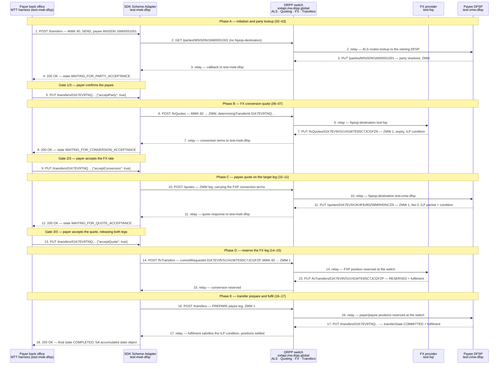

# DRPP Golden Path — sequence diagram

Sequence view of the flow captured in [README.md](README.md) (test case `DRPP-GP-01 Send Money (Source Currency, Multiple FXPs)`, trace-id `67629f2771f9ca3e58ae98d2b525ff82`, transferId `01K7EV9TNQ1VKX84N0GSQH6MDD`). Step numbers 1–18 match the files `01_…json` … `18_…json` in this folder.

## Actors

| Actor | What it is |
| :---- | :---- |
| **Payer back office** | Mojaloop Testing Toolkit acting as the `test-mwk-dfsp` back office — the party that initiates and authorizes. |
| **SDK Scheme Adapter (`test-mwk-dfsp`)** | The payer DFSP's connector (`conn-test-mwk-dfsp.pm.drpp-onprem.global`). Exposes the private outbound API upwards and speaks FSPIOP/ISO 20022 downwards; holds the transfer state machine. |
| **DRPP switch** | `https://extapi.mw.drpp.global` — the hub. Runs the Account Lookup Service (ALS), quoting/FX routing, and transfer position management. **Every** FSPIOP message below is sent to the switch and relayed by it; the DFSPs and the FXP never talk directly. |
| **FX provider (`test-fxp`)** | Prices and reserves the MWK → ZMW conversion leg. |
| **Payee DFSP (`test-zmw-dfsp`)** | Holds payee MSISDN `16665551001`; resolves the party, quotes the ZMW leg, and fulfils the transfer. |

## Diagram

Solid arrows are requests, dashed arrows are the asynchronous FSPIOP callbacks and the outbound-API responses. Wall-clock for the whole run: `2025-10-13T13:14:05.367Z → 13:14:11.252Z` (5.9 s).

## How the flow works

**Two protocol layers.** Steps 1, 4, 5, 8, 9, 12, 13 and 18 are the **SDK outbound API** — a private REST API between the payer's back office and its own Scheme Adapter, never seen on the scheme. Steps 2–3, 6–7, 10–11, 14–15 and 16–17 are the **FSPIOP / ISO 20022 interoperability API** (`application/vnd.interoperability.iso20022.*+json;version=2.0`) carried across the DRPP switch.

**Everything goes through the hub.** The `fspiop-source` / `fspiop-destination` headers name the logical endpoints (e.g. `test-mwk-dfsp` → `test-fxp`), but the transport is always DFSP → switch → counterparty. That is why each FSPIOP step appears twice in the diagram: the sender's leg and the switch's relay leg. Requests go to `extapi.mw.drpp.global`; callbacks arrive back on the payer connector `conn-test-mwk-dfsp.pm.drpp-onprem.global`. The switch is also where positions are reserved and settled, which is why it, not the DFSPs, is the authority for steps 14 and 16.

**Request/callback, not request/response.** FSPIOP is asynchronous: the POST or GET returns only an HTTP 202, and the real answer arrives later as a `PUT` callback on a separate connection. Each pair (2/3, 6/7, 10/11, 14/15, 16/17) is one logical exchange stitched together by its resource id.

**Three payer authorization gates.** The SDK state machine deliberately pauses three times and surfaces what it learned to the back office, which must resume it explicitly:

1. `WAITING_FOR_PARTY_ACCEPTANCE` (step 4) → `acceptParty` (step 5) — confirm *who* is being paid.
2. `WAITING_FOR_CONVERSION_ACCEPTANCE` (step 8) → `acceptConversion` (step 9) — confirm the *FX rate* (MWK 60 → ZMW 1).
3. `WAITING_FOR_QUOTE_ACCEPTANCE` (step 12) → `acceptQuote` (step 13) — confirm the *total cost* (transferAmount ZMW 1, payeeFspFee ZMW 0, payeeReceiveAmount ZMW 1).

Nothing financial is reserved before gate 3; steps 2–11 are purely discovery and pricing. Gate 3 is the commit point that releases steps 14 and 16.

**Why the FX leg is reserved first.** This is a source-currency (`SEND` MWK) cross-border transfer, so a conversion has to exist before the payee leg can move. Step 6 asks `test-fxp` to price it, step 14 reserves it under `commitRequestId 01K7EV9VS1V41WTE9SC7JCGFZP`, and only then does step 16 prepare the ZMW 1 payee leg. The two legs are bound by a shared ILP condition: the fulfilment returned by the payee in step 17 hashes to that condition, which is what allows the switch to commit the FXP reservation and the payee transfer atomically. If step 17 had not arrived, the reservations would expire and both legs would unwind.

**Correlation.** All ten FSPIOP messages share the W3C trace-id `67629f2771f9ca3e58ae98d2b525ff82` (differing only in span-id), so the entire cross-border leg is one distributed trace. The four outbound-API calls carry a separate harness-wide traceparent (`00-aabbb085054070210f925d85120ad171-…` plus `baggage: testCaseId=14`) that is reused across the whole test run and is *not* a per-flow correlator — but the SDK echoes the real `traceId` inside its own state object. Within the flow, the business identifiers do the linking: `transferId` spans steps 1–18, `conversionRequestId` links 6→7, `conversionId`/`commitRequestId` links 14→15, and `quoteId` links 10→11.

**Outcome.** Step 18 returns `COMPLETED` with the full accumulated state object, which contains every message above — party lookup result, FX quote, payee quote (including `originalIso20022QuoteResponse`), both fulfilments, and the final transfer state.

---

# Where each request lives in the code

Which repo in this workspace implements which participant:

| Participant in the diagram | Implemented by | In this workspace? |
| :---- | :---- | :---- |
| Payer back office (MTT harness) | Mojaloop Testing Toolkit | No — external test tool |
| SDK Scheme Adapter (steps 1, 4, 5, 8, 9, 12, 13, 18) | `mojaloop/sdk-scheme-adapter` docker image | **No** — see [the SDK note](#the-sdk-scheme-adapter-steps-1-4-5-8-9-12-13-18) below |
| DRPP switch — ALS (steps 2–3) | [account-lookup-service/](../../account-lookup-service/) | Yes |
| DRPP switch — quoting & FX quoting (steps 6–7, 10–11) | [quoting-service/](../../quoting-service/) | Yes |
| DRPP switch — transfer API edge (steps 14, 16) | [ml-api-adapter/](../../ml-api-adapter/) | Yes |
| DRPP switch — ledger, positions, fulfilment (steps 14–17) | [central-ledger/](../../central-ledger/) | Yes |
| DRPP switch — callbacks out to DFSPs (steps 15, 17 and the step 16 relay) | [ml-api-adapter/src/handlers/notification/](../../ml-api-adapter/src/handlers/notification/) | Yes |
| ISO 20022 ↔ FSPIOP transformation (all FSPIOP steps) | [ml-schema-transformer-lib/](../../ml-schema-transformer-lib/) | Yes |
| FX provider `test-fxp`, payee DFSP `test-zmw-dfsp` | Simulators / counterparty SDKs | No |

Two structural things to know before reading:

1. **Every switch service is HTTP-in → Kafka → handler → HTTP-out.** The HTTP route only validates and publishes to Kafka; the business logic lives in a Kafka consumer; the reply is a *new* outbound HTTP call, not a response on the original socket. So each numbered step lands in three or four different files.
2. **Routes are generated from OpenAPI specs**, not declared by hand. Hapi routes call `handleRequest(api, req, h)`, `api` being an OpenAPIBackend built from the spec in each service's `src/interface/`, and operationIds are mapped to handler functions in each service's `src/api/index.js` (or `src/api/handlers.js`). If you are looking for "where is POST /quotes wired", it is that operationId map.

---

## Steps 2–3 — party lookup (account-lookup-service)

**Step 2 — `GET /parties/MSISDN/16665551001` arriving at the switch, and the ALS relay out to the payee DFSP**

| | |
| :---- | :---- |
| Route | [account-lookup-service/src/api/routes.js:176-184](../../account-lookup-service/src/api/routes.js#L176-L184) |
| OpenAPI spec | [src/interface/fspiop-rest-v2.0-ISO20022_parties.yaml](../../account-lookup-service/src/interface/fspiop-rest-v2.0-ISO20022_parties.yaml) |
| operationId map | `PartiesByTypeAndIDGet` → [src/api/index.js:64](../../account-lookup-service/src/api/index.js#L64) |
| HTTP handler | [src/api/parties/{Type}/{ID}.js:46](../../account-lookup-service/src/api/parties/%7BType%7D/%7BID%7D.js#L46) — responds `202` immediately, then runs the lookup asynchronously |
| Domain entry | [src/domain/parties/getPartiesByTypeAndID.js:51](../../account-lookup-service/src/domain/parties/getPartiesByTypeAndID.js#L51) |
| Service | [src/domain/parties/services/GetPartiesService.js:35](../../account-lookup-service/src/domain/parties/services/GetPartiesService.js#L35) `handleRequest()` — validates the requester (`:59`), queries the oracle, then **forwards to the destination DFSP** at `forwardRequestToDestination()` [:88](../../account-lookup-service/src/domain/parties/services/GetPartiesService.js#L88) |
| Oracle lookup | [src/models/oracle/facade.js](../../account-lookup-service/src/models/oracle/facade.js) — resolves MSISDN → DFSP |
| Endpoint resolution | [src/models/participantEndpoint/facade.js](../../account-lookup-service/src/models/participantEndpoint/facade.js) — where the payee DFSP's callback URL comes from |

Cross-scheme note: if the party is not local, `triggerInterSchemeDiscoveryFlow()` [GetPartiesService.js:141](../../account-lookup-service/src/domain/parties/services/GetPartiesService.js#L141) fans the request out to proxy schemes. That is the code path that makes this a *multi-scheme* lookup.

**Step 3 — `PUT /parties/MSISDN/16665551001` callback from the payee DFSP, relayed to the payer**

| | |
| :---- | :---- |
| Route | [src/api/routes.js:185-193](../../account-lookup-service/src/api/routes.js#L185-L193) |
| operationId map | `PartiesByTypeAndIDPut` → [src/api/index.js:65](../../account-lookup-service/src/api/index.js#L65) |
| HTTP handler | [src/api/parties/{Type}/{ID}.js:93](../../account-lookup-service/src/api/parties/%7BType%7D/%7BID%7D.js#L93) |
| Domain entry | [src/domain/parties/putParties.js:60](../../account-lookup-service/src/domain/parties/putParties.js#L60) `putPartiesByTypeAndID()` |
| Service | [src/domain/parties/services/PutPartiesService.js:34](../../account-lookup-service/src/domain/parties/services/PutPartiesService.js#L34) `handleRequest()` → `sendSuccessCallback()` [:87](../../account-lookup-service/src/domain/parties/services/PutPartiesService.js#L87) — this is the outbound HTTP call that lands on `conn-test-mwk-dfsp…` |
| Oracle write-back | `#updateOracleWithParticipantMapping()` [:101](../../account-lookup-service/src/domain/parties/services/PutPartiesService.js#L101) |
| Shared helpers | [src/domain/parties/services/BasePartiesService.js](../../account-lookup-service/src/domain/parties/services/BasePartiesService.js) — header handling, callback dispatch, error callbacks |

ALS is the one service that is **synchronous internally** — no Kafka in the parties path. Its only Kafka handler is the timeout handler ([src/handlers/TimeoutHandler.js](../../account-lookup-service/src/handlers/TimeoutHandler.js)).

---

## Steps 6–7 and 10–11 — FX quote and payee quote (quoting-service)

Both exchanges share one HTTP handler pair and one Kafka consumer, branching on FX vs non-FX.

**HTTP edge (all four steps)**

| | |
| :---- | :---- |
| Routes | `POST /quotes` [src/api/routes.js:82](../../quoting-service/src/api/routes.js#L82) · `PUT /quotes/{id}` [:73](../../quoting-service/src/api/routes.js#L73) · `POST /fxQuotes` [:154](../../quoting-service/src/api/routes.js#L154) · `PUT /fxQuotes/{id}` [:145](../../quoting-service/src/api/routes.js#L145) |
| operationId map | `QuotesPost`, `QuotesByIdPut`, `FxQuotesPost`, `FxQuotesByIdPut` → [src/api/index.js:42-57](../../quoting-service/src/api/index.js#L42-L57) — note all four FX operations reuse the same two handler functions |
| POST handler | [src/api/quotes.js:59](../../quoting-service/src/api/quotes.js#L59) `post()` — detects FX from the path, produces to Kafka, returns `202` |
| PUT handler | [src/api/quotes/{id}.js:134](../../quoting-service/src/api/quotes/%7Bid%7D.js#L134) `put()` |
| Kafka message shape | [src/lib/dto.js](../../quoting-service/src/lib/dto.js) — builds the message the handler will consume |
| Topics | `topic-quotes-post` / `topic-quotes-put` and `topic-fx-quotes-post` / `topic-fx-quotes-put`, configured at [config/default.json:114-320](../../quoting-service/config/default.json#L114-L320) |

**Kafka consumer**

| | |
| :---- | :---- |
| Consumer wiring | [src/handlers/init.js:69](../../quoting-service/src/handlers/init.js#L69) and [src/handlers/createConsumers.js](../../quoting-service/src/handlers/createConsumers.js) |
| Topic → method routing | [src/handlers/QuotingHandler.js:76](../../quoting-service/src/handlers/QuotingHandler.js#L76) `defineHandlerByTopic()` |
| Step 6 | `handlePostFxQuotes()` [QuotingHandler.js:254](../../quoting-service/src/handlers/QuotingHandler.js#L254) |
| Step 7 | `handlePutFxQuotes()` [QuotingHandler.js:277](../../quoting-service/src/handlers/QuotingHandler.js#L277) |
| Step 10 | `handlePostQuotes()` [QuotingHandler.js:105](../../quoting-service/src/handlers/QuotingHandler.js#L105) |
| Step 11 | `handlePutQuotes()` [QuotingHandler.js:134](../../quoting-service/src/handlers/QuotingHandler.js#L134) |

**Business logic and the outbound relay**

| Step | Model method |
| :---- | :---- |
| 6 (in) | [src/model/fxQuotes.js:173](../../quoting-service/src/model/fxQuotes.js#L173) `handleFxQuoteRequest()` — validates, persists, runs the rules engine |
| 6 (relay to FXP) | [src/model/fxQuotes.js:270](../../quoting-service/src/model/fxQuotes.js#L270) `forwardFxQuoteRequest()` |
| 7 (in) | [src/model/fxQuotes.js:319](../../quoting-service/src/model/fxQuotes.js#L319) `handleFxQuoteUpdate()` |
| 7 (relay to payer) | [src/model/fxQuotes.js:424](../../quoting-service/src/model/fxQuotes.js#L424) `forwardFxQuoteUpdate()` |
| 10 (in) | [src/model/quotes.js:176](../../quoting-service/src/model/quotes.js#L176) `handleQuoteRequest()` |
| 10 (relay to payee) | [src/model/quotes.js:415](../../quoting-service/src/model/quotes.js#L415) `forwardQuoteRequest()` |
| 11 (in) | [src/model/quotes.js:531](../../quoting-service/src/model/quotes.js#L531) `handleQuoteUpdate()` |
| 11 (relay to payer) | [src/model/quotes.js:684](../../quoting-service/src/model/quotes.js#L684) `forwardQuoteUpdate()` |

Supporting files worth opening: [src/model/rulesEngine.js](../../quoting-service/src/model/rulesEngine.js) (scheme quoting rules), [src/data/quotes.js](../../quoting-service/src/data/quotes.js) and [src/data/database.js](../../quoting-service/src/data/database.js) (persistence of quote, quoteResponse, ILP packet), and [src/lib/payloadCache/PayloadCache.js](../../quoting-service/src/lib/payloadCache/PayloadCache.js) — the Redis cache that holds the **original ISO 20022 payload** so it can be replayed verbatim as `originalIso20022QuoteResponse` in step 11.

---

## Steps 14–17 — fxTransfers and transfers (ml-api-adapter + central-ledger)

### HTTP edge — ml-api-adapter (steps 14 and 16 inbound)

| | |
| :---- | :---- |
| OpenAPI spec | [ml-api-adapter/src/interface/fspiop-rest-v2.0-ISO20022_transfers.yaml](../../ml-api-adapter/src/interface/fspiop-rest-v2.0-ISO20022_transfers.yaml) |
| operationId map | [src/api/handlers.js:41-58](../../ml-api-adapter/src/api/handlers.js#L41-L58) — `FxTransfersPost` and `transfers` both map to the **same** `TransferHandler.create` |
| Route wiring | [src/shared/setup.js:225](../../ml-api-adapter/src/shared/setup.js#L225) — routes are generated from the spec at startup |
| POST handler (steps 14, 16) | [src/api/transfers/handler.js:64](../../ml-api-adapter/src/api/transfers/handler.js#L64) `create()` — FX is detected at [:67](../../ml-api-adapter/src/api/transfers/handler.js#L67) by path |
| PUT handler (step 17 inbound) | [src/api/transfers/handler.js:142](../../ml-api-adapter/src/api/transfers/handler.js#L142) `fulfilTransfer()` |
| Produce to Kafka | [src/domain/transfer/index.js:58](../../ml-api-adapter/src/domain/transfer/index.js#L58) `prepare()` → topic `topic-transfer-prepare`; [:88](../../ml-api-adapter/src/domain/transfer/index.js#L88) `fulfil()` → topic `topic-transfer-fulfil` |
| Message shape | [src/domain/transfer/dto.js](../../ml-api-adapter/src/domain/transfer/dto.js) — `prepareMessageDto` sets `action = FX_PREPARE` when `commitRequestId` is present, which is exactly what distinguishes step 14 from step 16 |

Captured examples of these Kafka messages are in [kafka-topic-listener/captured/](../../kafka-topic-listener/captured/) (`topic-transfer-prepare.sample.txt`, `topic-transfer-fulfil.sample.txt`) — useful for seeing the envelope the handlers actually receive.

### Ledger logic — central-ledger

| Step | Where |
| :---- | :---- |
| 14 / 16 prepare consumer | [central-ledger/src/handlers/transfers/prepare.js:447](../../central-ledger/src/handlers/transfers/prepare.js#L447) `prepare()` — one consumer for both transfer and fxTransfer prepare; registered at [handlers/transfers/handler.js:976](../../central-ledger/src/handlers/transfers/handler.js#L976) |
| duplicate check | [prepare.js:220](../../central-ledger/src/handlers/transfers/prepare.js#L220) `checkDuplication()` / [:242](../../central-ledger/src/handlers/transfers/prepare.js#L242) `processDuplication()` |
| persist the request | [prepare.js:309](../../central-ledger/src/handlers/transfers/prepare.js#L309) `savePreparedRequest()` |
| FX obligation / which participant's position moves | [prepare.js:147](../../central-ledger/src/handlers/transfers/prepare.js#L147) `calculateProxyObligation()` and [:346](../../central-ledger/src/handlers/transfers/prepare.js#L346) `definePositionParticipant()` — the code that decides the FXP holds the MWK side and the payee the ZMW side |
| hand off to positions | [prepare.js:382](../../central-ledger/src/handlers/transfers/prepare.js#L382) `sendPositionPrepareMessage()` |
| **position reservation** (steps 14 and 16) | [src/handlers/positions/handler.js:81](../../central-ledger/src/handlers/positions/handler.js#L81) `positions()`, or the batched variant [src/handlers/positions/handlerBatch.js:226](../../central-ledger/src/handlers/positions/handlerBatch.js#L226) — topic `topic-transfer-position` / `topic-transfer-position-batch` ([config/default.json:124-133](../../central-ledger/config/default.json#L124-L133)) |
| 15 — fxTransfer fulfil consumer | [src/handlers/transfers/handler.js:682](../../central-ledger/src/handlers/transfers/handler.js#L682) `processFxFulfilMessage()` |
| 15 — fulfilment validation & commit | [src/handlers/transfers/FxFulfilService.js](../../central-ledger/src/handlers/transfers/FxFulfilService.js) — `validateFulfilment()` [:239](../../central-ledger/src/handlers/transfers/FxFulfilService.js#L239) (this is the ILP condition check), `validateTransferState()` [:260](../../central-ledger/src/handlers/transfers/FxFulfilService.js#L260), `processFxFulfil()` [:339](../../central-ledger/src/handlers/transfers/FxFulfilService.js#L339) |
| 17 — transfer fulfil consumer | [src/handlers/transfers/handler.js:74](../../central-ledger/src/handlers/transfers/handler.js#L74) `fulfil()` → [:136](../../central-ledger/src/handlers/transfers/handler.js#L136) `processFulfilMessage()`; registered at [:1000](../../central-ledger/src/handlers/transfers/handler.js#L1000) |
| validation shared by both | [src/handlers/transfers/validator.js](../../central-ledger/src/handlers/transfers/validator.js) |
| ledger writes | [src/models/transfer/](../../central-ledger/src/models/transfer/) and [src/models/position/](../../central-ledger/src/models/position/) |

### Callbacks out to the DFSPs — ml-api-adapter notification handler

Everything the switch sends *back* on the wire in steps 15 and 17, and the relay of the prepare in step 16, goes through one consumer on `topic-notification-event`:

| | |
| :---- | :---- |
| Consumer start | [src/handlers/notification/index.js:107](../../ml-api-adapter/src/handlers/notification/index.js#L107) `startConsumer()` → [:154](../../ml-api-adapter/src/handlers/notification/index.js#L154) `consumeMessage()` |
| Dispatcher | [src/handlers/notification/index.js:244](../../ml-api-adapter/src/handlers/notification/index.js#L244) `processMessage()` — a long chain of `if (action === …)` branches, one per event action |
| Step 16 relay to the payee | branch at [:372](../../ml-api-adapter/src/handlers/notification/index.js#L372) — `Action.PREPARE` / `Action.FX_PREPARE` |
| Steps 15 and 17 callbacks | branch at [:465](../../ml-api-adapter/src/handlers/notification/index.js#L465) — `Action.COMMIT` / `Action.RESERVE` / `Action.FX_COMMIT` / `Action.FX_RESERVE` on success |
| Callback payload/header construction | [src/handlers/notification/dto.js](../../ml-api-adapter/src/handlers/notification/dto.js) and [utils.js](../../ml-api-adapter/src/handlers/notification/utils.js) |

A useful read: `processMessage()` is where a *single* ledger outcome fans out into up to two HTTP callbacks (one to the payer, one to the payee) with different content types — the `sendToSource` / `sendToDestination` logic around [:519](../../ml-api-adapter/src/handlers/notification/index.js#L519).

---

## The ISO 20022 layer (every FSPIOP step)

The content types in this capture are `…iso20022…+json;version=2.0`, so on every hop the payload is transformed between the ISO 20022 wire format and the internal FSPIOP model:

| | |
| :---- | :---- |
| Library | [ml-schema-transformer-lib/](../../ml-schema-transformer-lib/) |
| Facade used by the services | [src/facades/fspiopiso20022.ts](../../ml-schema-transformer-lib/src/facades/fspiopiso20022.ts) — this is `TransformFacades.FSPIOPISO20022.*` in the service code |
| Per-resource mappings | [src/mappings/fspiopiso20022/](../../ml-schema-transformer-lib/src/mappings/fspiopiso20022/) — `discovery.ts` (steps 2–3), `fxQuotes.ts` (6–7), `quotes.ts` (10–11), `fxTransfers.ts` (14–15), `transfers.ts` (16–17) |
| Call sites | e.g. [ml-api-adapter/src/api/transfers/handler.js:88](../../ml-api-adapter/src/api/transfers/handler.js#L88) and [notification/index.js:443](../../ml-api-adapter/src/handlers/notification/index.js#L443) |

The `extensionList` entries seen in the captured messages (`GrpHdr.MsgId`, `CdtTrfTxInf.Dbtr.Id.PrvtId.Othr.Id`, `SttlmInf.SttlmMtd`) are produced by these mappings — that is where to look to understand why a particular ISO field ends up where it does.

---

## The SDK Scheme Adapter (steps 1, 4, 5, 8, 9, 12, 13, 18)

**This source is not in this workspace.** It runs as a published container image — see [ml-core-test-harness/docker-compose.yml:440](../../ml-core-test-harness/docker-compose.yml#L440) (`mojaloop/sdk-scheme-adapter:${SDK_SCHEME_ADAPTER_VERSION}`) and the pinned `v23.3.0` in [docker-compose-security.yml:32](../../ml-core-test-harness/docker-compose-security.yml#L32). To read it, clone `github.com/mojaloop/sdk-scheme-adapter`.

What *is* available locally is the **API contract** for exactly the eight outbound-API steps, vendored under api-snippets:

| | |
| :---- | :---- |
| Outbound API spec | `ml-api-adapter/node_modules/@mojaloop/api-snippets/sdk-scheme-adapter/v2_1_0/outbound/openapi.yaml` |
| Step 1 — `POST /transfers` | `…/outbound/paths/transfers.yaml` — its description documents the three-stage `AUTO_ACCEPT_PARTIES` / `AUTO_ACCEPT_QUOTES` behaviour that produces the pauses at steps 4, 8 and 12 |
| Steps 5, 9, 13 — `PUT /transfers/{transferId}` | `…/outbound/paths/transfers_transferId.yaml` — the `acceptParty` / `acceptConversion` / `acceptQuote` request bodies |
| Request bodies for the three gates | `sdk-scheme-adapter/v2_1_0/components/schemas/` — `transferContinuationAcceptParty.yaml` (step 5), `transferContinuationAcceptConversion.yaml` (step 9), `transferContinuationAcceptQuote.yaml` (step 13) |
| Response schemas (steps 4, 8, 12, 18) | same directory — `transferStatus.yaml` / `transferStatusResponse.yaml`, the models carrying `currentState` |

The transfer state machine that pauses and resumes is the `OutboundTransfersModel` in the upstream repo (`src/lib/model/`), driven by the outbound server in `src/OutboundServer/`. The states you see in this capture — `WAITING_FOR_PARTY_ACCEPTANCE`, `WAITING_FOR_CONVERSION_ACCEPTANCE`, `WAITING_FOR_QUOTE_ACCEPTANCE`, `COMPLETED` — are that model's state names, and the accumulated state object returned at step 18 is that model's serialised state.

---

## Suggested reading order

If the goal is to follow one transaction through the switch, read in this order rather than step order — it keeps you in one service at a time:

1. [account-lookup-service/src/domain/parties/services/GetPartiesService.js](../../account-lookup-service/src/domain/parties/services/GetPartiesService.js) — simplest service, synchronous, shows the discovery + callback pattern in one file.
2. [quoting-service/src/api/quotes.js](../../quoting-service/src/api/quotes.js) → [src/handlers/QuotingHandler.js](../../quoting-service/src/handlers/QuotingHandler.js) → [src/model/fxQuotes.js](../../quoting-service/src/model/fxQuotes.js) — the full HTTP → Kafka → model → outbound-HTTP shape, in its smallest form.
3. [ml-api-adapter/src/api/transfers/handler.js](../../ml-api-adapter/src/api/transfers/handler.js) → [src/domain/transfer/index.js](../../ml-api-adapter/src/domain/transfer/index.js) — how thin the transfer edge actually is.
4. [central-ledger/src/handlers/transfers/prepare.js](../../central-ledger/src/handlers/transfers/prepare.js) → [src/handlers/positions/handler.js](../../central-ledger/src/handlers/positions/handler.js) — where money is actually reserved.
5. [central-ledger/src/handlers/transfers/FxFulfilService.js](../../central-ledger/src/handlers/transfers/FxFulfilService.js) → [src/handlers/transfers/handler.js](../../central-ledger/src/handlers/transfers/handler.js) — the fulfilment and ILP condition check that closes both legs.
6. [ml-api-adapter/src/handlers/notification/index.js](../../ml-api-adapter/src/handlers/notification/index.js) — how every outcome above becomes a callback on the wire.
