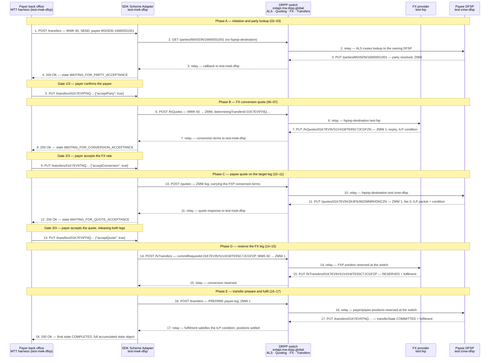

# DRPP Golden Path — sequence diagram

Sequence view of the flow captured in [README.md](README.md) (test case `DRPP-GP-01 Send Money (Source Currency, Multiple FXPs)`, trace-id `67629f2771f9ca3e58ae98d2b525ff82`, transferId `01K7EV9TNQ1VKX84N0GSQH6MDD`). Step numbers 1–18 match the files `01_…json` … `18_…json` in this folder.

## Actors

| Actor | What it is |
| :---- | :---- |
| **Payer back office** | Mojaloop Testing Toolkit acting as the `test-mwk-dfsp` back office — the party that initiates and authorizes. |
| **SDK Scheme Adapter (`test-mwk-dfsp`)** | The payer DFSP's connector (`conn-test-mwk-dfsp.pm.drpp-onprem.global`). Exposes the private outbound API upwards and speaks FSPIOP/ISO 20022 downwards; holds the transfer state machine. |
| **DRPP switch** | `https://extapi.mw.drpp.global` — the hub. Runs the Account Lookup Service (ALS), quoting/FX routing, and transfer position management. **Every** FSPIOP message below is sent to the switch and relayed by it; the DFSPs and the FXP never talk directly. |
| **FX provider (`test-fxp`)** | Prices and reserves the MWK → ZMW conversion leg. |
| **Payee DFSP (`test-zmw-dfsp`)** | Holds payee MSISDN `16665551001`; resolves the party, quotes the ZMW leg, and fulfils the transfer. |

## Diagram

Solid arrows are requests, dashed arrows are the asynchronous FSPIOP callbacks and the outbound-API responses. Wall-clock for the whole run: `2025-10-13T13:14:05.367Z → 13:14:11.252Z` (5.9 s).

## How the flow works

**Two protocol layers.** Steps 1, 4, 5, 8, 9, 12, 13 and 18 are the **SDK outbound API** — a private REST API between the payer's back office and its own Scheme Adapter, never seen on the scheme. Steps 2–3, 6–7, 10–11, 14–15 and 16–17 are the **FSPIOP / ISO 20022 interoperability API** (`application/vnd.interoperability.iso20022.*+json;version=2.0`) carried across the DRPP switch.

**Everything goes through the hub.** The `fspiop-source` / `fspiop-destination` headers name the logical endpoints (e.g. `test-mwk-dfsp` → `test-fxp`), but the transport is always DFSP → switch → counterparty. That is why each FSPIOP step appears twice in the diagram: the sender's leg and the switch's relay leg. Requests go to `extapi.mw.drpp.global`; callbacks arrive back on the payer connector `conn-test-mwk-dfsp.pm.drpp-onprem.global`. The switch is also where positions are reserved and settled, which is why it, not the DFSPs, is the authority for steps 14 and 16.

**Request/callback, not request/response.** FSPIOP is asynchronous: the POST or GET returns only an HTTP 202, and the real answer arrives later as a `PUT` callback on a separate connection. Each pair (2/3, 6/7, 10/11, 14/15, 16/17) is one logical exchange stitched together by its resource id.

**Three payer authorization gates.** The SDK state machine deliberately pauses three times and surfaces what it learned to the back office, which must resume it explicitly:

1. `WAITING_FOR_PARTY_ACCEPTANCE` (step 4) → `acceptParty` (step 5) — confirm *who* is being paid.
2. `WAITING_FOR_CONVERSION_ACCEPTANCE` (step 8) → `acceptConversion` (step 9) — confirm the *FX rate* (MWK 60 → ZMW 1).
3. `WAITING_FOR_QUOTE_ACCEPTANCE` (step 12) → `acceptQuote` (step 13) — confirm the *total cost* (transferAmount ZMW 1, payeeFspFee ZMW 0, payeeReceiveAmount ZMW 1).

Nothing financial is reserved before gate 3; steps 2–11 are purely discovery and pricing. Gate 3 is the commit point that releases steps 14 and 16.

**Why the FX leg is reserved first.** This is a source-currency (`SEND` MWK) cross-border transfer, so a conversion has to exist before the payee leg can move. Step 6 asks `test-fxp` to price it, step 14 reserves it under `commitRequestId 01K7EV9VS1V41WTE9SC7JCGFZP`, and only then does step 16 prepare the ZMW 1 payee leg. The two legs are bound by a shared ILP condition: the fulfilment returned by the payee in step 17 hashes to that condition, which is what allows the switch to commit the FXP reservation and the payee transfer atomically. If step 17 had not arrived, the reservations would expire and both legs would unwind.

**Correlation.** All ten FSPIOP messages share the W3C trace-id `67629f2771f9ca3e58ae98d2b525ff82` (differing only in span-id), so the entire cross-border leg is one distributed trace. The four outbound-API calls carry a separate harness-wide traceparent (`00-aabbb085054070210f925d85120ad171-…` plus `baggage: testCaseId=14`) that is reused across the whole test run and is *not* a per-flow correlator — but the SDK echoes the real `traceId` inside its own state object. Within the flow, the business identifiers do the linking: `transferId` spans steps 1–18, `conversionRequestId` links 6→7, `conversionId`/`commitRequestId` links 14→15, and `quoteId` links 10→11.

**Outcome.** Step 18 returns `COMPLETED` with the full accumulated state object, which contains every message above — party lookup result, FX quote, payee quote (including `originalIso20022QuoteResponse`), both fulfilments, and the final transfer state.
