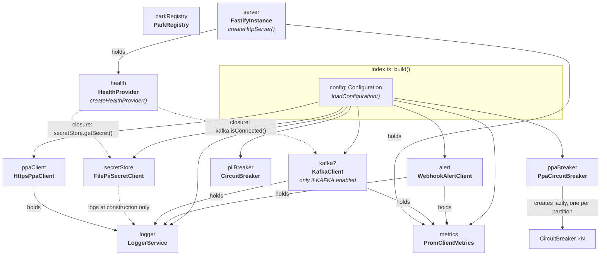
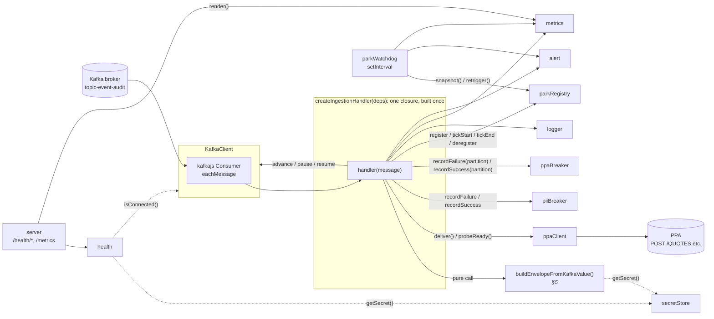
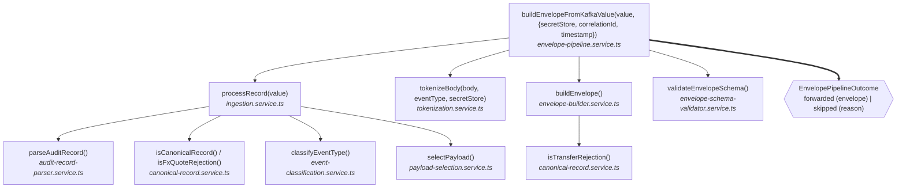
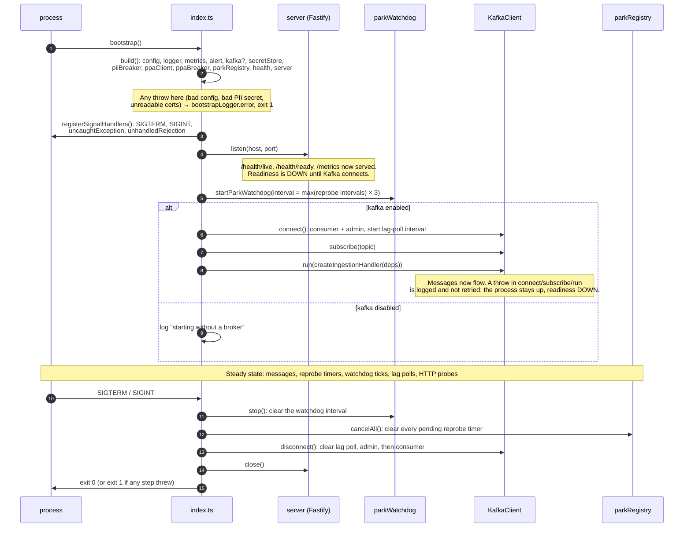

<!-- SPDX-License-Identifier: Apache-2.0 -->

# MLA Object Graph and Lifecycle

**Purpose:** a diagram-first map of how `cch-mla` is assembled at runtime. It shows which objects exist,
who holds a reference to whom, what each one owns, and the order in which they start and stop. Read it
before reading any single service, so each file you open already has a place in the picture.

**Source of truth:** `cch-mla/src/index.ts` (the composition root) and the constructors it calls, as of
`main` @ `f2fb624`. The diagrams use Mermaid; view them in a Mermaid-capable preview (GitLab, GitHub, or a
VS Code Mermaid extension).

- [1. Two views of the same code](#1-two-views-of-the-same-code)
- [2. The object graph: what `build()` constructs](#2-the-object-graph-what-build-constructs)
- [3. Every long-lived object, and what it owns](#3-every-long-lived-object-and-what-it-owns)
- [4. Runtime wiring: how a Kafka message reaches the objects](#4-runtime-wiring-how-a-kafka-message-reaches-the-objects)
- [5. The pipeline is functions, not objects](#5-the-pipeline-is-functions-not-objects)
- [6. Lifecycle: bootstrap to shutdown](#6-lifecycle-bootstrap-to-shutdown)
- [7. Short-lived objects: one message, one parked partition](#7-short-lived-objects-one-message-one-parked-partition)
- [8. Timers: every background loop in the process](#8-timers-every-background-loop-in-the-process)
- [9. Things the graph makes visible](#9-things-the-graph-makes-visible)

---

## 1. Two views of the same code

| View | Question it answers | Where in `index.ts` |
| --- | --- | --- |
| **Object graph** | Which objects exist, and who holds a reference to whom? | `build()` |
| **Lifecycle** | In what order do those objects start working, and in what order do they stop? | `bootstrap()` → `start()` → `shutdown()` |

The graph is fixed once `build()` returns: no object is created or replaced after that, with two
exceptions covered in §7 (per-partition circuit breakers, created lazily, and per-message closures).

---

## 2. The object graph: what `build()` constructs

`index.ts` is the only place in `src/` that calls `new` on a service or client. Everything below is created
once, in this order, inside `build()`.

**How to read it.** A solid arrow is a reference stored in a field and used for the object's whole life. A
dotted arrow is weaker: either a closure that reads the other object on demand (the health provider), or a
dependency used only inside the constructor (the secret store logs once, then never touches the logger
again).

**Leaves.** `LoggerService`, `PromClientMetrics`, `CircuitBreaker`, `PpaCircuitBreaker` and `ParkRegistry`
depend on nothing else in the graph. Every other object points down at `logger` and/or `metrics`.

**A second logger.** `bootstrapLogger` is a module-level `LoggerService` created at import time with fixed
settings. It exists only to report a failure in `build()` itself, before the configured `logger` exists.

---

## 3. Every long-lived object, and what it owns

| Object | Class / factory | File | Constructor inputs | State it owns | Resources it opens |
| --- | --- | --- | --- | --- | --- |
| `config` | `loadConfiguration()` | `services/config.service.ts` | `process.env` | Immutable config tree | none; **throws on invalid config**, which aborts boot |
| `logger` | `LoggerService` | `clients/logger.client.ts` | name, level, pretty | none | stdout |
| `metrics` | `PromClientMetrics` | `clients/metrics.client.ts` | `functionName` | Private `prom-client` `Registry` with every counter/gauge/histogram, plus default Node metrics | none |
| `alert` | `WebhookAlertClient` | `clients/alert.client.ts` | `config.alert`, `metrics`, `logger` | `inFlight` count, per-type coalesce windows, per-type last-drop-warning time | Outbound `fetch` to the webhook; coalesce and request-timeout timers |
| `kafka` | `KafkaClient` | `clients/kafka.client.ts` | `config.kafka`, `logger`, `metrics` | `connected` flag (driven by kafkajs events), lag-poll timer handle | kafkajs `Kafka`, one `Consumer`, one `Admin` |
| `secretStore` | `FilePiiSecretClient` | `clients/pii-secret.client.ts` | `config.pii.secretPath`, `logger` | The secret bytes, read **once** | One file read at construction; **throws if missing or under 32 bytes**, which aborts boot |
| `piiBreaker` | `CircuitBreaker` | `services/circuit-breaker.service.ts` | `config.pii.circuitBreakerThreshold` | Consecutive-failure count, tripped flag | none |
| `ppaClient` | `HttpsPpaClient` | `clients/ppa.client.ts` | `config.ppa`, `logger` | Parsed base/health URLs, timeout | Two keep-alive agents: `agent` for delivery (client cert unless `PPA_MTLS_DISABLED`), `healthAgent` for `/health/ready` (never a client cert). Cert files read once at construction. |
| `ppaBreaker` | `PpaCircuitBreaker` | `services/ppa-circuit-breaker.service.ts` | `config.ppa.circuitBreakerThreshold` | `Map<partition, CircuitBreaker>` | none |
| `parkRegistry` | `ParkRegistry` | `services/park-registry.service.ts` | none | `Map<partition, ParkState>`: kind, correlationId, parkedAt, lastTickAt, `ticking`, `retrigger` closure, pending timer | none; holds other code's timers so they can be cancelled |
| `health` | `createHealthProvider()` | `services/health.service.ts` | name, two readiness closures | none | none |
| `server` | `createHttpServer()` | `clients/fastify.client.ts` | `health`, `metrics` | Fastify instance with three routes | HTTP listener, opened later in `start()` |
| `parkWatchdog` | `startParkWatchdog()` | `services/park-watchdog.service.ts` | `parkRegistry`, `alert`, `metrics`, `logger`, interval | `{ stop }` handle | One `setInterval` (unref'd) |

`parkWatchdog` is the one object not built in `build()`. It is created in `start()`, because it is a
running loop rather than a passive object.

---

## 4. Runtime wiring: how a Kafka message reaches the objects

`build()` does not connect the objects to the message flow. That happens in `connectKafka()`, which calls
`createIngestionHandler(deps)` once and hands the resulting function to `kafka.run()`. The handler is a
closure that captures eleven dependencies. It is the only place where the pipeline, the breakers, the
registry and both outbound clients meet.

**The handler sees `kafka` through a narrow slice.** Its type is
`Pick<KafkaConnection, 'advance' | 'pause' | 'resume'>`, so the message path can commit, pause and resume
a partition but cannot connect, disconnect or subscribe. Those stay with the composition root.

**Two entry points into the same objects.** Work arrives either from kafkajs (`eachMessage` → handler) or
from a timer (a reprobe tick, or the watchdog calling `retrigger`). Both routes call the same functions
(`resolveTransient` → `resolveOutcome`), so a recovered record is delivered by exactly the same code as a
fresh one.

---

## 5. The pipeline is functions, not objects

Parsing, classification, tokenization and envelope construction are plain exported functions. They are
imported directly by the file that calls them, never injected. The only object passed into this chain is
`secretStore`.

`ppaClient.deliver()` also uses a pure function: `resolvePpaEndpoint(eventType)` in
`ppa-routing.service.ts` maps each of the four event types to its PPA path. The retry bursts use
`computeBackoffMs()` from `retry-backoff.service.ts`, and the handler's logging goes through
`ingestion-outcome-logging.service.ts`. None of these hold state.

**Why this matters for reading the code:** the pipeline can be read, and is tested, as input → output with
no setup. All the stateful, failure-prone behaviour (retry, park, breaker, commit) is confined to
`ingestion-consumer.service.ts` and the objects in §3.

---

## 6. Lifecycle: bootstrap to shutdown

**Why shutdown runs in this order.** The watchdog stops first so it cannot re-arm a reprobe loop that is
being cancelled. The reprobe timers are cancelled next, before Kafka disconnects, so no reprobe fires
against a closed consumer. A parked record's offset was never committed, so abandoning its loop loses
nothing: whichever instance owns the partition next re-reads it from the last committed offset. The HTTP
server closes last, so probes keep answering while Kafka drains.

**Fatal versus degraded startup:**

| Failure at startup | Result |
| --- | --- |
| Invalid configuration | Refuse to start, exit 1 |
| PII secret missing or under 32 bytes | Refuse to start, exit 1 |
| PPA client cert/key/CA unreadable (mTLS on) | Refuse to start, exit 1 (`readFileSync` throws in the constructor) |
| Kafka broker unreachable | Stay up, `/health/ready` DOWN, **no retry** of connect/subscribe/run |

**Process-level failures after startup.** `uncaughtException` and `unhandledRejection` both log and exit 1
immediately, without running `shutdown()`. The orchestrator restarts a clean instance.

---

## 7. Short-lived objects: one message, one parked partition

The long-lived graph in §2 never changes. What does change is a small set of per-message and per-partition
objects created inside the handler.

**Per message:** a `correlationId` (UUID), a `receivedAt` timestamp, and three closures: `attempt`
(re-runs the pipeline on the same Kafka value), `deliver` (calls `ppaClient.deliver` and records the outcome
metric) and `probeReady`. They live as long as the message is being handled or parked.

**Per parked partition:** when a retry burst is exhausted, the handler pauses the partition and starts a
reprobe loop. The loop's closure holds the Kafka message (or the built envelope, for a PPA park) in memory;
it does not rely on Kafka redelivering it. The loop registers itself in `parkRegistry` so the watchdog can
see it and so `shutdown()` can cancel it.

```mermaid
stateDiagram-v2
    [*] --> Consuming
    Consuming --> Delivered: pipeline forwarded, PPA 200
    Consuming --> Advanced: skipped record, or PPA 4xx
    Consuming --> RetryBurst: PII secret unavailable, or PPA 5xx/timeout/network
    RetryBurst --> Delivered: a retry succeeds
    RetryBurst --> Advanced: a retry returns PPA 4xx
    RetryBurst --> Parked: still failing after maxRetries

    state Parked {
        [*] --> Waiting
        Waiting --> Reprobe: setTimeout(reprobeIntervalMs)
        Reprobe --> Waiting: still failing, breaker records failure, re-arm
        note right of Reprobe
            PPA park: once the partition's breaker has tripped,
            probeReady() must succeed before a real delivery is tried.
        end note
    }
    Parked --> Delivered: reprobe delivery 200
    Parked --> Advanced: reprobe delivery 4xx

    Delivered --> Committed: kafka.advance(offset)
    Advanced --> Committed: kafka.advance(offset)
    Committed --> [*]: resume partition, deregister park (if parked)
```

**Per partition, lazily:** the first time `ppaBreaker.recordFailure(partition)` or `recordSuccess(partition)`
runs for a new partition, `PpaCircuitBreaker` creates a `CircuitBreaker` for it and keeps it for the rest of
the process. The partition count is fixed by the topic, so the map stays small.

---

## 8. Timers: every background loop in the process

| Timer | Created by | Type | Cleared on shutdown? |
| --- | --- | --- | --- |
| Lag poll | `KafkaClient.connect()` | `setInterval`, every `lagPollIntervalMs` | Yes, in `kafka.disconnect()` |
| Park watchdog | `start()` → `startParkWatchdog()` | `setInterval`, unref'd | Yes, `parkWatchdog.stop()` |
| Reprobe tick (one per parked partition) | `parkAndReprobeTransient` / `parkAndReprobePpa` | `setTimeout`, re-armed each tick, handle stored in `parkRegistry` | Yes, `parkRegistry.cancelAll()` |
| Alert coalesce window | `WebhookAlertClient` | `setTimeout`, unref'd | No; unref'd, so it does not keep the process alive, and `process.exit` ends it |
| Alert webhook request timeout | `WebhookAlertClient` | `setTimeout` + `AbortController` | No; cleared when the request settles |
| Retry-burst backoff | Handler | `await delay(...)` inside `eachMessage` | Not tracked by `shutdown()`; it lives inside the in-flight `eachMessage` call |

---

## 9. Things the graph makes visible

These are facts about the current wiring, stated so a reader does not have to rediscover them.

1. **Only `index.ts` constructs.** Every service and client receives its dependencies; none creates its
   own. To see what any object depends on, read its constructor signature and `build()`.
2. **`kafka` is optional.** With Kafka disabled, `service.kafka` is `undefined`: the HTTP server and
   watchdog still run, readiness reports Kafka as `DISABLED`, and no handler is ever created.
3. **The PII transient path is present but cannot fire.** `FilePiiSecretClient` reads its file once and
   throws on failure, so after a successful boot `getSecret()` always returns `available`. As a result,
   `tokenizeBody` never returns `secret-unavailable`, `piiBreaker` never records a failure, the PII park and
   reprobe loop never runs, and PII readiness is always UP. The machinery stays wired through the
   `PiiSecretStore` interface, so a future secret store that can fail at runtime would use it unchanged.
4. **Two breakers, two shapes.** `piiBreaker` is a single `CircuitBreaker` for the whole process (one
   secret, shared by every partition). `ppaBreaker` is one breaker per partition, because a PPA outage is
   observed and recovered partition by partition as each parked record reprobes.
5. **The health provider holds closures, not objects.** Readiness is computed fresh on every
   `/health/ready` request by calling `kafka.isConnected()` and `secretStore.getSecret()`. It reports
   nothing about PPA, by design: a shared downstream in readiness would pull every healthy replica out of
   rotation during one PPA outage. PPA's health is only probed from inside a PPA reprobe loop.
6. **The PPA client has two connection pools.** Delivery and the readiness probe use separate agents. The
   probe agent never presents a client certificate, even when delivery does.
7. **`metrics` and `logger` are the most shared objects.** Almost every other object writes to them, and
   neither depends on anything else. A failure inside either would surface everywhere; that is why the
   reprobe loops wrap their own error logging in a second `try`.
