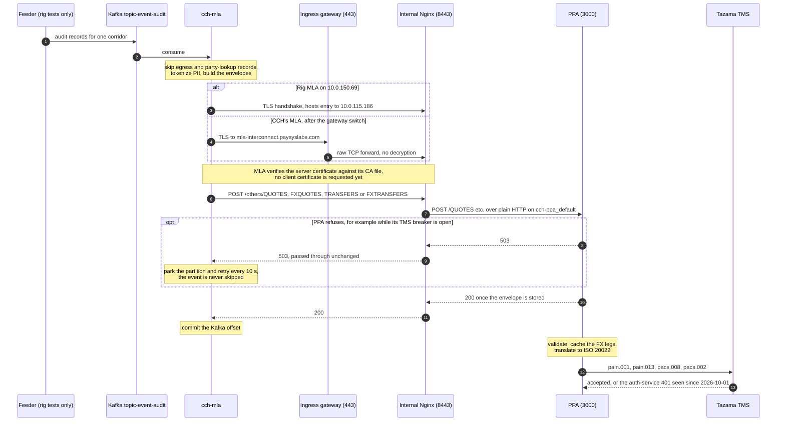

<!-- SPDX-License-Identifier: Apache-2.0 -->

# Internal Nginx in front of PPA — TLS termination now, mTLS once the COMESA/DRPP CA arrives

## Contents

- [1. Topology](#1-topology)
  - [Request flow](#request-flow)
- [2. Facts this plan is built on](#2-facts-this-plan-is-built-on)
- [3. Phase A — discovery](#3-phase-a--discovery)
- [4. Phase B — build (done)](#4-phase-b--build-done)
  - [4.1 Image (done 2026-10-01)](#41-image-done-2026-10-01)
  - [4.2 Back up the default configuration (required; done 2026-10-01)](#42-back-up-the-default-configuration-required-done-2026-10-01)
  - [4.3 Layout and compose](#43-layout-and-compose)
  - [4.4 The config](#44-the-config)
  - [4.5 The interim server certificate \[decision D9\]](#45-the-interim-server-certificate-decision-d9)
  - [4.6 The mTLS stage (target, not deployed)](#46-the-mtls-stage-target-not-deployed)
  - [4.7 Restrict who can reach port 8443](#47-restrict-who-can-reach-port-8443)
- [5. Verification](#5-verification)
  - [5.1 Proving routing against the real PPA without writing to it](#51-proving-routing-against-the-real-ppa-without-writing-to-it)
  - [5.2 `verify-internal-nginx.sh` — result 2026-10-02](#52-verify-internal-nginxsh--result-2026-10-02)
  - [5.3 Offline suite (2026-10-02)](#53-offline-suite-2026-10-02)
  - [5.4 End to end through the rig (optional, strongest)](#54-end-to-end-through-the-rig-optional-strongest)
- [6. Phase D — the real certificates (with Oscar)](#6-phase-d--the-real-certificates-with-oscar)
- [7. Phase E — cut-over (no downtime, coordinated with CCH and the infra team)](#7-phase-e--cut-over-no-downtime-coordinated-with-cch-and-the-infra-team)
- [8. Decisions not engineering's alone](#8-decisions-not-engineerings-alone)
- [9. Documents to update as each phase lands](#9-documents-to-update-as-each-phase-lands)

**What this is.** The plan and record for the second Nginx in the UAT path: an internal reverse proxy on
the PPA host `10.0.115.186` that terminates `cch-mla`'s TLS session and forwards plain HTTP to PPA. The
topology is the user-confirmed sketch [`CCh-->PSL architecture.jpeg`](<CCh-->PSL architecture.jpeg>). The
design decision was made by the user on 2026-10-01 and restated on 2026-10-02: **TLS (and later mTLS)
terminates at the internal Nginx, and the ingress gateway is plain TCP forwarding, with no decryption.**

**Status (2026-10-02).**
- **Built and verified against the real PPA.** `ppa-mtls-nginx` serves TLS on port 8443 with an interim
  self-signed server certificate and proxies to PPA. The verification ran from the host and from another
  subnet, and passed 11 of 11 both times (§5.2):
  - Health returns PPA's own `{"ready":true,...}`.
  - Each business route reaches PPA's route of the same name.
  - Wrong paths get 503.
  - PPA recorded no dead-letter writes.
- **Not live.** The ingress gateway still terminates TLS itself and forwards to PPA's port 3000. Going live
  needs two things (§7):
  - The Paysys infra team switches the gateway to TCP forwarding to `10.0.115.186:8443`.
  - CCH's MLA trusts the certificate this Nginx presents (D9).
- **The deployed files are in [`internal-nginx/`](internal-nginx/)**, byte-identical (SHA-256) to the
  copies on the host:
  - `ppa-mtls.conf`
  - `docker-compose.yml`
  - `verify-internal-nginx.sh`

Steps that need a decision from someone other than engineering are marked **[decision]** and listed in §8.

---

## 1. Topology

```
CCH cluster                      Paysys edge                         PPA host 10.0.115.186
┌──────────────────┐     TLS      ┌──────────────────────────┐  TLS  ┌────────────────────────────────────┐
│ topic-event-audit│  end to end  │ Ingress gateway (Nginx)  │ still │ Internal Nginx  :8443               │
│        │         │ ───────────▶ │ mla-interconnect         │ ────▶ │  • terminates TLS (mTLS later)      │
│        ▼         │              │   .paysyslabs.com        │ intact│  • strips /others, allows 6 routes  │
│     cch-mla      │              │  • DRPP IP allow-list    │       │  • any other path: 503              │
└──────────────────┘              │  • TCP forwarding, no    │       │        │ plain HTTP (Docker network)│
                                  │    decryption            │       │        ▼                            │
                                  └──────────────────────────┘       │  PPA :3000 ──▶ Tazama TMS :5000     │
                                                                     └────────────────────────────────────┘
```

| Component | Job | Holds |
| --- | --- | --- |
| `cch-mla` (CCH) | TLS client. Verifies the server certificate against its CA file, and checks the hostname. | Its CA file; a client key and certificate, which are not requested until the mTLS stage |
| Ingress gateway | Public entry point. Admits only DRPP's source IP and forwards the raw TCP stream. **Does not decrypt.** | No certificates for this hostname |
| Internal Nginx | Terminates TLS, filters routes, proxies to PPA. In the mTLS stage it also verifies and pins MLA's client certificate (§4.6). | Server key and certificate for `mla-interconnect.paysyslabs.com`; later, the CA bundle for client verification |
| PPA | Plain HTTP since `cch-ppa` `9c5709e`. Must be reachable only from the internal Nginx (§7 step 6). | Nothing TLS-related on ingress |

**Why the two instances can differ.**
- DNS is resolved by the client: MLA looks up `mla-interconnect.paysyslabs.com` and connects to the ingress
  gateway's public IP.
- TLS checks only that the certificate presented in the handshake carries that hostname in its SAN, not
  which machine presents it.
- With TCP forwarding at the gateway, the handshake runs directly between MLA and the internal Nginx.
- If the gateway decrypted the traffic instead, MLA's client certificate would stop there, and the internal
  Nginx could never verify it.

### Request flow

The rig test path (2026-10-02) and CCH's path after the gateway switch share every hop from the internal Nginx on.
The rig reaches the internal Nginx directly through a hosts entry, so it does not exercise the gateway.



---

## 2. Facts this plan is built on

**The PPA host**
- **System:** RHEL 8.10, x86_64, SELinux `Enforcing`, firewalld 0.9.11, Docker CE 26.1.3, OpenSSL 1.1.1k
  (FIPS).
- **No internet egress at all.**
- **Docker requires root.** `abdul.rahim` has password-gated `sudo`. Anything not touching Docker or root
  paths, including every check in §5.2, runs as `abdul.rahim`.
- **The clock is unsynchronized and about 51 s fast** (`timedatectl`, 2026-10-01; matched on 2026-10-02).

**PPA**
- **Compose project:** `/opt/cch-ppa`, service `ppa`, container `cch-ppa-ppa-1`, port 3000, Docker network
  `cch-ppa_default`.
- **Restart policy:** `restart: always`, set through `docker-compose.override.yml`.
- **Exposure:** it publishes 3000, 3010, 9464, 5432 and 6379 on `0.0.0.0`.
- **Body limit:** Fastify's default, 1 MiB.
- **Keep-alive:** idle connections stay open for 72 s.

**Docker and the firewall**
- **Docker-published ports bypass firewalld.** Docker inserts its own iptables rules, so a firewalld rule
  does not restrict a published port. Restrictions go in the `DOCKER-USER` chain or in Nginx itself.

**The ingress gateway today**
- **It terminates TLS itself.** The evidence:
  - CCH's MLA speaks HTTPS to it.
  - PPA serves only plain HTTP.
  - Nothing on the PPA host listened on 443 or 8443 before this Nginx.
- **It presents a self-signed certificate**, which Oscar Cobar bundled into MLA's CA file.
- **It strips `/others` and forwards to PPA's port 3000.**

**What CCH's MLA sends** (`cch-mla` `src/clients/ppa.client.ts`)
- **The request path is `PPA_BASE_URL`'s path plus the route.** The base URL is settled as
  `https://mla-interconnect.paysyslabs.com/others` (`deployment/MLA-deployment-kubernetes.md` §11 Q4), so:
  - Deliveries are `POST /others/QUOTES`, `/others/FXQUOTES`, `/others/TRANSFERS` and `/others/FXTRANSFERS`.
  - The health probe is `GET /others/health/ready`, sent **without** a client certificate (F-23,
    `bugs/qa-sweep-2-findings.md`).
- **TLS settings:**
  - Minimum version TLS 1.2.
  - `rejectUnauthorized: true`.
  - The hostname is checked against the server certificate's SAN.

**How MLA treats each response.** This is the contract every setting below protects.
- **HTTP 200** counts as delivered, and the Kafka offset is committed.
- **Any 4xx** is permanent: the event is logged and **skipped for good**.
- **Everything else** is retried, and the event is held behind the circuit breaker: 5xx, any other 1xx, 2xx
  or 3xx, timeouts, TLS failures and network errors.
- So no hop may ever answer 200 on PPA's behalf, and no hop may answer 4xx for a fault of its own.

---

## 3. Phase A — discovery

**Known**
- The gateway terminates TLS today (§2).
- The gateway's owner: the Paysys infra team.
- Port 8443 on the PPA host is reachable from this machine's VPN subnet (2026-10-02).

**Still open, for the infra team**
1. **The gateway host's internal IP**, and its current config for `mla-interconnect.paysyslabs.com`
   (`nginx -T`).
2. **Whether the gateway serves other hostnames on 443.** If it does, TCP forwarding must route by SNI
   (`ssl_preread`), and the other hostnames' TLS moves behind it (§7 step 3).
3. **How CCH resolves `mla-interconnect.paysyslabs.com`.** It does not resolve from Paysys's own machines, so
   it is either a public DNS record not visible internally, or a hosts entry on CCH's side.
4. **Whether the gateway host can reach `10.0.115.186:8443`.** They sit on different subnets, and a
   cross-subnet routing gap has blocked this network before (2026-09-21).

---

## 4. Phase B — build (done)

### 4.1 Image (done 2026-10-01)

The host has no egress, so the image is pulled here and streamed over, exactly as PPA's image was on
2026-10-01 (`plan.md` §16; `learning/MLA/FAQ.md` Q4). The archive's SHA-256 matched on both ends, and the
loaded image is `sha256:43d9d8c1…`, Nginx 1.30.5.

```bash
# this machine
docker pull nginx:1.30.5-alpine
docker save --platform linux/amd64 nginx:1.30.5-alpine | gzip \
  | ssh -i ~/.ssh/ppa_10_0_115_186 abdul.rahim@10.0.115.186 'cat > /tmp/nginx-1.30.5-alpine.tar.gz'
# host, as root: compare sha256sum, then
docker load -i /tmp/nginx-1.30.5-alpine.tar.gz
```

### 4.2 Back up the default configuration (required; done 2026-10-01)

The backup copies the image's `/etc/nginx` from a container that is created but never started, because the
image's entrypoint rewrites `conf.d/default.conf` on first start. It is at
`/opt/ppa-mtls-nginx/default-config-backup/nginx/`, write-protected, with `SHA256SUMS` for all 7 files.

- **Verified on 2026-10-01:** the hashes matched the untouched image byte for byte.
- **Checked again on 2026-10-02:** `sha256sum -c` passed.

```bash
mkdir -p /opt/ppa-mtls-nginx/default-config-backup && cd /opt/ppa-mtls-nginx
id=$(docker create nginx:1.30.5-alpine)
docker cp "$id":/etc/nginx ./default-config-backup/ && docker rm "$id"
(cd default-config-backup && find nginx -type f -exec sha256sum {} + > SHA256SUMS)
chmod -R a-w default-config-backup
```

Only `conf.d/` is replaced. The stock `nginx.conf` stays in place and keeps including `conf.d/*.conf` inside
its `http` block.

### 4.3 Layout and compose

```
/opt/ppa-mtls-nginx/
├── docker-compose.yml                       # internal-nginx/docker-compose.yml
├── docker-compose.yml.bak-stock-20261002    # the stock-config compose, for rollback
├── conf.d/ppa-mtls.conf                     # internal-nginx/ppa-mtls.conf
├── certs/                                   # mode 0700; the key is 0600 and never leaves this host
│   ├── mla-interconnect.key
│   └── mla-interconnect.crt                 # interim self-signed (§4.5)
└── default-config-backup/                   # §4.2
```

**The compose file** ([`internal-nginx/docker-compose.yml`](internal-nginx/docker-compose.yml)):
- Publishes 8443 on all interfaces.
- Mounts `conf.d/` and `certs/` read-only, with `:Z`, because SELinux is Enforcing.
- Caps the container's logs at 5 × 10 MB.
- Joins PPA's network `cch-ppa_default`, so Nginx reaches PPA as `ppa:3000`. That is what later lets PPA
  stop publishing port 3000 at all (§7 step 6).

**Rollback:** restore `docker-compose.yml.bak-stock-20261002` and run `docker compose up -d`.

**SELinux and `:Z`.** Docker relabels a `:Z` mount for the one container that mounts it. Two rules follow:
- **Use `cp` or `install` to put new files in place, never `mv` from `/tmp`.** A moved file keeps `/tmp`'s
  label, and Nginx cannot read it.
- **While `ppa-mtls-nginx` runs, never mount `conf.d/` or `certs/` into another container with `:Z`.** That
  relabels the directories for the new container, and the running Nginx loses access. Test the config with
  `docker exec ppa-mtls-nginx nginx -t` instead.

### 4.4 The config

The config is [`internal-nginx/ppa-mtls.conf`](internal-nginx/ppa-mtls.conf). What it does, and why:

**TLS and routing**
- **TLS only, for now.** Client certificates are not requested until the COMESA/DRPP CA bundle exists
  (§4.6). CCH's current client certificate is unknown, and a rejected one would answer 400, which MLA skips.
- **Routes:**
  - `POST /others/{QUOTES,FXQUOTES,TRANSFERS,FXTRANSFERS}` go to PPA's route of the same name, with
    `/others` stripped.
  - `GET /others/health/{live,ready}` go to PPA's health routes.
  - The bare forms (`/QUOTES`, `/health/ready`) are accepted too, so a base URL without `/others` still
    routes.
  - Named captures carry the route into `proxy_pass`. A path that arrived as `/` would get PPA's 404, and
    MLA would skip the event.
- **Any other path gets 503, not 404.** A misrouted event is then held and retried rather than skipped.
- **The wrong method on a business route gets 403.** MLA never sends one.
- **No PROXY protocol.** The gateway forwards plain TCP (D2), so the access log shows the gateway's IP as
  the client.

**Never answering for PPA**
- **`proxy_next_upstream off`:** this hop never re-sends a POST to PPA on its own initiative.
- **`proxy_intercept_errors off`:** PPA's own status reaches MLA unchanged.
- **`proxy_connect_timeout 1s`:** a dead PPA gets a 5xx before MLA's own 2 s timeout fires.

**Reaching PPA**
- **`resolver 127.0.0.11 valid=5s` and `server ppa:3000 resolve`:** PPA's name is re-resolved through
  Docker's DNS.
- **`resolver_timeout 2s`.** Measured offline on 2026-10-02:

| Setup | PPA recreated at a new IP | PPA absent when Nginx starts |
| --- | --- | --- |
| No re-resolution | 502 until Nginx is reloaded | Nginx refuses to start |
| Re-resolution, default 30 s `resolver_timeout` | 20 s of 502s after PPA is back | Starts; recovers about 30 s after PPA appears |
| Re-resolution with `resolver_timeout 2s` (deployed) | Served within 0–4 s, whatever the absence (0–30 s tried); 1 s on a same-IP restart | Starts; recovers within seconds |

**Limits and logging**
- **`client_max_body_size 2m`:** above PPA's own 1 MiB limit, so PPA alone decides on size.
- **Access log:** method, path, status, upstream status, timings and TLS version. Never bodies, because they
  carry PII.

### 4.5 The interim server certificate [decision D9]

**This certificate**
- **Self-signed.** Generated on the host by root on 2026-10-02. The key has never left the host.
- **Subject:** `C=ZM, O=DRPP, CN=mla-interconnect.paysyslabs.com`, with
  `SAN=DNS:mla-interconnect.paysyslabs.com`.
- **Valid until 2027-10-02 12:16:30 GMT,** a host-clock time, which runs about 51 s fast.
- **SHA-256 fingerprint:**
  `F3:87:F3:9B:06:70:68:7A:41:29:88:7C:1E:1B:EF:94:90:B5:A9:E6:0A:90:5A:D0:E5:77:22:3D:3D:CE:4E:8F`.

```bash
openssl req -x509 -newkey rsa:2048 -nodes -days 365 \
  -keyout certs/mla-interconnect.key -out certs/mla-interconnect.crt \
  -subj "/C=ZM/O=DRPP/CN=mla-interconnect.paysyslabs.com" \
  -addext "subjectAltName=DNS:mla-interconnect.paysyslabs.com"
chmod 600 certs/mla-interconnect.key
```

**CCH's MLA must trust whatever this Nginx presents before the gateway switches (§7 step 1).** Otherwise
every delivery fails its TLS handshake. MLA retries those failures and holds the events, so nothing is
lost, but nothing is delivered either. A local run with MLA's own client showed exactly that outcome
(§5.3).

**Options (D9):**
- **Recommended:** CCH adds this certificate to MLA's CA file and restarts the pod, as Oscar already did
  for the gateway's certificate. No private key moves.
- **The infra team hands over the gateway's current certificate and key.** CCH does nothing, but a private
  key moves between machines.
- **Sign a server certificate with the interim Paysys CA** (`O=Paysys, CN=cch-mla-ppa-interconnect-ca`):
  - **What's known:** its certificate went to George on 2026-09-21.
  - **Unconfirmed:** whether CCH's CA file still holds it.
  - **What it needs:** the interim CA's private key.

**Swapping a certificate later is a file swap plus a reload, with no restart.** Tested locally on
2026-10-02, it went as follows:
1. Overwrite the files in `certs/`.
2. Run `docker exec ppa-mtls-nginx nginx -t`.
3. Run `docker exec ppa-mtls-nginx nginx -s reload`.

What the test showed:
- The new certificate was served immediately.
- A CA file holding two CAs accepted clients from both, which allows an overlap.
- A mismatched certificate and key failed `nginx -t`, and a forced reload kept serving the old certificate.
- **Keep the previous files until the new ones pass.** Bad files left in place stop the container from
  starting on its next restart.

### 4.6 The mTLS stage (target, not deployed)

When the COMESA/DRPP CA bundle and certificates exist (Phase D), the server block gains these lines:

```nginx
ssl_client_certificate /etc/nginx/certs/comesa-drpp-ca-bundle.crt;
ssl_verify_client      optional;     # the health probe sends no client certificate (F-23); see below
ssl_verify_depth       3;

# Pin the one client identity allowed in: the CN agreed with CCH [decision D4].
map $ssl_client_s_dn $mla_client_allowed {          # http level, next to the upstream
    default                              0;
    "~(?:^|,)CN=<AGREED_MLA_CN>(?:,|$)"  1;         # non-capturing: a capturing regex here overwrites $1
}
# ...and in the business-route location:
#   if ($ssl_client_verify != SUCCESS) { return 503; }
#   if ($mla_client_allowed = 0)        { return 503; }
```

**Two rules for that stage:**
- **A rejected client certificate must answer 5xx, never 4xx.** MLA skips a 4xx for good, so a client
  certificate that expired or was misconfigured would silently drop every event. Nginx's own certificate
  errors (495, 496) answer 400 by default. Map them to 503, and test that, before enabling `on` or
  `optional`.
- **The health probe.** CCH's MLA probes health **without** a client certificate (F-23):
  - Under `ssl_verify_client on`, that probe fails, and a tripped partition never resumes.
  - Until F-23's fix ships in CCH's image, use `optional`: the business routes require `SUCCESS`, and the
    two health routes don't. Health returns only `{"ready":true,...}` and sits behind the gateway's IP
    allow-list.
  - After the fix ships, switch to `on`.

### 4.7 Restrict who can reach port 8443

8443 is published on all interfaces and bypasses firewalld (§2). It adds no exposure beyond what PPA's own
port 3000 already has: that port is plain HTTP and open to the same network. The two are therefore closed
together, after cut-over (§7 step 6).

The rule allows only the gateway, in the chain Docker leaves for operators:

```bash
firewall-cmd --permanent --direct --add-rule ipv4 filter DOCKER-USER 0 \
  -p tcp --dport 8443 ! -s <GATEWAY_INTERNAL_IP> -j DROP
firewall-cmd --reload
```

**To check on this host before relying on it:**
- Whether the rule applies at boot, since firewalld starts before Docker creates `DOCKER-USER`.
- Whether it survives a `firewall-cmd --reload`.
- That it doesn't match a container's own outbound connections to some other port 8443. A conntrack
  match, `-m conntrack --ctorigdstport 8443`, is tighter.

---

## 5. Verification

### 5.1 Proving routing against the real PPA without writing to it

**A test POST to the real PPA is never side-effect free:**
- PPA writes even a schema-rejected body to its dead-letter queue (`cch-ppa` `clients/fastify.ts`,
  `setErrorHandler`).
- A re-sent duplicate rewrites the stored envelope and runs it through processing again (`writeAhead`'s
  `ON CONFLICT … DO UPDATE`).

**The business routes are therefore probed with an unsupported `Content-Type` instead.**
- Fastify matches the route, then rejects the request with **415 `FST_ERR_CTP_INVALID_MEDIA_TYPE`** before
  validation, so before any write.
- A path mangled on the way gets PPA's **404**, or Nginx's own 503.
- This was proven against PPA's real app code at `7d92941`, compiled locally and driven with Fastify's
  `inject`:
  - The four routes gave 415.
  - `/`, `/others/QUOTES` and `/quotes` gave 404.
  - There were zero database calls.

### 5.2 `verify-internal-nginx.sh` — result 2026-10-02

[`internal-nginx/verify-internal-nginx.sh`](internal-nginx/verify-internal-nginx.sh) needs no root:
- It fetches the served certificate and uses it as the trust anchor, so `curl` also checks the hostname
  against the SAN.
- It runs 11 checks.
- It compares PPA's `ppa_dlq_write_total{code="VALIDATION_FAILED"}`, the only dead-letter write a probe
  could cause, before and after the checks.

```bash
/tmp/ppa-mtls-nginx-stage/verify-internal-nginx.sh            # on the host, against 127.0.0.1
METRICS=http://10.0.115.186:9464/metrics \
  ./verify-internal-nginx.sh 10.0.115.186                     # from another machine with a route to the host
```

**Result on 2026-10-02:** 11 of 11 passed, from the host and from this machine over the VPN, a different
subnet.

| Check | Expected | Got |
| --- | --- | --- |
| `GET /others/health/ready`, `/others/health/live` | 200 from PPA (`{"ready":true,"checks":{"writeAheadStore":true}}`) | 200 |
| `POST /others/QUOTES`, `FXQUOTES`, `TRANSFERS`, `FXTRANSFERS` (probe) | PPA's 415 `FST_ERR_CTP_INVALID_MEDIA_TYPE` | 415 |
| `POST /QUOTES` (bare form, probe) | 415 | 415 |
| `POST /others/quotes`, `GET /others/documentation` | Nginx's 503 | 503 |
| `GET /others/QUOTES` | 403 | 403 |
| PPA validation dead-letter writes during the run | 0 | 0 |

### 5.3 Offline suite (2026-10-02)

**The setup**
- Real `nginx:1.30.5-alpine` with the deployed config.
- A stand-in PPA that echoes the method and path it receives.
- **MLA's own `HttpsPpaClient`, compiled from `cch-mla` `f2fb624`, as the TLS client.** So TLS, the
  hostname check, URL building and status classification are exactly what a deployed MLA does.

| Case | Result |
| --- | --- |
| Base URL `…/others` (CCH's), trusting the served certificate | All four `deliver` calls `success`, and `probeReady` true. The stand-in received `/QUOTES`, `/FXQUOTES`, `/TRANSFERS`, `/FXTRANSFERS` and `/health/ready`. |
| Bare base URL | All `success` |
| Unexpected base URL (`…/ppa`) | `server-error` 503, which is retried. Never `client-error`. |
| MLA not trusting the served certificate | `tls-handshake-failure`, which is retried. Never `client-error`. |
| Stand-in PPA stopped | 504 within 1.0 s; `server-error` |
| Stand-in PPA recreated at a new IP | Served again within 6 s, with no reload |
| Doubled slashes, a query string, a 1.5 MB body | Routed to the right PPA path |
| TLS 1.1 client | No handshake |
| TLS 1.2 and 1.3 | Both negotiated |
| Client certificate requested | No |
| `nginx -s stop` inside the container | Restarted by the restart policy |

### 5.4 End to end through the rig (optional, strongest)

Run on 2026-10-02 with corridor `03_ZMW_to_MWK_alt`.
- **MLA:** all 8 deliverable envelopes reached PPA through the internal Nginx over TLS 1.3.
- **PPA's 503s:** PPA answered 503 twelve times, while its TMS breaker was open. MLA parked and retried each time; nothing was skipped.
- **TMS:** the quote and transfer legs then failed at TMS, with the open auth-service 401.

The steps:
1. Point the rig MLA on `10.0.150.69` at `https://mla-interconnect.paysyslabs.com:8443/others`, through a
   hosts entry to `10.0.115.186`.
2. Set `PPA_MTLS_DISABLED=false`, with the served certificate in its CA file.
3. Feed one corridor never sent to this PPA before (the 2026-10-01 procedure in `plan.md` §16).

Expect 8 forwarded envelopes. Real envelopes go into PPA's store, as in every corridor test.

---

## 6. Phase D — the real certificates (with Oscar)

1. **Server key and CSR on the PPA host.** The key never leaves `10.0.115.186`. Confirm key type and size
   with Oscar first [decision D5]. His command, unchanged, runs here rather than on the gateway:
   ```bash
   cd /opt/ppa-mtls-nginx/certs
   openssl req -new -newkey rsa:2048 -nodes \
     -keyout mla-interconnect-comesa.key -out mla-interconnect.csr \
     -subj "/C=ZM/O=DRPP/CN=mla-interconnect.paysyslabs.com" \
     -addext "subjectAltName=DNS:mla-interconnect.paysyslabs.com"
   chmod 600 mla-interconnect-comesa.key
   ```
   Send only `mla-interconnect.csr`. The interim key and certificate stay in service until the swap.
2. **Receive** `mla-interconnect.crt`, with its intermediates after it, and the COMESA/DRPP CA bundle.
3. **Client side (CCH).** CCH generates `cch-mla`'s key and CSR where MLA runs, with the agreed CN
   [decision D4], and gets it signed by the same CA (`deployment/PR-by-oscar/mtls-provisioning-steps.md`).
4. **Swap the server certificate and key (§4.5).**
   - Install the new files under the deployed names.
   - Run `nginx -t`, then reload.
   - Check with `curl` that the full chain verifies. A missing intermediate is the one mistake `nginx -t`
     does not catch.
   - CCH's MLA must trust the COMESA/DRPP CA before the swap.
5. **Enable the mTLS stage (§4.6),** after its 5xx mapping is tested. Fix the host clock first (NTP), so
   certificate validity checks don't trip over drift.

---

## 7. Phase E — cut-over (no downtime, coordinated with CCH and the infra team)

1. **CCH trusts the internal Nginx's certificate (D9).**
   - MLA's CA file holds both the gateway's current self-signed certificate and the one the internal Nginx
     presents.
   - MLA reads its CA file at start-up, so the pod is restarted.
   - Nothing changes on the wire yet.
2. **The infra team backs up the gateway config** (`nginx -T` output and the files) and checks the path
   from the gateway host. This should show `CN=mla-interconnect.paysyslabs.com`:
   ```bash
   openssl s_client -connect 10.0.115.186:8443 -servername mla-interconnect.paysyslabs.com </dev/null
   ```
3. **The infra team switches `mla-interconnect.paysyslabs.com` to TCP forwarding and reloads.** This is a
   sketch only: the real file depends on Phase A.
   ```nginx
   stream {
     map $ssl_preread_server_name $mla_backend {   # only needed if 443 serves other hostnames
       mla-interconnect.paysyslabs.com  10.0.115.186:8443;
       default                          127.0.0.1:8444;  # existing TLS sites, moved behind the stream block
     }
     server {
       listen 443;
       ssl_preread on;
       allow <DRPP_SOURCE_IP>;  deny all;
       proxy_pass $mla_backend;                    # no proxy_protocol: the internal Nginx does not expect it
     }
   }
   ```
   CCH's batches arrive about every 90 minutes. Switching right after one leaves a full cycle before the
   next.
4. **Verify live on CCH's next batch:**
   - `docker logs ppa-mtls-nginx` shows CCH's `POST /others/...` with `200 upstream=200`, from the
     gateway's IP.
   - PPA's `write_ahead` gains CCH rows (ULID prefix `01M3`) created after the switch.
   - CCH's MLA logs `Forwarded`.
5. **Rollback** (any failure in step 4): the infra team restores the gateway backup and reloads. Nothing on
   the PPA host needs undoing. MLA holds every event it could not deliver, then delivers it once the path
   works again.
6. **Close PPA's bypass:**
   - Restrict 8443 to the gateway's internal IP (§4.7).
   - PPA stops publishing 3000. Postgres 5432 and ValKey 6379 stop publishing entirely.
   - 3010 (unauthenticated DLQ replay) and 9464 (metrics) are restricted to localhost, or in the
     `DOCKER-USER` chain.
   - The rig's direct path to `:3000` ends here [decision D8].
7. **Later:** the COMESA/DRPP certificates (Phase D), then the mTLS stage (§4.6).

---

## 8. Decisions not engineering's alone

| # | Decision | Owner | State | Blocks |
| --- | --- | --- | --- | --- |
| D1 | The gateway does plain TCP forwarding (no decryption) for this hostname, to `10.0.115.186:8443` | Paysys infra team, which runs the gateway Nginx | Design decided by the user (2026-10-01, restated 2026-10-02). Not yet applied; their approval goes through several levels. | Go-live |
| D2 | PROXY protocol between the gateway and the internal Nginx | User | **Decided: none.** The gateway forwards plain TCP, so the internal Nginx sees the gateway's IP. | — |
| D3 | The internal Nginx's port, and the gateway's internal IP | Infra team | **Port decided: 8443.** The IP is still unknown. | §4.7 |
| D4 | `cch-mla`'s client CN, pinned by the internal Nginx | CCH (Oscar) with Paysys | Open | mTLS stage |
| D5 | Key type and size for both COMESA/DRPP certificates | Oscar | Open (his command uses RSA 2048) | Phase D |
| D6 | Health-probe handling once client certificates are verified: `optional` with a health exemption, until F-23's fix ships in CCH's image | Paysys engineering, then CCH to deploy | Not needed until the mTLS stage | `ssl_verify_client on` |
| D7 | Tell Oscar that TLS now terminates on the internal Nginx, not on the gateway his notes name. The certificate contents are unchanged; where the server key lives changes. | Paysys → Oscar | Open | Phase D |
| D8 | Whether the rig at `10.0.150.69` keeps any path to PPA after §7 step 6 (it could go through the internal Nginx) | User | Open | §7 step 6 |
| D9 | Which certificate the internal Nginx presents until the COMESA/DRPP one exists, and how CCH's MLA comes to trust it (§4.5) | User, with Oscar or the infra team | Open. The interim self-signed certificate is in place. | Go-live |

---

## 9. Documents to update as each phase lands

- **`plan.md` §16:** an entry per phase actually done (built, verified, what diverged), and §11's mTLS bullet.
- **`deployment/MLA-deployment-kubernetes.md`:** §2's diagram, §7, §8 item 1 and §11 Q5, for where TLS
  terminates and the certificate inventory.
- **`strategy.md` §1:** the UAT path line.
- **`e2e-testing/next-steps.md`:** item 22 (the internal Nginx) closes or splits into the remaining phases.
- **`bugs/qa-sweep-2-findings.md`:** F-23's status, once D6's target is shipped.
- **`internal-nginx/`:** any change to the host's files is made here too, in the same commit, so the two
  stay byte-identical.
