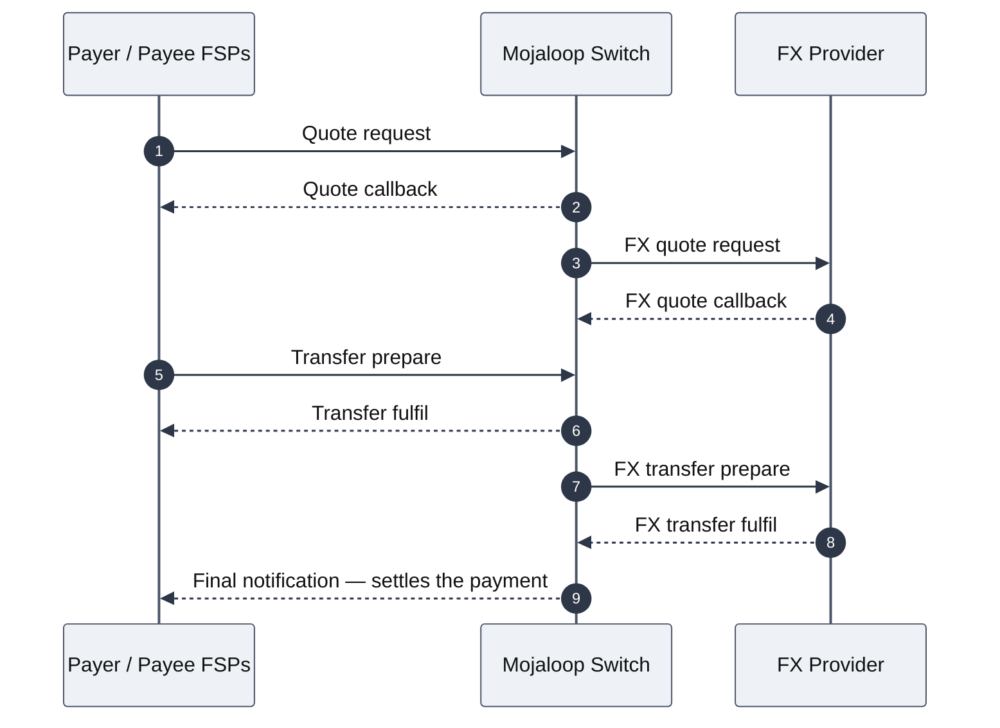

# MLA & PPA — Executive Summary

*A proof of concept that gets Mojaloop payment events into Tazama's fraud engine.*

---

## In one sentence

Two small services that sit between Mojaloop and Tazama, turn the scattered events a cross-border FX payment produces into the four complete ISO 20022 messages Tazama actually needs, and do it durably, safely under concurrency, and provably — not just on paper.

---

## The problem, in terms you already know

You know the cross-border FX flow: a quote goes out and comes back, an FX quote goes out and comes back, the transfer prepares and fulfils, the FX transfer prepares and fulfils, and a final notification settles it. Nine-ish separate asynchronous events, none of them a complete picture on its own — that's just how Mojoloop works, by design.

*Nine separate asynchronous events on the wire — none a complete picture on its own — for one payment.*

Tazama doesn't want fragments. Its Transaction Monitoring Service (TMS) accepts exactly four ISO 20022 message types, each one fully populated, or it can't run a fraud rule against it. Something has to sit in the middle, catch every one of those Mojoloop events, hold them together until enough of the picture exists, and hand Tazama a proper message at the right moments — no more, no less.

That "something" is **MLA** and **PPA**.

---

## The two components, and why there are two

**MLA (Mojaloop Adaptor)** lives inside Mojaloop's network. It reads one dedicated Kafka topic — the audit topic, not the live per-action topics — and for every event that lands, it does the absolute minimum: confirm it's well-formed, pull out the handful of identifiers it needs, wrap it in a standard envelope, and hand it to the PPA. It doesn't correlate anything, doesn't know what a payment *means*, doesn't touch the switch. That restraint is deliberate: it's the only piece with a foothold inside Mojoloop, so keeping it dumb means it never needs a Tazama credential and never becomes a second place business logic can drift.

**PPA (Payment Platform Adaptor)** lives inside Tazama's network. It does everything the MLA refuses to: holds each payment's accumulated state, decides when enough exists to fire a message, translates into ISO 20022, and sends it to TMS.

Two services instead of one because they live in different trust boundaries. One service straddling both would need a foothold and a credential in each — worse for everyone.

---

## How your familiar FX flow becomes four Tazama messages

Map it directly onto what you already know:

| Mojaloop event | Tazama receives |
| --- | --- |
| Quote request (`postQuotes`) | `pain.001.001.11` |
| Quote callback (`putQuotesByID`) | `pain.013.001.09` |
| Transfer prepare (`prepareTransfer`) | `pacs.008.001.10` |
| Final settlement notification (or any error) | `pacs.002.001.12` |

Notice what's *not* in that table: the FX quote and the FX transfer legs produce **no message of their own**. Their exchange rate and converted amount fold directly into the four messages above, so a cross-border payment shows up in Tazama as **one transaction**, exactly like a domestic one — not two settlement legs with the FX provider injected as a synthetic third party. Modelling it any other way would corrupt the velocity scoring the fraud rules depend on. This is one of the sharper design calls in the whole system, and it only makes sense if you already know the FX flow has that extra leg — which you do.

Everything on the switch is a trigger *or* an enrichment. A trigger fires exactly one outbound message, built from that event plus whatever's already accumulated. An enrichment just adds to the picture and produces nothing. The quote request is both — it fires `pain.001` immediately *and* feeds the later `pacs.008`.

---

## What actually happens to one payment

1. MLA reads an event, wraps it, POSTs it to the PPA.
2. PPA writes it durably **before** acknowledging — so a crash between those two steps never loses the event.
3. PPA classifies it: trigger or enrichment.
4. If it's a trigger, PPA pulls together whatever's accumulated for that payment so far, builds the ISO 20022 message, validates it against Tazama's own schema locally (catches drift before TMS's own validator would silently strip a field and still return `200`), and sends it.
5. If enrichment data is missing when a trigger fires — the callback never arrived, the FX quote never arrived — the message still goes out, but flagged **degraded** in the audit trail. A degraded message and a complete one look identical to Tazama, so that flag is the only place the distinction survives.
6. If the final settlement event never arrives at all, PPA raises an alert. It never invents a `pacs.002` — telling Tazama a payment settled on the strength of a request that was merely accepted would be worse than saying nothing.

---

## The features — what's actually built, not just designed

Everything below exists in running code today, and every one of these claims has been proven against a real, running Tazama instance — not asserted from the design.

*Speaker note: each item below is cued to a component in Diagram 1 ("System & trust-boundary topology") of [`MLA-PPA-Architecture-Diagrams.md`](MLA-PPA-Architecture-Diagrams.md) — pull that diagram up on screen for this section and point at the named node/color as you read each line.*

**Durability.** *[Diagram 1 — the "Write-ahead / park / DLQ store" node, purple]* Every event is written to disk before it's acknowledged. Killed a process mid-payment, mid-flight — a second, independent process picked the exact same payment back up from disk and finished it correctly.

**Handles events arriving out of order.** *[Diagram 1 — "Park sweep (background timer)", orange, working with the "Write-ahead / park / DLQ store", purple]* Mojaloop's Kafka partitioning means a payment's final notification can genuinely arrive before its own prepare message — confirmed as a real, observed case in the capture data, not a hypothetical. PPA parks whatever's missing and picks it back up the moment the rest shows up, even if that's hours or days later.

**Safe with multiple replicas running at once.** *[Diagram 1 — the "ValKey (Redis)" node, purple — the atomic Lua merge in `cache.ts`]* Two independent PPA instances, fed the same payment's events concurrently, correctly merge into one consistent picture with nothing lost or overwritten — proven with two real, separately-running processes, not simulated.

**Fails gracefully, and recovers on its own.** *[Diagram 1 — both orange nodes: "MLA→PPA circuit breaker" and "PPA→TMS circuit breaker"]* Circuit breakers on both hops (MLA→PPA and PPA→TMS): if TMS goes down, PPA stops hammering it and fails fast instead of burning retries on every message; the moment TMS is healthy again, it resumes automatically. Same pattern on the MLA side if the PPA goes down.

**Handles real load.** *[Diagram 1 — the "PPA" node, blue, and the "Write-ahead / park / DLQ store" it persists to before acking, purple — that accept-and-persist path is what the load test actually measured]* Over 1,000 concurrent synthetic payments in a sustained 30-second burst, zero failures, corroborated independently by TMS's own logs.

**A real audit trail.** *[Diagram 1 — the "Audit log store" node, purple]* Every payment has a durable, queryable record of exactly what happened to it and when — not something you have to grep out of server logs.

**A first pass at privacy protection.** *[Diagram 1 — the "Audit log store" node, purple, again — masking happens on the "append entry" edge into it]* Party identifiers (phone numbers, names) are masked with a keyed hash before they ever reach a log line or that audit trail — the same person always masks to the same value, so records can still be correlated, but nothing readable is ever written down.

**Operator tooling.** *[Diagram 1 — the "Operator / reviewer" node, grey, and its dotted "admin routes" edge into "PPA", blue]* A stuck or long-parked payment can be manually replayed back into the live pipeline on demand, without waiting for the automatic recovery path.

**Independently reproducible.** *[Diagram 1 has no dedicated node for these — they're MLA-side CLI tools that drive the whole path already on screen: "MLA" (blue) → "PPA" (blue) → "Tazama TMS" (grey)]* Two purpose-built tools are checked into the repo — one replays any real captured payment through the live pipeline end to end, the other sustains concurrent load against it. Either can be run by anyone against the same stack to watch the same result happen live, rather than take this document's word for it.

---

## Proven, not just designed

This is the part worth spending the most time on if the room is technical. The whole project has followed one rule: **never trust a design on paper — run it against the real system and watch it work.** That discipline found six genuine bugs that no amount of code review or unit testing alone would have caught:

- A race condition in a health check that could report a perfectly healthy system as down under real concurrent traffic.
- A recovery path that existed in code but was never actually wired up — so a paused consumer would have stayed paused forever.
- A missing identifier fallback for one specific FX-transfer stage, found on the very first live replay of real capture data.
- A recovery mechanism firing at the wrong moment, which briefly caused a settlement confirmation to be sent before the payment it confirmed had even reached Tazama's system.
- An ordering bug in the audit trail's own storage, caught by deliberately stress-testing it rather than trusting a single clean pass.

Every one of them is fixed, and every fix was re-verified live, the same way the original bug was found. That track record — not a claim that everything was perfect the first time, but proof that the process catches what actually breaks — is the strongest thing about this POC.

**199 automated tests** (33 for MLA, 166 for PPA), all built against real captured payment data rather than hand-written fixtures, plus every live-verification run above. Clean build, zero lint errors, on both services.

---

## What's deliberately not done, and why

Stated plainly, not hidden in a footnote:

- **Rejected or errored payments are unverified.** The available capture data has zero examples of a rejected transaction to build or test that path against. Blocked on getting that data, not a gap in effort.
- **Mutual TLS, the Keycloak authentication chain, and Kubernetes deployment manifests are not built.** These are deployment-stage concerns with no environment in this POC to actually validate them against — building configuration nobody can prove correct would break the one discipline everything else here follows.
- **Privacy protection is a first pass, not full tokenization.** The masking above covers logs and the audit trail. It does not, and cannot, touch the identifiers cryptographically bound inside the ILP packet itself — that's a separate, larger piece of infrastructure Mojoloop places upstream, and no implementation effort here changes that constraint.

---

## Where this stands today

The core pipeline, all four message types, durability, concurrency safety, operational resilience, audit trail, and a first pass at privacy protection are built and live-verified. What's left is one item genuinely blocked on external data, and a short list of deployment-stage work that has nowhere local to be validated yet. Nothing on this project's own list is still open by choice.
