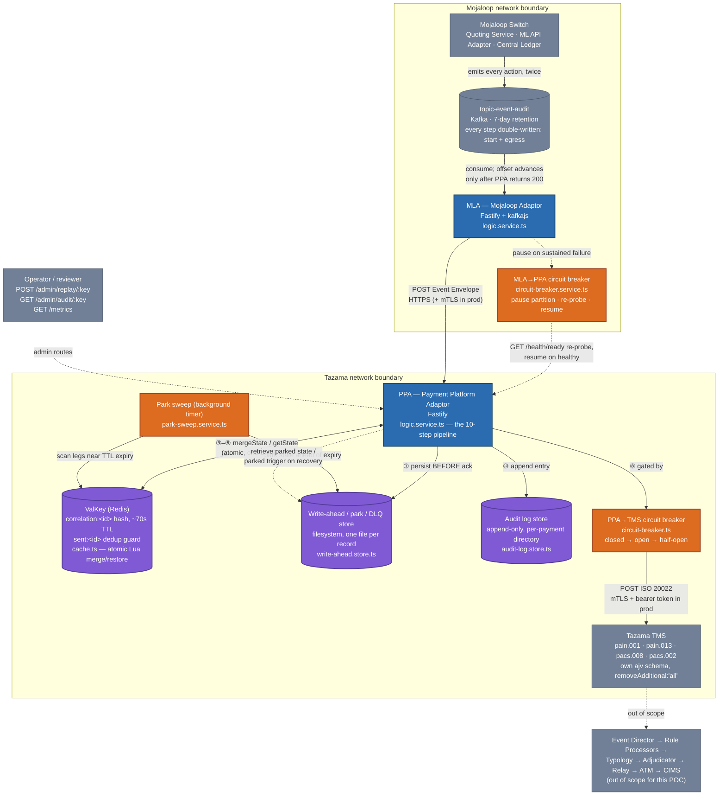
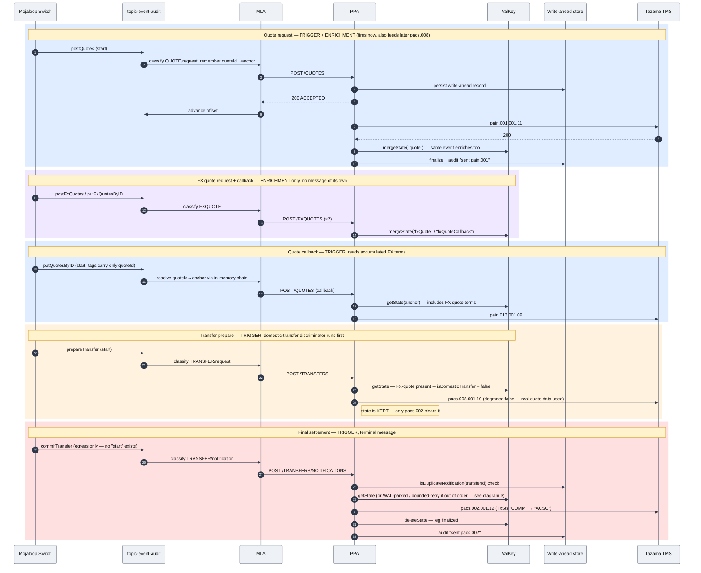

# MLA & PPA — Architecture Diagrams

**Companion documents:** [`MLA-PPA-Executive-Summary.md`](MLA-PPA-Executive-Summary.md),
[`MLA-PPA-Technical-Design.md`](MLA-PPA-Technical-Design.md), [`plan-outline.md`](plan-outline.md)

This document is a visual companion to the technical design, built by reading
the actual code (`mla/src/`, `ppa/src/`) alongside the FSD/IID and the
capture-driven design decisions. Where a diagram element maps to a specific
file or function, it's named directly, so this can double as an orientation
map for a first-time reader of the codebase.

Three diagrams, at three different zoom levels:

1. **System & trust-boundary topology** — the whole POC, one screen.
2. **Payment lifecycle, sequenced** — one real cross-border payment, end to
   end, matching the exact sequence live-verified in `plan-outline.md`
   (`01_MWK_to_ZMW_PRIMARY`).
3. **PPA's internal decision pipeline** — what `processEnvelope` actually
   does, step by step, including the out-of-order/recovery paths that aren't
   obvious from the happy path alone.

---

## 1. System & trust-boundary topology

The core fact this diagram exists to convey: **two services, two organizational
boundaries, one direction of data flow.** MLA never receives a callback from
PPA or TMS; everything downstream of "envelope accepted" is PPA's problem
alone. Blue = the two services that are this POC's actual deliverable.
Purple = the durable/stateful surfaces they depend on. Orange = the
self-healing guards (circuit breakers, the park sweep) that make the whole
thing resilient rather than just "working on the happy path."

**Reading this diagram:**

- **Blue (MLA, PPA)** — the two services this POC builds. MLA is
  deliberately thin (§2 of the Technical Design); PPA carries all the state
  and business logic.
- **Purple (ValKey, write-ahead store, audit log)** — the three distinct
  durable/semi-durable surfaces. They are _not_ interchangeable: ValKey is
  fast but short-TTL and per-field-mergeable; the write-ahead store is the
  90-day-retention safety net (persist-before-ack, park/retrieve, DLQ, and
  the notification-dedup set); the audit log is append-only forensic history
  indexed by payment, not by message.
- **Orange (circuit breakers, park sweep)** — the parts that exist purely so
  the system degrades gracefully instead of losing data or hammering a dead
  downstream. Both circuit breakers are per-process/in-memory by design (not
  shared across PPA replicas — each replica tracks its own TMS connection
  health).
- **Grey (Switch, TMS, downstream, operator)** — everything outside this
  POC's code, shown only to establish scope.
- MLA's **only** path back to the audit topic is the Kafka offset — there is
  no MLA-side DLQ (§2.6). Everything the MLA can't yet process just... stays
  on the topic, because the topic's own retention already durably holds it.

---

## 2. Payment lifecycle, sequenced

This is one real cross-border payment (MWK→ZMW), tracing the exact sequence
`plan-outline.md`'s live-verification runs replayed against a real local TMS.
It shows the two roles every event plays — **trigger** (fires exactly one
outbound Tazama message) or **enrichment** (folds into the leg's state,
produces nothing) — and where the FX leg quietly disappears into the
messages around it rather than becoming a message of its own.

**What to notice:**

- **Four Tazama messages, nine-ish Mojaloop events.** The FX quote
  (highlighted purple) contributes real data — exchange rate, converted
  amount — but never becomes a message of its own; it folds into `pain.001`,
  `pain.013`, and `pacs.008`. This is _the_ design decision that keeps a
  cross-border payment looking like one transaction to Tazama's fraud
  scoring, instead of two settlement legs with the FX provider injected as a
  synthetic third party.
- **The `pacs.008` fires on prepare, not on fulfil.** Waiting for the fulfil
  would destroy the only window in which a fraud rule can still affect the
  outcome — by the time `commitTransfer` lands, the transfer already
  happened on the switch.
- **`putQuotesByID`'s tags carry no anchor identifier** — only `quoteId`.
  MLA resolves it via a small in-memory chain populated when the matching
  `postQuotes` was processed moments earlier (same partition, so ordering is
  guaranteed). The equivalent chain exists for `reserveFxTransfer` →
  `commitRequestId`/`conversionId`.
- **Every envelope is persisted to the write-ahead store before PPA acks**
  — that ordering, not anything downstream, is what makes a mid-pipeline
  crash recoverable.

---

## 3. PPA's internal decision pipeline

This is `processEnvelope` in [`ppa/src/services/logic.service.ts`](../ppa/src/services/logic.service.ts)
— the ten steps from Technical Design §3.2, plus the out-of-order recovery
paths (§3.7) that only show up when an event arrives early, late, or not at
all. This is the part of the system doing the real work; the two diagrams
above are the shape it produces.

```mermaid
flowchart TD
    A["POST /QUOTES · /FXQUOTES · /TRANSFERS ·<br/>/FXTRANSFERS · /TRANSFERS/NOTIFICATIONS"] --> B{"① Reachability gate<br/>acceptEnvelope()"}
    B -->|"ValKey or write-ahead store down"| B1["503 UNAVAILABLE<br/>— MLA offset stays put"]
    B -->|"reachable"| C["① Persist write-ahead record<br/>writeAheadStore.persist()"]
    C --> D["② 200 ACCEPTED to MLA<br/>— everything below is async"]

    D --> F{"③ validateEnvelope"}
    F -->|invalid| F1["audit: rejected"]
    F -->|valid| G{"④ notification?<br/>isDuplicateFinalStateNotification"}
    G -->|duplicate| G1["audit: discarded — duplicate notification"]
    G -->|new| H{"⑤ classify()<br/>Trigger / Enrichment / CorrelationOnly"}

    H -->|"Enrichment or<br/>CorrelationOnly"| I["⑥a mergeEnrichment()<br/>ValKey Lua EVAL — HSETNX+HSET+EXPIRE,<br/>one field, one atomic command"]
    I --> I1["audit: merged"]

    H -->|Trigger| J["cacheClient.getState(id)"]
    J --> K{"state found?"}
    K -->|"no, and this is<br/>a notification"| L["resolveNotificationState:<br/>① check write-ahead 'parked' state (late arrival)<br/>② bounded retry vs ValKey (early arrival,<br/>the confirmed partition-split race)"]
    L -->|resolved| M["state"]
    L -->|"still nothing"| L1["parkPendingTrigger() to write-ahead store<br/>audit: parked — wait for its own pacs.008"]
    K -->|yes| M

    M --> N{"⑥b TRANSFER prepare<br/>with no FX-quote state?<br/>isDomesticTransfer"}
    N -->|"yes — domestic"| N1["discard — out of Phase-1 scope<br/>metrics: discarded.domestic"]
    N -->|no| O["⑦ translateAndValidate:<br/>translate() → toPain001/toPain013/<br/>toPacs008/toPacs002, then pinned<br/>local ajv schema check"]

    O -->|"translate or<br/>schema-validate fails"| O1["finalize(failed) + audit: failed<br/>— permanent defect, not retried"]
    O -->|ok| P{"claimSentGuard<br/>ValKey SET NX EX dedup"}
    P -->|already sent| P1["audit: skipped — already sent"]
    P -->|claimed| Q["⑧ sendToTms()<br/>gated by TMS circuit breaker,<br/>retried with backoff+jitter"]

    Q --> R{"QUOTE eventType?"}
    R -->|yes| R1["also mergeEnrichment()<br/>— trigger AND enrichment"]
    R -->|no| S
    R1 --> S{"TRANSFER prepare<br/>sent successfully?"}
    S -->|yes| T["completeParkedTriggerAfterPrepare:<br/>replay any pacs.002 parked earlier<br/>for this leg — now safe, pacs.008<br/>is in Tazama's graph"]
    S -->|no| U
    T --> U["⑨ finalize():<br/>write-ahead complete();<br/>if pacs.002 succeeded → deleteState (terminal)"]
    U --> V["⑩ auditLog(): outcome, degraded flag,<br/>masked party summary → audit-log.store.ts"]

    classDef trigger fill:#2b6cb0,color:#ffffff,stroke:#1a4971,stroke-width:2px
    classDef enrich fill:#38a169,color:#ffffff,stroke:#22543d,stroke-width:2px
    classDef recovery fill:#dd6b20,color:#ffffff,stroke:#9c4221,stroke-width:2px
    classDef terminal fill:#718096,color:#ffffff,stroke:#4a5568,stroke-width:1px
    classDef reject fill:#c53030,color:#ffffff,stroke:#822727,stroke-width:1px

    class O,Q,R1,T,U trigger
    class I,I1 enrich
    class L,L1,S recovery
    class F1,G1,N1,O1,P1,B1 reject
```

**Why the out-of-order paths (orange) matter as much as the happy path
(blue).** `04_ZMW_to_EGP_partition_split` in the real capture data shows a
settlement leg landing on a _different Kafka partition, under a fresh trace
id_, from the rest of its own transaction — so a `pacs.002` trigger racing
ahead of its `pacs.008` is a confirmed real condition, not a defensive
allowance. Two genuine bugs were found and fixed by live-replaying exactly
this scenario (see `plan-outline.md` / Technical Design §3.7 & §7.5):

- **Firing too early:** an earlier version replayed a parked trigger the
  moment _any_ enrichment merged in, not specifically once its own
  `pacs.008` had reached TMS — sending `pacs.002` before Tazama's graph had
  a `pacs.008` to reference. Fixed by moving the replay condition to exactly
  `completeParkedTriggerAfterPrepare`, shown above.
- **Firing twice:** the replayed `pacs.002` then tripped its own prior
  duplicate-notification claim. Fixed with the `isReplay` flag that skips
  the dedup check only for this internal replay path.

**The other core invariant this diagram encodes:** state is cleared
(`deleteState`) **only** when the terminal message (`pacs.002`) sends
successfully — never on `pacs.008`. A `pacs.008` reads accumulated state and
leaves it alone, because the `pacs.002` that eventually terminates the leg
still needs it.

---

## Core parts, at a glance

| Part                                       | File(s)                                                                             | Why it's core                                                                                                                                                                                                                                                                               |
| ------------------------------------------ | ----------------------------------------------------------------------------------- | ------------------------------------------------------------------------------------------------------------------------------------------------------------------------------------------------------------------------------------------------------------------------------------------- |
| **MLA classification & envelope build**    | `mla/src/services/logic.service.ts`                                                 | Resolves FSD Open Item #7 — every event self-identifies via `operation`, no payload sniffing. Handles the `start`/`egress` double-write and the two identifier-chaining exceptions (`putQuotesByID`, `reserveFxTransfer`).                                                                  |
| **MLA offset discipline**                  | `mla/src/clients/kafka.ts`, `dispatchToPpa`                                         | The entire MLA recovery model: advance on success/permanent failure, pause on transient failure. No DLQ exists or is needed — the audit topic's own retention is it.                                                                                                                        |
| **PPA's 10-step pipeline**                 | `ppa/src/services/logic.service.ts` (`processEnvelope`)                             | Every business rule in the system funnels through here: classification, correlation, domestic-transfer discrimination, translation, schema validation, TMS dispatch, finalization, audit.                                                                                                   |
| **Atomic correlation merge**               | `ppa/src/clients/cache.ts` (`MERGE_STATE_SCRIPT`)                                   | One Lua `EVAL` per enrichment field — the mechanism that makes concurrent PPA replicas safe with no lost updates, live-verified across two independent processes.                                                                                                                           |
| **ISO 20022 translation**                  | `ppa/src/services/iso20022.ts`                                                      | Where FX-leg folding, `TxSts` vocabulary translation (`COMM`→`ACSC`), and degraded-field fallbacks all live.                                                                                                                                                                                |
| **Durable write-ahead / park / DLQ store** | `ppa/src/clients/write-ahead.store.ts`                                              | Persist-before-ack durability, the notification dedup set, and both halves of persist-and-retrieve (late-arrival parking via the sweep, early-arrival pending-trigger parking). A POC filesystem stand-in for the real backing store, but genuinely crash-safe (temp-file + atomic rename). |
| **Park sweep**                             | `ppa/src/services/park-sweep.service.ts`                                            | Proactively copies near-expiry ValKey state to the durable store — the only way to beat ValKey's TTL, since Redis has no "about to expire" event.                                                                                                                                           |
| **Circuit breakers**                       | `ppa/src/clients/circuit-breaker.ts`, `mla/src/services/circuit-breaker.service.ts` | Fail-fast + auto-recovery on both hops (MLA→PPA, PPA→TMS) — closes the gap where a paused Kafka partition used to stay paused forever.                                                                                                                                                      |
| **Audit log store**                        | `ppa/src/clients/audit-log.store.ts`                                                | Append-only, per-payment (not per-message) — answers "what happened to this payment" as one ordered list.                                                                                                                                                                                   |
| **PII masking**                            | `ppa/src/services/pii-mask.service.ts`                                              | Keyed HMAC over party identifiers before they reach a log line or the audit store — deterministic (correlatable) but not reversible by inspection. A first pass, not full tokenization.                                                                                                     |
| **Operator tooling**                       | `POST /admin/replay/:key`, `GET /admin/audit/:key`, `GET /metrics`                  | Lets a human use the durable store's 90-day window directly, and gives a reviewer a live view into what the pipeline is doing without grepping logs.                                                                                                                                        |

Every one of the flows above has been run against a real local Tazama TMS
and ValKey instance, not just designed — see `plan-outline.md`'s
"Current status" section and Technical Design §7 for the full live-run
evidence behind each diagram.
