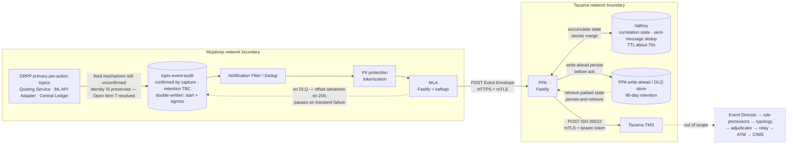

# MLA & PPA — Technical Design

**Proof of concept:** `poc-mla-ppa`
**Companion documents:** [`MLA-PPA-Executive-Summary.md`](MLA-PPA-Executive-Summary.md), [`plan-outline.md`](plan-outline.md), [`rejected-events.md`](rejected-events.md)

**Normative sources:**

| Document | Authority for |
| --- | --- |
| `CCH_FSD_MessageIngestion_v4.0.md` (CCH-PL-FSD-MSGING-001) | How the MLA and PPA work internally — the component-level authority for correlation, classification, and ISO 20022 translation rules |
| `Integration_and_Interface_Document_v4.0.md` | Every system-to-system boundary end to end, and where MLA/PPA sit in the wider pipeline |
| `DRPP_Kafka_E2E_Pack` (raw captures, `topic-event-audit`, 11–13 Aug 2026) | **Ground truth for what the audit topic actually contains** — supersedes the FSD's topic/envelope model wherever the two conflict (§2). Full analysis and provenance: `plan-outline.md` § *Capture analysis*. |
| `raw_export_500.json` (a second, wider capture — 500 records across 12 partitions of `topic-event-audit`) | **Ground truth for real rejection shapes** — the transfer-prepare, FX-quote, and party-lookup rejections, none matching what the FSD assumed. Full analysis, the phased build, and open questions: [`rejected-events.md`](rejected-events.md). |

This document is the implementation-facing view: interfaces, data shapes, keying, failure behaviour, and the exact boundary between what the POC builds and what it defers. Section references in the form (§6.3) point at the Message Ingestion FSD, which remains the authority on business logic (correlation, trigger/enrichment classification, translation rules) that the captures do not touch. Where the captures and the FSD disagree on the **ingress/topic model** specifically, this document follows the captures — they are what the MLA will actually read, not what the FSD predicted it would read.

### Where the two sources disagree

The IID cites the FSD as its own source. Its own revision passes have since closed most of the drift once tracked here — trigger pairing language, FX Transfer's enrichment-only status, `TxSts` translation, `pacs.008` field shapes, and the health-endpoint split all now match the FSD, which this document follows throughout as the component-level authority for these two services. One point remains a live, unresolved disagreement:

| Point | FSD v4.0 (followed here) | IID v4.0 | Note |
| --- | --- | --- | --- |
| `msgType` values | `request` / `callback` / `notification` | The original HTTP method — `POST` / `PUT` | The IID flags this itself as an unresolved naming collision, not a one-sided correction — it needs a decision from someone with authority over both documents (IID Open Item #22). This POC follows the FSD; see §6. |

**The IID's `pacs.008` worked example is still missing required fields.** Its current example gets the field shapes right (`PmtId.InstrId`/`EndToEndId`, `IntrBkSttlmAmt.Amt.{Amt,Ccy}`, the party fields) but omits `RgltryRptg`, `RmtInf`, and `SplmtryData` entirely. The FSD's own worked example (§7) includes all three as required — constant-valued (no Mojaloop data populates them), but required by Tazama's schema regardless. A live TMS instance rejects the message without them (`400`, `missing required property 'RgltryRptg'`) — this is the exact defect this POC's live run (§7.3) caught and fixed in `ppa/src/services/iso20022.ts`. Not a gap in this design; worth raising with whoever owns the IID.

### Where the captures override the FSD's topic model

The four rows above are documentation drift between two specs. These are different in kind: they are what the FSD *predicted* the audit topic would look like, corrected against what it actually contains. Full derivation in `plan-outline.md` § *Capture analysis*; this table is the design decision, not the investigation.

| Point | FSD's model | Confirmed from `DRPP_Kafka_E2E_Pack` | Followed here |
| --- | --- | --- | --- |
| Topic name | "The Mojaloop audit topic" (unnamed) | **`topic-event-audit`** | Captures |
| Envelope shape | `{from, to, id, content, metadata}`, one record per event | Redpanda Console export: `{partitionID, offset, key, value.payload{content, metadata}}`; identifiers live in `metadata.trace.tags`, not the body | Captures — §2.2, §2.3 |
| Event classification | Topic name, with payload-shape fallback for FX transfer (Open Item #7) | **`metadata.trace.tags.operation`** — an explicit, deterministic 13-value stage classifier. Open Item #7 is resolved: no payload sniffing needed anywhere, for any stage. | Captures |
| Records per logical step | One | **Two** — `start` and `egress` — for most operations, asymmetrically (§2.2a) | Captures |
| Base64 decoding | Mandatory for transfer/notification payloads | **Optional.** The FSPIOP JSON form is already plain in `content.payload`/`content.transformedPayload`; `content.dataUri` carries the base64 ISO form only where the ISO shape is wanted | Captures |
| Party lookup on this topic | Does not exist — ALS is HTTPS end-to-end, never Kafka-published (§6.4.1, §6.4.3) | **Present.** `getPartiesByTypeAndID` / `putPartiesByTypeAndID` are stages 1–2 of every capture | Captures — the FSD's premise here does not hold for `topic-event-audit` |
| Payee display name | No confirmed source; degrades to MSISDN (Open Item #4) | **Present** — `CdtTrfTxInf.Cdtr.Nm` (ISO form) and `payee.personalInfo.complexName` (FSPIOP form), on the quote payload | Captures — Open Item #4 resolved |
| `pacs.002` trigger | Undecided between Central Ledger notification and FSPIOP fulfil callback (Open Item #5) | **`commitTransfer`**, an egress-only record from `ml-notification-handler` carrying `fspiop-source`/`-destination` and `TxSts: "COMM"` | Captures — Open Item #5 resolved |
| Date of birth | Sourced from the quote request; degrades on cache miss (§6.4.3) | **Absent everywhere** — zero occurrences across the entire pack, in either message form | Captures — this is now a structural gap, not a fallback case, §3.6 |
| `TxSts` vocabulary | `COMMITTED`/`ABORTED`/`RESERVED` (FSPIOP form only) | Also carries **`COMM`/`RESV`** (ISO form) — a third vocabulary the FSD's §6.5.3 table has no row for | Captures — table extended, §3.5 |

**Not resolved by these five captures:** no error, abort, or rejection appears in `DRPP_Kafka_E2E_Pack`'s five transactions — all five settle successfully. **A separate, wider capture (`raw_export_500.json`, 500 records across 12 partitions) surfaced real rejection data** — an FX-quote reject, a transfer-prepare reject, and a party-lookup reject, none matching the shape the FSD assumed. The transfer-prepare rejection is now built and live-verified against a real TMS (§2.2a, §3.3, §3.5, §7.14); the FX-quote and party-lookup rejections are deliberately not forwarded to the PPA at all (§3.3, §6 Q1). See [`rejected-events.md`](rejected-events.md) for the full findings, the design decisions, and what remains genuinely open (no fulfil-side rejection or FX-transfer-level rejection has been captured; reason-code diversity is minimal).

---

## 1. Component topology



Five things the diagram is making a point of, updated against the captures (§2):

- The MLA reads **one** topic — confirmed by capture as `topic-event-audit` — not seven, and the two upstream components sit *after* it, so its own forensic record predates both tokenization and notification dedup. The captures carry unmasked MSISDNs and full names throughout, which is consistent with sitting upstream of the tokenization component, but is worth confirming directly rather than assuming.
- **Open Item #7 is resolved, favourably.** Every event on this topic carries an explicit `operation` tag identifying its stage — no payload-shape sniffing is needed anywhere, for any stage, including FX-vs-domestic transfer. The *feed mechanism* from the primary topics (top edge) remains unconfirmed, but it no longer matters for the MLA's own logic: whatever feeds the topic, what lands on it is classifiable directly.
- Every operation is **written up to twice** — a property the diagram can't show at this scale but that dominates §2.2. It is not drawn as a loop because it is asymmetric per operation, not a generic doubling.
- The only line leaving the MLA other than the one to the PPA goes **back to the audit topic**: that is the offset, and it is the MLA's entire recovery mechanism.
- The arrow from the durable store back into the PPA is persist-and-retrieve. Without it, an event arriving after its leg's ValKey TTL is unresolvable; with it, the leg waits in the store for up to 90 days. The captures confirm this path is load-bearing, not defensive: `04_ZMW_to_EGP_partition_split` shows the entire settlement leg landing on a different Kafka partition under a fresh trace id, so the `pacs.002` trigger can genuinely arrive before the `pacs.008` it belongs to.

The two services are independently deployable and independently scalable. The MLA addresses the PPA through a single stable service name or load balancer, never individual PPA instances. The PPA holds no state in process — every replica is interchangeable, with all shared state in ValKey and the durable store.

**Where this sits in the wider pipeline.** Ingestion ends at the TMS, but the TMS is not the end of the pipeline. Per the IID, the canonical downstream chain is TMS → Event Director → Rule Processors → Typology Processor → Event Adjudicator → Relay Service → Alert Triage Module → CIMS. Nothing downstream of the TMS is in scope here; it matters only because it sets what "delivered" means — a message the TMS accepts but silently strips fields from (§3.2 step 7) still fails rules five hops later.

## 2. MLA — Mojaloop Adaptor

### 2.1 Ingress: `topic-event-audit`

**The MLA subscribes to one dedicated topic, `topic-event-audit`, not to the per-action primary topics.** Confirmed by direct capture (`DRPP_Kafka_E2E_Pack`, Redpanda Console, 11–13 August 2026) — this is no longer the FSD's unnamed hypothesis. It is a real-time stream, separate from Mojoloop's live transaction topics, fed by the forensic audit workstream. Its defining guarantee, per the FSD, is that every message is durably persisted to a queryable store *before processing continues* — durability is established before the MLA ever sees the event. The FSD states 7-day retention on this basis; the captures do not evidence retention either way, so treat that figure as inherited from the FSD rather than independently confirmed (tracked in `plan-outline.md` § *Open questions*).

That guarantee is why the MLA has no dead-letter queue of its own (§2.6).

**Two components are specified to sit between the topic and the MLA, in this order:**

1. **Notification Filter/Dedup** — identifies notification-type events and suppresses duplicate final-state notifications. Per the IDD, its Phase 1 *deployment* is embedded inside the MLA/PPA containers by default.
2. **PII-protection component** — deterministically tokenizes party-identity fields before the MLA consumes the event.

⚠️ **The captures show unmasked MSISDNs and full names throughout** — every record's party identifiers (`+260976001234`, `Chikondi;;Banda;`, etc.) are cleartext. This is consistent with the FSD's architecture (both components sit upstream of the MLA, so a capture taken at the topic itself would show pre-tokenization data regardless of whether the component is running), but it has not been independently confirmed that the PII-protection component ran ahead of this capture. Treat the tokenization requirement as fully in force for production; do not infer anything about its operation from these samples.

### 2.2 Record shape — the actual export, not the FSD's hypothesis

Records are Redpanda Console exports, not the FSD's `{from, to, id, content, metadata}` model:

```
{ partitionID, offset, timestamp, compression, isTransactional, headers, key,
  value: { payload: { id, type, content, metadata } } }
```

`value.payload` is the business envelope:

| Path | Contents |
| --- | --- |
| `content.headers` | Full HTTP headers — `fspiop-source`, `fspiop-destination`, `fspiop-signature`, `authorization`, `traceparent` |
| `content.payload` | The body. **Form varies**: ISO 20022 element tree on quote/FX-quote records, FSPIOP JSON on transfer records |
| `content.transformedPayload` | The FSPIOP-equivalent form, present on quote/FX-quote records alongside `content.payload` |
| `content.dataUri` | Base64 `data:...;base64,...` ISO 20022 form, present on transfer records alongside `content.payload` |
| `metadata.event.action` | `"start"` or `"egress"` — see §2.2a, this is not optional to handle |
| `metadata.trace.tags` | The classifier and every business identifier — see below |

**Base64 decoding is optional, not mandatory.** The FSPIOP fields the FSD's mapping wants are already plain JSON in `content.payload` (transfer records) or `content.transformedPayload` (quote records). Decode `content.dataUri` only where the ISO 20022 form specifically is wanted — verified: it is a genuinely different representation of the same step, not a duplicate.

**Identifiers live in `metadata.trace.tags`, confirmed reliable across the entire pack.** Every record whose `operation` maps to a `QUOTE`/`FXQUOTE`/`TRANSFER`/`FXTRANSFER` envelope carries its FSD-mandated identifier directly in tags, on **both** `start` and `egress`, with one exception (`putQuotesByID` — see §2.3). Reading from tags is simpler and more reliable than reading from the body, and is the source this design uses.

**Deprecated by the above:** party lookup is present on this topic (`getPartiesByTypeAndID`, `putPartiesByTypeAndID`), which the FSD's premise (ALS is HTTPS end-to-end, never Kafka-published) said could not happen. Whether to reinstate party-lookup enrichment now that the data is available is an open design decision, not a technical blocker — see `plan-outline.md` item C1.

**Kafka key is a trace id, not a transaction id — do not use it for correlation.** In this capture, every observed trace id covered more than one transaction, and the settlement leg is sometimes re-emitted under a fresh trace id (confirmed in `04_ZMW_to_EGP_partition_split` — see §3.7). `correlationId` on the envelope must be freshly generated by the MLA per event, never derived from the Kafka message key.

**Consumer group** must be dedicated to the MLA. Reusing a DRPP-internal group name risks stealing partition assignments from a live payment-path handler.

### 2.2a Classification and canonical-record selection

**Classify on `metadata.trace.tags.operation` alone.** It is an explicit, deterministic 13-value classifier — this is what resolves Open Item #7. Do not use `transactionType`: it is present but **disagrees between the `start` and `egress` of the same step** (e.g. `postFxQuotes` reads `transactionType: "quote"` on `start` and `"fxquote"` on `egress`) and cannot be trusted as a classifier.

**Not every operation is written twice, and the pairing is not symmetric.** Confirmed across every record in the pack — each `operation` value has a **fixed, single set of `action` values**, never varying by transaction:

| `operation` | `action`(s) observed | FSD stage | Canonical record | Signature present |
| --- | --- | --- | --- | --- |
| `getPartiesByTypeAndID` | start, egress | Party lookup (out of scope unless C1 reinstated) | — | No |
| `putPartiesByTypeAndID` | start only | Party lookup callback | — | Yes |
| `postFxQuotes` | start, egress | FX quote request | **start** | start only |
| `putFxQuotesByID` | start, egress | FX quote callback | **start** | start only |
| `postQuotes` | start, egress | Quote request → `pain.001` trigger | **start** | start only |
| `putQuotesByID` | start, egress | Quote callback → `pain.013` trigger | **start** | start only |
| `prepareFxTransfer` | start, egress | FX transfer prepare | **start** | both |
| `fulfilFxTransfer` | start only | FX transfer fulfil (ingress leg) | — (see `reserveFxTransfer`) | Yes |
| `reserveFxTransfer` | egress only | FX transfer fulfil (outbound leg) | **egress** | Yes |
| `prepareTransfer` | start, egress | Transfer prepare → `pacs.008` trigger | **start** | both |
| `fulfilTransfer` | start only | Transfer fulfil (ingress leg) | — (see below) | Yes |
| `notifyFxTransfer` | egress only | FX-transfer-side notification of the fulfil | — | Yes |
| `commitTransfer` | egress only | Final settlement → `pacs.002` trigger | **egress** | Yes |
| `putPartiesErrorByTypeAndID` | start (49 of 50), egress (1) | Party lookup error callback | — | Yes |

**`prepareTransfer`'s egress half is overloaded, confirmed by a second, wider capture (`raw_export_500.json`, 500 records across 12 partitions — see [`rejected-events.md`](rejected-events.md)).** On the happy path it is the harmless duplicate the table above says to discard. When the transfer is rejected, it is instead this leg's *terminal* record — `TxInfAndSts.StsRsnInf` (a reason code and description) in place of the normal transfer body, and never followed by `fulfilTransfer`/`notifyFxTransfer`/`commitTransfer`. The two are told apart by payload shape (`StsRsnInf` present, corroborated by the record's `httpUrl` ending `/error`), not by `operation`/`action` alone — the canonical-record table above is necessary but not sufficient for this one operation. Built and live-verified against a real TMS; see §6 and §7.14.

**This is not a generic "start vs egress" rule** — three operations exist only as `start` (`fulfilFxTransfer`, `fulfilTransfer`, `putPartiesByTypeAndID`) and three only as `egress` (`reserveFxTransfer`, `notifyFxTransfer`, `commitTransfer`). The fulfil-side operations rename themselves between ingress and egress rather than repeating: a `PUT /transfers/{id}` fulfil is audited as `fulfilTransfer` (start, from `ml-api-adapter-service`) on the way in, and fans out to **two** separate `egress` records from `ml-notification-handler` — `notifyFxTransfer` (notifies the FX leg) and `commitTransfer` (the actual final-state notification). `commitTransfer` is the FSD's `pacs.002` trigger, and it exists **only** as this fan-out record — there is no `commitTransfer` `start` to disambiguate against.

**The canonical-record column above is corroborated by signature presence**, not asserted independently of it: every record marked canonical carries a real JWS signature; every `start`/`egress` counterpart that is *not* canonical for its operation is exactly the one that lacks one (quote/FX-quote `egress`, and the party `GET`). Treat that correlation as supporting evidence for the table, not as the classification rule itself — the rule is the `operation` value.

### 2.3 Event Envelope

The single wire contract between the two services.

| Field | Type | Notes |
| --- | --- | --- |
| `msgType` | string | `request`, `callback`, or `notification` — see the IID divergence noted at the top of this document |
| `eventType` | string | `QUOTE`, `FXQUOTE`, `TRANSFER`, `FXTRANSFER` — from `metadata.trace.tags.operation` per §2.2a |
| `id` | string | See deviation below |
| `correlationId` | string | MLA-generated technical trace id, distinct from `id` **and from the Kafka message key** (§2.2). Propagated through the PPA, ValKey, audit log, PPA's DLQ and the outbound TMS call. |
| `fspiop-source` | string | Originating DFSP — mandatory, read from `content.headers` |
| `fspiop-destination` | string | Intended recipient DFSP — mandatory, read from `content.headers` |
| `body` | object | `content.payload` — or `content.transformedPayload` for the quote-family FSPIOP form, per §2.2 |
| `timestamp` | string | ISO 8601, when the MLA consumed the event |

**Deviation from the FSD's per-`eventType` `id` scheme.** The FSD specifies `id` as `quoteId` / `conversionRequestId` / `transferId` / `commitRequestId` depending on `eventType`. Verified against the captures, this scheme has one hard exception: `putQuotesByID` (the quote callback, canonical per §2.2a) carries **only** `quoteId` in its tags on both `start` and `egress` — never the anchor identifier (`transactionId`) that every other record carries. Every other envelope-relevant record carries the anchor identifier directly, confirmed universally across the entire pack.

This POC uses the **anchor identifier** (`transactionId` — confirmed always equal to `transferId` and `determiningTransferId` where more than one is present) as `id` uniformly across every `eventType`, rather than switching fields per type. The FSD's stage-local identifiers (`quoteId`, `conversionRequestId`, `conversionId`, `commitRequestId`) are still needed — the PPA's per-stage correlation-cache keys in §6.4.4 require them — so they are carried inside `body` (they are already present there) rather than promoted to `id`. This resolves the `putQuotesByID` gap cleanly (its anchor is available; its stage-local id, `quoteId`, is carried in `body` as before) and simplifies extraction to one rule instead of four. The one place this still requires chaining is `putQuotesByID` itself, if the PPA's `quoteId`-keyed cache entry needs to be resolved back to the anchor — which it does, via the `postQuotes` record processed earlier in the same leg (the capture pack's own analysis documents this exact chain: `quoteId` → `PmtId.TxId` on `postQuotes`).

### 2.4 Egress: per-action endpoints

| `eventType` | PPA endpoint |
| --- | --- |
| `QUOTE` | `POST /QUOTES` |
| `FXQUOTE` | `POST /FXQUOTES` |
| `TRANSFER` | `POST /TRANSFERS` |
| `FXTRANSFER` | `POST /FXTRANSFERS` |
| Final-state notification | `POST /TRANSFERS/NOTIFICATIONS` |

Per-action rather than one generic endpoint, mirroring the per-action topic model upstream. The endpoint is a contract boundary — schema, versioning and auth scope attach to it — so a breaking change to one message type does not force a migration on unrelated traffic. Unaffected by the capture findings: `eventType` classification changed (§2.2a), routing on it did not.

### 2.5 Per-event processing

1. Read the raw message off `topic-event-audit`; confirm it is well-formed JSON.
2. Classify by `metadata.trace.tags.operation`; select the canonical record per §2.2a — skip non-canonical `start`/`egress` counterparts without forwarding them.
3. Extract `eventType`, `id`, `fspiop-source`, `fspiop-destination` from tags/headers (§2.3).
4. Validate the JWS signature (§2.6) — every canonical record carries one, per §2.2a.
5. Build the Event Envelope, reading `body` from `content.payload` (or `content.transformedPayload` for quote-family records).
6. POST to the PPA's per-action endpoint; wait for `200`.
7. **Only then** advance the audit-topic offset.

Step 7 is the durability contract. Advancing the offset before the acknowledgement would create a window in which an event is considered handled but never reached the PPA.

### 2.6 Failure handling

**The MLA has no dead-letter queue.** Every outcome below resolves to one of two actions — *advance the offset* or *pause it* — because the audit topic's persistence guarantee already holds anything the MLA cannot yet process (§2.1). The distinction that decides which is whether the failure is **transient** (the event will succeed on retry, so pause and keep it) or **permanent** (it never will, so advance and stop blocking the partition behind it).

| Situation | Behaviour |
| --- | --- |
| PPA returns `200` | Advance the offset, move on. |
| PPA returns `4xx` | Permanent — the envelope itself is invalid and retrying cannot help. Log the full envelope as an error, alert, then **advance the offset anyway**. There is no DLQ to park it in, and pausing for an event that will never succeed stalls everything behind it. ⛔ *see Open Item #8 in §6* |
| PPA returns `5xx` or times out | Transient. Retry 3× with exponential back-off **and jitter** (1s/2s/4s), offset not advancing. On exhaustion, alert and **pause the offset** — do not advance. PPA is down or degraded, so the event should be retried once it recovers, not discarded. |
| Sustained consecutive failures (circuit breaker trips) | The PPA is systemically down, not flaky for one event. Pause consumption on the affected partition(s) entirely and re-probe PPA health on a timer. This is the same recovery model as the audit topic itself. |
| Malformed or unreadable message | Permanent. Skip and log; never forward broken data. Advance the offset — it will not become readable on retry. |
| Broker unreachable | Rely on the Kafka client's built-in reconnect. The offset naturally stays paused until reconnection. |
| `FSPIOP-Signature` missing on a canonical record | Permanent. Reject, do not forward, log and raise a **security** alert, then advance the offset — same reasoning as the `4xx` row. Confirmed: no canonical record (§2.2a) lacks a signature in the captured pack, so this row should not fire in normal operation — treat any occurrence as a genuine anomaly worth investigating, not routine noise. ⛔ *see Open Item #8 in §6* |
| No error/abort/reject records exist to validate against | The `RJCT` path, `putPartiesErrorByTypeAndID`, and every row above involving an actual malformed or rejected DRPP-side event remain built against the FSD specification alone — no capture confirms any of it. |

Note what pausing costs: it stalls every event behind it on that partition. That is the intended trade — correctness over throughput — but it means the retention window (§2.1) is the real bound on how long an outage can last before events are genuinely lost.

## 3. PPA — Payment Platform Adaptor

### 3.1 Ingress

| Endpoint | Method | Purpose |
| --- | --- | --- |
| `/QUOTES` | POST | Quote request / callback / error |
| `/FXQUOTES` | POST | FX quote request / callback / error |
| `/TRANSFERS` | POST | Transfer request / callback |
| `/FXTRANSFERS` | POST | FX transfer request / callback |
| `/TRANSFERS/NOTIFICATIONS` | POST | Deduplicated final-state notification |
| `/health/live` | GET | Process is responsive |
| `/health/ready` | GET | **Instance-local only** |

`/health/ready` deliberately checks only instance-local state — process up, config loaded, write-ahead store reachable. It does **not** gate on ValKey or the TMS token chain. Those are shared by every replica, so failing readiness on them would pull the entire fleet out of rotation simultaneously over one transient downstream blip. Shared-dependency health is surfaced through metrics and alerts instead.

### 3.2 Processing pipeline

| # | Step | Detail |
| --- | --- | --- |
| 1 | **Reachability gate + write-ahead persist** | Before acknowledging, confirm both ValKey and the durable store are reachable. If either is down, return **503** and do nothing else — do not persist, do not ack. Otherwise write the envelope to the durable store first. **Unchanged by the audit-topic model** — that topic covers the MLA's own recovery only; from the PPA's ack onward, this step is the durability mechanism. |
| 2 | **Acknowledge** | Return `200`. All further processing is asynchronous. |
| 3 | **Validate** | Required fields present, `body` non-null, `eventType` recognised. |
| 4 | **Dedup** (notifications only) | Key: `transferId` **alone**, with terminal-state monotonicity — a re-emitted `COMMITTED` after an already-processed `ABORTED` is not a new key. Stored in the **durable store, not ValKey**: ValKey's `volatile-lru` eviction would silently drop a dedup key and re-admit a duplicate. |
| 5 | **Classify** | Trigger or enrichment (§3.3). |
| 6a | **Enrichment** | Atomic read-modify-write into the leg's transaction state. Stop. No outbound message. |
| 6b | **Trigger** | Read accumulated state, assemble, mark **degraded** in the audit log if enrichment is incomplete. For `TRANSFER`/`FXTRANSFER` triggers, first apply the domestic-transfer discriminator (§3.6). Handle out-of-order arrival per §3.7. |
| 7 | **Translate** | Build exactly **one** ISO 20022 message. `MsgId` is pinned here and never regenerated. Validate against a **pinned local copy** of Tazama's ajv schema before sending. |
| 8 | **Send to TMS** | POST to the version-pinned route. At-least-once. Guarded by an atomic check-and-set on a short-TTL sent-message set. |
| 9 | **Handle response** | On `200`: log, clear transaction state **only once the terminal message for the payment has been sent**, update the write-ahead record. Otherwise apply the retry policy. Where state would instead be lost to a TTL expiry, park it rather than dropping it (§3.4). |
| 10 | **Audit log** | What came in, what went out, all timestamps, TMS response, errors, and the degraded flag. Masked per the data-protection policy. |

Two steps deserve emphasis because they are easy to get wrong and expensive to discover late:

**Step 7's local schema validation is not redundant with TMS's own.** Tazama's TMS compiles its schemas with `removeAdditional: 'all'`. A message carrying a field that has drifted from the pinned `tms-service` version does not fail — TMS silently strips the field and returns `200`. Validating locally against a pinned copy of the same schema is the only way to see that drift.

**Step 8 must resend, not rebuild.** Retries reuse the exact message assembled at step 7, with the same pinned `MsgId`. A rebuild would generate a fresh `MsgId` and defeat any dedup TMS performs, inserting duplicate transaction history into Tazama's graph.

### 3.3 Trigger and enrichment classification

| Mojaloop event | Role | Produces |
| --- | --- | --- |
| Party lookup (`getPartiesByTypeAndID` / `putPartiesByTypeAndID`) | **Out of scope by default** — see note below | — |
| `POST /quotes` (request) | Trigger + enrichment | `pain.001.001.11` |
| `PUT /quotes` (callback) | Trigger + enrichment | `pain.013.001.09` |
| `POST` / `PUT /fxQuotes` | Enrichment only | — |
| `POST` / `PUT /fxTransfers` | Correlation / audit only | — |
| `POST /transfers` (prepare) | Trigger | `pacs.008.001.10` |
| Final-state event / notification | Trigger | `pacs.002.001.12` |
| Transfer-prepare rejection (`prepareTransfer`'s overloaded egress, §2.2a) | Trigger | `pacs.002.001.12` (`TxSts: RJCT`) — **built and live-verified against a real TMS**, not spec-only (see §7.14, [`rejected-events.md`](rejected-events.md)) |
| FX-quote rejection (no `operation` tag, dies before `postQuotes` ever fires) | **Not a trigger — no Tazama message.** Counted only (MLA-side `discarded.fxQuoteRejected`, §7.14) | — |

**Party lookup row added, not part of the FSD's original model.** The FSD removed party-lookup enrichment on the premise that ALS is HTTPS end-to-end and never Kafka-published. `topic-event-audit` shows otherwise (§2.1, §2.2) — party lookup is present as stages 1–2 of every capture. It is listed here as out of scope **by default**, matching the FSD's current classification, with reinstating it as enrichment (it carries the payee's resolved MSISDN and confirms reachability, but not the display name — that already comes from the quote payload, §3.5) tracked as an open design decision rather than a technical blocker (`plan-outline.md` item C1).

**No stage works by pairing a request with its callback and emitting once.** Every trigger fires on a single event, reading whatever has accumulated in the leg-wide cache at that moment. This is most consequential at the transfer stage: the prepare emits its `pacs.008` immediately rather than waiting for the fulfil. The two are about a second apart, and waiting would destroy the entire pre-settlement evaluation window — the only point at which a fraud decision can still affect the outcome.

**The FX-quote rejection is deliberately not a trigger.** Every confirmed occurrence dies before `postQuotes` ever fires — no `pain.001` was ever built for the payment, so there is nothing in Tazama's graph for a `pacs.002` to close out. Symmetric to the domestic-transfer discard (§3.6): nothing was ever submitted, so nothing needs to be un-submitted. This is a recorded design decision, not an oversight — see [`rejected-events.md`](rejected-events.md) §6 Q1 for the reasoning and the one open question it depends on (whether an FX quote can fail *after* a `pain.001` has already been sent in production, which no capture to date has shown).

Four messages per payment. The FX quote contributes none of its own.

### 3.4 Correlation state

| Purpose | Key |
| --- | --- |
| Transaction state, all stages | `transactionId` / `transferId` |
| Quote stage | `quoteId` |
| FX quote stage | `conversionRequestId` |
| FX transfer stage | `commitRequestId` |

State is retained until the **terminal** message for the payment has been sent — not until the `pacs.008`. ValKey runs as an HA cluster with `volatile-lru` eviction, since every correlation key carries an explicit TTL by design. Its unavailability is a deliberate hard-stop for the whole pipeline, which makes that HA a release-blocking requirement rather than an operational nicety.

A separate ValKey key namespace, with a much shorter TTL scoped to the retry window, backs the step-8 sent-message dedup set.

**Persist-and-retrieve — the TTL is not the end of a leg's life.** Where a leg's accumulated state would otherwise be lost to a ValKey TTL expiry without its expected counterpart having arrived, the PPA writes that state to its own durable store *before* it expires, rather than letting it lapse. If the missing event later arrives — even long after the ValKey TTL — the PPA retrieves the parked state and completes correlation from there instead of treating the late arrival as unresolvable.

This extends a leg's effective correlation lifetime from ValKey's ~70 seconds out to the durable store's 90-day retention, and it changes what the store is for: for this case it is not a terminal record of failure but a waiting room. It matters most for the two rows in §3.7 that would otherwise be dead ends — a final-state event that arrives very late, and an error callback with no cached transaction.

⛔ It does **not** cover the case where the PPA is down long enough that it never gets the chance to park anything. That residual gap is FSD Open Item #9 (§6).

**Concurrency.** The transaction-state entry accumulates enrichment from up to five separate messages, and PPA replicas sit behind a load balancer, so two replicas can process events for the same payment concurrently. Correlation state is stored as a Redis hash (`correlation:<id>`), one field per enrichment slot (`quote`, `quoteCallback`, `fxQuote`, `fxQuoteCallback`, `fxTransfer`), each JSON-encoded independently rather than as one blob. Every merge runs as a single Lua script (`CacheClient.mergeState`, `ppa/src/clients/cache.ts`): `HSETNX` on `createdAt` (idempotent leg creation — whichever merge reaches a new key first, from whichever replica, wins that field), `HSET` on the one field being merged plus `correlationId`/`updatedAt`, `EXPIRE` to refresh the TTL. Redis/ValKey executes a script as a single uninterruptible command, so application code never issues a GET of its own and never holds a copy of the state that another replica's write could make stale — two replicas merging different fields for the same leg, or the same replica merging concurrently-arriving events, can only serialise through Redis's own command execution. Live-verified against the local ValKey container (not just against `ioredis-mock`'s Lua VM): five fields merged concurrently for one leg all landed, `createdAt` unchanged and `updatedAt` refreshed across a later merge, `deleteState` confirmed removing the whole hash.

**Identifier resolution.** The `pacs.008`'s `EndToEndId` is the `transactionId` from the decoded ILP packet; the final-state event carries `transferId`. FSPIOP models these as distinct fields, and in the golden path they happen to be the same ULID — but the pipeline must not assume it. When the `pacs.008` is emitted, the PPA writes `transferId → { InstrId, EndToEndId }` into the transaction state, and the `pacs.002` resolves its originals from that entry. Without this, any payment where the two identifiers differ produces a `pacs.002` that TMS accepts and stores, but whose chain never links back to its `pacs.008` — a transaction that silently never completes.

### 3.5 Message mapping

Full field-level mapping is in FSD §6.5 and §7. The shape of the problem:

| Output | Trigger | Draws enrichment from |
| --- | --- | --- |
| `pain.001.001.11` | Quote request | Cached FX quote (`EqvtAmt`, `XchgRateInf`) |
| `pain.013.001.09` | Quote callback | Cached quote request + FX quote |
| `pacs.008.001.10` | Transfer prepare | Quote request, quote callback, FX quote request + callback |
| `pacs.002.001.12` | Final state / error | Cached identifiers and charges |

`GrpHdr.MsgId` is **always** PPA-generated (a new ULID), on every outbound message with no exception, including `pain.013` where the callback offers a scheme-supplied value. A DFSP- or scheme-supplied `MsgId` puts uniqueness outside the PPA's control and could repeat if the source re-sends. `GrpHdr.CreDtTm` is the PPA's timestamp at first construction. Both are fixed at that moment and never regenerated on retry.

**Status translation is a correctness duty, not a validation one** — `TxSts` is an unconstrained string in Tazama's schema, so an untranslated value is accepted and stored, then fails every downstream rule that tests for a real ISO status code. **Two source vocabularies now confirmed**, not one: the FSPIOP form (`content.payload.transferState`, e.g. `"COMMITTED"`) and the ISO form (`content.payload.TxInfAndSts.TxSts`, e.g. `"COMM"`) — both appear in the captures, sometimes on the same logical step's `start`/`egress` pair (§2.2). Translate whichever form the canonical record (§2.2a) actually carries:

| Mojaloop value | Source form | Tazama `TxSts` |
| --- | --- | --- |
| `COMMITTED` | FSPIOP (`transferState`) | `ACSC` |
| `COMM` | ISO (`TxInfAndSts.TxSts`) | `ACSC` |
| `RESERVED` | FSPIOP (`transferState` / `conversionState`) | `ACSP` |
| `RESV` | ISO (`TxInfAndSts.TxSts`) | `ACSP` |
| `ABORTED` | FSPIOP | `RJCT` |

`ACSC`, not `ACCC`. `ACCC` asserts funds reached the creditor's account; Mojoloop's `COMMITTED`/`COMM` confirms settlement between schemes, which is not the same claim. `ABORTED`/`REJECTED` remain unconfirmed by any capture to date — carried from the FSD's specification alone, distinct from `COMMITTED`/`COMM`/`RESERVED`/`RESV` above, which the captures do confirm.

**The confirmed transfer-prepare rejection does not carry a status string at all, and is not a row in the table above.** A real rejection (`prepareTransfer`'s overloaded egress, §2.2a) carries `TxInfAndSts.StsRsnInf` — a reason code and description — with no `TxSts`/`transferState` field anywhere in the body. This is a structural signal, not a value to translate: `RJCT` is resolved directly by the shape's presence, never by looking a value up in the table above. Running `'RJCT'` back through that lookup would find no match and silently fall through to Tazama's own `PDNG` default — a real defect this design specifically avoids (`toRejectedPacs002` in `ppa/src/services/iso20022.ts`, kept deliberately separate from `toPacs002`/`toTxSts`). The reason code/description are not written into the message at all — see the interface limitation below — and travel to the audit log instead. Built and live-verified against a real TMS; see §7.14 and [`rejected-events.md`](rejected-events.md).

**The ISO form on `topic-event-audit` is Mojoloop's ISO 20022, not Tazama's** — confirmed by capture: `IntrBkSttlmAmt.{ActiveCurrencyAndAmount, Ccy}` and `FinInstnId.Othr.Id`, exactly the shapes the divergence table at the top of this document (and FSD §7) warns cannot be copied through unmodified. Tazama needs `IntrBkSttlmAmt.Amt.{Amt, Ccy}` and `FinInstnId.ClrSysMmbId.MmbId`. The translation step in §3.2 step 7 remains fully necessary; the captures clarify its input, not its necessity.

**Known interface limitation, confirmed and built against, not just anticipated:** Tazama's `pacs.002.001.12` has no `StsRsnInf` element, so a rejection's reason code and description (`TxInfAndSts.StsRsnInf.{Rsn.Prtry, AddtlInf}` — the real field names, not the FSD's assumed `errorCode`/`errorDescription`) cannot be carried through. They are retained in the PPA audit log only, attached under `rejection: {code, description}` on the `sent` entry. The field exists in ISO 20022 generally — this is a Tazama interface gap worth raising as a schema-change request.

### 3.6 Degraded operation

If enrichment state is missing when a trigger fires, the message is still assembled and sent, with these substitutions:

| Lost | Falls back to |
| --- | --- |
| Payee name | Payee MSISDN — **confirmed rare in practice**: the quote payload carries `Cdtr.Nm` / `payee.personalInfo.complexName` directly (§3.5), so this fallback should only fire on a genuine cache miss, not routinely as the FSD's Open Item #4 originally assumed |
| Payer legal name | Quote request's `Dbtr.Nm` / `payer.personalInfo.complexName` — present, same basis as payee name above |
| **Date of birth** | **Sentinel date — now structural, not a fallback.** Confirmed absent from every message form, on every record, across the entire capture pack. This is not a cache-miss degradation case; `Dbtr…BirthDt` cannot be populated from `topic-event-audit` under any circumstance observed so far. Confirm with Tazama whether the sentinel is acceptable indefinitely, not just as an occasional gap. |
| `ChrgBr`, `ChrgsInf` | `SLEV`, zero charge |
| `InstdAmt` source amount, `XchgRate` | `InstdAmt` = `IntrBkSttlmAmt`; rate omitted |
| `RmtInf.Ustrd` | Empty string |

Degraded messages are structurally valid and **indistinguishable from complete ones at Tazama's door**. The audit-log flag is the only record that a fraud decision was made on partial data, which is why it is mandatory rather than diagnostic. The date-of-birth row above means every `pacs.008` this pipeline sends will carry the sentinel — worth flagging to whoever owns the fraud rules that depend on it, rather than treating it as a rare degraded case.

**Domestic-transfer discriminator.** At a `TRANSFER` / `FXTRANSFER` trigger, if there is no correlated FX-quote state and no FX linkage (`determiningTransferId`), the payment is domestic — out of scope for Phase 1. Discard it and count it in a metric. This check runs before assembly, not after.

### 3.7 Missing and out-of-order events

| Situation | Behaviour |
| --- | --- |
| Quote callback never arrives | `pain.001` was already sent from the request alone. **`pain.013` is never sent** and nothing is synthesised in its place. A later prepare emits a degraded `pacs.008`. Log the timeout; flag both. |
| FX quote never arrives | `pain.001` still goes, without `EqvtAmt`/`XchgRate`. If the quote carried no FX linkage, this is expected rather than degraded; if linkage was present, it is a genuine gap — log and flag. |
| Final-state event never arrives | The `pacs.008` was already sent. Log a timeout, alert, and **park the pending state to the durable store before the ValKey entry expires** (§3.4). **Never synthesise a `pacs.002`.** If the final-state event does eventually arrive, retrieve the parked state and emit the `pacs.002` then. |
| Error callback with no cached transaction | **Check the durable store for a parked entry first** — the state may have been persisted there ahead of a TTL expiry. If found, resolve the identifiers from it. Only if it is genuinely nowhere: log, alert, and do not forward an unlinkable message. |
| Fulfil / notification trigger arrives before its prepare | **Park and retry** within a short bounded window, reusing the existing retry budget, before dead-lettering. Do not assume the prepare will never arrive. If the prepare arrives after the event was dead-lettered, retrieve the parked entry and complete correlation from there — bounded by the 90-day retention, not the short retry window. |

That last row is not an edge case, and is no longer a hypothetical one. `04_ZMW_to_EGP_partition_split` in `DRPP_Kafka_E2E_Pack` shows the entire settlement leg (`fulfilTransfer`, `notifyFxTransfer`, `commitTransfer`) landing on a **different Kafka partition**, under a **fresh trace id**, from the rest of the same transaction — confirmed by capture, one of five transactions examined. Kafka orders only within a partition, so a `pacs.002` trigger racing ahead of its `pacs.008` is a real condition this design must handle correctly, not a defensive allowance.

The first three rows all changed shape under v4.0's persist-and-retrieve mechanism: each was previously a dead end that logged and gave up, and each is now recoverable if the missing event ever shows up.

**Built and live-verified**, not just designed. `resolveLateOrEarlyState` (`ppa/src/services/logic.service.ts`) implements the "final-state event never arrives" and "fulfil/notification arrives before its prepare" rows as one resolution path: check the durable store's parked state first (the late-arrival case), then a short bounded retry against ValKey reusing the TMS retry budget (the early-arrival case), before parking the trigger envelope itself and giving up for now. `completeParkedTriggerAfterPrepare` picks a parked trigger back up — but only once *this leg's own `pacs.008` has actually reached TMS*, not merely once some state exists for the leg. That distinction is not incidental: an earlier version fired the replay from inside `mergeEnrichment` (any enrichment merge, not specifically a successful `pacs.008` send), and a live replay of `04_ZMW_to_EGP_partition_split` — the settlement leg sent to the PPA deliberately before its prepare, reproducing the exact partition-split race — caught it sending `pacs.002` before `pacs.008` existed in Tazama's graph, which then made the real `prepareTransfer` (arriving later, finding its state already cleared by that premature `pacs.002`'s `finalize`) get discarded as domestic: `pacs.008` never sent at all. A second bug surfaced by the same replay: the recovered `pacs.002` was then discarded as a duplicate of itself, because its own first (parked) arrival had already claimed the step-4 dedup key. Both fixed; the corrected replay produced `pain.001` → `pain.013` → `pacs.008` → `pacs.002`, in that order, all accepted, corroborated on TMS's own container logs. Full account: §7.5.

The proactive sweep behind persist-and-retrieve's write half (`ppa/src/services/park-sweep.service.ts`) is live-verified separately: a leg was watched being parked by the running sweep, twice, as its correlation TTL approached, against the real ValKey container. What is *not* yet live-verified specifically: a notification arriving late enough that a swept-and-parked *state* (not a parked trigger) is what resolves it — the partition-split replay above exercised the early-arrival trigger-parking path, not this one, since nothing had been swept yet by the time its notification arrived.

### 3.8 Egress to TMS

| Parameter | Value |
| --- | --- |
| Transport | HTTPS only, mutually authenticated |
| Routes | `POST /v1/evaluate/iso20022/{pain.001.001.11 \| pain.013.001.09 \| pacs.008.001.10 \| pacs.002.001.12}` |
| Auth | Two layers: mutual TLS proves **which** service is connecting; a bearer token from the Auth-lib → Auth-service → Keycloak chain proves **what** the call may do. Both, not either. |
| Content-Type | `application/json` |
| Delivery | At-least-once. 3 retries, exponential back-off with jitter, circuit-break on sustained failure, dead-letter and alert on exhaustion. |

The route's version segment is part of the path and is not cosmetic.

## 4. Repository layout

Both services are independent projects with their own `package.json`, `tsconfig.json` and build, matching how Tazama's core services are structured. The file layout, npm script names, `tsconfig` settings, ESLint flat config, Prettier rules and SPDX headers follow `tms-service` and `event-director` directly, so the code reads as part of the same estate.

```
poc-mla-ppa/
├── docs/
│   ├── MLA-PPA-Executive-Summary.md
│   ├── MLA-PPA-Technical-Design.md
│   ├── plan-outline.md
│   └── continue/                  handoff docs between sessions
├── mla/
│   ├── src/
│   │   ├── index.ts               bootstrap, cluster fork, graceful shutdown
│   │   ├── config.ts              typed env configuration + validation
│   │   ├── logger.ts              LoggerService-shaped wrapper over pino
│   │   ├── router.ts              health routes
│   │   ├── app.controller.ts      route handlers
│   │   ├── clients/
│   │   │   ├── fastify.ts         Fastify instance, plugins, ajv
│   │   │   ├── kafka.ts           kafkajs audit-topic consumer wrapper
│   │   │   └── ppa.client.ts      HTTP client for MLA → PPA
│   │   ├── services/
│   │   │   └── logic.service.ts   per-event processing (§2.5)
│   │   └── interfaces/
│   │       └── event-envelope.ts  the shared wire contract (§2.3)
│   └── __tests__/
└── ppa/
    ├── src/
    │   ├── index.ts
    │   ├── config.ts
    │   ├── logger.ts
    │   ├── router.ts              five ingestion routes + health
    │   ├── app.controller.ts
    │   ├── clients/
    │   │   ├── fastify.ts
    │   │   ├── cache.ts           ValKey / Redis wrapper
    │   │   └── tms.client.ts      HTTP client for PPA → TMS
    │   ├── services/
    │   │   ├── logic.service.ts   the 10-step pipeline (§3.2)
    │   │   ├── iso20022.ts        FSPIOP → Tazama field mapping, all four message types
    │   │   └── tazama-schema.validator.ts  pinned local ajv validation before every TMS send (§3.2 step 7)
    │   ├── schemas/
    │   │   ├── event-envelope.json  ajv schema, validates every ingress
    │   │   └── tazama/            pinned copies of tms-service's own pain.001/pain.013/pacs.008/pacs.002 schemas
    │   └── interfaces/
    │       └── event-envelope.ts
    └── __tests__/
```

The Event Envelope type is defined in both projects rather than shared through a package. It is a contract boundary, and the duplication is the point — either side can version its own view of the contract without a lockstep release.

### 4.1 Deviations from Tazama's service conventions

| Tazama uses | This POC uses | Why |
| --- | --- | --- |
| `@tazama-lf/frms-coe-lib` (`LoggerService`, `Apm`, ISO 20022 interfaces) | `pino` behind a `LoggerService`-shaped wrapper; locally declared interfaces | The `@tazama-lf` scope resolves against GitHub Packages and needs a `GH_TOKEN` to install. Keeping the POC installable without credentials matters more than library reuse at this stage. The wrapper preserves the call sites, so swapping the real library in later is a single-file change. |
| `@tazama-lf/frms-coe-startup-lib` (NATS `StartupFactory`) | Not present | Neither service publishes to NATS. The MLA consumes the audit topic, the PPA speaks HTTP to TMS. |
| `@tazama-lf/auth-lib` token chain | Not present | Deferred with the rest of the auth work. |

Everything else — build output to `build/`, `start` via `node -r dotenv/config`, the `fix:*` / `lint:*` script pairs, `ES2022` + `NodeNext`, ESLint's `no-console: error`, Prettier at 140 columns, `.env.template` — matches.

## 5. POC scope

### 5.1 Built

- Both services start, listen, serve `/health/live` and `/health/ready`, and shut down cleanly on `SIGINT` / `SIGTERM`.
- Typed configuration loaded and validated from the environment at boot; a missing required variable fails the process at startup rather than at first use.
- MLA: audit-topic consumption against the confirmed record shape (§2.2), canonical-record selection (§2.2a), `eventType` discrimination, envelope construction (§2.3), PPA dispatch, offset advance/pause (§2.6) — live-verified end to end, not just unit-tested (§7.3).
- PPA exposes all five ingestion routes, each validating its body against the Event Envelope ajv schema and returning `200` on acceptance, `400` on a malformed envelope.
- PPA: the full 10-step pipeline (§3.2) for all four Tazama message types — `pain.001`/`pain.013` on the Quote request/callback triggers, `pacs.008`/`pacs.002` on the Transfer prepare/final-state triggers. Quote is trigger *and* enrichment (§3.3): it fires its own message and still merges into the leg's state for the later `pacs.008` to draw on. **All four are live-verified against a real TMS**, not just unit-tested — see §7.3.
- Pinned local ajv schema validation (`tazama-schema.validator.ts`) before every PPA→TMS send (§3.2 step 7), against a pinned copy of `tms-service`'s own schemas (`frmscoe/tms-service` commit `f18317f1f7973623157e1467da78e6853c7b1b89`).
- Kafka, ValKey and HTTP client wrappers connect for real against the local dev stack (§6 of `continue/`).
- PPA: atomic compare-and-merge for `mergeEnrichment` (§3.4) — a Lua script (`CacheClient.mergeState`) merges one enrichment field per call as a single uninterruptible Redis command, closing the lost-update race a plain read-modify-write had across concurrent replicas. Live-verified against the local ValKey container, not just unit-tested.
- PPA: the durable write-ahead store (`write-ahead.store.ts`) — real, filesystem-backed (a POC stand-in, not the eventual production backing technology — §6 item below), every method doing real I/O: write-ahead persist/complete, notification dedup, park/retrieve, and the out-of-order pending-trigger park/retrieve pair. Persist-and-retrieve (`parkExpiringState`/`retrieveParkedState`) and out-of-order handling (§3.7) are both real and wired in, backed by a new proactive sweep (`park-sweep.service.ts`). Live-verified: `/health/ready` genuinely reflects store reachability in both directions, a leg was watched being parked live by the sweep, a killed-mid-pipeline PPA process's write-ahead record was read back correctly by an independent second process, and a full replay of `04_ZMW_to_EGP_partition_split` produced the correct message order end to end after two real bugs the replay itself caught were fixed — see §3.7 and §7.5.
- PPA: **operator-triggered replay** of a durable-store-parked leg on demand (`POST /admin/replay/:key` → `operatorReplayParkedState` → `CacheClient.restoreState`) — the missing piece on top of persist-and-retrieve that lets a human use the store's 90-day retention window directly, rather than only the automatic path. Read-only on the durable copy, so repeatable. Live-verified against the real `tazama-valkey-1` container and a live PPA — see §7.6.
- PPA: **the swept-and-parked-state live-verification gap closed** — a late `commitTransfer` genuinely recovering from a parked copy after ValKey's TTL had actually lapsed, not just argued to be correct by construction. See §7.6.
- PPA: **multi-replica confirmation** — two genuinely independent PPA processes fed events for one payment leg concurrently, atomic merge holding under real concurrent replica traffic, not just single-instance. Found and fixed a real bug in the process — see §7.7.
- MLA + PPA: **`correlationId` propagation audit, a minimal `/metrics` endpoint, and circuit breakers on both hops** (§3.8, §2.6) — closing out this design's own "operability" requirements. The MLA-side circuit breaker is what actually implements §2.6's "sustained consecutive failures" row (pause consumption, re-probe on a timer, resume automatically). Both hops live-verified through a full trip→fail-fast→recover cycle against a simulated outage. See §7.8.
- MLA: **two checked-in verification tools**, not scratch scripts — `demo:replay` (replays one real capture, or a raw multi-transaction partition slice, through the actual compiled pipeline) and `demo:loadtest` (sustained concurrent synthetic load against the real pipeline, built on the same real functions). Both standalone, no Kafka offset involved. See §7.9–§7.11.
- MLA: **`buildEnvelope`'s anchor-identifier chain extended to `reserveFxTransfer`** (the FX-transfer settlement callback) — the one case identified in §2.3 as still needing a fallback, found by `demo:replay`'s first real run and fixed the same session. See §7.9.
- MLA: **the interleaved partition-2 slice is a permanent regression fixture** (`raw_topic_slice_partition2.json`, 41 records, 3 transactions) — the first fixture in this repo exercising `buildEnvelope`'s anchor-chaining maps across more than one transaction sharing a process-lifetime cache. See §7.10.
- PPA: **a real, dedicated, append-only audit log store** (`audit-log.store.ts`, `GET /admin/audit/:key`) — replaces the structured-log-line placeholder `auditLog` used to fall back to. Indexed by the payment's anchor id, not the per-message `correlationId`, so a lookup answers "what happened to this payment" across its whole life. See §7.12.
- PPA: **a first pass at PII masking** (`pii-mask.service.ts`) — a keyed HMAC over party identifiers before they reach a log line or the audit store, deterministic (correlatable without being identifiable), genuinely partial by design (the ILP packet's cryptographic binding still carries identifiers in cleartext regardless — full tokenization stays a separate, larger, still-not-started item). See §7.13.
- MLA + PPA: **the transfer-prepare rejection** (§2.2a, §3.3, §3.5) — a real capture rejection now correctly selected as canonical despite sharing `prepareTransfer`'s operation tag, classified as a terminal notification rather than a second prepare, translated to `pacs.002.001.12`/`TxSts: RJCT` without going through the (inapplicable) status-vocabulary lookup, and audited with the rejection reason. The FX-quote rejection is deliberately not forwarded to the PPA at all — counted at the MLA instead, via its own new `GET /metrics` (the MLA's first metrics surface). **Live-verified against a real TMS**, corroborated on TMS's own container logs, not just unit-tested — see §7.14 and [`rejected-events.md`](rejected-events.md).

### 5.2 Stubbed — signature and call site exist, body is a marked `TODO`

Nothing in the PPA's own processing pipeline is left in this state. What remains stubbed sits outside it — see §5.3.

### 5.3 Not started

Mutual TLS on both hops, the upstream PII-tokenization and Notification Filter/Dedup components (Mojaloop-side — distinct from the PPA-side masking pass in §5.1), full end-to-end PII tokenization, JWS signature validation, the Auth-lib → Auth-service → Keycloak token chain, Kubernetes deployment manifests, APM instrumentation, sizing the write-ahead store against peak TPS, and choosing its real backing technology (§6). All deployment-stage work with no local environment to validate it against, or (tokenization) genuinely blocked by the ILP packet regardless of effort — not gaps in what was attempted.

**No longer in this list, done and live-verified since the version of this document that first wrote it**: the audit-log store, circuit breakers on both hops, and operator-triggered replay of a parked entry — see §5.1 and §7.6–§7.13. (The transfer-prepare rejection's translation to `pacs.002`/`RJCT`, §5.1 and §7.14, was never a deployment-stage item and so was never tracked in this particular list — see §6 instead for its own before/after.)

## 6. Open items carried from the FSD

**Numbering follows FSD v4.0 §12** so the two lists can be read side by side. Five items are resolved by the captures (§ *Where the captures override the FSD's topic model*, above) — kept here, struck through, so a reader following the FSD's own numbering can see what happened to each one rather than finding it silently gone.

| FSD # | Item | Outcome |
| --- | --- | --- |
| ~~7~~ | ~~Does the audit topic preserve per-event source-topic / payload-shape identity?~~ | ✅ **Resolved, favourably.** `metadata.trace.tags.operation` classifies every stage explicitly — no payload sniffing needed anywhere (§2.2a). |
| ~~3~~ | ~~Does `FSPIOP-Signature` survive into the Kafka event?~~ | ✅ **Resolved.** Real JWS signatures present on every canonical record (§2.2a); absent only on the non-canonical `start`/`egress` counterpart and the party `GET`. |
| ~~5~~ | ~~The `pacs.002` trigger is undecided.~~ | ✅ **Resolved.** `commitTransfer` carries `fspiop-source`/`-destination` on every captured example (§2.2a). |
| ~~4~~ | ~~Payee display name has no confirmed source.~~ | ✅ **Resolved.** Present on the quote payload, both message forms (§3.5). |
| ~~2~~ | ~~`topic-notification-event` scope.~~ | ✅ **Superseded.** No separate notification topic exists in this architecture — the final state is `commitTransfer` on `topic-event-audit`. |

Genuinely still open:

| FSD # | Item | What it gates here |
| --- | --- | --- |
| 1 | **MLA→PPA and PPA→TMS timeout values** not yet agreed. | The 5s defaults in both `.env.template` files are placeholders, not decisions. |
| 6 | **Zambia Data Protection Act applicability.** Deterministic tokenization is pseudonymisation, not anonymisation, so tokenized party identifiers remain personal data — retention, access-control and erasure obligations need legal confirmation. Sharper now: the captures show exactly the unmasked fields this item is about, in cleartext (§2.1). | Retention policy on both stores. |
| 8 | **Should MLA-side permanent failures advance the offset immediately?** (PPA `4xx`, JWS failure — §2.6.) Sharper now that the MLA has no DLQ to park them in. | Whether §2.6's permanent-failure rows advance or pause. |
| 9 | **Recovery when an MLA/PPA outage exceeds the correlation TTL.** Persist-and-retrieve (§3.4) covers state the PPA proactively parks, but not the case where the PPA is down long enough never to park anything. Sharper now that partition splits are confirmed, not hypothesised (§2.2, §3.7). | Whether that residual scenario needs its own mechanism. |
| — | **Substantially resolved, not fully.** `DRPP_Kafka_E2E_Pack`'s five transactions carry no error, abort or rejection, but a second, wider capture (`raw_export_500.json`) surfaced three real rejection shapes. The transfer-prepare rejection is now built and live-verified end to end against a real TMS, `TxSts: RJCT`, corroborated on TMS's own container logs (§2.2a, §3.3, §3.5, §7.14). The FX-quote and party-lookup rejections are deliberately not forwarded to the PPA (§3.3, §6 Q1 of [`rejected-events.md`](rejected-events.md), counted at the MLA instead). **Still genuinely open**: no fulfil-side rejection or FX-transfer-level rejection has ever been captured; only three reason codes total have been observed; the FSPIOP `ABORTED`/`REJECTED` vocabulary rows in §3.5's translation table remain unconfirmed by any capture. | §2.6 and §3.7's error-path rows for the confirmed shape are now built and verified, not specification-only; the residual gaps above still are. |
| ~~—~~ | ~~**Pinned `tms-service` commit** not yet chosen.~~ | ✅ **Resolved.** Pinned to `frmscoe/tms-service` commit `f18317f1f7973623157e1467da78e6853c7b1b89` (package version 3.0.0) — its four schema files copied into `ppa/src/schemas/tazama/`, validated against with the same ajv configuration TMS itself uses (`tazama-schema.validator.ts`). |
| — | **`msgType` semantics conflict** between the FSD (`request`/`callback`/`notification`) and the IID (`POST`/`PUT`). The IID recommends splitting out separate `sourceTopic` / `sourceAction` / `isoMessageType` fields in the next FSD iteration. | The envelope schema and `classifyMsgType`. This POC follows the FSD; see the divergence table at the top. |
| — | **Central Ledger notification version.** Recorded in the FSD as `pacs.002.001.15`, unverified — superseded in practice by `commitTransfer`'s confirmed shape (`TxSts: "COMM"`, no `OrgnlTxId`), but the FSD's own version string was never independently checked. | Notification parsing — low priority now that the actual shape is known from capture. |

## 7. Prior validation

### 7.1 Against a live Tazama TMS (`ppa-prototype`)

The `ppa-prototype` service in this workspace established the following against live infrastructure, and those results carry into this design rather than needing re-derivation:

- `pacs.008` and `pacs.002` transforms were accepted by a running Tazama deployment (`200 Transaction is valid`) and independently confirmed in Tazama's own Postgres — matching `EndToEndId`, distinct `MsgId` per message, and the expected `TxSts`.
- The `MsgId` / `EndToEndId` split is load-bearing and was found empirically: `EndToEndId` must be shared across the pair because TMS looks up its Redis `DataCache` by that value to link a `pacs.002` back to its `pacs.008`, while `MsgId` must be unique per message because TMS enforces `UNIQUE(MsgId, TenantId)`. Reusing one value for both collides.
- A `pacs.002` for a transfer TMS has never seen a `pacs.008` for fails on a foreign-key violation. Consuming prepare before fulfil satisfies this naturally in normal operation — which is exactly why the out-of-order handling in §3.7 exists for when it does not.

These findings are about the TMS-facing half of the pipeline (translation and egress) and are unaffected by the capture findings in §2, which are about the MLA-facing half (ingress and envelope construction). `ppa-prototype` read Mojoloop's **primary per-action topics directly** — no audit topic existed to test against at the time — so its topic/envelope handling does not carry forward; its ISO 20022 transform and TMS-integration logic does.

### 7.2 Against the real audit topic (`DRPP_Kafka_E2E_Pack`)

Static analysis of five complete captured transactions plus one 41-record interleaved partition slice, not a live run. This validates *shape*, not *runtime behaviour* — no consumer, no offset handling, no lag, no partition rebalancing was exercised, because none of that is possible against a static file. See `plan-outline.md` § *Open questions for the COMESA / Mojaloop team* for what remains to confirm on a live topic.

What the captures did establish, confirmed across every one of the five transactions rather than inferred from one:

- The topic is `topic-event-audit`; every record classifies deterministically on `metadata.trace.tags.operation` (§2.2a).
- Business identifiers are reliably present in `metadata.trace.tags` for every envelope-relevant record, with exactly one universal exception (`putQuotesByID`, §2.3).
- The anchor identifiers (`transactionId`, `transferId`, `determiningTransferId`) never disagree where more than one is present, in any of the five transactions.
- `conversionId` and `commitRequestId` are the same value throughout — confirmed, not assumed.
- The settlement leg's Kafka partition split (§1, §3.7) occurred in `04_ZMW_to_EGP_partition_split`, one of five — i.e. observed as a real, if intermittent, condition, not constructed as a hypothetical.
- Signature presence per `(operation, action)` pair is fixed and consistent across all five transactions and the interleaved slice — no case observed where the same pair carried a signature in one transaction and not another.

What these five captures did **not** establish at the time: any error, abort, or rejection path (§2.6, §3.7). A separate, wider capture has since closed most of that gap — see [`rejected-events.md`](rejected-events.md) and §7.14 for the transfer-prepare rejection, now built and live-verified. Still not established by any capture: live consumption behaviour; the audit topic's actual retention; a fulfil-side or FX-transfer-level rejection.

### 7.3 All four message types, against a real TMS with `QUOTING=true`

The Phase 1 live run (above) proved `pacs.008`/`pacs.002`; this run closes the remaining gap. `tazama-tms-1`'s `QUOTING` flag was flipped from `false` to `true` (`env/tms.env` in the local stack's compose project, `tms` service recreated with `--no-deps` to avoid touching anything else running) and confirmed live — `POST .../pain.001.001.11` moved from `404` to `400` (the route is mounted; the `400` is empty-body validation, expected).

The full real capture (`01_MWK_to_ZMW_PRIMARY`) was then replayed through the actual compiled code in causal order — `postFxQuotes` → `putFxQuotesByID` → `postQuotes` → `putQuotesByID` → `prepareTransfer` → `commitTransfer` — via the real `parseAuditMessage`/`buildEnvelope`/`dispatchToPpa` functions (not mocks), against the running PPA:

- **All four Tazama message types were accepted by TMS with `degraded: false`** — `pain.001.001.11`, `pain.013.001.09`, `pacs.008.001.10`, `pacs.002.001.12`. `degraded: false` on the quote pair specifically confirms the FX-quote enrichment chain works end to end: `EqvtAmt`/`XchgRateInf` on `pain.001` came from the real agreed FX-quote terms, not the 1:1 fallback, and `pain.013`'s `PmtInfId` resolved from the real cached quote request, not the anchor fallback.
- **Corroborated independently on the TMS side**, not just trusted from the PPA's own logs: `tazama-tms-1`'s own container logs show `Start`/`End - Handle Pain001 request`, `...Pain013...`, `...Pacs008...`, `...Pacs002...`, each logging the exact deterministic `MsgId` this design generates (`{anchor}-pain001`, etc.) and each forwarded on to the `event-director` service — meaning each one passed TMS's own schema validation, not just its HTTP layer.
- **The pinned local ajv validator (§ *Prior validation* is where this pass adds it) raised zero rejections** during this run — consistent with it already having caught the one real gap (`pain.001`'s missing transaction-level `SplmtryData`) at build time, before this run rather than during it.

This closes the exit criterion Phase 3 was left at after the previous pass: all four message types are now live-verified, not three of four schema-checked and two of four live.

### 7.4 Atomic compare-and-merge, against the local ValKey container

Phase 2's concurrency gap (§3.4) — closed by `CacheClient.mergeState` (`ppa/src/clients/cache.ts`). Verified at two levels:

- **49 unit tests** (up from 35), including a new `__tests__/cache.test.ts` that runs the actual `mergeState` Lua script against `ioredis-mock`, which executes `EVAL` on a real Lua VM (`fengari`) rather than stubbing the call — the same `HSETNX`/`HSET`/`EXPIRE`/`HGETALL` sequence ValKey runs in production.
- **Live-verified against the running `tazama-valkey-1` container** (`localhost:16379`, db 1), not just the mock: five different fields (`quote`, `fxQuote`, `quoteCallback`, `fxQuoteCallback`, `fxTransfer`) merged concurrently onto one leg all landed; `createdAt` stayed fixed and `updatedAt` refreshed across a later merge; `deleteState` confirmed removing the whole hash. This is the specific race the old plain read-modify-write could not survive — two concurrent writers merging different fields for the same leg.

`saveState` (the old whole-blob overwrite) is retired, not left alongside the new method — keeping an unsafe primitive next to the safe one would only invite a future call site to reach for the wrong one.

### 7.5 The durable store, persist-and-retrieve, and out-of-order handling, against the running local stack

Four checks, all against real infrastructure — a running PPA process, the real `tazama-valkey-1` container, and the real local filesystem — not `ioredis-mock` or a temp directory this time.

1. **`/health/ready` is a genuine reachability probe, both directions.** Pointed at a normal, writable `WRITE_AHEAD_DIR`: `200`/`UP`. Pointed at a path where a file sits where a directory is needed: `503`/`DOWN`. Confirms the step-1 gate stopped being "structurally correct and functionally hollow" (§5.1's old framing) — it now actually depends on the store being reachable.
2. **The proactive sweep parks a real leg.** A `QUOTE` was sent to a PPA instance running with a shortened correlation TTL and sweep interval; the sweep's own log line (`Park sweep: 1 leg(s) within Ns of correlation-TTL expiry parked to the durable store`) and the resulting file under `data/write-ahead/parked/` both confirmed the leg was parked — twice, once per sweep tick it remained near-expiry, exactly the idempotent-overwrite behaviour by design.
3. **The write-ahead record survives a real crash.** A `QUOTE` was sent to a PPA instance pointed at an unreachable TMS (so the background pipeline was still genuinely retrying, not a race against how fast it happens to run); the process was `kill -9`'d the instant the `200` ack returned. The WAL record was on disk with `status: "pending"` — `complete()` never got to run. A *second, independent* Node process, started after the first was confirmed dead, required the same compiled `write-ahead.store.js` fresh and called `complete(corr, 'success')` on that exact record: it read the file and the record was cleared, correctly. Genuine cross-process, cross-restart durability — real filesystem persistence, not an in-memory coincidence.
4. **The full `04_ZMW_to_EGP_partition_split` capture, replayed through the real compiled MLA code**, settlement leg (`commitTransfer`) sent to the PPA deliberately *before* the earlier partition-7 records — reproducing the exact race the capture shows, not a synthetic approximation of it. This is the check that actually mattered:
   - **First attempt, two real bugs caught, neither present in the unit tests.** (a) The parked `commitTransfer` was replayed the moment *any* enrichment merged in, not specifically once this leg's `pacs.008` had reached TMS — sending `pacs.002` with no `pacs.008` yet in Tazama's graph, and, because a successful `pacs.002` clears ValKey state via `finalize`, causing the real `prepareTransfer` (arriving later) to read no state and get discarded as domestic: `pacs.008` never sent at all. (b) Once (a) was fixed, the replayed `pacs.002` was then discarded as a *duplicate* — its own first, parked arrival had already claimed the step-4 dedup key, and replaying it re-ran that same check against its own prior claim.
   - **Fixes:** `completeParkedTriggerAfterPrepare` now fires only after a confirmed successful `pacs.008` send, not from `mergeEnrichment`. A new `isReplay` flag (threaded through a thin public wrapper, so no existing caller needed to change) skips the step-4 dedup check only on this internal replay path — a genuinely fresh duplicate arrival is unaffected and still correctly discarded.
   - **Re-run after both fixes:** the identical replay produced `pain.001` → `pain.013` → `pacs.008` → `pacs.002`, in that causal order, every message `degraded: false`, independently corroborated on `tazama-tms-1`'s own container logs (`Start`/`End - Handle {Pain001,Pain013,Pacs008,Pacs002} request`, correct deterministic `MsgId`s for each). Afterward: the pending-trigger record was confirmed cleared, and ValKey's correlation state confirmed deleted by `finalize`'s Pacs002-success path.

**Not covered by this pass**: a notification arriving late enough that a *swept-and-parked state* (rather than a parked trigger) is what resolves it — check 2 above proves the sweep parks state; check 4 exercises the opposite-direction early-arrival trigger-parking path, not this one, since nothing had been swept yet by the time its notification arrived. Also not covered at this point: sizing the store against peak TPS, and operator-triggered replay — see §7.6 for the latter, closed in a later session.

### 7.6 Operator-triggered replay, and the swept-and-parked-state gap closed

**Operator-triggered replay** (`POST /admin/replay/:key`) is the missing piece on top of persist-and-retrieve: `park`/`retrieveParked` (§7.5) prove a leg's state survives past ValKey's TTL, but only an automatic path (a notification happening to arrive) could make use of that. `CacheClient.restoreState` — a full-snapshot Lua `EVAL` (`DEL`+`HSET`+`EXPIRE`), not a merge, since a parked record already is the complete state — restores a parked leg into ValKey with a fresh TTL on demand. Live-verified: a leg parked to the real filesystem store, confirmed absent from `tazama-valkey-1`, then `POST /admin/replay/live-replay-demo-leg` returned `200 RESTORED` with the exact parked snapshot (original `createdAt` preserved) landing in ValKey with a fresh TTL, confirmed via `HGETALL`/`TTL` on the container directly. A second replay of the same key: still `200 RESTORED`, confirming the read side is genuinely non-destructive. A replay of a never-parked key: `404`.

**The one specific gap §7.5 left open — a late notification retrieving swept-and-parked *state*, not a parked *trigger* — is now closed, live.** No new code; pure live-verification against a fast-configured local run (`CORRELATION_TTL_SECONDS=8`, `PARK_SWEEP_INTERVAL_SECONDS=2`, `PARK_SWEEP_THRESHOLD_SECONDS=6`, demo-only overrides). A real `putFxQuotesByID` capture record merged FX-quote terms into a real ValKey entry; the PPA's own log showed the sweep parking that exact leg three times as its TTL ran down, and 15 real seconds later `EXISTS` on the key confirmed it genuinely gone from ValKey. Only then was the matching real `commitTransfer` posted — the first and only message ever sent for this leg's settlement side. It reached TMS as `pacs.002.001.12`, `degraded: false`, **51ms** after being received — far too fast to have gone through the bounded ValKey retry path (~1s minimum per attempt), the quantitative proof `retrieveParkedState` resolved it on the first check.

### 7.7 Multi-replica confirmation — and a real concurrency bug it found

Closes this design's own requirement to confirm the atomic merge (§3.4, §7.4) holds with several PPA instances processing events for the same payment concurrently, not just proven single-instance. Two genuinely independent PPA processes (`:3002`/`:3003`, separate write-ahead directories, one shared real `tazama-valkey-1`) were fed five real capture records for one leg, fired concurrently and alternated across both replicas.

**First run: 3 of 5 requests came back `503`.** Not a merge problem — `writeAheadStore.isReachable()` (the step-1 gate every request runs) probed reachability by writing and unlinking a file with a **fixed name**, `.probe`. Under genuinely concurrent requests to one replica, one call's `unlink` beat another's, and the loser hit `ENOENT` on a file that no longer existed — reported "store unreachable" for a store that was completely healthy. Invisible to every prior test, because none called `isReachable()` from two places at once. **Fixed**: `randomUUID()` suffix per probe call, the same fix already applied to the write-ahead store's temp-file naming (§7.5's crash test). New regression test: 20 genuinely concurrent `isReachable()` calls on one directory. **Second run, clean state, after the fix: all 5 requests `200`**, the resulting ValKey hash carrying every one of the five fields intact, none clobbered, single `createdAt`, refreshed TTL. Both triggers reached TMS (`pain.001` from replica A, `pain.013` from replica B), corroborated on `tazama-tms-1`'s own container logs with the correct deterministic `MsgId`s.

### 7.8 Operability — `correlationId` propagation, `/metrics`, and circuit breakers on both hops

**`correlationId` propagation audit.** Not just a documentation pass — found and fixed two real gaps. `sendToTms`'s log lines carried only `messageType`, nothing identifying *which* payment, exactly the ambiguity §7.7's concurrency check lived through directly. Fixed: `correlationId` threaded through as a required parameter, every `sendToTms` log line now carries it. On the MLA side, pre-`buildEnvelope` logs dropped identifiers already present in `record.metadata.trace.tags` — fixed with a `logIdentifierFor` helper. Live-verified: a real `postQuotes` record produced a log line carrying its correlationId end to end.

**Minimal `/metrics`.** In-memory counters for TMS outcomes, degraded/failed translations, domestic/duplicate discards, the four out-of-order outcomes, and legs the sweep parks — JSON, not Prometheus exposition, since this is for a reviewer to read directly. Wired into every real branch point already deciding these outcomes, not a parallel bookkeeping system. Live-verified: a real domestic prepare and a real degraded `postQuotes` moved `/metrics` from all-zero to the expected non-zero state, corroborated on TMS's own logs.

**Circuit breakers on both hops** (§3.8's design, §2.6's MLA-side row) — neither existed before this work: `KafkaConsumerClient.resume` was defined but **never called anywhere**, so a paused MLA partition stayed paused forever with no way back, and every PPA→TMS message during a TMS outage independently burned its full retry budget rather than failing fast once TMS was known down. Built both: `ppa/src/clients/circuit-breaker.ts`, a standard closed/open/half-open state machine gating `sendToTms` before the retry loop starts (a `4xx` counts as success — TMS answered correctly, the message is bad, not TMS's health); `mla/src/services/circuit-breaker.service.ts` pairs the existing pause-on-exhaustion with a periodic `GET /health/ready` probe that resumes every partition the trip paused the moment PPA answers healthy again.

Live-verified on both hops through a full lifecycle, using a self-controlled mock TMS so the real `tazama-tms-1` container never needed to go down: **PPA→TMS** — two real messages against a down mock TMS retried and exhausted, tripping the breaker; a third failed fast with zero TMS calls (confirmed via `/metrics`); the mock TMS was flipped healthy, the cooldown elapsed, and a probe message succeeded and closed the breaker — the full closed→open→fail-fast→half-open→closed cycle, live. **MLA→PPA** — `dispatchToPpa` against a genuinely unreachable port produced a real `ECONNREFUSED`, retried once, tripped `tripAndPause` (confirmed via a real pause call); three real seconds of the re-probe timer against the still-down port correctly did **not** resume anything; a real PPA process was then spawned on that port, and within one real re-probe interval the timer detected it healthy and called `resume` — genuine network-based recovery detection.

### 7.9 The saved replay tool, and the `reserveFxTransfer` anchor-chain gap it found

`mla/src/scripts/demo-replay.ts` (`npm run demo:replay -- <capture>`) replaces the scratch replay script every prior live-verification session had reconstructed from scratch and thrown away. Runs the actual compiled MLA pipeline — real `parseAuditMessage`/`isCanonicalRecord`/`classifyEventType`/`hasFspiopSignature`/`buildEnvelope`/`dispatchToPpa` — against one capture, sequentially, printing each record's stage, skip reason, or dispatch outcome. Standalone: no Kafka offset involved.

**Found a real, previously-uncaught gap on its first run.** Record `[14]` (`reserveFxTransfer`/`egress`, the FX-transfer settlement leg's callback) failed `buildEnvelope`: no `transactionId`/`transferId`/`determiningTransferId` in its tags, only `commitRequestId`/`conversionId`, and `resolveAnchorId`'s chain fallback (§2.3) existed for `QUOTE` but not `FXTRANSFER`. **Fixed the same session**: same shape as the existing `quoteId` chain — a bounded `commitRequestId`/`conversionId → anchor` map, populated when `prepareFxTransfer` is processed. Re-running `demo:replay` against the same capture dispatched record `[14]` correctly, confirmed accepted by a live PPA.

### 7.10 The interleaved partition-2 slice as a permanent regression fixture

`raw_topic_slice_partition2.json` (41 records, a contiguous unfiltered read of one Kafka partition, not the pre-filtered per-transaction folders) copied verbatim into `mla/__tests__/fixtures/` — the first fixture in this repo not curated down to a handful of records, and the first place any test exercises `buildEnvelope`'s anchor-chaining maps across **more than one transaction sharing the same process-lifetime cache**. `demo:replay` took it as a raw file path with no plumbing needed. Live-verified first: 15 dispatched, 26 skipped, matching a new automated test (`partition2-slice.test.ts`) exactly; the PPA's own log confirmed every dispatched record's outcome, including one instructive non-bug — a `commitTransfer` correctly discarded as a duplicate notification because that transaction's `pacs.002` had already genuinely been sent earlier in the same session's §7.9 work, the sent-dedup guard correctly catching a genuine cross-run duplicate.

Also corrected while replaying it: the slice's own documented "four transactions interleaved" turned out to be **three** on close inspection (two complete, one truncated), each one's records sequential within the slice, not alternating record-by-record — fixed in `plan-outline.md`'s *Capture analysis* section rather than left to disagree with a closer look.

### 7.11 Sustained load test

`mla/src/scripts/demo-loadtest.ts` (`npm run demo:loadtest -- <capture> [durationSeconds] [concurrency]`), built on the same real functions `demo-replay.ts` uses. Each concurrent "transaction" is a fresh clone of one real capture with only its id-bearing trace tags rewritten to fresh ULIDs — everything downstream keys off those tags, never off body content, so this reliably produces many distinct, realistic transactions from one template.

**Live-verified with a real 30-second run at concurrency 5**: 1,059 synthetic transactions, 8,472 accept-and-persist calls, **zero** failures, TMS circuit breaker stayed closed throughout. Accept-and-persist latency (what actually gates Kafka offset back-pressure, §3.2 steps 1–2) — p50 15.5ms, p95 31.3ms, p99 45.9ms, max 82.8ms. A drained `/metrics` snapshot confirmed the full pipeline kept up, not just the fast-ack path: 4,236 real messages reached TMS, corroborated by `tazama-tms-1`'s own container logs showing matching volume and zero errors in that window.

**A real methodology gap in the tool itself was found and fixed** (not a pipeline defect): a `/metrics` snapshot taken the instant the last request acks can under-read, because the PPA acks and returns `200` *before* the rest of the pipeline (§3.2 steps 3–10) runs, by design. Fixed by polling `/metrics` until its totals stop moving before reporting a final snapshot — which also corrected what "latency" the tool was reporting (accept-and-persist, not full-pipeline), the more relevant number for this test's actual question anyway.

### 7.12 A real audit log store

`ppa/src/clients/audit-log.store.ts` replaces the structured-log-line placeholder `auditLog` previously fell back to (§3.2 step 10's requirement: "what came in, what went out ... masked per the data-protection policy" — the masking half is §7.13). Same filesystem POC-stand-in pattern as the write-ahead store — one file per record, temp-then-atomic-rename — but append-only: every `auditLog` call for a payment's life gets its own file, filed under a directory named for the payment's own anchor id rather than the per-message `correlationId` each individual event carries, so a lookup answers "what happened to this payment" across its whole life. `GET /admin/audit/:key` exposes the read side.

Live-verified: `demo:replay` against a live PPA, then `GET /admin/audit/<anchor>` returned all eight real entries for that leg, in order, on disk: FX quote merged, FX quote callback merged, `pain.001` sent, FX transfer merged, `pain.013` sent, FX transfer callback merged, `pacs.008` sent, `pacs.002` sent — the full lifecycle of one real payment, corroborated on `tazama-tms-1`'s own container logs and `/metrics`. A lookup for a never-audited key correctly returned `404`.

### 7.13 A first pass at PII masking — and a real bug it found in §7.12's own store

`ppa/src/services/pii-mask.service.ts` — a keyed HMAC-SHA256 over party identifiers, masking whatever `EventEnvelope.body.payer`/`.payee` carries (the only stage carrying `partyIdInfo`/`personalInfo` directly, §2.2a) before it reaches a log line or the audit store. Keyed rather than a bare hash: an MSISDN's space is small enough to enumerate and rainbow-table against an unkeyed hash trivially. Deterministic: the same real person masks to the same value every time, so an auditor can still correlate records about the same payer without the audit trail ever recording who that payer is. Genuinely partial, not end-to-end, by design: the ILP packet's cryptographic condition still carries identifiers in cleartext regardless (§5.3), and "what went out" to TMS stays unmasked deliberately — TMS needs the real data to build its transaction graph.

Live-verified: `demo:replay` against a live PPA, then `GET /admin/audit/<anchor>` — the `pain.001` entry (the only stage carrying party data) came back with masked payer/payee identifiers, identical mask values to a separate unit-test run against the same real data (confirming determinism holds across process restarts). Grepped both the HTTP response and the raw on-disk files directly for the real MSISDN/names: zero matches in either. TMS still received the real, unmasked data as required, corroborated on its own logs.

**A real, confirmed bug was caught and fixed along the way, in §7.12's store, not this item's own code.** Writing this item's tests (many rapid sequential `auditLog` calls) surfaced entries occasionally reading back out of insertion order. Root cause, confirmed with a standalone 50-call deterministic repro before touching any code: the audit store's filename scheme (`<Date.now()>-<randomUUID>.json`) guaranteed no filename collision but not call order — a random suffix sorts arbitrarily when two calls share the same millisecond, which ordinary sequential `await`ed calls do routinely, not just under contrived concurrency. Roughly a third of 50 sequential entries landed out of order. **Fixed**: a synchronous, per-process, strictly-increasing sequence number as the real tiebreaker, assigned before the function's first `await` (so it reflects true call order even across concurrent invocations), kept secondary to `Date.now()` rather than replacing it — `Date.now()` stays primary so ordering still survives a process restart mid-payment, which an in-memory counter reset to zero would not. Re-verified: the 50-call repro produces exact insertion order after the fix, every time; a new 200-call regression test; the full suite re-run three consecutive times clean to rule out any remaining flakiness, since the bug was intermittent by nature.

### 7.14 The transfer-prepare rejection, and the FX-quote rejection's own metrics surface

Full account, including the initial capture analysis and the phased build plan, is in [`rejected-events.md`](rejected-events.md). Summarised here in this section's own style, matching §7.1–§7.13.

**What triggered this item.** A second, separate, wider capture (`raw_export_500.json`, 500 records across 12 partitions of `topic-event-audit`) — the widest slice of the topic captured to date — surfaced three real rejection shapes that `DRPP_Kafka_E2E_Pack`'s five all-successful transactions never could. None matched the FSD's assumed `errorInformation`/`TxSts`-string shape; all three carried `TxInfAndSts.StsRsnInf` (a reason code and description) instead.

**The defect this found, before any fix.** `prepareTransfer`'s egress half is overloaded — the harmless duplicate on the happy path, but this leg's terminal record when the transfer is rejected. `isCanonicalRecord` (§2.2a), keyed on `operation`/`action` alone, could not tell the two apart and silently discarded every real rejection identically to the harmless duplicate it exists to filter. Confirmed directly: two real rejections in the capture, both would have vanished at the MLA under the pre-fix code, traced to the exact table lookup responsible.

**Built.** MLA: a shape-based detector (`StsRsnInf` present, corroborated by the record's `httpUrl` suffix, not the primary signal) makes the rejection canonical regardless of the table's default for `prepareTransfer`, classifies it as a terminal notification rather than a second prepare request, and extracts the reason into a new optional `EventEnvelope.error: {code, description}` field — additive to the ajv schema on both sides, never required. PPA: `classify()` already treated `TRANSFER` as a trigger regardless of `msgType`, so no change was needed there; `translate()` branches on `envelope.error` before ever attempting the normal final-state parser (which would throw on this shape — no `TxInfAndSts.TxSts` exists on it at all); a new `toRejectedPacs002` resolves `TxSts: 'RJCT'` directly, deliberately bypassing the source-vocabulary lookup table (`toTxSts`), which has no entry for `'RJCT'` itself and would silently fall through to `'PDNG'`. The reason travels to the audit log only, under `rejection: {code, description}` — Tazama's schema has no field for it (§3.5). The FX-quote rejection (dies before `postQuotes` ever fires, so no `pain.001` exists to close out) is deliberately never forwarded to the PPA; the MLA gained its first-ever metrics surface (`GET /metrics`, previously nonexistent) specifically so this discard is counted, not silently indistinguishable from an ordinary skipped duplicate.

**Live-verified, not just unit-tested — following this project's own established discipline.** `demo:replay` against the full 500-record capture, against a live PPA and the real local `tazama-tms-1`: both real rejections went from silently dropped (pre-fix) to `translation.failed: 2` (mid-fix, envelope reaching the PPA but the old final-state parser correctly throwing on a shape it wasn't built for — a safe, audited failure, not a crash) to `translation.failed: 0` / `tms.accepted: +2` (post-fix) across successive sessions on the same real data. TMS's raw HTTP response to the exact assembled message was captured directly, independent of the PPA's own claim: `{"message":"Transaction is valid", ..."TxSts":"RJCT"...}`, `200` — corroborated again on `tazama-tms-1`'s own container logs (`Start`/`End - Handle Pacs002 request`) for both real anchors' deterministic `MsgId`s. `GET /admin/audit/<anchor>` shows the recorded reason (`4200`/"Payer limit error") against both real payments. The pre-settlement `pacs.008` for the same rejected leg was confirmed unaffected — sent, non-degraded, seconds before its own rejection. The FX-quote-rejection path was verified directly against the real compiled `handleMessage` (no Kafka broker in this environment, the same constraint `demo:replay` itself exists to work around): the real counter incremented, and the PPA was never contacted. Also re-confirmed at this same 500-record, 12-partition scale: the anchor-chaining maps (`quoteIdToAnchor`, `fxTransferIdToAnchor`) hold correctly for 44 distinct transactions sharing one process-lifetime cache, not just the 3 the prior largest fixture exercised (§7.10).

**What this does not close.** No fulfil-side rejection or FX-transfer-level rejection has ever been captured — every such branch remains built against the FSD's specification alone. Only three reason codes total have been observed across 71 error records. Whether an FX quote can fail *after* a `pain.001` has already been sent in production (as opposed to always failing first, the only ordering any capture has shown) is unconfirmed — see `rejected-events.md` §6 Q1. New tests: MLA 54 (up from 43, across `logic.test.ts`, a new `metrics.service.test.ts`, `health.test.ts`, and a new `wide-export-500.test.ts` regression fixture at the 12-partition scale); PPA 176 (up from 166, across `logic.test.ts`, `metrics.service.test.ts`, and `ingress.test.ts`'s schema-acceptance tests for the new envelope field). `npm run lint`: 0 errors on both, throughout.
