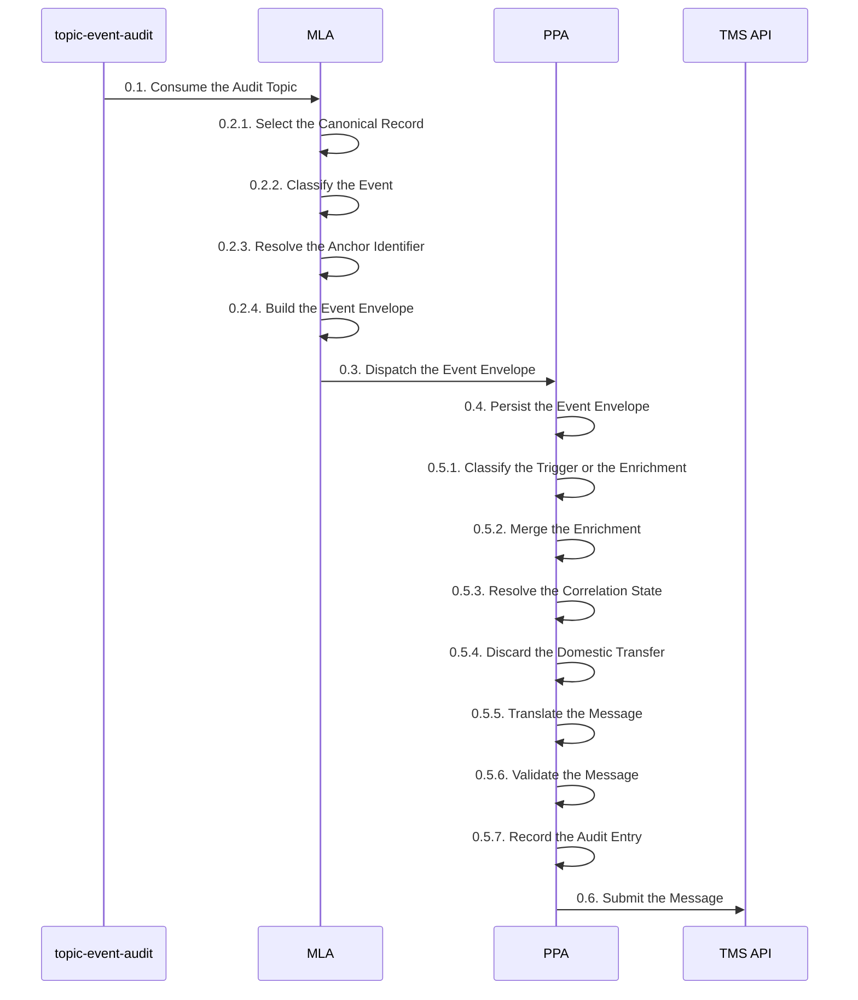

<!-- SPDX-License-Identifier: Apache-2.0 -->

# Mojaloop Adaptor (MLA) and Payment Platform Adaptor (PPA) <!-- omit in toc -->

- [Introduction](#introduction)
- [MLA and PPA Context](#mla-and-ppa-context)
  - [0.1. Consume the Audit Topic](#01-consume-the-audit-topic)
    - [Payload](#payload)
  - [0.2.1. Select the Canonical Record](#021-select-the-canonical-record)
  - [0.2.2. Classify the Event](#022-classify-the-event)
  - [0.2.3. Resolve the Anchor Identifier](#023-resolve-the-anchor-identifier)
  - [0.2.4. Build the Event Envelope](#024-build-the-event-envelope)
  - [0.3. Dispatch the Event Envelope](#03-dispatch-the-event-envelope)
    - [Payload](#payload-1)
  - [0.4. Persist the Event Envelope](#04-persist-the-event-envelope)
  - [0.5.1. Classify the Trigger or the Enrichment](#051-classify-the-trigger-or-the-enrichment)
  - [0.5.2. Merge the Enrichment](#052-merge-the-enrichment)
  - [0.5.3. Resolve the Correlation State](#053-resolve-the-correlation-state)
  - [0.5.4. Discard the Domestic Transfer](#054-discard-the-domestic-transfer)
  - [0.5.5. Translate the Message](#055-translate-the-message)
  - [0.5.6. Validate the Message](#056-validate-the-message)
  - [0.5.7. Record the Audit Entry](#057-record-the-audit-entry)
  - [0.6. Submit the Message](#06-submit-the-message)
    - [Payload](#payload-2)

## Introduction


The foundation of the Tazama Transaction Monitoring service is its ability to evaluate incoming transactions for financial crime behaviors through the execution of a number of conditional statements (rules) that are then combined into typologies that describe the nature of the financial crime that the system is trying to detect.

Transactions reach that evaluation through the Transaction Monitoring Service (TMS) API, which implements ISO 20022 message formats to facilitate Payment Initiation messages `pain.001` and `pain.013` and Payment Settlement messages `pacs.008` and `pacs.002`. The TMS API validates each incoming message, stores it unadulterated for audit purposes, loads it into the historical graph, builds the `DataCache` object, and routes the message to the Event Director, which determines the typologies and rules in scope and distributes the transaction to the rule processors.

A Mojaloop switch does not speak ISO 20022, and it does not present a payment as a single message. Where a client system is unable to submit messages in the required ISO 20022 format, that client submits its transactions to a custom-built adaptor so that the transaction can be transformed and then passed to the Tazama system to meet the specification of the TMS API. The Mojaloop Adaptor (MLA) and the Payment Platform Adaptor (PPA) are that adaptor, built as two services rather than one.

The purpose of the MLA and the PPA is to observe every event that a payment produces on a Mojaloop switch, assemble those events into the four complete ISO 20022 messages the TMS API accepts, and submit each message for evaluation at the point in the payment at which it is meaningful.

A single cross-border payment on a Mojaloop switch is not one event. Every action on the switch is asynchronous and split in two: a Digital Financial Service Provider (DFSP) sends a request, the switch returns `202 Accepted` immediately, and the answer arrives later as a separate callback. One payment therefore lands on Kafka as roughly nine separate events — quote out and back, FX quote out and back, transfer prepare and fulfil, FX transfer prepare and fulfil, and a final settlement notification — each carrying a fragment of the picture and none complete on its own. The MLA and the PPA hold those fragments together and emit exactly four messages.

The work is split across two services because the two halves sit in different trust boundaries. The MLA runs inside the Mojaloop network boundary, where the Kafka topic is, and performs no correlation, no enrichment and no translation, so that it never holds a Tazama-scoped credential. The PPA runs inside the Tazama network boundary, where the TMS API is, and performs all of the correlation, translation and dispatch. The MLA addresses the PPA through a single stable service name or load balancer, never an individual PPA instance. The PPA holds no state in process, so every replica is interchangeable: shared state lives in ValKey and in the PPA's durable store.

**Note** The Tazama Product documentation uses "Payment Platform Adapter (PPA)" for a complete Mojaloop-to-ISO 20022 adaptor. This document follows `CCH_FSD_MessageIngestion_v4.0.md`, in which "PPA" names only the Tazama-side half of that adaptor and "MLA" names the Mojaloop-side half. The MLA and the PPA together are the Payment Platform Adapter the [TMS API document](https://github.com/tazama-lf/docs/blob/main/Product/transaction-monitoring-service-api.md) refers to.

**Note** The MLA and the PPA occupy steps 0.1 to 0.6, ahead of the TMS API's step 1. This range is claimed by this document and is not yet recorded in the step-number registry in [service-doc-template.md](https://github.com/tazama-lf/docs/blob/main/Product/service-doc-template.md), which currently opens at step 1. The registry entry is outstanding.

This document describes a proof of concept. The full ingestion path is built and has been verified against a running Tazama TMS, a running ValKey instance and real captured Mojaloop events. Mutual TLS on both hops, the Auth-lib to Auth-service to Keycloak token chain, the upstream PII-tokenization and Notification Filter/Dedup components, and the choice of a production backing technology for the durable store are not built. Each step below states what is true today.

<div style="text-align: right">
    <a href="#introduction">Top</a>
</div>

## MLA and PPA Context



### 0.1. Consume the Audit Topic

The MLA subscribes to a single dedicated Mojaloop topic, `topic-event-audit`, and reads one record at a time. The MLA does not subscribe to the switch's per-action topics, and never writes to the switch.

The audit topic is a real-time stream fed by the forensic audit workstream, separate from the live transaction topics on the payment path. Its defining guarantee is that every message is durably persisted to a queryable store before processing continues, which is why the MLA has no dead-letter queue: the consumer offset is the entire recovery mechanism. The MLA connects with `autoCommit: false` and advances the offset by hand, so that the durability contract is never delegated to the Kafka client. The consumer group named in `KAFKA_GROUP_ID` must be dedicated to the MLA, because reusing a DRPP-internal group name risks stealing partition assignments from a live payment-path handler.

The topic name is confirmed by capture. The 7-day retention figure is inherited from `CCH_FSD_MessageIngestion_v4.0.md` and is not evidenced by the captures either way. `KAFKA_ENABLED` defaults to `false`, so the service starts and serves its health endpoints without a broker present.

**Note** Two components are specified to sit between the topic and the MLA — a Notification Filter/Dedup and a PII-protection component that tokenizes party identities. Neither is built. The captures show unmasked MSISDNs and full names throughout.

#### Payload

- Kafka transport metadata (`partitionID`, `offset`, `timestamp`, and `key`, supplied by the consumer, not part of the record body)
- `content.headers` (the full HTTP headers of the original Mojaloop call, carrying `fspiop-source`, `fspiop-destination` and `fspiop-signature`)
- `content.payload` (the message body, an ISO 20022 element tree on quote-family records and FSPIOP JSON on transfer records)
- `content.transformedPayload` (the FSPIOP-equivalent form, present alongside `content.payload` on quote-family records)
- `content.dataUri` (the base64 ISO 20022 form, present alongside `content.payload` on transfer records)
- `metadata.event.action` (`start` or `egress`, the marker of the double write)
- `metadata.trace.tags` (the stage classifier `operation` and every business identifier)

### 0.2.1. Select the Canonical Record

The MLA selects exactly one record per logical step and skips the other, using the fixed table `CANONICAL_ACTION_BY_OPERATION` through `isCanonicalRecord`.

Every logical step on the switch is written to the audit topic up to twice, once as `metadata.event.action` of `start` and once as `egress`, so a 10-stage transaction produces 20 records. Acting on both would double every outbound Tazama message. The selection is a per-operation table rather than a generic "always take `start`" rule, because the pairing is asymmetric: `putPartiesByTypeAndID`, `fulfilTransfer` and `fulfilFxTransfer` exist only as `start`, while `reserveFxTransfer`, `notifyFxTransfer` and `commitTransfer` exist only as `egress`. The fulfil-side operations rename themselves between ingress and egress rather than repeating, so a `PUT /transfers/{id}` fulfil is audited as `fulfilTransfer` on the way in and fans out to two separate `egress` records, `notifyFxTransfer` and `commitTransfer`.

The table holds with zero exceptions across the whole capture pack, and is corroborated independently by signature presence: every record marked canonical carries a real JWS signature, and every non-canonical counterpart is the one that lacks one. The table is not yet confirmed as a stable contract on the Mojaloop side, so a future shape change would require re-verification.

**Note** `commitTransfer` is the trigger for the `pacs.002` message and exists **only** as an `egress` record. There is no `commitTransfer` `start` record to disambiguate it against.

### 0.2.2. Classify the Event

The MLA reads `metadata.trace.tags.operation` and maps it, through `classifyEventType` and `classifyMsgType`, to an `eventType` of `QUOTE`, `FXQUOTE`, `TRANSFER` or `FXTRANSFER`, and a `msgType` of `request`, `callback` or `notification`.

`operation` is an explicit 13-value stage classifier, so classification is a table lookup and no payload inspection is required anywhere, for any stage. This resolves the open item that `CCH_FSD_MessageIngestion_v4.0.md` recorded as the largest unknown on the collector side, namely whether an FX transfer could be told from a domestic one: the operation is literally `prepareFxTransfer` against `prepareTransfer`. The MLA does not classify on `transactionType`, which is present but disagrees between the `start` and `egress` of the same step and cannot be trusted.

Party lookup is present on this topic as `getPartiesByTypeAndID` and `putPartiesByTypeAndID`, which the FSD's own premise said could not happen. Party lookup is out of scope by default, and `handleMessage` skips it explicitly. Whether to reinstate party-lookup enrichment is an open design decision. The `msgType` vocabulary follows the FSD; the Integration and Interface Document defines the same field as the original HTTP method, and that conflict is unresolved between the two documents.

### 0.2.3. Resolve the Anchor Identifier

The MLA resolves a single anchor identifier for the payment through `resolveAnchorId`, preferring `transactionId`, then `transferId`, then `determiningTransferId` from the trace tags.

The FSD specifies a different identifier per `eventType` — `quoteId`, `conversionRequestId`, `transferId` or `commitRequestId`. The MLA deviates and uses one anchor identifier uniformly, because the three tag values above never disagree where more than one is present, and because one extraction rule is simpler to reason about than four. The stage-local identifiers the FSD names are still required for the PPA's per-stage cache keys, so they travel inside `body`, where they already are, rather than being promoted to `id`.

Two operations carry no anchor identifier in their tags and are resolved by chaining. `putQuotesByID` carries only `quoteId`, and `reserveFxTransfer` carries only `commitRequestId` and `conversionId`. Both are resolved from a bounded in-process map — `quoteIdToAnchor` and `fxTransferIdToAnchor`, each capped at 10,000 entries — populated when the matching `postQuotes` or `prepareFxTransfer` record was processed earlier on the same partition. These maps are per-MLA-instance bookkeeping, not shared correlation state.

### 0.2.4. Build the Event Envelope

The MLA constructs the Event Envelope in `buildEnvelope`, reading the FSP identifiers from `content.headers` and the body from `content.transformedPayload` where present and `content.payload` otherwise.

The Event Envelope is the sole wire contract between the two services, and it is defined separately in each service rather than shared through a package, so that either side can version its own view of the contract without a lockstep release. `correlationId` is generated fresh per event with `ulid()` and is never derived from the Kafka message key: in the captures every observed trace id covered more than one transaction, and the settlement leg is sometimes re-emitted under a fresh trace id, so the key is not a correlation identifier. The FSPIOP form is preferred for `body` because it matches the FSD's field expectations directly and gives structured names, where the ISO form gives a semicolon-packed string.

Base64 decoding of `content.dataUri` is implemented as optional and is currently unused, because the FSPIOP fields the mapping needs are already plain JSON. `hasFspiopSignature` checks for the presence of the `fspiop-signature` header only; cryptographic JWS verification against DFSP keys is not built. A record that fails envelope construction is logged and skipped as a permanent failure.

### 0.3. Dispatch the Event Envelope

The MLA POSTs the envelope to the PPA on a per-action route, waits for the response, and only then resolves the Kafka offset.

The ordering is the durability contract for the whole pipeline. Advancing the offset before the acknowledgement would create a window in which an event is considered handled but never reached the PPA. Routes are per-action rather than one generic endpoint, mirroring the per-action topic model upstream, so that the endpoint is a contract boundary to which schema, versioning and auth scope attach and a breaking change to one message type does not force a migration on unrelated traffic. Because the MLA has no dead-letter queue, every outcome resolves to one of two actions, and the distinction is whether the failure is transient or permanent:

| Outcome | Offset action |
| ------- | ------------- |
| PPA returns `200` | `OffsetAction.Advance` |
| PPA returns `4xx` | Log, alert, `OffsetAction.Advance` — the envelope is invalid and retrying cannot help |
| PPA returns `5xx` or times out | Retry 3 times with exponential back-off and jitter, then `OffsetAction.Pause` |
| Malformed or unreadable message | Log, `OffsetAction.Advance` — it will not become readable on retry |

On a pause the MLA calls `tripAndPause`, which pauses consumption on the affected partition and starts a periodic `GET /health/ready` probe against the PPA, resuming every paused partition once the PPA answers healthy. Pausing stalls every event behind it on that partition, which makes the topic's retention window the real bound on how long an outage can last before events are lost. The hop runs over plain HTTP in this proof of concept; production requires mutual TLS with the PPA authorizing on the client certificate presented.

#### Payload

- `msgType` (`request`, `callback` or `notification`)
- `eventType` (`QUOTE`, `FXQUOTE`, `TRANSFER` or `FXTRANSFER`)
- `id` (the payment's anchor identifier, the same value for every event in the payment)
- `correlationId` (an MLA-generated `ulid()` trace identifier, distinct from `id` and unique per event)
- `fspiop-source` (the originating DFSP, read from `content.headers`)
- `fspiop-destination` (the intended recipient DFSP, read from `content.headers`)
- `body` (the original Mojaloop message body, FSPIOP form where both forms are present)
- `timestamp` (ISO 8601, when the MLA consumed the event)

```json
{
  "msgType": "request",
  "eventType": "TRANSFER",
  "id": "01KZRP0E6JT2BX5EA20AQPTX6F",
  "correlationId": "01M0SBEDCVJ6RYVBQW2X5ENNDZ",
  "fspiop-source": "<payer DFSP>",
  "fspiop-destination": "<payee DFSP>",
  "body": { "transferId": "01KZRP0E6JT2BX5EA20AQPTX6F", "amount": { "amount": "100", "currency": "MWK" }, "...": "..." },
  "timestamp": "2026-08-11T09:14:22.418Z"
}
```

<div style="text-align: right">
    <a href="#introduction">Top</a>
</div>

### 0.4. Persist the Event Envelope

The PPA confirms in `acceptEnvelope` that both ValKey and the durable store are reachable, writes the envelope to the durable store, and only then returns `200` to the MLA. Every step from 0.5.1 onward runs asynchronously, off the request path.

Persisting before acknowledging is what keeps an event recoverable when the process dies mid-pipeline. Returning `503` rather than `200` when a durable dependency is down is what makes the offset-gated back-pressure real: the MLA never commits a Kafka offset for an event this instance cannot make progress on, so the event stays on the audit topic. `writeAheadStore.isReachable` performs an actual write-then-delete probe rather than a directory `stat`, because a full disk or a permissions problem on an existing directory passes `stat` and then fails every real write. Each write goes to a temporary file and is then renamed atomically, so a crash mid-write never leaves a torn record.

`GET /health/ready` gates on the write-ahead store only. The readiness endpoint deliberately does not gate on ValKey or the TMS token chain, because those are shared by every replica and failing readiness on them would pull the entire fleet out of rotation simultaneously over one transient downstream blip. The store is a filesystem stand-in; the production backing technology is pending a hosting-location decision, and every call site is written against the module's exported shape only, so that decision is a change to one file. The store has not been sized against peak transaction volume, and nothing currently prunes it to the 90-day retention target.

### 0.5.1. Classify the Trigger or the Enrichment

The PPA classifies each envelope in `classify` as a **trigger**, which causes exactly one outbound message, or an **enrichment**, which contributes data to the payment's accumulated picture and produces no message of its own.

No stage works by pairing a request with its callback and emitting once. Every trigger fires on a single event and reads whatever has accumulated for the payment at that moment. This matters most at the transfer stage: the prepare emits its `pacs.008` immediately rather than waiting for the fulfil. The two are about a second apart, and waiting would destroy the pre-settlement evaluation window, which is the only point at which a fraud decision can still affect the outcome.

`TRANSFER` and `QUOTE` classify as `EventRole.Trigger`, `FXQUOTE` as `EventRole.Enrichment` and `FXTRANSFER` as `EventRole.CorrelationOnly`. Notifications are checked against a duplicate guard before classification, keyed on the anchor identifier alone with terminal-state monotonicity, and held in the durable store rather than ValKey, because ValKey's `volatile-lru` eviction would silently drop a dedup key and re-admit a duplicate.

**Note** `QUOTE` is a trigger **and** an enrichment. A quote event fires its own message and then still merges into the payment's state for the later `pacs.008` to draw on. `EventRole` does not carry that distinction, so it is handled at the call site in `processEnvelope`, after the message has been sent.

### 0.5.2. Merge the Enrichment

The PPA merges an enrichment event into the payment's accumulated state through `mergeEnrichment`, which calls `CacheClient.mergeState`.

Correlation state is held in ValKey as a Redis hash at `correlation:<id>`, one field per enrichment slot — `quote`, `quoteCallback`, `fxQuote`, `fxQuoteCallback` and `fxTransfer` — each JSON-encoded independently rather than as one blob. Every merge runs as a single Lua `EVAL`: `HSETNX` on `createdAt` so that leg creation is idempotent, `HSET` on the one field being merged plus `correlationId` and `updatedAt`, then `EXPIRE` to refresh the TTL. ValKey executes a script as one uninterruptible command, so application code never issues a `GET` of its own and never holds a copy of the state that another replica's write could make stale. A plain read-modify-write would lose an update whenever two replicas merged different fields for the same payment concurrently, because whichever write landed second would overwrite the whole blob.

The correlation TTL is approximately 70 seconds and has not been confirmed against real observed prepare-to-fulfil gaps. ValKey's unavailability is a deliberate hard stop for the pipeline, which makes running it as a high-availability cluster a release-blocking requirement rather than an operational nicety.

### 0.5.3. Resolve the Correlation State

At a trigger, the PPA reads the payment's accumulated state with `getState`. Where a final-state notification arrives and ValKey holds nothing, `resolveNotificationState` checks the durable store for a parked copy, then retries ValKey within a short bounded window, and parks the trigger envelope itself if neither resolves it.

Kafka orders records only within a partition, and the captures confirm an entire settlement leg landing on a different partition under a fresh trace id from the rest of its own transaction. A `pacs.002` trigger arriving ahead of the `pacs.008` it belongs to is therefore a real condition, not a defensive allowance. The two halves of the resolution address two different causes: a parked copy means the payment was swept to the durable store before its ValKey entry expired and this notification is the delayed counterpart, while a bounded retry means the prepare is seconds behind on another partition. Because ValKey emits no "about to expire" event, only "gone", the sweep in `park-sweep.service.ts` scans for payments close to their TTL and copies their state to the durable store while it is still readable. A payment still present in ValKey is sufficient reason to park it, because `finalize` deletes the entry the moment a payment reaches its terminal state, so anything the sweep finds is by construction still incomplete.

A parked trigger is replayed by `completeParkedTriggerAfterPrepare` only once this payment's own `pacs.008` has reached the TMS API, not merely once some state exists. An earlier version replayed on any enrichment merge, which sent the `pacs.002` before the `pacs.008` existed in Tazama's graph and, because a successful `pacs.002` clears the state, caused the real prepare arriving later to be discarded as domestic. The replay path also sets `isReplay`, which skips the duplicate-notification check, because the envelope claimed that key on its first arrival and would otherwise be discarded as a duplicate of itself. `operatorReplayParkedState`, exposed as `POST /admin/replay/:key`, restores a parked payment into ValKey on demand within the store's retention window. A `pacs.002` is never synthesised.

### 0.5.4. Discard the Domestic Transfer

At a `TRANSFER` prepare, the PPA applies `isDomesticTransfer` and discards the payment where no correlated FX-quote state exists.

Domestic payments are out of scope for this phase, and the check runs before assembly rather than after, so no message is built for a payment that will not be submitted. A prepare arriving with no correlated FX-quote state is legitimately indistinguishable from a domestic payment, which is why the discriminator is the presence of that state rather than an attribute of the prepare itself.

The check is applied to `TRANSFER` prepares only. The PPA does not extend it to `QUOTE`, whose triggers fire independently with no scope gate: a quote for a payment that later turns out to be domestic degrades gracefully rather than being suppressed. Every discard is counted in `metrics.recordDiscardedDomestic` and surfaced at `GET /metrics`.

### 0.5.5. Translate the Message

The PPA assembles exactly one ISO 20022 message in `translate`, through `toPain001`, `toPain013`, `toPacs008` or `toPacs002`, from the trigger event plus whatever has accumulated for the payment.

| Mojaloop event | Tazama message |
| -------------- | -------------- |
| Quote request (`postQuotes`) | `pain.001.001.11` |
| Quote callback (`putQuotesByID`) | `pain.013.001.09` |
| Transfer prepare (`prepareTransfer`) | `pacs.008.001.10` |
| Final settlement (`commitTransfer`) or any error | `pacs.002.001.12` |

The FX quote and the FX transfer produce no message of their own. Their exchange rate and converted amounts fold into the four messages above, so that a cross-border payment appears in Tazama as one transaction rather than two settlement legs. Modelling the FX leg separately would inject the FX provider into the historical graph as a synthetic counterparty on every cross-border payment and corrupt the velocity scoring that the rules depend on. `GrpHdr.MsgId` is always PPA-generated through `messageId`, deterministic per payment and message type, and is pinned at assembly and never regenerated on a retry, because a fresh `MsgId` would defeat any dedup the TMS API performs. Status translation is a correctness duty rather than a validation one, because `TxSts` is an unconstrained string in Tazama's schema, so an untranslated value is accepted and stored and then fails every downstream rule: `toTxSts` maps both confirmed source vocabularies, the FSPIOP `COMMITTED` and `ABORTED` and the ISO `COMM` and `RESV`. The result is `ACSC` rather than `ACCC`, because `ACCC` asserts that funds reached the creditor's account, which Mojaloop's `COMMITTED` does not evidence.

The ISO 20022 form carried on the audit topic is Mojaloop's ISO, not Tazama's — the captures show `IntrBkSttlmAmt.ActiveCurrencyAndAmount` and `FinInstnId.Othr.Id` where Tazama requires `IntrBkSttlmAmt.Amt` and `FinInstnId.ClrSysMmbId.MmbId` — so the translation cannot be a copy-through. Date of birth is absent from every message form on every record across the entire capture pack, so `Dbtr` birth date is populated with a sentinel on every `pacs.008` this pipeline sends, which is a structural gap rather than an occasional degradation. The error path that produces `TxSts` of `RJCT` is built against the specification alone: the capture pack contains no rejected, aborted or errored transaction to verify it against.

**Note** Where enrichment is missing when a trigger fires, the message is still assembled and sent, with documented placeholder values, and `translate` returns `degraded: true`. A degraded message and a complete one are indistinguishable at the TMS API's door.

### 0.5.6. Validate the Message

The PPA validates every assembled message in `validateTazamaMessage`, against a pinned local copy of the TMS API's own ajv schemas, before it is sent.

This is not redundant with the validation the TMS API performs. The TMS API compiles its schemas with `removeAdditional: 'all'`, so a message carrying a field that has drifted from the pinned version does not fail: the field is silently stripped and the call returns `200`. Validating locally against a pinned copy of the same schema, with the same ajv configuration, is the only place that drift is visible. A failure here is treated as a permanent translation defect: the message is logged, not sent, and not retried.

The schemas are pinned to `frmscoe/tms-service` commit `f18317f1f7973623157e1467da78e6853c7b1b89`, copied into `ppa/src/schemas/tazama/`. The pin has already caught two real defects that unit testing alone did not: a missing `RgltryRptg` block on `pacs.008`, and a missing transaction-level `SplmtryData` block on `pain.001`.

### 0.5.7. Record the Audit Entry

The PPA appends an audit entry in `auditLog` recording what arrived, what was sent, the outcome, and the `degraded` flag. Entries are readable through `GET /admin/audit/:key`.

Because a degraded message is indistinguishable from a complete one once it reaches the TMS API, the audit entry is the only place a record survives that a fraud decision was made on partial data, which is why the flag is mandatory rather than diagnostic. The store is indexed by the payment's anchor identifier rather than by `correlationId`: a payment's life spans many events, each carrying its own fresh `correlationId`, so indexing on that would produce a trail of length one for almost every lookup. Entry filenames carry a timestamp, then a synchronous per-process sequence number, then a random suffix, in that order, so that a directory listing is already in insertion order — the timestamp alone does not order entries that share a millisecond, which ordinary sequential calls do routinely.

Writes are best-effort: a failure is caught and logged, never thrown, because the payment's real outcome has already happened by the time this step runs and a full disk must not turn a successful send into an unhandled rejection. For the same reason the audit store is not wired into `GET /health/ready`. Party identifiers are masked before they reach a log line or the audit store, using a keyed HMAC-SHA256 in `maskIdentifier`: keyed rather than a bare hash because an MSISDN's space is small enough to enumerate, and deterministic so that an auditor can still tell that two records concern the same payer without the trail recording who that payer is. The masking is genuinely partial. The PPA masks `body.payer` and `body.payee` on quote-family records, which is the only place this pipeline writes a party identifier to a log or the audit store, and masks nothing in what is sent to the TMS API, which needs the real party data to build the historical graph. The identifiers bound inside the ILP packet's cryptographic condition cannot be masked at all without breaking the payment.

<div style="text-align: right">
    <a href="#introduction">Top</a>
</div>

### 0.6. Submit the Message

The PPA submits the assembled message in `sendToTms` to the version-pinned TMS API route for its message type, which is the point at which the TMS API's step 1 begins.

Delivery is at-least-once. Before every send the PPA claims an atomic check-and-set guard in ValKey on the combination of anchor identifier and message type, so that the same message is not sent twice. Retries resend the exact message assembled at step 0.5.5 rather than rebuilding it, because a rebuild would regenerate `GrpHdr.MsgId` and insert duplicate transaction history into the historical graph. A `5xx` response or a network failure is retried three times with exponential back-off and jitter. A `4xx` is logged as an application error and not retried. The hop is gated by a circuit breaker in `circuit-breaker.ts` that fails fast once the TMS API shows sustained failure, so that an outage does not burn the full retry budget on every in-flight message; a `4xx` counts as a success for the breaker, because the TMS API answered correctly and it is the message that is invalid, not the service's health. On a successful terminal message the PPA clears the payment's ValKey state in `finalize`, which happens only on `pacs.002` and never on `pacs.008`, because the `pacs.008` state is still needed when the `pacs.002` trigger reads it later.

The routes are `/v1/evaluate/iso20022/pain.001.001.11`, `/v1/evaluate/iso20022/pain.013.001.09`, `/v1/evaluate/iso20022/pacs.008.001.10` and `/v1/evaluate/iso20022/pacs.002.001.12`. The version segment is part of the path and is not cosmetic. The hop runs over plain HTTP with no bearer token in this proof of concept; production requires two independent layers, mutual TLS to prove which service is connecting and a bearer token from the Auth-lib to Auth-service to Keycloak chain to prove what the call may do.

#### Payload

- Transaction data (one ISO 20022 message, in Tazama's abridged JSON form, populated from the trigger event and the payment's accumulated state)
- `GrpHdr.MsgId` (the PPA-generated deterministic message identifier, pinned at assembly)
- `GrpHdr.CreDtTm` (the PPA's timestamp at first construction, never regenerated on a retry)

On receipt the TMS API validates the message, stores it unadulterated in the matching `TransactionHistory` collection for audit purposes, loads it into the historical graph, builds the `DataCache` object, generates the `traceParent` and `prcgTmDP` metadata, and routes the message to the Event Director. See the [Transaction Monitoring Service (TMS) API](https://github.com/tazama-lf/docs/blob/main/Product/transaction-monitoring-service-api.md) page for step 1 and the data preparation tasks, and [processor results propagation](https://github.com/tazama-lf/docs/blob/main/Product/processor-results-propagation.md) for the payload composition from one processor to the next.

Technical documentation for the implementation of the MLA and the PPA is covered in the [MLA](../mla/README.md) and [PPA](../ppa/README.md) service directories, with the full design in [MLA-PPA-Technical-Design.md](MLA-PPA-Technical-Design.md) and the architecture diagrams in [MLA-PPA-Architecture-Diagrams.md](MLA-PPA-Architecture-Diagrams.md). 

<div style="text-align: right">
    <a href="#introduction">Top</a>
</div>
