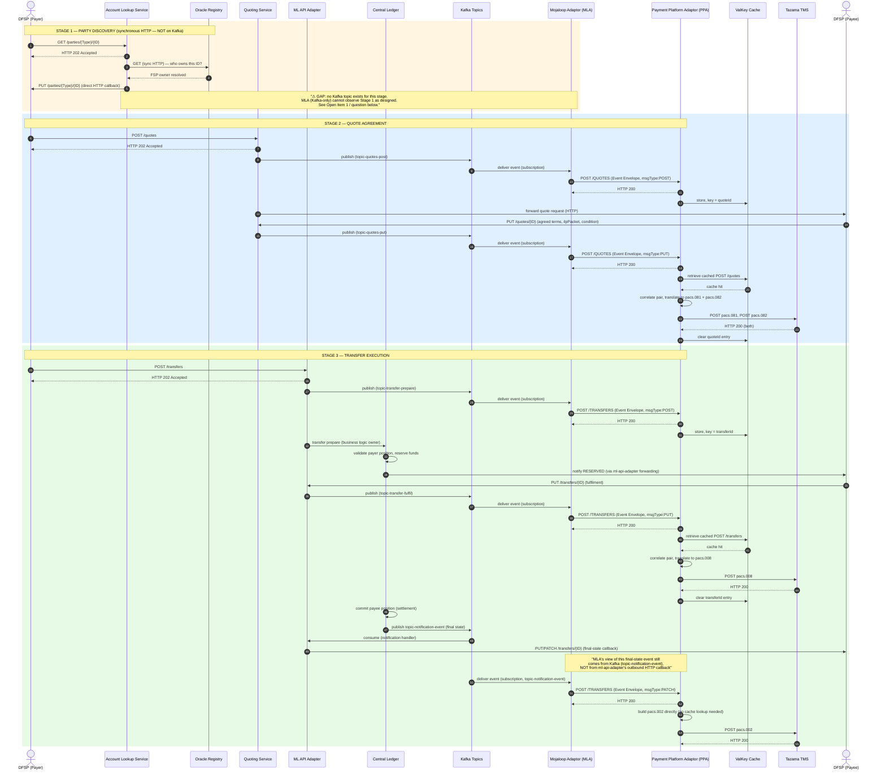

# Standard P2P Payment Flow — Corrected vs. FSD v2.0 Figure 2

This doc redraws the FSD's Section 6.1 "Standard P2P Payment — Full Happy Path" diagram (page 14,
Figure 2 — *P2P Quote and Transfer Sequence*). The original shows a payer FSP sending money to a
payee FSP on the same switch, with the MLA capturing every stage (party discovery, quote, transfer)
purely via Kafka.

That diagram is **not fully accurate**. It's built on the same wrong assumption flagged in
[`review-fsd.md`](../FSD/review-fsd.md) Finding #1 (topic names) plus one new problem specific to
Stage 1, found while redrawing this: **party discovery has no Kafka topic at all** in this
codebase. The corrected version below is grounded in the live-verified findings in
`docs/Kafka/kafka-topics-quote-transfer.md` and `docs/mojaloop-ecosystem/2.mojaloop-comprehensive-overview.md`.

## What's wrong with the original diagram

1. **Stage 1 (Party Discovery) is drawn as Kafka-based, but it isn't.** The FSD's Fig. 1 (page 5)
   and Fig. 2 both show ALS publishing `GET /parties` and `PUT /parties/{ID}` to Kafka the same way
   quoting-service and ml-api-adapter do. In the actual `account-lookup-service` code, there is
   **no Kafka topic for party lookup at all**. `GET /parties/{Type}/{ID}` returns HTTP 202
   immediately, then ALS does a synchronous HTTP call to an external Oracle, and delivers the
   result by calling the requester's registered `PUT .../parties/{Type}/{ID}` URL back **directly
   over HTTP** — nothing touches Kafka in between. This means the MLA, as specified (a
   Kafka-subscriber-only component), **cannot capture Stage 1 the same way it captures Stages 2–3**.
   This is drawn as an open gap below, not silently fixed — see the question at the end of this doc.

2. **Stages 2–3 (Quote, Transfer) use the wrong topic names.** The FSD shows one topic per service
   (`quoting-service`, `ml-api-adapter`). The real topics are per-action:
   `topic-quotes-post` / `topic-quotes-put` for quotes, and `topic-transfer-prepare` /
   `topic-transfer-fulfil` for transfers.

3. **The switch-to-payee "PATCH" notification doesn't come from ml-api-adapter's own Kafka topic —
   it comes from central-ledger, on a separate topic (`topic-notification-event`), which
   ml-api-adapter *consumes* (not produces) and turns into the outbound `PUT`/`PATCH` HTTP
   callback.** The original diagram shows ML Adaptor producing this notification directly to Kafka
   for MLA to pick up; in reality central-ledger produces it, ml-api-adapter consumes it and turns
   it into an HTTP call to the payee — there is no separate Kafka message carrying a literal "PATCH"
   verb that the MLA could subscribe to independently of the callback ml-api-adapter already sends
   over HTTP. The corrected diagram shows this as two hops (central-ledger → Kafka →
   ml-api-adapter → HTTP callback) rather than one.

4. **`central-ledger` is missing from the actor list entirely**, despite owning the transfer
   commit/settlement logic and being the actual producer of the final-state notification event.

5. Minor: the original diagram omits the Oracle from Stage 1, collapsing "ALS resolves the payee"
   into one box, which further obscures that this stage is synchronous HTTP underneath, not async
   Kafka.

---

## Corrected Diagram

---

## Step-by-Step Description

### Stage 1 — Party Discovery (⚠ not currently Kafka-observable)

1. The payer's FSP sends `GET /parties/{Type}/{ID}` to the Account Lookup Service (ALS), asking
   who owns this party identifier (e.g. a phone number).
2. ALS returns HTTP 202 immediately — the real answer comes later, asynchronously.
3. ALS calls out to an external Oracle registry over a **plain synchronous HTTP request** (no 202,
   no Kafka) to resolve which FSP owns that identifier.
4. Once the Oracle responds, ALS delivers the result by calling the payer FSP's registered
   `PUT /parties/{Type}/{ID}` callback URL **directly over HTTP**.
5. **Gap:** at no point in this stage does ALS publish anything to Kafka. The MLA, as specified, is
   a Kafka-only subscriber — it has no mechanism to observe Stage 1 events at all under the current
   design. This is the same gap the FSD already flags as Open Item #1 ("confirm Kafka topic name
   for ALS party events"), except the live code shows there currently *is no such topic to name* —
   the open item may need to become "decide how the MLA captures party lookups at all," not just
   "confirm the topic name." See the question at the bottom of this doc.

### Stage 2 — Quote Agreement

6. The payer's FSP sends `POST /quotes` to the Quoting Service. The switch returns HTTP 202
   immediately.
7. Quoting Service publishes the quote request to `topic-quotes-post`.
8. The MLA, subscribed to that topic, picks up the event, wraps it in an Event Envelope
   (`msgType: POST`, `eventType: QUOTE`), and POSTs it to the PPA's `/QUOTES` endpoint.
9. The PPA acknowledges with HTTP 200 and stores the envelope in the ValKey cache, keyed by
   `quoteId`, while it waits for the matching callback.
10. Behind the scenes (outside Kafka), Quoting Service forwards the quote request over HTTP to the
    payee's FSP, which calculates its fees/terms and responds with `PUT /quotes/{ID}` — carrying
    the agreed transfer amount, fees, `ilpPacket`, and `condition`.
11. Quoting Service publishes this response to `topic-quotes-put` (the same topic is used for both
    successful and error responses — see Annex note below).
12. The MLA picks up this callback event and sends it to PPA `/QUOTES` (`msgType: PUT`).
13. The PPA finds the cached POST event by `quoteId`, combines both halves, and builds the two ISO
    20022 messages this pair requires: `pacs.081` and `pacs.082`.
14. The PPA sends both messages to Tazama TMS and, once both are acknowledged, clears the cached
    `quoteId` entry.

### Stage 3 — Transfer Execution

15. The payer's FSP sends `POST /transfers` to the ML API Adapter. The switch returns HTTP 202.
16. ML API Adapter publishes the transfer prepare event to `topic-transfer-prepare`. ML API Adapter
    is a **producer only** here — it does not process the transfer itself.
17. The MLA picks this up and sends it to PPA `/TRANSFERS` (`msgType: POST`, `eventType: TRANSFER`).
    The PPA stores it in cache keyed by `transferId`.
18. **Central Ledger** — not ML API Adapter — is the actual consumer of `topic-transfer-prepare`.
    It validates the payer FSP has sufficient position/credit and reserves the funds.
19. Central Ledger (via ML API Adapter's forwarding) notifies the payee FSP the transfer is
    reserved; the payee releases funds/goods to its customer and responds with
    `PUT /transfers/{ID}` (the fulfilment), which ML API Adapter publishes to
    `topic-transfer-fulfil`.
20. The MLA picks up this callback and sends it to PPA `/TRANSFERS` (`msgType: PUT`).
21. The PPA correlates it against the cached POST, builds `pacs.008`, and sends it to TMS.
22. Separately, Central Ledger finalizes (commits) the payee's side of the ledger and publishes the
    final transfer state to `topic-notification-event` — a **different topic, produced by Central
    Ledger, not by ML API Adapter**.
23. ML API Adapter *consumes* `topic-notification-event` and turns it into the outbound
    `PUT`/`PATCH` HTTP callback that actually reaches the payee FSP.
24. The MLA, subscribed to `topic-notification-event` directly, independently picks up this same
    event from Kafka and sends it to PPA `/TRANSFERS` (`msgType: PATCH`).
25. The PPA does not need a cached pair for this one — it builds `pacs.002` directly from the
    notification payload and sends it to TMS.
26. Tazama evaluates everything received for this transaction. No alert is triggered on this
    happy-path flow.

---

## Notes Carried Over From the FSD Review

- **`topic-notification-event` fires more than once per transfer** in practice (per-state-transition,
  not per-request/response pair — 37 messages observed against 8 requests in one measured run). The
  step above ("MLA picks up this event, sends PATCH to PPA") should really be read as "for each
  relevant notification event," with a filter/dedupe rule (e.g. by `metadata.event.action`) needed
  before this reaches PPA — otherwise PPA may attempt to build and send `pacs.002` multiple times
  per transfer. Not resolved in this diagram; carried over from `review-fsd.md` Finding #3.
- **Quote error responses ride the same `topic-quotes-put` topic** as successful ones — Quoting
  Service does not switch topics for the error case, it flags it via `payload.errorInformation`
  inside the same message. Worth confirming the FSD's "PUT /quotes/{ID}/error" framing (implying a
  separate resource/event) matches this in the MLA/PPA implementation, or whether it's purely a
  body-level distinction the PPA needs to check.
- **The `pacs.081` / `pacs.082` partial-failure question from `review-fsd.md` Finding #4 still
  applies** to Stage 2 step 14 above — this diagram shows both sends succeeding, but doesn't
  resolve what happens if only one does.

---

## Question

Given the confirmed absence of any Kafka topic for party lookup in `account-lookup-service`, how
should Stage 1 actually be captured for Tazama monitoring? Options that occurred to me, for you to
weigh in on:

1. **Modify ALS** to also publish party-lookup request/response events to a new Kafka topic (extra
   scope on the Mojaloop-partner side, mirrors quoting-service's pattern).
2. **Give the MLA an HTTP-tap capability** in addition to its Kafka-subscriber role — e.g. register
   the MLA itself as (or alongside) the callback endpoint ALS calls, so it observes the HTTP
   traffic directly instead of via Kafka.
3. **Drop Stage 1 from Phase 1 scope** — accept that party lookups aren't monitored by Tazama for
   now, and revisit once/if ALS gains Kafka publishing.

This seems like a decision for the JAD workshop (it directly extends Open Item #1), but flagging it
here since it changes the MLA's architecture (Kafka-only vs. Kafka+HTTP) rather than just a topic
name.
