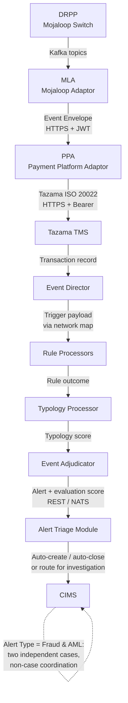
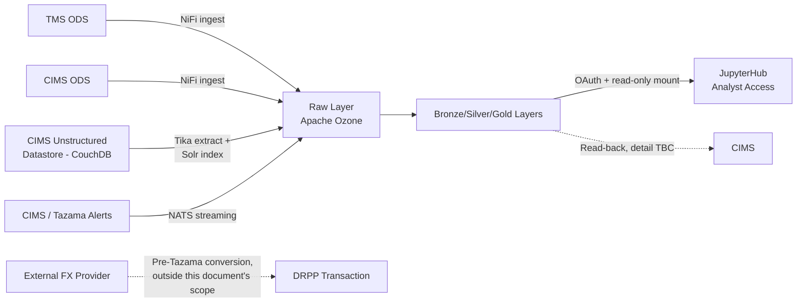

# INTEGRATION & INTERFACE DOCUMENT
## Tazama Fraud Management Module — End-to-End Integration Architecture

**COMESA CLEARING HOUSE × PAYSYS LABS**
*Contract Deliverable — Milestone 2 (Design & Analysis)*

---

| | |
|---|---|
| **Document Ref** | CCH-PL-IID-001 |
| **Version** | v3.1 |
| **Date** | 22nd July 2026 |
| **Author** | Syeda Ruba Zehra, Business Analyst — Paysys Labs |
| **Classification** | Confidential |
| **Status** | Draft |

### Version History

| Version | Date | Author | Summary of Changes |
|---|---|---|---|
| v0.1 | 20th July 2026 | Syeda Ruba Zehra | Initial draft. Consolidated confirmed integration points from the Message Ingestion FSD (v2.0), the Case Management FSD (v2.0), and the BIAR FSD (v1.0) into a single cross-reference document. |
| v1.0 | 20th July 2026 | Soban Najam | Reviewed against `AI Skills/interface-spec-review/SKILL.md`; resolved every v0.1 finding — re-cited Message Ingestion as v3.0, removed stale Discovery Reverse Proxy content, added the Rules/ML Customization FSD as a fourth source, added BIAR's own interfaces, and gave every catalogued interface a full technical contract. |
| v2.0 | 21st July 2026 | Syeda Ruba Zehra | **Ground-up rewrite, not an incremental patch on v1.0.** (1) **TADProc is renamed to Event Adjudicator**, and **DRPP is now the confirmed platform name** (2) joint Fraud & AML alert handling is **re-modelled** as two independent cases.  Also adds a dedicated, consolidated **API/Endpoint Master Reference** (§6) per this revision's explicit purpose of listing every API in one place, and gives the CIMS unstructured-evidence extraction pipeline (CouchDB → Apache Tika → Apache Solr → Raw layer) its own interface entry rather than folding it silently into the general NiFi ingestion row. |
| v3.0 | 21st July 2026 | Syeda Ruba Zehra | **Tech-team review pass.** (1) **Removed DEAPI and Simulation Sandbox entirely** — both were BIAR-ecosystem capabilities never confirmed as in-scope contract interfaces for this engagement; every reference, catalog row, detailed spec, API entry, and open item for each has been deleted, not just relabelled. (2) Corrected the §1.2 scope pipeline to include MLA. (3) Fixed the dangling `§1.3` glossary cross-reference. (4) Standardized the DRPP expansion. (5) Clarified ATM as post-alert triage, pending confirmation that no outcome is payment-blocking. (6) Removed Lakehouse read-back from the main catalog pending a real contract. (7) Flagged the `/QUOTES`/`/TRANSFERS` aggregate-endpoint design as an open question rather than a settled contract. (8) Added an explicit disclaimer separating event-dedup from transaction-stage correlation, and separated the MLA envelope's internal `eventType`/`msgType` fields from Mojaloop's actual per-action topic/message identity. (9) Flagged the quote/FX-quote "one message or two" TMS-submission ambiguity as unresolved. (10) Flagged the Alert payload schema's mismatch against the current CIMS dev-branch `Alert` table. (11) Split CIMS-internal Compliance Officer authorization from external regulator-side authentication in §5.10.3. (12) Marked the remaining BIAR sections as resting on a stale BIAR FSD pending that document's own update. (13) Removed the BIAR NATS alert-consumption claim from §6.6. (14) Marked ATM fail-open as a required-but-unconfirmed target behaviour, not an implemented control. (15) Flagged the tech-team review's claim that BIAR ingestion is pull-based against the currently-cited BIAR FSD, which states push-based/source-owned retry explicitly — kept the FSD-grounded position and surfaced the conflict as an open item rather than silently switching to an unconfirmed model. (16) Resolved the §5.2/§7.3 idempotency-key contradiction with explicit, separate dedup and correlation keys. |
| **v3.1** | **22nd July 2026** | **Syeda Ruba Zehra** | **§6 (API/Endpoint Master Reference) only — no other section modified.** §6 now carries only endpoint-level content confirmed via direct source-code review of the seven pipeline repositories (`tms-service`, `event-director`, `rule-executer`, `typology-processor`, `event-adjudicator`, `case-management-system`, `biar`) that is not already stated in §5 — every subsection that would have only repeated a §5 table (DRPP → MLA Kafka topics, MLA → PPA REST, External/Unowned) is omitted entirely, and the redundant framing/pointer text within the remaining subsections has been stripped, leaving just the new findings: §6.1 Tazama TMS's actual implemented REST endpoints (a confirmed discrepancy against §5.3's FSD-sourced list); §6.2 the confirmed CIMS alert-ingest REST path and NATS consumer stream (resolving part of Open Item #3); §6.3 the full CIMS-internal endpoint inventory (resolving §5.10's generic rows to actual routes); §6.4 Gold Lakehouse API; §6.5 Visualization Delivery (Jupyter/Voila proxy); §6.6 Flowable BPM integration; §6.7 CIMS Auth Service integration; §6.8 the Alert Triage Module's confirmed outbound call; §6.9 BIAR's confirmed empty-repository status. Cross-references in §7.2 and §9 Open Item #1 were corrected to match this final §6.9 BIAR APIs numbering. Internal Tazama evaluation-engine hops (Event Director → Rule Processors → Typology Processor → Event Adjudicator) remain deliberately excluded per this document's own §1.2/§5.4 scope boundary. |

---

## 1. Introduction

### 1.1 Purpose

This document is the **Integration & Interface Document** deliverable named in the CCH–Paysys Labs contract (Inception Report §9.1, deliverable #3): *"Specifies all integration points, APIs, data flows, and interface contracts."*

Four component-level FSDs already specify **how each component works internally**:

- `CCH_FSD_MessageIngestion_v3.0.md` — the Mojaloop Adaptor (MLA) and Payment Platform Adaptor (PPA)
- `CCH_FSD_CaseManagement_v2.1.md` — the Case Management System (CMS) / Case & Investigation Management System (CIMS)
- `Tazama_BIAR_FSD_v1_0.md` — the BIAR/Data Lakehouse ecosystem
- `Tazama_Rules_ML_Customization_FSD_v3_0.md` — the fraud/AML rule and typology parameter configuration

This document does **not** repeat that internal detail. It is the **cross-reference document that ties every system-to-system boundary together end to end** — what crosses each boundary, in what format, over what protocol, triggered by what, and handled how when it fails — together with the actual technical contract (request/response schema and example payload) for each one, and a single consolidated list of every API, endpoint, topic, and message format the pipeline uses (§6). Where a full worked example or schema already exists in a source FSD, this document adapts it rather than re-deriving it from scratch, citing the source so the two stay traceable to each other.

### 1.2 Scope

This document covers every integration point across the full fraud-detection pipeline:

```
DRPP → MLA → PPA → Tazama TMS → Event Director → Rule Processors → Typology Processor → Event Adjudicator → CIMS
```

It is scoped to **interfaces and data flow only**. It excludes:

- Internal business logic of any single component (see the relevant FSD)
- Infrastructure sizing, hosting, and network topology (see the Infrastructure Design Document, `Design Docs/2-IDD/`)
- UI/workflow detail within CIMS (see `CCH_FSD_CaseManagement_v2.1.md`)
- ATM model training/retraining methodology, and the 33 individual rule parameter/band definitions (see `Tazama_Rules_ML_Customization_FSD_v3_0.md`) — this document treats the rule processors as one internal hop, not 33 separately-specified interfaces


---

## 2. Glossary

| Term | Meaning |
|---|---|
| **DRPP** | Digital Retail Payment Platform — COMESA's Mojaloop-based payment switch. Confirmed current name (Case Management FSD v2.1 Version History and Glossary; Message Ingestion FSD v3.0 Version History); formerly RRPS. **Note:** the Rules/ML Customization FSD v3.0 glossary still expands this as "Digital Retail Payment System" — a confirmed inconsistency, tracked in §9. |
| **MLA** | Mojaloop Adaptor. Subscribes to DRPP's Kafka topics and relays events to the PPA, unmodified. |
| **PPA** | Payment Platform Adaptor. Correlates request/callback event pairs, translates to Tazama's specific ISO 20022 message set, forwards to Tazama TMS. |
| **TMS** | Tazama Transaction Monitoring Service. Receives ISO 20022 messages from the PPA, stores transaction history, and hands off to the Event Director. |
| **Event Director (ED)** | First step of the Tazama evaluation engine. Selects which typologies apply to a transaction (based on message type) and triggers the relevant rule processors via a configured network map. |
| **Rule Processor** | Evaluates a transaction and the historical behaviour of its participants against one configured rule; submits a rule outcome to the Typology Processor. |
| **Typology Processor** | Aggregates weighted rule outcomes into a typology score; checks it against interdiction (block) and investigation (alert) thresholds. |
| **Event Adjudicator** | Final stage of the Tazama evaluation pipeline. Aggregates typology scores, applies decisioning logic, and generates the alert sent onward for triage. Confirmed current name (Case Management FSD v2.1 Version History and Glossary); formerly TADProc. |
| **Alert Triage Module (ATM)** | AI/ML-powered module that scores every alert from the Event Adjudicator and decides auto-close vs. route-for-investigation before a case is created. **Intended as post-alert case triage, not real-time fraud detection** — the Inception Report (§6.2) excludes real-time AI/ML fraud detection from Paysys Labs's contracted scope, and the ATM only ever acts on an alert the Tazama rule/typology engine has already generated, not on a live transaction. Its authority to auto-close a case without human review makes it a dedicated threat-model subject — see §5.9, §7.1. Whether any ATM outcome can still gate an in-flight payment (as opposed to always acting post-settlement) is unconfirmed and would be a scope/SLA escalation if true — see §5.9, §8.2, §9. Its new-build-vs-existing status and deployment ownership remain unconfirmed (Case Management FSD §23, Open Item #11/#15). |
| **CIMS / CMS** | Case & Investigation Management System — owns the alert-to-closure investigation lifecycle. Referred to as "CMS" throughout its own source FSD; this document uses CIMS/CMS interchangeably, matching the source. |
| **Joint Fraud & AML Case** | When an alert is typed `Fraud & AML`, CIMS creates **two independent cases** (one Fraud, one AML), each with its own SLA, lifecycle, and closure outcome, coordinated by a **non-case coordination process** — not a parent/master case. See §5.9.1. |
| **Case Priority** | A static LOW/MEDIUM/HIGH classification set at case creation from a Priority Score (0.0–1.0); does not change thereafter. Distinct from SLA State. |
| **SLA State** | A dynamic ON_TRACK / AT_RISK / DUE_SOON / BREACHED classification, derived on every read from elapsed time toward the case's stored SLA deadline — no background recalculation job. |
| **Event Envelope** | The standard JSON wrapper the MLA uses for every event forwarded to the PPA. |
| **Correlation** | The PPA's process of matching a DRPP request event with its later callback event using a shared transaction/quote/transfer ID. |
| **ISO 20022** | International financial messaging standard. Used by both Mojaloop and Tazama, but as two distinct message sets — the PPA translates one into the other. |
| **Network Map** | Tazama configuration defining which typologies and rules apply to which transaction/message types; drives Event Director routing. |
| **NATS** | Lightweight message queue used for asynchronous, high-throughput alert delivery from the Event Adjudicator/ATM into CIMS, and for streaming ingestion into the BIAR Raw layer. |
| **JWT / mTLS** | Bearer-token and mutual-TLS mechanisms used to authenticate and secure service-to-service calls across the pipeline. |
| **BIAR** | Business Intelligence, Analytics & Reporting — the Tazama Data Lakehouse ecosystem covering ingestion, layered storage (Raw/Bronze/Silver/Gold), and analyst/simulation access. |
| **NiFi** | Apache NiFi — the ingestion tool landing source data immutably into the BIAR Raw layer (Apache Ozone object storage). |
| **Apache Tika / Solr** | Tika extracts text/metadata from unstructured CIMS evidence (documents, images, recordings); Solr indexes that extracted metadata for investigator search. Binaries never leave CouchDB — only the extracted JSON reaches the Lakehouse Raw layer. See §5.12. |
| **JupyterHub** | Multi-user server providing analyst/data-scientist access to BIAR's Gold-layer data and AI/ML model development environments — the sole information-delivery mechanism actually delivered. |
| **Corridor** | An ordered source-currency → destination-currency pair. The Rules Engine configures thresholds/baselines per corridor rather than converting amounts into one shared reference currency at runtime (see §5.14). |
| **External FX Provider** | A third-party system, outside CCH/Paysys/Tazama's control, that performs currency conversion before a transaction reaches DRPP. Not a system this document can specify a contract for — see §5.14. |

---

## 3. End-to-End Architecture Overview

### 3.1 Primary Transaction & Alert Pipeline



**Cross-document note:** the Message Ingestion FSD's own system-context diagram (§3.2) simplifies the pipeline as *TMS → Rule Processors → Typology Processor → Case Management*, omitting the Event Director and Event Adjudicator stages. The pipeline above is the corroborated, more complete version, confirmed independently by both the Case Management FSD (§3.1) and the BIAR FSD (§1.1). This document treats the diagram above as canonical; correcting the Message Ingestion FSD's own diagram is tracked as an open item (§9), not attempted here.

### 3.2 Analytics & Configuration Integration Surface

The BIAR pipeline and the Rules Engine's external dependency sit alongside the primary pipeline above, not inside it — they consume its outputs (transaction/alert data) and feed configuration back into it, rather than sitting on the same request path.



---

## 4. Integration Points Catalog

| # | Interface | Source → Target | Protocol | Direction | Sync/Async | Trigger |
|---|---|---|---|---|---|---|
| 1 | Quote/Transfer event publish | Quoting Service / ML API Adapter / Central Ledger → Kafka | Kafka publish | Inbound to pipeline | Async (event) | Every quote/transfer request or callback on DRPP |
| 2 | Kafka subscription | Kafka topics → MLA | Kafka consume | Inbound | Async | Continuous subscription |
| 3 | Event forwarding | MLA → PPA | HTTPS + JWT (REST) | Internal | Async (fire-and-acknowledge) | Per Kafka event consumed |
| 4 | Transaction submission | PPA → Tazama TMS | HTTPS + Bearer (REST) | Internal | Async | Per correlated request/callback pair |
| 5 | Transaction ingestion → routing | TMS → Event Director | Internal (in-process/service call) | Internal | Sync | Per ingested ISO 20022 message |
| 6 | Typology/rule triggering | Event Director → Rule Processors | Internal, network-map-driven | Internal | Sync/parallel fan-out | Per message type match in network map |
| 7 | Rule result submission | Rule Processor → Typology Processor | Internal | Internal | Async (per rule, aggregated) | Per rule evaluation completed |
| 8 | Typology scoring | Typology Processor → Event Adjudicator | Internal | Internal | Sync | Once all rule results for a typology are received |
| 9 | Alert generation | Event Adjudicator → Alert Triage Module | REST API / NATS | Internal | Async | When evaluation score meets alert threshold |
| 10 | Case intake | Alert Triage Module → CIMS | REST API / NATS | Internal | Async | Per ATM triage decision (auto-create, auto-close, or manual-triage handoff); joint alerts fan out to two cases (§5.9.1) |
| 11 | Investigation context | Rule Processors / TMS → CIMS | REST API | Internal | Sync (on-demand) | Investigator opens Linked Items / Transaction History tab |
| 12 | Evidence upload | CIMS UI → Evidence Ingest API | REST (multipart/form-data) | Internal to CIMS | Sync | Investigator uploads evidence |
| 13 | Regulatory filing | CIMS → SAR/STR Filing | Document upload / API | Outbound (external, regulatory) | Sync | Case reaches `82_CLOSED_CONFIRMED` |
| 14 | External FX conversion | External FX Provider → DRPP transaction (pre-Tazama) | Unspecified — outside this document's authority to define | External, upstream | Assumed sync | Every cross-corridor transaction, before it reaches DRPP |
| 15 | Multi-source ingestion → Raw layer | TMS ODS / CIMS ODS → NiFi → Raw layer | Streaming (NATS) / Trickle (HTTP/SFTP) / Batch, per source | Inbound to BIAR | Async | Per source-system cadence |
| 16 | Unstructured evidence extraction → Raw layer | CIMS Unstructured Datastore (CouchDB) → Apache Tika → Apache Solr → Raw layer | Batch/triggered extraction; metadata-only landing | Inbound to BIAR | Async | Per new/updated CouchDB attachment |
| 17 | Alert streaming ingestion | CIMS / Tazama alerts → Raw layer | NATS | Inbound to BIAR | Async, near-real-time | Per alert generated |
| 18 | Analyst access | Gold layer → JupyterHub | OAuth (Keycloak) + read-only mount | Internal | Sync (interactive) | Analyst session start |

**Note:** Lakehouse read-back (Data Lakehouse → CIMS) is deliberately not a numbered row here — it has no protocol, schema, or purpose specified anywhere in any source FSD, only a diagram annotation (§3.2). It is not a contract this catalog can list as in-scope until one is confirmed; see §5.16 and Open Item #12, §9.

---

## 5. Detailed Interface Specifications

Every interface below follows the same contract template: endpoint/topic, auth, transport security, request/response schema and example, error handling, rate limiting, idempotency, and versioning. Where an interface has no schema anywhere in its source FSD, the contract is explicitly labeled **PROPOSED** and paired with an Open Item.

### 5.1 DRPP → MLA (Kafka Topics)

DRPP does not integrate with the fraud pipeline directly — Kafka is the boundary. The MLA subscribes to per-action topics.

| Topic | Published By | Carries |
|---|---|---|
| `topic-quotes-post` / `topic-quotes-put` | Quoting Service | Quote request / callback (`pacs.081`/`pacs.082`) |
| `topic-fx-quotes-post` / `topic-fx-quotes-put` | Quoting Service | FX quote request / callback (`pacs.091`/`pacs.092`) |
| `topic-transfer-prepare` / `topic-transfer-fulfil` | ML API Adapter | Transfer request / callback (`pacs.008`) |
| `topic-notification-event` | Central Ledger | Final transfer-state notification (`pacs.002`) — must be deduplicated, §7.3 |

**Contract summary:**

| | |
|---|---|
| Auth | Kafka consumer credentials under a dedicated consumer group — never reusing a DRPP-internal group name, since that risks stealing partitions from a live payment-path handler |
| Transport | Kafka broker TLS 1.2+ |
| Rate limiting | Not applicable — MLA is a passive consumer; backpressure is handled via consumer lag, not request throttling |
| Idempotency | Handled downstream at the PPA correlation layer (§5.3, §7.3), not at this hop |
| Versioning | Topic names are stable identifiers; a breaking payload change requires a new topic name, not an in-place schema change |

> Full topic list, FX-transfer topic naming (pending Mojaloop Implementation Partner confirmation), and consumer-group requirements: `CCH_FSD_MessageIngestion_v3.0.md` §4.4, §5.2, Annex A.1.

### 5.2 MLA → PPA (Event Envelope)

| Endpoint | Method | Covers |
|---|---|---|
| `/QUOTES` | POST | All quote and FX quote events |
| `/TRANSFERS` | POST | All transfer, FX transfer, and final-state notification events |
| `/health` | GET | Health check |

**Open design question:** these two endpoints are deliberately broad — each groups several distinct message types (request, callback, error variant) behind one path, leaving the PPA to branch internally on `eventType`/`msgType`/payload shape. `markdowns/message-ingestion-fsd-v3-review-concerns.md` concern #16 already asks the authors to confirm whether this aggregation is intentional, and Message Ingestion FSD v3.0's own Kafka ingress is per-action (per-topic), which is a natural source-side separation this API currently collapses. This document does not treat `/QUOTES`/`/TRANSFERS` as a settled design — see Open Items, §9. If there is no strong operational reason for the aggregation, an endpoint-per-action/message-type design (mirroring the Kafka topic split) should be preferred, reusing shared handler code internally.

**Contract summary:**

| | |
|---|---|
| Auth | JWT bearer token, required on every POST; requests without one rejected with HTTP 401 |
| Transport | TLS 1.2+ (mTLS recommended, both internal trusted services carrying live financial data) |
| Rate limiting | Not applicable — internal trusted service-to-service hop, not externally reachable; rely on the retry/circuit-breaker policy (§7.2) instead |
| Idempotency | PPA correlates by `id` (see id-scheme below); a redelivered event with the same `id` and `eventType` is treated as the same logical event, not a duplicate transaction. **Disclaimer:** `eventType` here is only the broad resource family (`QUOTE`/`FXQUOTE`/`TRANSFER`/`FXTRANSFER`, see schema below) — it does not by itself distinguish a request from its callback, notification, or error redelivery, so `id` + `eventType` is a *dedup* key, not a complete *pairing/correlation* rule. Correlation (matching a request to its own callback) is a separate concern, defined in §5.3/§7.3, and must not be conflated with this redelivery-dedup check. |
| Versioning | Envelope schema changes must be additive (new optional fields); a breaking change requires a new endpoint path (e.g. `/TRANSFERS/v2`) |

**Request schema — Event Envelope:**

| Field | Type | Description |
|---|---|---|
| `msgType` | string | HTTP method of the original event: `POST` or `PUT` |
| `eventType` | string | Resource type: `QUOTE`, `FXQUOTE`, `TRANSFER`, or `FXTRANSFER` |
| `id` | string | The unique ID for this transaction leg — see id-scheme table below |
| `fspiop-source` | string | DFSP that originated the request (mandatory) |
| `fspiop-destination` | string | Intended recipient DFSP (mandatory) |
| `body` | object | The full original message body |
| `timestamp` | string | ISO 8601 datetime the MLA consumed the event |

**`id` scheme by resource type:** `QUOTE` → `quoteId`; `FXQUOTE` → `conversionRequestId`; `TRANSFER` → `transferId`; `FXTRANSFER` → `commitRequestId`.

**Disclaimer — `eventType`/`msgType` are internal envelope fields, not Mojaloop's action identity.** Message Ingestion FSD v3.0 confirms Mojaloop actually publishes on per-*action* Kafka topics (`topic-quotes-post`/`-put`, `topic-fx-quotes-post`/`-put`, `topic-transfer-prepare`/`-fulfil`, `topic-notification-event` — §5.1), each carrying a specific ISO 20022 message type (`pacs.081`, `pacs.082`, `pacs.091`, `pacs.092`, `pacs.008`, `pacs.002`). The envelope's `eventType` normalizes this down to a broad resource family, and `msgType` here means the *original HTTP method* (`POST`/`PUT`) — a different meaning from how the Message Ingestion FSD elsewhere describes request/callback/notification framing. **These two identities must not be treated as interchangeable:** `eventType`/`msgType` are this envelope's own normalized classification, not a restatement of Mojaloop's source topic/action/message-type identity. Formalizing separate fields (e.g. `sourceTopic`, `sourceAction`, `isoMessageType`) is recommended for the next Message Ingestion FSD iteration — tracked as an Open Item, §9, not implemented here since it would mean inventing envelope fields no source FSD currently defines.

**Request example:**

```json
{
  "msgType": "POST",
  "eventType": "TRANSFER",
  "id": "b51ec534-ee48-4575-b6a9-ead2955b8069",
  "fspiop-source": "payerfsp",
  "fspiop-destination": "payeefsp",
  "body": {
    "transferId": "b51ec534-ee48-4575-b6a9-ead2955b8069",
    "payerFsp": "payerfsp",
    "payeeFsp": "payeefsp",
    "amount": { "currency": "USD", "amount": "100.00" },
    "condition": "f5sqb7tBTWPd5Y8BDuhX0Ndph5Q4uOnMt6oS9YZOOgk",
    "expiration": "2026-07-17T10:15:30.000Z"
  },
  "timestamp": "2026-07-17T10:15:30.500Z"
}
```

**Response:** HTTP 200 on receipt only. No response body required.

**Error handling:** see §7.2. 4xx responses are logged with the full envelope and never retried; 5xx/timeout triggers the retry/circuit-breaker policy. Error responses never echo back internal PPA state.

Full envelope schema and id-scheme table source: `CCH_FSD_MessageIngestion_v3.0.md` §5.4.

### 5.3 PPA → Tazama TMS (Tazama's Specific ISO 20022 Message Set)

The PPA correlates the two halves of each DRPP transaction stage (via its ValKey cache, §7.3) and translates the combined data into Tazama's own ISO 20022 message set before sending to TMS.

| Event Pair | Tazama ISO 20022 Output | TMS Endpoint |
|---|---|---|
| Quote request + callback | `pacs.081` + `pacs.082` | `/api/transaction/pacs.081` + `/api/transaction/pacs.082` |
| FX Quote request + callback | `pacs.091` + `pacs.092` | `/api/transaction/pacs.091` + `/api/transaction/pacs.092` |
| Transfer request + callback | `pacs.008` | `/api/transaction/pacs.008` |
| Final-state notification (deduplicated) | `pacs.002` | `/api/transaction/pacs.002` |
| FX Transfer request + callback | `pacs.009` | `/api/transaction/pacs.009` |
| Any error callback | `pacs.002` (error variant) | `/api/transaction/pacs.002` |

**Clarification — one correlated pair does not mean one TMS submission.** Message Ingestion FSD v3.0 §6.1 describes the PPA as building "a single complete message from the pair," which reads as if correlation always yields one TMS call. Its own Annex A.3 endpoint list resolves the ambiguity differently per resource type: Transfer, FX Transfer, and the deduplicated final-state notification each correlate down to **one** TMS endpoint/message (`pacs.008`, `pacs.009`, `pacs.002`), but Quote and FX Quote correlate to **two** separate ISO 20022 messages sent to **two** separate TMS endpoints (`pacs.081`+`pacs.082`, `pacs.091`+`pacs.092` respectively) — i.e. "single complete record" means *a complete correlated pair used to generate the TMS submission(s)*, not literally one wire message in every case. **Open Item, carried into the next Message Ingestion FSD iteration too:** for the two-message Quote/FX-Quote case, ordering (does `pacs.081` have to land before `pacs.082`?), idempotency, and failure handling (one POST succeeds, the other fails) are not yet defined anywhere.

**Contract summary:**

| | |
|---|---|
| Auth | Bearer token via **Auth-lib → Auth-service → Keycloak** chain — a live, dynamically-fetched token, not a static config value |
| Transport | TLS 1.2+ (mTLS recommended in addition) |
| Rate limiting | Not applicable — internal trusted hop; backpressure handled via the retry/circuit-breaker policy (§7.2) |
| Idempotency | Correlation via ValKey cache keyed by `quoteId`/`transferId`/`conversionRequestId`/`commitRequestId`; no partial message is ever forwarded to TMS (§7.3) |
| Versioning | ISO 20022 message-type versions are pinned; a schema-breaking change requires bumping the `pacs.xxx` version suffix, not silently changing field meaning |

**Request example** (`pacs.008`, from Message Ingestion FSD §7.1):

```json
{
  "FIToFICstmrCdtTrf": {
    "GrpHdr": {
      "MsgId": "01J9Z3K2Q8W7X6Y5V4T3R2S1P0",
      "CreDtTm": "2026-07-17T10:15:31.600Z",
      "NbOfTxs": "1",
      "SttlmInf": { "SttlmMtd": "CLRG" }
    },
    "CdtTrfTxInf": {
      "PmtId": { "TxId": "b51ec534-ee48-4575-b6a9-ead2955b8069" },
      "IntrBkSttlmAmt": { "Ccy": "USD", "value": "100.00" },
      "DbtrAgt": { "FinInstnId": { "Othr": { "Id": "payerfsp" } } },
      "CdtrAgt": { "FinInstnId": { "Othr": { "Id": "payeefsp" } } },
      "VrfctnOfTerms": {
        "IlpV4PrepPacket": "AYIBgQAAAAAAAASwGmcuZmluYW5jZS1uZXQ...",
        "Condition": "f5sqb7tBTWPd5Y8BDuhX0Ndph5Q4uOnMt6oS9YZOOgk"
      }
    }
  }
}
```

**Follow-up `pacs.002`** (from the deduplicated Central Ledger notification):

```json
{
  "FIToFIPmtStsRpt": {
    "GrpHdr": { "MsgId": "01J9Z3K3A1B2C3D4E5F6G7H8I9", "CreDtTm": "2026-07-17T10:15:32.000Z" },
    "TxInfAndSts": {
      "OrgnlTxId": "b51ec534-ee48-4575-b6a9-ead2955b8069",
      "TxSts": "COMMITTED",
      "ExctnConf": "XoWG6BsPXqfsBb1zRjEcE0-fWnKtvJnGGxsXOgmuXOg",
      "PrcgDt": { "DtTm": "2026-07-17T10:15:31.500Z" }
    }
  }
}
```

**Response:** HTTP 200 expected. On failure: retry ×3 with exponential backoff + jitter, circuit-break on sustained failure, dead-letter + alert on exhaustion (§7.2).

Full field-mapping tables and worked examples for every message type: `CCH_FSD_MessageIngestion_v3.0.md` §6.5, §7, Annex A.3/B.

### 5.4 Tazama TMS → Event Director

**This interface, and §5.5–§5.7 below, are internal Tazama hand-offs — not a network boundary Paysys Labs configures directly.** No source FSD provides a schema for them: the Tazama core evaluation engine is out of scope for this contract to specify. They remain catalogued (§4) so the pipeline's full shape is visible.

Once TMS stores the message in transaction history, the Event Director inspects the message type (`pain.001`, `pain.013`, `pacs.008`, `pacs.002`, etc.) and decides which typologies apply, using a configured **network map**.

*Source: `Tazama_BIAR_FSD_v1_0.md` §1.1.*

### 5.5 Event Director → Rule Processors

Internal hand-off — see the scoping note in §5.4. The Event Director triggers every rule processor required by the typologies selected for that message type, per the network map. Each rule processor independently evaluates the transaction plus the historical behaviour of its participants, against that rule's own parameter and result-category configuration.

The field-level bindings for each of the 33 in-scope rules (which ISO 20022 message each rule attaches to, and which fields it reads) are fully specified in `Tazama_Rules_ML_Customization_FSD_v3_0.md` §6 — not repeated here, since that level of detail is about rule *content*, not the integration boundary itself.

### 5.6 Rule Processor → Typology Processor

Internal hand-off — see §5.4. Each rule processor submits its outcome — one of a configurable set of related result categories (a **Band** or a **Case**, per `Tazama_Rules_ML_Customization_FSD_v3_0.md` §2) — to the Typology Processor as each rule finishes evaluating.

### 5.7 Typology Processor → Event Adjudicator

Internal hand-off — see §5.4. The Typology Processor assigns a weighting to each incoming rule outcome per its parent typology's configuration. Once every rule result for a typology has arrived, the weighted scores sum to a typology score, checked against:

- **Interdiction threshold** — should the transaction be blocked in-flight?
- **Investigation threshold** — should this trigger a review/alert at the end of evaluation?

The typology score is passed to the Event Adjudicator for final aggregation.

### 5.8 Event Adjudicator → Alert Triage Module

The Event Adjudicator combines all typology results for the transaction, applies decisioning logic, and — where the evaluation score meets the alert threshold — generates an alert. The alert is delivered onward via:

- **REST API** — synchronous, real-time delivery
- **NATS** — asynchronous, high-throughput delivery

**Contract summary:**

| | |
|---|---|
| Auth | **Assumption (pending ATM build confirmation — Open Item, §9):** reuses CIMS's Keycloak/Auth-lib/Auth-service chain (§7.1), consistent with the project's baseline |
| Transport | TLS 1.2+ |
| Rate limiting | Not applicable — internal trusted hop |
| Idempotency | **Not currently specified for this hop — Open Item.** Redelivery on the NATS path could otherwise cause a duplicate alert |
| Versioning | Alert schema changes must be additive; a breaking change requires a new alert schema version field |
| Latency budget | Event Adjudicator → CMS ingest endpoint: **100ms (p95)** — confirmed in Case Management FSD §20.2, folded into the end-to-end budget at §8.1 |

**Request schema — Alert payload** (Case Management FSD §7.1, §19.1):

| Field | Description |
|---|---|
| `alertId` | Unique identifier |
| `alertType` | `FRAUD` / `AML` / `FRAUD_AML` — drives joint-case handling, §5.9.1 |
| `transactionId` | The transaction that triggered the alert |
| `alertPriority` | HIGH / MEDIUM / LOW, derived from Confidence Score |
| `confidenceScore` | 0–1 numeric suspicion confidence |
| `alertStatus` | OPEN / RESOLVED |
| `timestamp` | Alert generation time |
| `evaluationContext` | Nested object: `typologyScores` (per-typology score array), `transactionAmount`, `debtorAccountId`, `creditorAccountId`, `slaDeadline` |

**Open Item — this schema does not match the current CIMS implementation.** The table above is drawn from the Case Management FSD's prose/sample payload, but the dev-branch CIMS Prisma `Alert` model (`alerts` table, reviewed 21st July 2026) is materially different: it uses an autoincrement integer `alert_id` (not a string `alertId`), a required `tenant_id` this payload has no field for, `priority`/`priority_score` in place of `alertPriority`, an integer-percentage `confidence_per` in place of a 0–1 `confidenceScore`, `network_map`/`alert_data` JSON blobs in place of `evaluationContext.typologyScores`, a full `transaction` JSON in place of `transactionId`, no `alertStatus` column at all, and dev-branch-only fields (`prediction_outcome`, `source`, `txtp`, `message`, `case_id`, `investigationGroup`) this payload doesn't carry. This means the Event Adjudicator/ATM → CIMS interface as specified here may not be directly implementable without either a translation/DTO layer or a schema update — whichever is intended needs an explicit field-by-field mapping (inbound field → DB column/JSON target → required/optional → enum values → transformation rule → ownership of generated fields like `alert_id`/`created_at`/`case_id`), and the Case Management FSD's own alert-ingestion section and sample payload need the same update. Tracked in §9.

**Request example** (Case Management FSD §19.1):

```json
{
  "alertId": "ALRT-2026-0741293",
  "alertType": "FRAUD",
  "transactionId": "b51ec534-ee48-4575-b6a9-ead2955b8069",
  "alertPriority": "HIGH",
  "confidenceScore": 0.87,
  "alertStatus": "OPEN",
  "timestamp": "2026-07-17T09:42:11.000Z",
  "evaluationContext": {
    "typologyScores": [
      { "typology": "structuring", "score": 0.81 },
      { "typology": "velocity", "score": 0.63 }
    ],
    "transactionAmount": { "currency": "USD", "amount": "4800.00" },
    "debtorAccountId": "payerfsp:923001234567",
    "creditorAccountId": "payeefsp:923007654321",
    "slaDeadline": "2026-07-20T09:42:11.000Z"
  }
}
```

*Source: `CCH_FSD_CaseManagement_v2.1.md` §7.1, §19.1.*

### 5.9 Alert Triage Module → CIMS

Every alert is routed through the ATM before any human investigator sees it:

| ATM Prediction | Condition | Outcome |
|---|---|---|
| False positive | Confidence ≥ threshold (default 95%) | Auto-closed, no investigation (`72_AUTOCLOSED_REFUTED`) |
| True positive | Confidence ≥ threshold, transaction blocked or no ML indicated | Auto-closed, no investigation (`71_AUTOCLOSED_CONFIRMED`) |
| True positive | Confidence ≥ threshold, transaction occurred / ML suspected | Case created, routed for investigation |
| Any | Confidence below threshold | Case created, routed for investigation (ATM not confident enough to auto-close) |

If the ATM is disabled, misconfigured, or suffers a runtime outage, it must **fail open** — all alerts route to manual triage rather than blocking intake. **This is a required target design, not a confirmed current capability.** Implementation status is unconfirmed — no source FSD states where this fallback routing is actually implemented. Without it, an ATM outage risks blocking alert intake or silently preventing case creation/triage; the CIMS/ATM implementation owner needs to confirm where this is (or will be) handled, and the Case Management FSD's own ATM fail-open description should carry the same disclaimer. Tracked in §9.

#### 5.9.1 Joint Fraud & AML Alerts (new in v2.0 — re-modelled per Case Management FSD v2.1 §9)

When `alertType = FRAUD_AML`, a single case cannot efficiently serve both investigation streams. As of Case Management FSD v2.1, the case-intake behaviour is:

- **Two independent cases are created** — one Fraud, one AML — each with its own Case ID, own SLA, own lifecycle, and own closure outcome.
- **No parent/master case is created.** Coordination between the two is handled by a **non-case coordination process** that carries no status and no owner, and completes only once both cases reach a closure outcome. (This replaces the hybrid parent/child model described in the Case Management FSD's earlier v1.3, and is a genuine behavioural change v1.0 of this document did not reflect.)
- Evidence relevant to the joint alert is accessible across both cases; audit logs across both cases are cross-referenced.
- Dashboard case counts are never multi-counted for a joint alert — always exactly two leaf cases (Case Management FSD §16.1).

This does not change the wire contract of the ATM→CIMS interface itself (the same alert payload, §5.8, carries `alertType: FRAUD_AML`) — it changes what CIMS does with that payload on receipt. It is documented here because it is the one piece of CIMS-internal behaviour that materially affects how an integration reviewer should read the case-intake interface's fan-out.

**ATM threat model (cross-referenced from Case Management FSD §21.4, not restated in full — it's genuinely a CIMS-owned control):** the ATM has the authority to suppress an investigation entirely, so its model artifacts and confidence threshold must be integrity-protected (signed model versions, threshold changes gated behind Administrator role + change approval), assessed for adversarial-input susceptibility, and every auto-closure decision must log the model version, input feature summary, and confidence score used — not just the outcome. A percentage of auto-closed outcomes must be sampled for supervisor spot-review.

**Contract summary:**

| | |
|---|---|
| Auth | Per CIMS's centralized identity provider (§7.1) |
| Transport | TLS 1.2+ |
| Rate limiting | Not applicable — internal hop |
| Idempotency | **Not currently specified — Open Item.** NATS redelivery of a decision message could otherwise cause a duplicate case creation or duplicate auto-closure (or, for a joint alert, a duplicate *pair* of cases); needs a dedup key (e.g. Alert ID + decision) before this is release-ready |
| Versioning | Decision-outcome schema changes must be additive |

*Source: `CCH_FSD_CaseManagement_v2.1.md` §7.2, §8.1, §9, §13.5, §21.4.*

### 5.10 CIMS-Internal Integration Points

CIMS's own integration surface (summarised here; full detail in `CCH_FSD_CaseManagement_v2.1.md` §3.2):

| Interface | Direction | Protocol | Purpose |
|---|---|---|---|
| Rule Processors / TMS (transaction context) | Inbound | REST API | Populates the investigator's Linked Items / Transaction History tab (past 90 days) |
| Evidence Ingest API | Inbound | REST (multipart/form-data) | Accepts evidence uploads; SHA-256 hashed, content-addressable storage |
| Investigation Visualizations | Internal | Embedded (JupyterLab / custom UI) | Network Navigator, Transaction History Analysis, Transaction Detail View, Alert History View |
| SAR/STR Filing | Outbound (regulatory) | Document upload / API | Regulatory filings on `82_CLOSED_CONFIRMED` |
| Audit Log Service | Internal | Async event logging | Immutable record of all actions and transitions |

#### 5.10.1 Investigation Context (Rule Processors / TMS → CIMS)

**Contract summary:**

| | |
|---|---|
| Auth | Per CIMS's centralized identity provider |
| Transport | TLS 1.2+ |
| Rate limiting | Not applicable — internal, on-demand, per-investigator-session read |
| Pagination | **Not currently specified — Open Item.** The 90-day Linked Items view returns a list; without pagination, an active account risks an unbounded response |
| Caching | **Not currently specified — Open Item.** Read-heavy path; an ETag or short-TTL cache should be considered |
| Idempotency | Read-only; not applicable |
| Versioning | Additive only |
| Latency target | p95 < 3s for the 90-day Investigation Workspace load (Case Management FSD §20.1) |

#### 5.10.2 Evidence Ingest API (CIMS UI → Evidence Ingest API)

**Contract summary:**

| | |
|---|---|
| Auth | Per CIMS's centralized identity provider; role-gated to Investigator/Supervisor (Case Management FSD §5) |
| Transport | TLS 1.2+ |
| Request schema | Multipart/form-data: file + metadata (category: KYC/EDD, Sanctions Screening, Adverse Media, Others) |
| Response | UUID/reference ID to associate with the case task |
| Rate limiting | Per-user upload rate limit recommended (not currently specified — Open Item) |
| Payload limits | Not confirmed in bytes — Case Management FSD §20.3 assumes avg. 2MB, up to 20MB for TIFF/PPT outliers; carry this assumption into implementation until confirmed |
| Idempotency | Each upload gets a new UUID; re-uploading is not deduplicated — acceptable, since each upload is a distinct evidence record |
| Hashing | SHA-256 computed **streaming during upload**, not after full buffering (Case Management FSD §17.2, §20.3) |
| Data classification | **Restricted — Regulated Financial PII** (Case Management FSD §21.3); encrypted at rest (AES-256, KMS/HSM-managed keys), SHA-256 used for integrity only, not confidentiality |
| Versioning | Additive only |

Full requirement table: `CCH_FSD_CaseManagement_v2.1.md` §17.2, §20.3, §21.3.

#### 5.10.3 Regulatory Filing (CIMS → SAR/STR Filing)

The one interface in the primary pipeline that is genuinely external/regulator-facing. Its auth row spans two distinct security boundaries and should not be read as one undifferentiated "proposed" mechanism:

| | |
|---|---|
| Auth — internal authorization (confirmed) | Submission is restricted to a CIMS user holding the **Compliance Officer** role, enforced via the project's existing Keycloak/RBAC model. Not speculative — this is the same role/RBAC baseline already used elsewhere in CIMS (§7.1). |
| Auth — external authentication (unconfirmed) | The mechanism CIMS uses to authenticate itself to the regulator's own intake system or document channel is **to-be-confirmed**, pending CCH Compliance/regulator input (Open Item — Case Management FSD §23 Open Item #4). "Regulator" means the external regulatory authority/system, not the internal Compliance Officer user role. |
| Transport | TLS 1.2+ minimum; confirm whether the regulator's own intake system mandates a stricter minimum |
| Rate limiting | Not applicable in the outbound direction (one filing per confirmed case; for a joint Fraud & AML pair, one coordinated SAR/STR sign-off step per §5.9.1, not two independent filings) |
| Data classification | **Restricted — Regulated Financial PII**, carried through from the case record |
| Error handling | **Not currently specified — Open Item.** A failed regulatory submission needs a defined retry/escalation path — silent failure here is a compliance risk, not just an availability one |
| Idempotency | **Not currently specified — Open Item.** A resubmission should not create a duplicate regulatory filing |
| Versioning | Depends on the regulator's own format requirements — unconfirmed |

---

### 5.11 Source Ingestion → Raw Layer (BIAR)

**PROPOSED — pending confirmation.** No field-level schema exists for this in the BIAR FSD; the following is grounded in its architectural constraints (§4 step 1, §5.1–§5.2), not invented from nothing.

| Source | Ingestion Pattern | Cadence |
|---|---|---|
| TMS ODS | Streaming (NATS) or trickle feed (HTTP/SFTP) | Near-real-time to daily, per source configuration |
| CIMS ODS | Trickle feed (HTTP/SFTP) | Case updates / new cases, near-real-time |

**Contract summary:**

| | |
|---|---|
| Auth | **Proposed:** service-account credentials scoped per source system, issued via the project's Keycloak baseline |
| Transport | TLS 1.2+ for HTTP/SFTP paths; broker TLS for NATS |
| Landing format | Apache NiFi lands data immutably into Apache Ozone using a `raw/<source>/dt=YYYY-MM-DD/` bucket/folder pattern, with size/checksum/metadata recorded per file, and schema validation before write |
| Rate limiting | Not applicable — push-based, source-system-owned cadence |
| Idempotency | **Proposed:** file-level checksum comparison to detect and skip re-landed duplicates |
| Versioning | Proposed: schema validation at landing time should reject (not silently accept) a source-schema change until the Raw-layer contract is updated |

*Source: `Tazama_BIAR_FSD_v1_0.md` §4 (step 1), §5.1–§5.2, §12 (P6, P7, P8, P15–P19, P22–P25).*

### 5.12 Unstructured Evidence Extraction → Raw Layer (New in v2.0 — dedicated entry)

This interface was previously folded into the general NiFi ingestion row; it gets its own entry here because it is architecturally distinct — a three-hop extraction pipeline, not a direct landing.

| Hop | Component | What Crosses |
|---|---|---|
| 1 | CIMS Unstructured Datastore (CouchDB) | Evidence stored as CouchDB attachments against a case document; each upload creates a new revision/ETag |
| 2 | Apache Tika | Detects content type, extracts plain text + metadata (case ID, timestamps, mime type, checksum) from the artifact; packages output as JSON |
| 3 | Apache Solr | Indexes the extracted metadata/text into a searchable, facetable core (case ID, type, timestamps, extracted text) |
| 4 | Raw Layer | Only the extracted JSON (text + metadata) lands at `raw/case/dt=YYYY-MM-DD/` — **binaries are never written to the Lakehouse** |

**Contract summary:**

| | |
|---|---|
| Auth | Internal service credentials, per the BIAR ingestion baseline (§5.11) |
| Transport | Internal service-to-service; encryption at rest per BIAR FSD Principle P30 |
| Trigger | New or updated CouchDB document with attachments |
| Rate limiting | Not applicable — internal, source-triggered |
| Error handling | Tika extraction failures are logged with reason codes to a Dead Letter Queue/error collection; Solr indexing errors are logged and retriable |
| Idempotency | Not specified beyond CouchDB's own revision model — Open Item if re-extraction on a revision update needs an explicit dedup rule |
| Data classification | Same **Restricted — Regulated Financial PII** classification as the source evidence (§5.10.2) — carried through even though only extracted metadata (not the binary) crosses into the Lakehouse |
| Versioning | Not specified |

*Source: `Tazama_BIAR_FSD_v1_0.md` §4 (step 3), §7, §12 (P9, P10, P17).*

### 5.13 Alert Streaming Ingestion (CIMS/Tazama Alerts → Raw Layer)

BIAR FSD: "Streaming – Continuous, near real-time flow of event data (e.g. via NATS) into Raw, for sources such as Tazama alerts where minimal lag is required" (§5.1).

| | |
|---|---|
| Protocol | NATS |
| Auth | Broker-level credentials, consistent with the project's NATS usage elsewhere (Event Adjudicator→ATM, ATM→CIMS) |
| Transport | Broker TLS 1.2+ |
| Payload | The same Alert payload schema as §5.8, streamed into the Raw layer rather than into CIMS |
| Rate limiting | Not applicable — internal streaming path |
| Idempotency | **Proposed:** alert ID as the natural dedup key |
| Versioning | Tied to the Alert payload's own versioning (§5.8) |

### 5.14 External FX Conversion Dependency

**This is not a contract this document can specify.** The Rules/ML Customization FSD (§3, §4.1) confirms currency conversion happens entirely outside Tazama's visibility, performed by a third-party FX provider **before** a transaction reaches DRPP. No endpoint, protocol, or data format for the FX provider itself is given anywhere in any source document, and this is a wholly external, third-party system outside CCH/Paysys's control — proposing a fabricated API contract for it would not be a grounded proposal, just an invention.

What **is** confirmed, and worth carrying into this document as the operating assumption: no live FX rate feed is available to rule evaluation at runtime; rules compare/aggregate amounts on a **per-corridor** basis (source currency → destination currency), with thresholds/baselines configured per corridor in that corridor's own local currency. Twenty-eight of the 33 rules in scope require this per-corridor cohorting change (`currencyScope`, `restrictToSameCurrency`, or `corridorThreshold`) at the parameter level — see `Tazama_Rules_ML_Customization_FSD_v3_0.md` §5.1, §9 for the full per-rule breakdown; this document does not repeat that rule-by-rule detail.

**Open Item:** if a technical contract is ever needed here (e.g. because Tazama needs to validate the FX provider's conversion rather than trust it blindly), that requires a separate discovery exercise with whoever owns the FX provider relationship.

### 5.15 Analyst Access (Gold Layer → JupyterHub)

**PROPOSED — pending confirmation** of the exact access-grant mechanism, though the auth provider is confirmed (BIAR FSD §12/P3: "RBAC in the BIAR ecosystem must be via Keycloak").

| | |
|---|---|
| Auth | Keycloak-issued OAuth2 session |
| Transport | TLS 1.2+ |
| Access model | Read-only mount of Gold-layer data per analyst session, via vaulted secrets — write access to Gold is blocked (BIAR FSD §8) |
| Rate limiting | Not applicable — interactive session |
| Idempotency | Not applicable — read-only |
| Versioning | Not applicable — access mechanism, not a message schema |

*Source: `Tazama_BIAR_FSD_v1_0.md` §8, §12 (P3, P29).*

### 5.16 Lakehouse Read-Back (Data Lakehouse → CIMS) — Not a Catalogued Contract

**Detail TBC — deliberately not carried in this document's §4 main catalog.** This interface is only ever mentioned as a diagram annotation in the BIAR FSD's own architecture diagram (§4.1, Figure 1: "CMS reads back from Lakehouse") — no protocol, schema, or purpose is specified anywhere, and there isn't enough source material to ground even a proposed contract the way §5.11–§5.13 and §5.15 are grounded. It is noted here only so the pipeline diagram (§3.2) is legible; it does not appear as a numbered row in this document's §4 or as an entry in §6's API reference until it has an actual contract. **Open Item:** confirm with BIAR's owner whether this interface is still planned, and if so, what it's for.

---

## 6. API / Endpoint Master Reference

This section carries **only** endpoint-level information confirmed via direct source-code review that is not already stated in §5 — new findings, corrections, or discrepancies against the FSD-sourced specifications. Hops that are already fully specified in §5 with nothing further to add — DRPP → MLA Kafka topics (§5.1), MLA → PPA REST (§5.2), and the External/Unowned boundaries (§5.14, §5.10.3) — are omitted from this section entirely rather than listed with a pointer.

**Note (v3.1):** entries below reflect direct inspection of the seven pipeline repositories (`tms-service`, `event-director`, `rule-executer`, `typology-processor`, `event-adjudicator`, `case-management-system`, `biar`) as of 22nd July 2026 — a different evidence basis from the FSD-sourced content in §5, called out explicitly wherever the two disagree. Internal Tazama evaluation-engine hops (Event Director → Rule Processors → Typology Processor → Event Adjudicator) remain out of this section's scope per §1.2/§5.4.

### 6.1 Tazama TMS — Confirmed Implemented REST Endpoints

**Confirmed via direct source-code review of `tms-service`, 22nd July 2026.** The actual REST routes implemented in `tms-service` do **not** match the `/api/transaction/pacs.xxx` pattern in §5.3, which describes the Message Ingestion FSD's PPA-side expectation. This is a confirmed discrepancy between the two sources, not a duplicate listing.

| Endpoint | Method | Purpose | Status |
|---|---|---|---|
| `/` | GET | Health check (`{status:'UP'/'DOWN'}`) | Confirmed |
| `/health` | GET | Health check (same as above) | Confirmed |
| `/v1/evaluate/iso20022/pain.001.001.11` | POST | Mojaloop Quote | Confirmed; mounted only when `QUOTING=true` |
| `/v1/evaluate/iso20022/pain.013.001.09` | POST | Mojaloop Quote Response | Confirmed; mounted only when `QUOTING=true` |
| `/v1/evaluate/iso20022/pacs.008.001.10` | POST | Mojaloop Transfer | Confirmed; always mounted |
| `/v1/evaluate/iso20022/pacs.002.001.12` | POST | Payment status | Confirmed; always mounted |
| `/swagger`, `/documentation` | GET | Self-served OpenAPI UI | Confirmed |

No `pacs.081`/`082`/`091`/`092`/`009` routes exist anywhere in `tms-service`. Reconciling which side is authoritative against §5.3 (or whether both exist under different names/gateways) is recommended before this document leaves draft status.

### 6.2 Event Adjudicator → CIMS — Confirmed Alert-Ingest Values

**Confirmed via source-code review**, resolving part of Open Item #3 (§5.8, §5.9, §9):

| Channel | Confirmed Value | Note |
|---|---|---|
| CIMS alert-ingest REST endpoint | `POST /ingest-alert` (`case-management-system`, `process-alert.controller.ts`) | Resolves the REST half of Open Item #3 |
| CIMS alert-ingest NATS subject (consumer side) | `CONSUMER_STREAM=investigation-service` (`case-management-system` NATS config) | Resolves the CIMS-side subject name |
| Event Adjudicator NATS subject (publisher side) | `ALERT_PRODUCER` env var | **Still open** — required by `event-adjudicator` code but never set in its own `.env.template`; the publish-side subject name itself remains unconfirmed even though the consuming side is now known |

### 6.3 CIMS-Internal APIs — Full Endpoint Inventory

**Confirmed via source-code review** — the following concrete, implemented endpoints in `case-management-system` resolve the generic interface list in §5.10 (Investigation Context, Evidence Ingest, SAR/STR Filing, Investigation Visualizations, Audit Log Service) to actual routes.

| Module | Endpoints |
|---|---|
| Investigation Context / Linked Items (§5.10.1) | `GET api/v1/alert/:alertId/transaction-data`; `GET api/v1/lakehouse/transaction-detail/:endToEndId`; `GET api/v1/jupyter/proxy/transaction-history/:accountId` |
| Evidence Ingest API (§5.10.2) | `POST api/v1/evidence/upload`; `GET api/v1/evidence/task/:taskId`; `GET api/v1/evidence/evidenceType/:evidenceType`; `GET api/v1/evidence/case/:caseId`; `GET api/v1/evidence/:id`; `GET api/v1/evidence/:id/download`; `GET api/v1/evidence/:id/verify`; `DELETE api/v1/evidence/:id/attachments/:attachmentName` |
| SAR/STR Filing / Reports (§5.10.3) | `POST api/v1/reports/fraud/generate`; `PUT api/v1/reports/fraud/edit/:reportId`; `POST api/v1/reports/fraud/approve`; `GET api/v1/reports/fraud/:caseId`; `GET api/v1/reports/case-status`; `GET api/v1/reports/investigator-workload`; `GET api/v1/reports/event-logs`; `GET api/v1/reports/case-ageing`; `GET api/v1/reports/filters` |
| Case | `GET api/v1/cases/all`; `GET api/v1/cases/:caseId`; `PUT api/v1/cases/:caseId`; `POST api/v1/cases/manual`; `POST api/v1/cases/save-as-draft`; `PUT api/v1/cases/:caseId/abandon`; `PUT .../reopen`; `PUT .../suspend`; `PUT .../resume`; `PUT .../complete`; `PUT .../close`; `POST .../complete-case-creation`; `PUT .../approve`; `PUT .../reject`; `PUT .../approve-creation`; `PUT .../reject-creation`; `PUT .../approve-reopening`; `PUT .../reject-reopening`; `PUT .../return-for-review`; `PATCH .../priority`; `GET api/v1/cases/user/assigned`; `GET api/v1/cases/user/:userId/assigned`; `GET api/v1/cases/user/workload`; `GET api/v1/cases/check-access/:caseId`; `GET api/v1/cases/priority-thresholds` |
| Task | `POST api/v1/task`; `GET api/v1/task`; `GET api/v1/task/:taskId`; `GET api/v1/task/case/:caseId`; `PATCH api/v1/task/:taskId`; `PATCH .../reassign`; `PATCH .../unassign`; `PATCH .../assign`; `POST .../complete` |
| Alert | `GET api/v1/alert`; `GET api/v1/alert/:alertId`; `GET api/v1/alert/:alertId/action-history` |
| Triage | `PATCH api/v1/triage/alerts/:alertId`; `GET api/v1/triage/alerts/:alertId/navigator`; `GET api/v1/triage/alerts/transactions/:transactionId` |
| Comment | `POST api/v1/comment`; `GET api/v1/comment`; `GET api/v1/comment/:commentId`; `GET api/v1/comment/case/:caseId/comment`; `GET api/v1/comment/task/:taskId/comment` |
| Filter | `POST api/v1/filter/create`; `GET api/v1/filter/user/:userId/filterType/:filterType` |
| Case/Task History | `GET api/v1/case-history`; `GET api/v1/case-history/:caseId`; `GET api/v1/task-history`; `GET api/v1/task-history/:caseId` |
| Async Task | `GET async-tasks/:taskId`; `GET async-tasks/failed/list`; `POST async-tasks/:taskId/retry` |
| Event Log | `GET v1/event-logs` |
| Notification Preferences | `GET api/v1/users/me/notification-preferences`; `PUT` (same path); `GET .../history`; `POST .../test` |
| Admin | `POST admin/reference-id`; `GET admin/referencesIds/all` |
| User | `GET /v1/user/list-by-role/:role` |

### 6.4 Gold Lakehouse API

**Confirmed implemented integration, not in §5 (supersedes the "detail TBC" status given to Lakehouse read-back in §5.16).** `case-management-system` actively calls the Gold Lakehouse API and exposes analytics/visualization data derived from it to its own frontend.

| Endpoint | Method | Direction | Purpose |
|---|---|---|---|
| `{GOLD_LAKEHOUSE_API_URL}/query` | POST | Outbound (CIMS → Gold Lakehouse) | Structured table query (table_name/filters/columns) |
| `{GOLD_LAKEHOUSE_API_URL}/execute_sql` | POST | Outbound (CIMS → Gold Lakehouse) | Raw parameterized SQL execution |
| `api/v1/lakehouse/entity-metadata/:alertId` | GET | Inbound (CIMS frontend) | Entity metadata for an alert |
| `api/v1/lakehouse/alert-navigator/:alertId` | GET | Inbound | Alert navigator data |
| `api/v1/lakehouse/transaction-detail/:endToEndId` | GET | Inbound | Transaction detail |
| `api/v1/lakehouse/conditions/summary` | GET | Inbound | Conditions summary |
| `api/v1/lakehouse/conditions/details` | GET | Inbound | Conditions detail |
| `api/v1/lakehouse/network-analysis/transaction/:accountId` | GET | Inbound | Network analysis by transaction |
| `api/v1/lakehouse/network-analysis/entity-network/:entityId` | GET | Inbound | Entity network graph |
| `api/v1/lakehouse/network-analysis/counterparty-node/:counterpartyId` | GET | Inbound | Counterparty node detail |
| `api/v1/lakehouse/network-analysis/counterparty/:accountId` | GET | Inbound | Counterparty network |
| `api/v1/lakehouse/lake/analytics/benford/account/:accountId` | GET | Inbound | Benford's Law analytics |
| `api/v1/lakehouse/profile/generate/:alertId` | POST | Inbound | Profile generation |

### 6.5 Visualization Delivery — Jupyter / Voila Proxy

**Confirmed implemented integration, not in §5** (§5.10 only names "Investigation Visualizations... Embedded (JupyterLab/custom UI)" generically, with no endpoint names).

| Endpoint | Method | Direction | Purpose |
|---|---|---|---|
| `{VOILA_BASE_URL}/*` | ALL | Outbound (CIMS → Voila) | Reverse-proxied Voila notebook rendering |
| `voila-proxy/*`, `voila/*` | ALL | Inbound (CIMS frontend) | Catch-all reverse proxy to Voila |
| `api/v1/jupyter/proxy/network-analysis/counterparty/:accountId` | GET | Inbound | Mirrors §6.4 lakehouse route |
| `api/v1/jupyter/proxy/network-analysis/counterparty-node/:counterpartyId` | GET | Inbound | Mirrors §6.4 lakehouse route |
| `api/v1/jupyter/proxy/network-analysis/transaction/:accountId` | GET | Inbound | Mirrors §6.4 lakehouse route |
| `api/v1/jupyter/proxy/network-analysis/entity/:entityId` | GET | Inbound | Mirrors §6.4 lakehouse route |
| `api/v1/jupyter/proxy/alert-history/summary` | GET | Inbound | Alert history summary |
| `api/v1/jupyter/proxy/alert-history/timeline` | GET | Inbound | Alert history timeline |
| `api/v1/jupyter/proxy/alert-history/alerts` | GET | Inbound | Alert history list |
| `api/v1/jupyter/proxy/transaction-history/:accountId` | GET | Inbound | Transaction history |
| `api/v1/jupyter/proxy/lake/analytics/benford/account/:accountId` | GET | Inbound | Mirrors §6.4 lakehouse route |
| `api/v1/jupyter/proxy/conditions/by-transaction/:transactionId` | GET | Inbound | Conditions by transaction |
| `api/v1/jupyter/proxy/conditions/summary` | GET | Inbound | Mirrors §6.4 lakehouse route |
| `api/v1/jupyter/proxy/conditions/details` | GET | Inbound | Mirrors §6.4 lakehouse route |
| `api/v1/jupyter/proxy/conditions/evaluated-transactions/:accountId` | GET | Inbound | Evaluated transactions by account |

### 6.6 Flowable BPM Integration

**Confirmed implemented integration, not in §5 or anywhere else in this document.** `case-management-system` uses Flowable as its case/task workflow engine.

| Endpoint | Method | Purpose |
|---|---|---|
| `{FLOWABLE_URL}/repository/deployments` | POST | Deploy the CMS BPMN process definition |
| `{FLOWABLE_URL}/repository/deployments` | GET | Flowable health check |
| `{FLOWABLE_URL}/runtime/process-instances` | POST | Start a process instance (case created) |
| `{FLOWABLE_URL}/runtime/process-instances` | GET | Look up process instance by case ID |
| `{FLOWABLE_URL}/runtime/process-instances/{id}/variables/{name}` | PUT | Update a process variable |
| `{FLOWABLE_URL}/runtime/process-instances/{id}` | DELETE | Terminate a process instance |
| `{FLOWABLE_URL}/runtime/tasks` | POST | Create a task |
| `{FLOWABLE_URL}/runtime/tasks` | GET | List tasks for a process |
| `{FLOWABLE_URL}/runtime/tasks/{id}/variables` | GET | Fetch task variables |
| `{FLOWABLE_URL}/runtime/tasks/{id}` | POST (action=complete/claim/unclaim) | Complete/claim/unclaim a task |
| `{FLOWABLE_URL}/runtime/tasks/{id}/variables/{name}` | PUT | Update a task variable |

### 6.7 CIMS Auth Service Integration

**Confirmed implemented integration, not in §5** — the concrete mechanism behind the generic "Keycloak" references throughout §7.1.

| Endpoint | Method | Direction | Purpose |
|---|---|---|---|
| `v1/auth/login` | POST | Inbound (CIMS frontend → CIMS backend) | User login |
| `v1/auth/me` | GET | Inbound | Current user info |
| `v1/auth/logout` | POST | Inbound | Logout |
| `{TAZAMA_AUTH_URL}/login` | POST | Outbound (CIMS → Tazama Auth Service) | Credential validation |
| `{TAZAMA_AUTH_URL}/users/:userId/roles` | GET | Outbound | Role lookup |
| `{TAZAMA_AUTH_URL}/users/:userId` | GET | Outbound | User detail lookup |

### 6.8 Alert Triage Module — Confirmed Outbound Call

**Confirmed implemented integration point, not in §5** (§5.9 discusses ATM decision logic only, with no technical endpoint). `case-management-system`'s `triage.service.ts` makes a concrete outbound call when `TRIAGE_TYPE=AI`:

| Endpoint | Method | Purpose | Status |
|---|---|---|---|
| `{AI_MODEL_ENDPOINT}` | POST | AI/ML triage confidence and priority prediction | Confirmed in code; the `AI_MODEL_ENDPOINT` env var itself is not set in `case-management-system`'s `.env.example` |

This does not resolve Open Items #7/#17/#18 (ATM build status, payment-blocking status, fail-open implementation) — it only confirms that a concrete outbound endpoint already exists in code for this function.

### 6.9 BIAR APIs — Confirmed Implementation Status

**Confirmed via source-code review:** the `biar` repository contains no source code as of 22nd July 2026 — only `README.md`, `LICENSE`, `.github`, `.codacy.yml`. None of the three interfaces specified in §5.11 (NiFi ingestion), §5.13 (Alert streaming NATS subject), or §5.15 (JupyterHub OAuth session) have any implementation to inspect yet; all three remain FSD-sourced/proposed, not code-confirmed.

---

## 7. Cross-Cutting Concerns

### 7.1 Authentication & Transport Security

| Hop | Mechanism |
|---|---|
| MLA → PPA | TLS 1.2+, JWT bearer token (mTLS recommended). `FSPIOP-Signature` (JWS) validation is required if enabled on DRPP's deployment (Message Ingestion FSD §10.2). Token issuance is confirmed only from PPA's side: PPA validates tokens issued via Keycloak to a dedicated, least-privilege-scoped service client (Message Ingestion FSD §10.2). **No source FSD defines how MLA itself obtains that token** — whether by a Keycloak client-credentials grant, an Auth-lib/Auth-service chain (as used on PPA's own outbound leg, next row), or static provisioning — nor who owns rotation/revocation. Tracked as Open Item, §9. |
| PPA → TMS | TLS 1.2+, bearer token via Auth-lib → Auth-service → Keycloak chain (mTLS recommended) |
| Event Adjudicator → ATM | **Assumption, pending ATM build confirmation:** reuses CIMS's Keycloak/Auth-lib/Auth-service chain |
| ATM → CIMS | REST/NATS, secured per CIMS's centralized identity provider (Case Management FSD §21.1) |
| CIMS Evidence Ingest | Role-gated (Investigator/Supervisor), Keycloak baseline |
| CIMS SAR/STR Filing | Two distinct security boundaries, not one: **(a) internal authorization** — submission is restricted to a CIMS user holding the Compliance Officer role, enforced via the project's Keycloak/RBAC baseline (confirmed); **(b) external authentication** — the mechanism CIMS uses to authenticate to the regulator's own intake system or document channel remains **to-be-confirmed**, pending CCH Compliance/regulator input (Case Management FSD §23, Open Item #4). "Regulator" here means the external regulatory authority/system, not the internal Compliance Officer user role. See §5.10.3. |
| BIAR ingestion / analyst access | Keycloak-issued service accounts and OAuth2 sessions (proposed for NiFi ingestion; confirmed for JupyterHub) |
| CIMS user sessions | Short-lived access + refresh tokens (Keycloak defaults); MFA **enforced** (not merely supported) for Supervisor, Compliance Officer, Administrator roles; tokens bound to TLS, HttpOnly/Secure cookies (Case Management FSD §21.1–21.2) |

All hops use **TLS 1.2 or higher** as the minimum transport-security bar.

### 7.2 Error Handling & Retry Policy (Consolidated)

| Hop | On failure |
|---|---|
| MLA → PPA | 4xx: log, no retry, ops alert. 5xx/timeout: retry ×3 with exponential backoff + jitter, circuit-break on sustained failure, else dead-letter + alert. Kafka offset not committed until PPA acks 200. |
| PPA → TMS | Same retry/circuit-break/dead-letter pattern. Cache (ValKey) unavailable → **hard stop**, PPA halts processing, Kafka offset withheld (deliberate, not a gap). |
| ATM → CIMS | ATM runtime outage must fail **open** to manual triage, not block alert intake. **Required target behaviour — implementation status unconfirmed** (§5.9, §9). |
| Event Adjudicator → ATM → CIMS | **Retry-storm risk, still unresolved.** This is structurally the same shape (REST + async, multi-hop, threshold-triggered) as the MLA→PPA→TMS chain, where retry-storm amplification was already found and fixed (jitter + circuit breakers). Case Management FSD §20.5 still flags this as an **open, unresolved** question — confirm whether the Event Adjudicator/ATM apply an equivalent policy before go-live. Tracked in §9. |
| CIMS Evidence Ingest | An upload failure is a hard-stop for that upload only; must never block other case/task actions. |
| CIMS SAR/STR Filing | **Not currently specified — Open Item.** A failed regulatory submission needs a defined retry/escalation path. |
| BIAR ingestion | Push-based; a failed landing attempt is the source system's responsibility to retry — confirmed explicitly in the currently-cited BIAR FSD v1.2 (§5.1 "all ingestion is push-based... owned and managed by the source system"; Principle 21). The same source notes its own retry/backoff policy for source systems is not yet stated (§10). **Flagged by tech-team review (21st July 2026):** the review states BIAR is pull-based in the *updated* pipeline, which would move retry/checkpointing/watermarking/alerting ownership onto BIAR-side ingestion jobs instead. This document continues to reflect the current BIAR FSD as its source of truth rather than silently adopting an unconfirmed model; see Open Item #1 (BIAR FSD pipeline conflicts), §9 — §5.11 and §6.9 would need matching updates once resolved. |
| Tika/Solr extraction (§5.12) | Extraction failures logged to a Dead Letter Queue with reason codes; Solr indexing errors logged and retriable. |

All error responses returned to a caller are generic rejection reasons — no stack traces, internal hostnames, or schema internals are ever echoed back.

### 7.3 Correlation, Idempotency & Deduplication

**This document defines two distinct keys, not one — §5.2 and this section were previously easy to misread as conflicting, so both are stated explicitly here:**

- **Event redelivery dedup key (§5.2):** `id` + `eventType` on the MLA→PPA envelope. This recognizes a *redelivered copy of the same event* (e.g. a retried POST) so it isn't double-counted — it does **not** identify which stage/leg of a transaction the event belongs to, since `eventType` is only the broad resource family (§5.2's disclaimer).
- **Correlation cache key (this section):** the PPA's ValKey cache holds the first half of a request/callback pair keyed by the **business ID** (`quoteId` / `transferId` / `conversionRequestId` / `commitRequestId`) until the second half arrives or the TTL expires. This identifies the *transaction leg and its expected pair mapping* (e.g. "quote request waiting for quote callback") — a different operation from event-level dedup above. No partial message is ever forwarded to TMS.
- **Notification dedup key:** `transferId` + state, used specifically for the Central Ledger final-state notification (below).

Sections 5.2, 5.3, and this section use these same two key definitions consistently; a future Message Ingestion FSD iteration should adopt the same terminology so the PPA's actual implementation doesn't diverge from either document.

- **Central Ledger notification dedup:** the final transfer-state notification may be published more than once per transfer and must be deduplicated (by `transferId` + state) before being treated as a distinct event. **Ownership of this dedup step (MLA-side vs. PPA-side) remains unresolved — §9.**
- **Alert → Case correlation:** each alert carries a Transaction ID that traces back through TMS to the originating DRPP transaction, letting an investigator reconstruct the full chain from Case ID back to the original `transferId`/`quoteId`.
- **Joint Fraud & AML correlation (new in v2.0):** for `alertType: FRAUD_AML`, the two resulting cases are linked by a non-case grouping reference (not a foreign key to a parent case row), with cross-referenced audit logs across both. No wire-level schema for this grouping reference is specified anywhere yet — Open Item, §9.
- **Event Adjudicator → ATM → CIMS:** **not currently specified — Open Item.** No dedup key is defined for this NATS-based hop, despite it being retry-prone async traffic.

### 7.4 Data Handling

- Transfer-topic payloads arrive as a base64-encoded `data:` URI — decoded by the MLA, a transport step, not a security control.
- PII (names, MSISDNs, account identifiers, and — per Rules FSD Rule 028 — date of birth) flowing through transaction messages must be masked in logs per each source FSD's data-protection section (Message Ingestion FSD §10.3; Case Management FSD §21.3).
- Data classification (e.g. "Restricted — Regulated Financial PII") must be carried across every boundary it crosses — including into the BIAR Raw layer, where only extracted metadata (never binaries) crosses the boundary but still inherits the source classification (§5.12).

### 7.5 Audit Logging

Every hop that isn't a pure internal Tazama hand-off (§5.4–§5.7) should log its invocation consistent with the project's audit-immutability baseline (Message Ingestion FSD §10.4; Case Management FSD §15, §21.6) — applying to MLA→PPA, PPA→TMS, and Event Adjudicator→ATM→CIMS, not just CIMS-internal actions.

### 7.6 Versioning Strategy

All interfaces in this document follow the same principle: **schema evolution must be additive and backward-compatible** wherever possible. A genuinely breaking change requires a new topic name, a new endpoint path suffix (e.g. `/v2/...`), or a new message-type version (a new `pacs.xxx` revision) — never an in-place silent change.

---

## 8. Non-Functional Considerations for Integration

Full NFR detail lives in the component FSDs' own Performance/Security sections and in the Infrastructure Design Document — not restated here.

### 8.1 End-to-End Latency Budget

**Updated in v2.0** with Case Management FSD v2.1's own confirmed internal budget (§20.2 there), which v1.0 of this document predates and did not have.

| Stage | Budget (p95) | Basis |
|---|---|---|
| DRPP → MLA → PPA (per event) | < 200ms (MLA ack < 200ms) | Message Ingestion FSD §9.1 |
| PPA correlation-to-TMS (cache hit) | < 500ms | Message Ingestion FSD §9.1, §9.2 |
| TMS → Event Director → Rule Processors → Typology Processor → Event Adjudicator | **Not budgeted anywhere — Open Item.** No source FSD gives a figure for the internal Tazama fan-out. | — |
| Event Adjudicator → CMS ingest endpoint | 100ms | Case Management FSD §20.2 |
| Envelope validation + persistence | 100ms | Case Management FSD §20.2 |
| ATM feature assembly | 150ms | Case Management FSD §20.2 |
| ATM model inference | 100ms | Case Management FSD §20.2 |
| Decision write + case auto-create/close or queue | 50ms | Case Management FSD §20.2 |
| **Total: alert receipt → triage outcome** | **500ms (REST) / 5s (NATS, batchable)** | Case Management FSD §20.2 |
| **End-to-end, DRPP → alert decision** | **< ~1.2s (REST path), still TBC on the internal Tazama-fan-out row** | Sum of the above; the missing row means this total is a floor, not a confirmed ceiling |

A cross-border FX payment sends up to 6 ISO 20022 messages across all stages (quote, FX quote, transfer, FX transfer, and their callbacks — Message Ingestion FSD §8.2), each subject to the per-stage budgets above.

### 8.2 Availability Boundaries

Every component in this pipeline is a side-channel/monitoring component that can degrade without affecting live DRPP payments — there is no in-line, payment-path-SLA component in this pipeline. The one exception worth confirming explicitly: Case Management FSD §20.1 flags that *some* ATM outcomes may gate a still-in-flight payment decision, and asks whether any ATM outcome is genuinely payment-blocking — if so, the ATM's own SLA becomes release-blocking, not just a UX target (§9, Open Items).

---

## 9. Known Gaps, Assumptions & Open Items

| # | Item | Detail |
|---|---|---|
| 1 | BIAR FSD pipeline conflicts (**revised in v3.0**) | **Terminology alignment is resolved:** BIAR FSD v1.2 (21st July 2026 — a newer revision than the v1.0/7th-July text the v2.0 IID reviewed) has already renamed TADProc/TAD Processor to Event Adjudicator and CIMS to CMS throughout (§1.1, §2 Glossary); it still never mentions DRPP by name, but does not need to, since BIAR has no direct DRPP-facing interface. **Still open:** tech-team review (21st July 2026) states the *updated* BIAR pipeline is pull-based (BIAR pulls from source systems) and does not consume alerts via NATS — both of which contradict the currently-cited BIAR FSD v1.2 text (§5.1/§10 for push/retry; §5.1 for NATS-based alert streaming into Raw). This document has not silently adopted the reviewer's unconfirmed claims over its cited source (see §6.9, §7.2). **Recommendation, per the review:** update the BIAR FSD first against the confirmed current pipeline, then revise every IID BIAR section end to end (§3.2, §4, §5.11–§5.13, §5.15, §5.16, §6.9, §7) against that updated source — not as an isolated patch to any one section. |
| 2 | Joint Fraud & AML wire-level grouping reference | Case Management FSD v2.1 §9 confirms the *behavioural* model (two independent cases, non-case coordinator) but no schema is given anywhere for how the grouping reference between the two cases is represented at the data or API level. Needed before this interface can be implemented against, not just described. |
| 3 | Event Adjudicator → CMS endpoint/topic name unconfirmed | Neither a REST endpoint path nor a NATS subject name is confirmed anywhere for alert delivery (Case Management FSD §23, Open Item #1) — this is the one primary-pipeline hop in §6 with no concrete endpoint name at all. |
| 4 | Message Ingestion FSD diagram gap | Its system-context diagram (§3.2) omits the Event Director and Event Adjudicator stages present in the corroborated pipeline (§3 of this document). |
| 5 | FX transfer topic names | Pending confirmation with the Mojaloop Implementation Partner at the JAD workshop (Message Ingestion FSD §12). |
| 6 | Notification Filter/Dedup ownership | Unresolved whether the Central Ledger notification-dedup component sits on the MLA side or the PPA side (§7.3; Message Ingestion FSD §4.1, §12). |
| 7 | ATM build status | Whether the Alert Triage Module is new-build or an existing/off-the-shelf component, and its deployment model, is unconfirmed (Case Management FSD §23, Open Items #11, #15). Gates §5.8/§7.1's auth-mechanism assumption. |
| 8 | Audit Log Service sync/async decision | Whether logging blocks regulatory-relevant transitions or is buffered/async is an open design decision (Case Management FSD §23, Open Item #14). |
| 9 | TenantID enforcement layer | Multi-tenancy scoping (database row level vs. service level vs. both) across cases, evidence, and audit logs is not yet designed (Case Management FSD §23, Open Item #17). |
| 10 | Event Adjudicator→ATM→CIMS retry-storm risk | No jitter/circuit-breaker policy is confirmed for this chain despite it being structurally identical to the already-fixed MLA→PPA→TMS chain (§7.2). Also unresolved: idempotency/dedup key for this NATS hop (§7.3). |
| 11 | External FX provider's actual integration mechanism | Unspecified anywhere and outside this document's authority to propose (§5.14) — requires a separate discovery exercise. |
| 12 | BIAR interface contracts (proposed) | §5.11 and §5.15 are PROPOSED contracts grounded in BIAR FSD's architectural constraints but not yet confirmed by BIAR's implementation owner. §5.16 (Lakehouse read-back to CIMS) has no proposal at all and is deliberately excluded from the main catalog (§4) pending one. |
| 13 | Investigation Context pagination/caching | No pagination or caching strategy specified for the 90-day Linked Items view (§5.10.1). |
| 14 | Evidence Ingest rate limiting & payload limits | No confirmed byte-size limit or per-user rate limit for evidence uploads (§5.10.2). |
| 15 | SAR/STR Filing security & error handling | Internal Compliance-Officer authorization is confirmed (§5.10.3, §7.1); regulator-side auth mechanism, retry policy, and idempotency protection remain unconfirmed. |
| 16 | Internal Tazama hop latency budget | No latency figure exists anywhere for TMS→Event Director→Rule Processors→Typology Processor→Event Adjudicator (§8.1). |
| 17 | ATM payment-blocking confirmation | Whether any ATM auto-closure outcome is genuinely payment-blocking (vs. always post-settlement) changes the SLA class of §5.8/§8.1 from a UX target to a release-blocking requirement (Case Management FSD §23, Open Item #19). Related to ATM scope clarification, §2 Glossary / §5.9. |
| 18 | ATM fail-open implementation status | Required target behaviour, not a confirmed current capability — no source FSD states where this fallback is actually implemented (§5.9, §7.2). |
| 19 | MLA's JWT acquisition mechanism | No source FSD defines how the MLA itself obtains the bearer token PPA validates — only PPA's own outbound token chain (Auth-lib→Auth-service→Keycloak) is documented (§7.1; Message Ingestion FSD §5.5, §6.2, §10.2). |
| 20 | MLA→PPA `/QUOTES`/`/TRANSFERS` aggregate-endpoint design | Unconfirmed whether the two broad endpoints are an intentional design choice or should be split per action/message type, mirroring the per-action Kafka topic split (§5.2; `markdowns/message-ingestion-fsd-v3-review-concerns.md` concern #16). |
| 21 | Quote/FX-Quote TMS submission mechanics | Confirmed that Quote/FX-Quote correlation produces two TMS messages (not one) per pair (§5.3, via Annex A.3), but ordering, idempotency, and partial-failure handling across the two POSTs are unspecified. |
| 22 | MLA envelope `eventType`/`msgType` vs. Mojaloop action identity | The envelope's `eventType`/`msgType` fields are this document's own normalized classification, not Mojaloop's actual per-action topic/message identity (§5.2). Recommend the next Message Ingestion FSD iteration adopt explicit separate fields (e.g. `sourceTopic`, `sourceAction`, `isoMessageType`). |
| 23 | Alert payload schema vs. CIMS implementation | The Alert payload (§5.8), drawn from the Case Management FSD's prose/sample, does not match the current dev-branch CIMS Prisma `Alert` table — needs an explicit field-by-field mapping or a schema update, and a matching update to the Case Management FSD's own sample payload. |
| 24 | DRPP expansion inconsistency | The Rules/ML Customization FSD v3.0 glossary expands DRPP as "Digital Retail Payment System," while the Message Ingestion FSD, Case Management FSD, and this document use "Digital Retail Payment Platform" (§2 Glossary). Recommend standardizing the Rules/ML Customization FSD to "Platform" unless CCH confirms otherwise. |

---

## 10. References

| Document | Path |
|---|---|
| Message Ingestion FSD v3.0 | `cchfrms-comesa/docs/Design Docs/1-FSDs/2-Internal-Review/CCH_FSD_MessageIngestion_v3.0.md` |
| Case Management FSD v2.1 | `cchfrms-comesa/docs/Design Docs/1-FSDs/2-Internal-Review/CCH_FSD_CaseManagement_v2.1.md` |
| BIAR FSD v1.2 | `cchfrms-comesa/docs/Design Docs/1-FSDs/1-Draft/Tazama_BIAR_FSD_v1_0.md` (filename retained; internal version header is v1.2) |
| Rules/ML Customization FSD v3.0 | `cchfrms-comesa/docs/Design Docs/1-FSDs/1-Draft/Tazama_Rules_ML_Customization_FSD_v3_0.md` |
| CCH–Paysys Labs Inception Report v2.0 | `cchfrms-comesa/docs/Project Inception/CCH_Paysys_Inception_Report_v2.0.md` |
| Interface Spec Review Skill | `AI Skills/interface-spec-review/SKILL.md` |
| Tech-team review notes (21st July 2026) | `integration-interface-document-v2-review.md` (review tracker driving this v3.0 revision) |
| Prior version (v2.0) of this document | `Integration_and_Interface_Document_v2.0.md` (same folder) — superseded by this v3.0, kept alongside per this project's documentation convention (`Design Docs/0-README.md`) |
| Prior version (v1.0) of this document | `Integration_and_Interface_Document_v1.0.md` (same folder) — superseded by v2.0, kept alongside per the same convention |

---

*This is a v3.1 working draft, scoped entirely to §6 (API/Endpoint Master Reference) — no other section was modified from v3.0. §6 now reflects direct source-code review of the seven pipeline repositories rather than FSD-sourced assumptions, surfacing a confirmed discrepancy against §5.3's FSD-sourced TMS endpoint list, the actual CIMS alert-ingest REST path and NATS consumer stream (partially resolving Open Item #3), the full CIMS-internal endpoint inventory, and BIAR's confirmed empty-repository status. Twenty-four items remain in §9 Open Items — that table itself was not re-walked against §6's new findings in this pass, so Open Item #3's wording still reads as fully unresolved even though §6.2 now partially answers it; worth a follow-up pass. The ones most load-bearing before this draft advances toward `2-Internal-Review`: BIAR FSD staleness (#1) — including two claims from the tech-team review (BIAR is pull-based; BIAR does not consume via NATS) that this document has flagged rather than silently adopted, since they contradict the currently-cited BIAR FSD text; the Alert payload's mismatch against the live CIMS schema (#23); the endpoint-name gap (#3); and the joint-case grouping schema (#2).*
