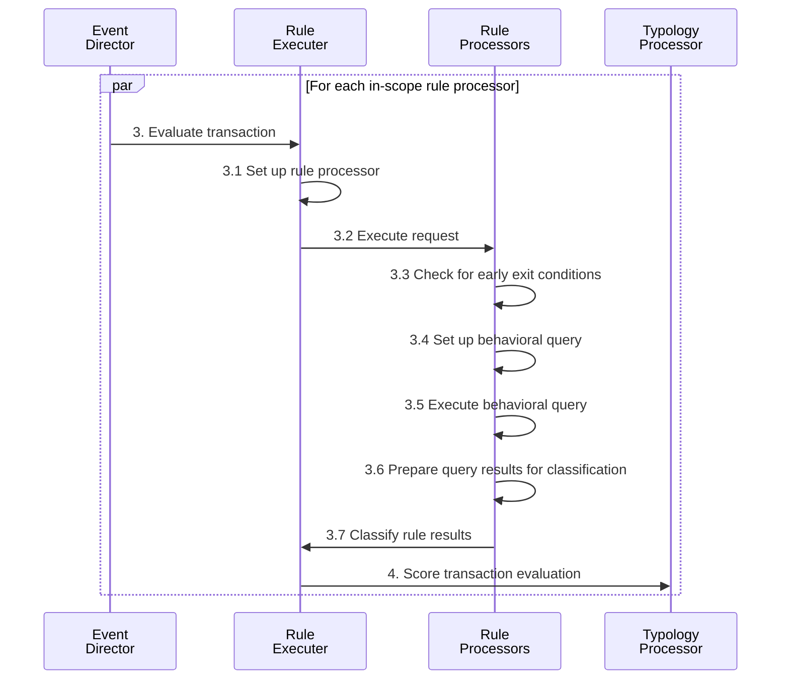
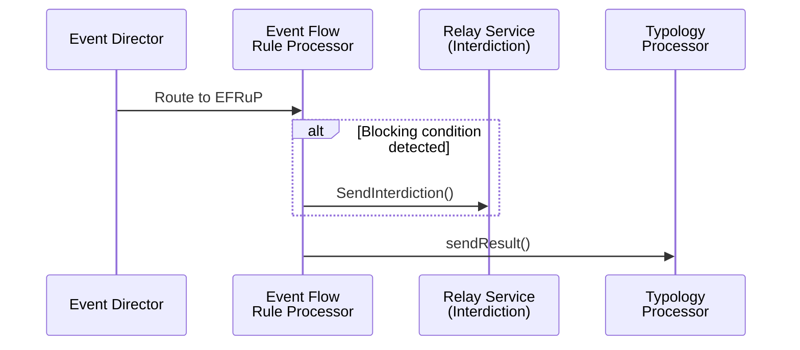
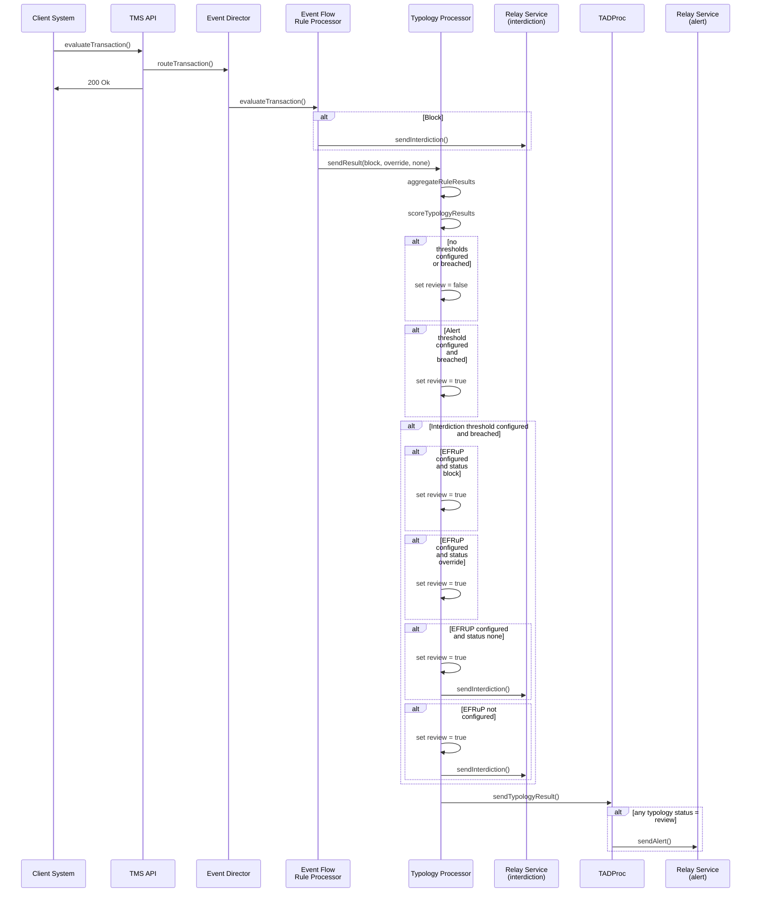

# Rules Knowledge Base

This document consolidates all rules-related documentation from the Tazama `docs/Product` folder into a single reference. It covers rule processors, the rule executer, the Event Flow Rule Processor (EFRuP), rule configuration, the rules life-cycle, and how rules fit into the broader configuration model (typologies and the network map).

Source documents:
- `rule-processor-overview.md`
- `event-flow-rule-processor.md`
- `complete-example-of-a-rule-processor-configuration.md`
- `Creating-and-Maintaining-Processors/Tazama-Rules-Life-Cycle.md`
- `configuration-management.md` (rule-processor-relevant sections)
- `Creating-and-Maintaining-Processors/Introduction.md` (rule-processor-relevant sections)

---

## Table of Contents

1. [Rule Processors — Overview](#1-rule-processors--overview)
2. [The Rule Executer](#2-the-rule-executer)
3. [Rule Processor Context — Evaluation Sequence](#3-rule-processor-context--evaluation-sequence)
4. [Rule Classification: Banded vs. Cased Results](#4-rule-classification-banded-vs-cased-results)
5. [The Event Flow Rule Processor (EFRuP)](#5-the-event-flow-rule-processor-efrup)
6. [Rule Processor Configuration Structure](#6-rule-processor-configuration-structure)
7. [Complete Rule Configuration Examples](#7-complete-rule-configuration-examples)
8. [Rules and the Typology Configuration](#8-rules-and-the-typology-configuration)
9. [Rules and the Network Map](#9-rules-and-the-network-map)
10. [Version Management for Rules](#10-version-management-for-rules)
11. [The Tazama Rules Life-Cycle](#11-the-tazama-rules-life-cycle)
12. [Creating a New Rule — Practical Steps](#12-creating-a-new-rule--practical-steps)
13. [FAQ](#13-faq)

---

## 1. Rule Processors — Overview

The foundation of the Tazama Transaction Monitoring System is its ability to evaluate incoming transactions for financial crime behavior through the execution of conditional statements ("rules") that render a result. Rule evaluations consider specific attributes of the incoming transaction and the historical behavior of the transaction participants.

- The **Event Director** determines which typologies are applicable to a transaction (typologies describe specific financial crime scenarios) and routes the transaction to the rules required by those typologies.
- Rules receive the transaction plus the portion of the **Network Map** that identifies them as recipients (and, by association, which typologies benefit from their results).
- The **Event Flow Rule Processor (EFRuP)** is a special rule processor that behaves differently from all other rule processors — see [Section 5](#5-the-event-flow-rule-processor-efrup).

**Design principle:** each rule executes as a discrete, bespoke function with as small a purpose as possible, answering a single, specific behavioral question, e.g.:
- How many transactions were made by the debtor?
- How many accounts does the creditor have?
- Has the creditor immediately transferred the money they just received?

Once a rule completes, it passes its result — along with the transaction and Network sub-map — to the **Typology Processor**, where it is combined with other rule results to score the transaction against a specific typology.

Tazama ships with a number of preconfigured rule processors, but most are not publicly accessible (to prevent fraudsters reverse-engineering detection logic). The one publicly available example is **Rule 901 — Number of transactions performed by the debtor** ([tazama-lf/rule-901](https://github.com/tazama-lf/rule-901)), used as the reference rule throughout the documentation.

---

## 2. The Rule Executer

Individual rule processors are wrapped in a **rule executer** shell that handles common functions across all rule processors uniformly. This keeps rule processors easy to maintain: common code lives in the rule executer, unique logic lives in the rule processor itself.

- Every rule processor must be wrapped in its own rule-executer instance when deployed.
- The rule executer source is centralized in the public [`rule-executer`](https://github.com/tazama-lf/rule-executer) repository.
- Each rule processor's unique source code lives in its own (often private) repository.

---

## 3. Rule Processor Context — Evaluation Sequence



### 3. Evaluate transaction
Using a list of unique rules, the Event Director invokes all unique rule processors and passes the transaction message and network sub-map to each.

**Payload:**
- Transaction data (the original submitted transaction message)
- Metadata (process information picked up in the TMS API and Event Director)
- Network sub-map (the portion of the network map defining in-scope rules/typologies)

### 3.1 Set up rule processor
The rule executer wraps the rule-specific code and performs generic setup tasks common to all rule processors, then invokes the rule-specific `handleTransaction` function to begin the behavioral assessment. (See the [rule-executer repo README](https://github.com/tazama-lf/rule-executer).)

### 3.2 Execute request
The rule-specific portion of the processor receives the request from the executer and performs the remaining steps (3.3–3.7) to complete the assessment.

### 3.3 Check for early exit conditions
To conserve system resources (database queries are expensive), the processor first checks whether anything in the incoming payload disqualifies the result as non-viable (e.g., the outcome would be non-deterministic / have no impact on associated typologies). See "Standard Rule Processing Exit and Error Conditions" in the [tazama-lf/docs](https://github.com/tazama-lf/docs/blob/main/Technical/Processors/Rule-Processors/standard-rule-processor-exit-and-error-conditions.md) repo for examples.

### 3.4 Set up behavioral query
Composes the database query (in an injection-safe way) to retrieve behavioral history, using parameters from the rule configuration.

- Each rule is configured via an external JSON document hosted in the Tazama configuration database.
- This document is read at rule-processor startup and cached in Node cache for fast retrieval.
- Configuration parameters may include things like the minimum number of documents required for a viable result, or the timeframe of the query.

### 3.5 Execute behavioral query
Executes the composed query against the database. In rare cases, a result depends only on the incoming payload (no historical query needed) — in that case, no query is composed/executed and the processor proceeds straight to classification.

### 3.6 Prepare query results for classification
Occasionally requires extra formatting steps beyond what the query itself returns — e.g., arranging results into a histogram for statistical/trend analysis.

### 3.7 Classify rule results
The external configuration document defines how query results are classified into the rule's final result. See [Section 4](#4-rule-classification-banded-vs-cased-results).

### 4. Score transaction evaluation
Once complete, the payload (now including the rule result) is sent to the Typology Processor for scoring.

**Outgoing payload:**
- Transaction data
- Metadata (TMS API, Event Director, and rule processor process info)
- Network sub-map
- The rule processor evaluation result

---

## 4. Rule Classification: Banded vs. Cased Results

Tazama classifies rule query results in one of two ways:

### 4.1 Banded rule processor results
Subdivisions of a **contiguous range of values** (theoretically −∞ to +∞). This is by far the most common result type.

**Example (Rule 901 — number of debtor transactions):**
| Condition | Band |
|---|---|
| Exactly 1 transaction to date (including current) | Band 1 |
| ≥2 and <4 transactions | Band 2 |
| ≥4 transactions | Band 3 |

**Design principle:** band evaluation is always `lowerBandLimit <= value < upperBandLimit`, ensuring bands are contiguous with no overlaps or gaps.

### 4.2 Cased rule processor results
An **explicit list of discrete values**, plus a specific "none of the above" (`else`) outcome.

**Example — service channel:**
| Code | Description | Case |
|---|---|---|
| AGT | Agent network | ELSE |
| ATM | Automated teller machines | ELSE |
| BRN | Branch | ELSE |
| CCT | Call centre | 1 |
| APP | Digital Application | 2 |
| WEB | Web-site | 3 |
| MMW | Mobile money wallet | 4 |

The cased configuration specifies the codes of interest and a catch-all "else" for anything else.

> **Warning:** it is critical that a rule's configuration (banded or cased) never leaves gaps. Every possible outcome must be accounted for, or the rule processor will emit an error (`.err`) result with reason "Value provided undefined, so cannot determine rule outcome".

---

## 5. The Event Flow Rule Processor (EFRuP)

EFRuP is a special rule processor that runs alongside all other rule processors to provide **operational control** over normal Tazama functioning — e.g., blocking a customer from transacting on any account, or overriding an interdiction to allow a transaction that would otherwise be blocked.

EFRuP evaluates **conditions** against transaction attributes (created on a debtor or creditor) to block or allow a transaction. There are two condition types:

1. **Blocking conditions**
   - `non-overridable-block` (red)
   - `overridable-block` (amber)
2. **Override conditions** (green)

### 5.1 EFRuP dependencies (configuration steps)
1. **Network map configuration** — add EFRuP as a processor so the Event Director routes transactions to it alongside other configured rules.
2. **Typology configuration** — add the EFRuP rule to the typology's rule list and set `"flowProcessor": "EFRuP@1.0.0"` in the `workflow` object. (`flowProcessor` can be omitted if a typology isn't affected by EFRuP.)
3. **Conditions** — created against an entity or account via Admin APIs. Multiple conditions can coexist; hierarchy of evaluation:
   1. Prevailing `non-overridable-block` (red) conditions always apply.
   2. Prevailing override (green) conditions trump `overridable-block` (amber) conditions.
   3. An un-overridden overridable (amber) condition still applies.
   4. Override (green) conditions can also override a typology interdiction result and suppress an interdiction alert (if EFRuP/interdiction workflows are configured).

   Admin API capabilities: create a condition (entity/account), retrieve a condition (entity/account), expire a condition. (Implementation details: [admin-service repo](https://github.com/tazama-lf/admin-service).)

### 5.2 EFRuP processing

- **Event Director**: routes a transaction event to EFRuP if configured in the network map.
- **EFRuP**: sends a single result to the Typology Processor. `subRuleRef` will be one of `block`, `override`, or `none`. If evaluation results in `block`, EFRuP immediately generates an interdiction alert (`ALRT`), published to the NATS subject defined in EFRuP's environment variables.
- **Typology Processor**: if a typology score ≥ threshold but an override is in place, no interdiction workflow is triggered.

> **Note:** the EFRuP result carries no weight (`wght`) and is never added to the typology score.

**EFRuP sequence diagram:**


**Sample typology processor output including EFRuP:**
```JSON
"report": {
  "evaluationID": "ecbd6990-09d6-4010-9f1c-2baddbd2bc73",
  "metaData": { "prcgTmDP": 5829672, "prcgTmED": 3375241 },
  "status": "NALT",
  "timestamp": "2024-05-22T14:24:20.373Z",
  "tadpResult": {
    "id": "004@1.0.0",
    "cfg": "1.0.0",
    "typologyResult": [
      {
        "id": "typology-processor@1.0.0",
        "cfg": "999@1.0.0",
        "result": 100,
        "ruleResults": [
          { "id": "901@1.0.0", "cfg": "1.0.0", "subRuleRef": ".01", "prcgTm": 11024622, "wght": 400 },
          { "id": "EFRuP@1.0.0", "cfg": "none", "subRuleRef": "override", "prcgTm": 11024622 }
        ],
        "prcgTm": 1532599,
        "review": true,
        "workflow": {
          "alertThreshold": 200,
          "interdictionThreshold": 400,
          "flowProcessor": "EFRuP@1.0.0"
        }
      }
    ],
    "prcgTm": 7142981
  }
}
```

**End-to-end sequence diagram:**


**EFRuP rule configuration:**
```JSON
{
  "id": "EFRuP@1.0.0",
  "cfg": "none",
  "termId": "vEFRuPat100atnone",
  "wghts": [
    { "ref": ".err", "wght": "0" },
    { "ref": "override", "wght": "0" },
    { "ref": "non-overridable-block", "wght": "0" },
    { "ref": "overridable-block", "wght": "0" },
    { "ref": "none", "wght": "0" }
  ]
}
```

---

## 6. Rule Processor Configuration Structure

A rule processor is a custom-built module. When designed, the rule designer specifies both input parameters and output results. These attributes are hosted in the **rule configuration** (external JSON document) so behavior can change without modifying rule processor code.

A rule processor configuration document typically contains:
- Rule configuration **metadata**
- A `config` object that may contain **parameters**, may contain **exit conditions**, and will contain either result **bands** or result **cases**

### 6.1 Rule configuration metadata
| Attribute | Description |
|---|---|
| `id` | Identifies the specific rule processor and version (typically drawn from the source-code repo name + semantic version). |
| `cfg` | Unique version of the rule configuration. Multiple versions can coexist. |
| `desc` | Human-readable description of the rule. |

`id` + `cfg` together form a unique identifier per rule configuration; the database enforces uniqueness so a specific configuration version can never be overwritten.

```JSON
{
  "id": "rule-001@1.0.0",
  "cfg": "1.0.0",
  "desc": "Derived account age - creditor",
  ...
}
```

### 6.2 The configuration object — parameters
Parameters define how a rule processor operates. They are coded into the rule and **must** be present in configuration for a successful outcome — missing required parameters cause a default error outcome.

Notable examples:
| Parameter | Description |
|---|---|
| `evaluationIntervalTime` | Time-frame (ms) for histogram interval partitioning in statistical/trend rules. |
| `maxQueryLimit` | Maximum number of records to return from the query. |
| `maxQueryRange` | Time (ms) limiting the maximum extent of a historical query (e.g., 86400000 = last 24 hours). |
| `minimumNumberOfTransactions` | Minimum data points required for a viable statistical result; if unmet, raises a non-deterministic exit condition. |
| `tolerance` | Margin of error for threshold evaluation (0 = exact match; 0.1 = ±10%). |

```JSON
"config": {
  "parameters": {
    "maxQueryRange": 86400000,
    "commission": 0.1,
    "tolerance": 0.1
  }
}
```
If unused, `parameters` may be empty (`{}`) or omitted.

### 6.3 The configuration object — exit conditions
Exit conditions ensure a rule always produces a result even when it can't reach a deterministic outcome (non-deterministic exceptions). Coded into the processor; missing configuration entries produce an error outcome complaining about the missing condition.

Convention: exit condition codes are prefaced with `x`.

| Code | Description | Example |
|---|---|---|
| `.x00` | Rule relies on the current transaction being successful. | "Unsuccessful transaction" |
| `.x01` | A minimum number of historical transactions is required. | "Insufficient transaction history" / "At least 50 historical transactions are required" |
| `.x02` | Currently unused. | — |
| `.x03` | Historical period shows no clear trend, but most recent period shows an upturn. | "No variance in transaction history and the volume of recent incoming transactions shows an increase" |
| `.x04` | Historical period shows no clear trend, but most recent period shows a downturn. | "No variance in transaction history and the volume of recent incoming transactions is less than or equal to the historical average" |

```JSON
"config": {
  "exitConditions": [
    { "subRuleRef": ".x00", "reason": "Unsuccessful transaction" },
    { "subRuleRef": ".x01", "reason": "Insufficient transaction history" }
  ]
}
```

Attributes:
| Attribute | Description |
|---|---|
| `subRuleRef` | Unique sub-rule reference identifying this specific outcome (prefaced with `x` by convention). |
| `reason` | Human-readable description accompanying the result. |

**The `.err` condition:** every rule processor has a built-in error outcome for unanticipated exceptions (e.g., database inaccessible, missing data dependency). This is not defined in configuration — it's handled exclusively in code — but always produces a result with sub-rule reference `.err`. If unanticipated, reason may default to "Unhandled rule result outcome".

### 6.4 The configuration object — rule results (bands / cases)
The core output of a rule processor. Two kinds:

- **Banded results** — categorize a continuous range into discrete bands.
- **Cased results** — an explicit value from a discrete list.

> **Warning:** configuration must leave no gaps in results (banded or cased), or the rule processor will emit `.err` with reason "Value provided undefined, so cannot determine rule outcome".

#### Banded results
- Lower limit evaluated with `>=`; upper limit evaluated with `<`.
- Omitted lower limit implies −∞; omitted upper limit implies +∞.
- Unlimited number of bands supported.

```JSON
"config": {
  "bands": [
    { "subRuleRef": ".01", "upperLimit": 86400000, "reason": "Account is less than 1 day old" },
    { "subRuleRef": ".02", "lowerLimit": 86400000, "upperLimit": 2592000000, "reason": "Account is between 1 and 30 days old" },
    { "subRuleRef": ".03", "lowerLimit": 2592000000, "reason": "Account is more than 30 days old" }
  ]
}
```

| Attribute | Description |
|---|---|
| `subRuleRef` | Unique identifier for the outcome (convention: numeric, dot-prefixed, e.g. `.01`, but any unique string works). |
| `lowerLimit` | Inclusive lower bound (`>=`). Omit for −∞. |
| `upperLimit` | Exclusive upper bound (`<`). Omit for +∞. |
| `reason` | Human-readable description. |

**Standard millisecond conversions used throughout rule configs:**
| Term | Milliseconds |
|---|---|
| second | 1,000 |
| minute | 60,000 |
| hour | 3,600,000 |
| day | 86,400,000 |
| week | 604,800,000 |
| month (30.44 days) | 2,629,743,000 |
| year (365.24 days) | 31,556,926,000 |

#### Cased results
- Each case is evaluated with `=` (no ranges).
- Must include a catch-all "else" outcome — by convention, sub-rule reference `.00`.

```JSON
"config": {
  "cases": [
    { "subRuleRef": ".00", "reason": "Value found is non-deterministic" },
    { "value": "P2B", "subRuleRef": ".01", "reason": "The transaction is a merchant payment" },
    { "value": "P2P", "subRuleRef": ".02", "reason": "The transaction is a peer-to-peer transfer" }
  ]
}
```

| Attribute | Description |
|---|---|
| `value` | The specific value matched (`=`). String or number. Omitted only for the default "else" case. |
| `subRuleRef` | Unique identifier for this outcome (convention: `.00` reserved for "else"). |
| `reason` | Human-readable description. |

---

## 7. Complete Rule Configuration Examples

### 7.1 Banded rule configuration (Rule 006 — outgoing transfer similarity, amounts)
```JSON
{
  "id": "006@1.0.0",
  "cfg": "1.0.0",
  "desc": "Outgoing transfer similarity - amounts",
  "config": {
    "parameters": {
      "maxQueryLimit": 3,
      "tolerance": 0.1
    },
    "exitConditions": [
      { "subRuleRef": ".x00", "reason": "Incoming transaction is unsuccessful" },
      { "subRuleRef": ".x01", "reason": "Insufficient transaction history" }
    ],
    "bands": [
      { "subRuleRef": ".01", "upperLimit": 2, "reason": "No similar amounts detected in the most recent transactions from the debtor" },
      { "subRuleRef": ".02", "lowerLimit": 2, "upperLimit": 3, "reason": "Two similar amounts detected in the most recent transactions from the debtor" },
      { "subRuleRef": ".03", "lowerLimit": 3, "reason": "Three or more similar amounts detected in the most recent transactions from the debtor" }
    ]
  }
}
```

### 7.2 Cased rule configuration (Rule 078 — transaction type)
```JSON
{
  "id": "078@1.0.0",
  "cfg": "1.0.0",
  "desc": "Transaction type",
  "config": {
    "parameters": {},
    "exitConditions": [],
    "cases": [
      { "subRuleRef": ".00", "reason": "The transaction type is not defined in this rule configuration" },
      { "subRuleRef": ".01", "value": "WITHDRAWAL", "reason": "The transaction is identified as a cash withdrawal" },
      { "subRuleRef": ".02", "value": "PAYMENT", "reason": "The transaction is identified as a merchant payment" },
      { "subRuleRef": ".03", "value": "TRANSFER", "reason": "The transaction is identified as a direct funds transfer" }
    ]
  }
}
```

### 7.3 EFRuP rule configuration
```JSON
{
  "id": "EFRuP@1.0.0",
  "cfg": "none",
  "termId": "vEFRuPat100atnone",
  "wghts": [
    { "ref": ".err", "wght": "0" },
    { "ref": "override", "wght": "0" },
    { "ref": "non-overridable-block", "wght": "0" },
    { "ref": "overridable-block", "wght": "0" },
    { "ref": "none", "wght": "0" }
  ]
}
```

---

## 8. Rules and the Typology Configuration

The Typology Processor is a centralized, generic "engine" processor that aggregates rule results into fraud/money-laundering scenarios ("typologies"). Unlike rule processors, a typology doesn't physically exist as a unique processor — it's entirely defined by its configuration.

A typology configuration document contains:
- Typology configuration metadata
- A `rules` object (rule identifier, config version, term identifier)
- A `wghts` object per rule (weighting per sub-rule reference / outcome)
- An `expression` object (formula combining weighted rule results into the typology score)
- A `workflow` object (alert / interdiction thresholds)

### 8.1 Rules object and weighting
Every possible rule outcome (error, exit conditions, bands/cases) must be represented and weighted in the typology's `rules`/`wghts` arrays — including the `.err` outcome, which is not itself listed in the rule configuration (it's built into the rule processor). If a rule produces a result the typology processor isn't configured to catch, that typology's evaluation will hang.

```JSON
"rules": [
  {
    "id": "001@1.0.0",
    "cfg": "1.0.0",
    "termId": "v001at100at100",
    "wghts": [
      { "ref": ".err", "wght": 0 },
      { "ref": ".x00", "wght": 100 },
      { "ref": ".x01", "wght": 100 },
      { "ref": ".01", "wght": 0 },
      { "ref": ".02", "wght": 200 },
      { "ref": ".03", "wght": 300 }
    ]
  },
  {
    "id": "002@1.0.0",
    "cfg": "1.0.0",
    "termId": "v002t100at100",
    "wghts": [
      { "ref": ".err", "wght": 0 },
      { "ref": ".00", "wght": 0 },
      { "ref": ".01", "wght": 0 },
      { "ref": ".02", "wght": 1 },
      { "ref": ".03", "wght": 0 }
    ]
  }
]
```

### 8.2 Expression object
Defines the formula for the typology score using MathJSON-style operators (`Add`, `Subtract`, `Multiply`, `Divide`), referencing each rule's `termId`.

```JSON
"expression": [
  "Add",
  "v001at100at100",
  "v002at100at100",
  "v003at100at100",
  "v004at100at100"
]
```
= `typology score = rule 001 weighting + rule 002 weighting + rule 003 weighting + rule 004 weighting`

### 8.3 Workflow object (thresholds)
- **Alert** (`alertThreshold`): alerts an investigator if breached; no other action.
- **Interdiction** (`interdictionThreshold`): if breached, forces a block instruction to the client system, plus an alert at end of evaluation.
- Breach condition: score `>=` threshold.
- A threshold of `0` always breaches.
- Omit a threshold entirely if not required.

```JSON
"workflow": {
  "alertThreshold": 500,
  "interdictionThreshold": 1000
}
```

If EFRuP applies to the typology, add `"flowProcessor": "EFRuP@1.0.0"` to the workflow object and add the EFRuP rule entry to `rules` (see [Section 5](#5-the-event-flow-rule-processor-efrup)).

---

## 9. Rules and the Network Map

The **Network Map** associates a transaction type with the rules and typologies used to evaluate it, structured as a decision tree:

**transactions → typologies → rules** (routing order)
**rules → typologies → transaction** (evaluation order, reverse)

It lets the Event Director:
1. Decide whether an incoming transaction type should be routed at all.
2. Determine which typologies apply.
3. Determine which unique rules those typologies require.
4. Route the transaction to each identified rule processor.

### 9.1 Rules object within the network map
```JSON
"rules": [
  { "id": "002@1.0.0", "cfg": "1.0.0" }
]
```
| Attribute | Description |
|---|---|
| `id` | Unique identifier for the rule processor and version to invoke. |
| `cfg` | Unique rule configuration version guiding execution. |

EFRuP entry example:
```JSON
{ "id": "EFRuP@1.0.0", "cfg": "none" }
```
Adding the EFRuP entry to the network map causes the Event Director to route transactions to EFRuP in addition to the other configured rules.

### 9.2 Full network map skeleton (with EFRuP + Rule 901)
```JSON
[
  {
    "active": true,
    "cfg": "1.0.0",
    "messages": [
      {
        "id": "004@1.0.0",
        "cfg": "1.0.0",
        "txTp": "pacs.002.001.12",
        "typologies": [
          {
            "id": "typology-processor@1.0.0",
            "cfg": "999@1.0.0",
            "rules": [
              { "id": "901@1.0.0", "cfg": "1.0.0" },
              { "id": "EFRuP@1.0.0", "cfg": "none" }
            ]
          }
        ]
      }
    ]
  }
]
```

---

## 10. Version Management for Rules

- Rule processors are versioned with **semantic versioning** (`MAJOR.MINOR.PATCH`): MAJOR for incompatible changes, MINOR for backward-compatible functionality additions, PATCH for backward-compatible bug fixes.
- The combination of rule `id` (name@processor-version) and `cfg` (configuration version) is unique; the database never allows overwriting an existing `id`+`cfg` pair — a new configuration version must always be issued.
- A rule processor version may be deployed multiple times with different configurations attached.
- **Never overwrite configurations in production** — issue new versions and supersede old ones via the network map. (Overwriting in a test/PoC environment is more acceptable but discouraged in production, since it invalidates auditability/replayability of past evaluations.)
- The network map controls which configuration version an active rule processor uses at any time; it doesn't carry its own explicit configuration version, but instead an `active` flag (only one network map can be `active: true` at a time).
- Restart requirement: after updating rule/typology/network-map configuration documents, the **Event Director, Typology Processor, and Transaction Aggregation and Decisioning Processor (TADProc)** must be restarted to absorb the changes.

---

## 11. The Tazama Rules Life-Cycle

**Typologies** define how financial crime is perpetrated. **Rules** are the boolean statements deployed to detect a typology in a transaction (or set of transactions). The life-cycle:

### 11.1 Typology identification
Sourced from bodies like FATF, Moneyval, GSMA, ACAMS, and regional FICs. Deloitte compiled an initial register of 232 typologies (funded by the Bill & Melinda Gates Foundation) for push payments/mobile money, plus 40 more for internal-fraud-at-switching-hub scenarios, classified via the APRICOT model (7 dimensions, 20 attributes) to prioritize. The typology register evolves as new financial crime patterns emerge.

### 11.2 Rules discovery
A rules-based approach is the foundation for detection (ML/AI is a possible future direction, out of current scope/budget). Discovery is driven by team experience, brainstorming, and research.

**Rule classification:**
- **Atomic rule** — single logic statement, single boolean outcome.
  _Example:_ "IF an MSISDN has been associated with a new SIM ICCID within the last 3 days" → TRUE/FALSE.
- **Compound rule** — multiple atomic rules combined via AND/OR/XOR into one outcome. Only used during aggregation of rule results in typology processing — should not be composed inside any single rule processor.
  _Example:_ "IF the Payer is a private individual AND IF the Payer had never performed a transfer request before".
- **Rule-set** — multiple mutually exclusive statements resembling case statements built from atomic rules.
  _Example (account dormancy):_

  | Sub-rule ref | Statement | Outcome | Reason |
  |---|---|---|---|
  | .01 | Elapsed time since last transfer >3mo, <6mo | Dormancy 3 = TRUE | Dormant 3–6 months |
  | .02 | Elapsed time >6mo, <12mo | Dormancy 6 = TRUE | Dormant 6–12 months |
  | .03 | Elapsed time >12mo | Dormancy 12 = TRUE | Dormant >12 months |
  | .00 | Elapsed time <3mo | Dormancy = FALSE | Not dormant |
  | .04 | No prior transfers found at all | Dormancy = FALSE | Inconclusive — no transactions |

  Rule-sets group continuous results into bands/buckets; typology processing itself is intended to remain limited to true/false evaluation.

Data availability constrains viable rules; the preferred approach specifies rules idealistically first, then narrows scope by available data — critical rules may justify expanding data collection instead of being dropped.

### 11.3 Rules development
Rules are discrete, parameterizable modules returning a boolean result. Predominantly developed in JavaScript/Node.js, though some (e.g., graph-database rules) use specialized tools like TinkerPop Gremlin. All changes to an existing rule must be tracked for review against the previous deployed/approved version.

### 11.4 Rules testing
Required test types (ideally automated, CI/CD-integrated):
- **Unit testing** — correctness of output for given inputs per spec.
- **Integration testing** — fits within the architecture without unintended side effects.
- **Performance testing** — turnaround time, resource usage, detection effectiveness (without inflating false positives).
- **Regression testing** — overall platform health remains stable/improved after deployment.

Both positive ("does it work?") and negative ("can it break, and how?") testing approaches are expected. Repeatable, comparable test data libraries are needed for integration/performance/regression testing.

### 11.5 Rules deployment
Rules are sensitive/critical — deployment requires a strict, secure change-control process with segregated development/review/approval roles. New versions must be uniquely and properly versioned (traceable in logs/results, supports "proof of results" replayability for regulatory/legislative needs).

### 11.6 Rules execution
Every execution must be logged; execution must be secure and integrity-assured.

- **DRY execution** — rule runs once per transaction, shared result reused across all typologies that need it. Parameterized at deployment/channel level.
- **WET execution** — rule runs once per typology, with typology-specific parameters; result returned directly to the invoking typology.

A DRY rule's result must be accessible asynchronously to all consuming typologies, since different rules complete at different times (historical-data rules are much slower than simple field-inspection rules).

### 11.7 Rules performance monitoring
Tracked metrics:
- Telemetry (turnaround time, throughput, resource consumption)
- Detection rate
- False positive rate

Poor/diminishing performance triggers rule review. Informed by system analytics, complaints/feedback on undetected fraud, and investigation outcomes. Real-time monitoring is generally unnecessary (except telemetry) — daily/weekly reporting typically suffices.

### 11.8 Rule calibration
Two variables change over time:
1. Rule parameters (e.g., thresholds) — may shift per deployment.
2. Rule weight in typology scoring.

Performance monitoring data informs tweaks to both parameters and weightings — and may even determine that a rule is no longer relevant.

---

## 12. Creating a New Rule — Practical Steps

(Consolidated from `configuration-management.md` FAQ and `Creating-and-Maintaining-Processors/Introduction.md`.)

Assuming the Event Director / Typology Processor / TADProc already exist and you're adding a new rule/typology route:

1. **Create the transaction object** in the Network Map (if not already present for the target `txTp`).
2. **Develop the Rule Processor(s)** — implement the rule-specific logic.
3. **Create the rule processor configuration** — new document in the `ruleConfiguration` collection (metadata + parameters + exit conditions + bands/cases).
4. **Create/update the Typology Configuration** — integrate the new rule's possible outcomes (`ref`/`wght` pairs) into the relevant typology's `rules` array, and update the `expression` if the rule contributes to the score.
5. **Update the Network Map** — add the rule under the relevant typology's `rules` array (a new network map version).
6. **Cut over** — set the old network map's `active` flag to `false` and the new network map's `active` flag to `true`. Only then is the new route live.
7. **Restart** the Event Director, Typology Processor, and TADProc so they absorb the updated configuration documents.

**General configuration principles:**
- Configuration documents live in the Configuration database (ArangoDB), uploaded via ArangoDB's HTTP API (bulk or one-by-one).
- The DB enforces that an existing `id`+`cfg` combination can never be resubmitted — every change requires a new configuration version.
- Prefer creating new configuration versions over overwriting existing ones (overwriting invalidates the repeatability/auditability of past evaluations made under that version).
- Demo UI reflects the currently active network map on startup/reload — rule/typology changes are visible there once the corresponding network map is activated.
- There is currently no native configuration UI in Tazama for this (a UI has been built by an ecosystem partner, Sybrin, but is not part of the OSS baseline); a native Configuration UI is planned ("coming soon").

---

## 13. FAQ

**Can rules and typologies be configured through configuration files without coding changes?**
Yes — rule configuration files, typology configuration files, and the network map can all be updated without code changes. These live in three collections in the configuration database: Network Configuration, Rule Configuration, and Typology Configuration (accessible via the ArangoDB web UI, e.g. `http://localhost:18529` in the full-stack-docker-tazama deployment).

**How do I update the configuration files to create a new rule?**
See [Section 12](#12-creating-a-new-rule--practical-steps) — new rule configuration → updated typology configuration(s) → new network map version → cutover (`active` flag swap) → restart Event Director/Typology Processor/TADProc.

**If I change rules/typologies/network map through configuration, are these changes visible in the Demo UI?**
Yes — the Demo UI loads the current active network map on startup, so added/removed rules and typologies will appear there.

**Is there a Configuration UI to make this easier?**
Not yet natively in Tazama ("coming soon") — it will enforce/manage the processes above and handle configuration deployment through a UI.

---

## Key Cross-Cutting Notes

- **Every possible rule outcome** (`.err`, exit conditions, bands/cases) must be represented with a weighting in every typology configuration that uses that rule — otherwise the typology evaluation will hang on an unrecognized result.
- **subRuleRef** is the unifying identifier that flows from a rule's configuration into a typology's `wghts` array (`ref` values) — any change to a rule's bands/cases/exit conditions must be mirrored in every typology configuration that consumes that rule.
- **Never overwrite production configuration** — always version and cut over via the network map's `active` flag, to preserve auditability and replayability of past evaluations.
- **Restart requirement** — Event Director, Typology Processor, and TADProc must restart to pick up new/updated configuration documents.
